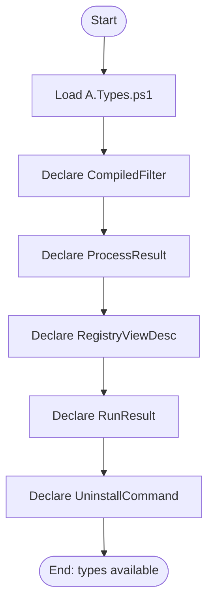

# A.Types

## Purpose

`A.Types.ps1` declares the five private PowerShell classes that the rewrite uses
as shared in-memory contracts: compiled filters, process results, registry view
descriptors, run results, and parsed uninstall commands. `build.ps1`
concatenates private source files alphabetically, so `A.Types.ps1` loads before
helpers that instantiate or reference these types from `New-CompiledFilter`,
`Test-ApplicationMatch`, `Get-UninstallRegistryPath`, `Invoke-SilentProcess`,
`New-RegistryViewDescriptor`, `Resolve-UninstallCommand`, and
`Start-Uninstaller`. The file exists to centralize these cross-function data
contracts so later helpers can rely on stable property names, constructor
shapes, typed parameters, and `[OutputType()]` metadata.

## Parameters

This source file takes no parameters. Each class exposes a constructor whose
arguments mirror its public properties.

## Return Value

When the file is parsed or dot-sourced, it writes no pipeline output and returns
no value. Its normal effect is to register five class types in the current
session so later helpers can use them with `[Type]::new(...)`, typed
parameters, generic collections, and `[OutputType()]` metadata. There is no
`$Null` sentinel output path; producing no output is the expected behavior every
time the file loads successfully.

## Execution Flow

## Error Handling

- The file has no `Try/Catch`, `Throw`, `New-ErrorRecord`, `Write-Warning`, or
  silent-skip path.
- Parse-time syntax errors or class-definition problems while loading the file
  bubble directly to the caller or build step.
- Constructor argument type mismatches surface at the call site that invokes
  `[StartUninstaller*]::new(...)`; the constructors themselves only assign
  incoming values to properties and do not translate errors.
- Current Microsoft documentation also says PowerShell classes cannot be
  unloaded or reloaded in-session, so updated class definitions in this file do
  not replace already-loaded session types; any resulting reload/load conflict
  still bubbles directly because this file has no catch path.

## Side Effects

Loading the file registers five PowerShell class types in the current session:
`StartUninstallerCompiledFilter`, `StartUninstallerProcessResult`,
`StartUninstallerRegistryViewDescriptor`, `StartUninstallerRunResult`, and
`StartUninstallerUninstallCommand`. Current Microsoft docs also note that
PowerShell classes cannot be unloaded or reloaded in a session, so changing
this file during development requires a fresh session before new definitions
take effect. It does not modify the registry, files, processes, or caller
variables.

## Research Log

| Topic | Finding | Source | Date Verified |
|-------|---------|--------|---------------|
| Search: `about_Requires #Requires scope` | Current Microsoft docs say `#Requires` can appear on any line in a script and still applies globally before execution. That removes the earlier scope ambiguity: `A.Types.ps1` simply lacks the repo-required `#Requires -Version 5.1` directive. Change: this updates the standards audit from `REVIEW` to `FAIL`. | https://learn.microsoft.com/en-us/powershell/module/microsoft.powershell.core/about/about_requires?view=powershell-5.1 | 2026-04-02 |
| Search: `about_Classes import-module requires updated classes` | Current Microsoft docs still say `Import-Module` and `#Requires` do not import PowerShell classes, and updated classes cannot be reloaded or unloaded in the same session. That strengthens the existing note that `A.Types.ps1` must load before type consumers and that changed class definitions require a fresh session. Change: new row. | https://learn.microsoft.com/en-us/powershell/module/microsoft.powershell.core/about/about_classes?view=powershell-7.5 https://learn.microsoft.com/en-us/powershell/module/microsoft.powershell.core/about/about_using?view=powershell-5.1 | 2026-04-02 |
| Search: `PowerShell Practice and Style naming conventions` | The current PowerShell Practice and Style guide still recommends full command names, full parameter names, and explicit paths instead of aliases or shorthand. Change: first audit row. | https://poshcode.gitbook.io/powershell-practice-and-style/style-guide/naming-conventions | 2026-04-02 |
| Search: `PowerShell-Docs style guide keywords operators aliases` | Microsoft's current docs style guide still prefers full cmdlet and parameter names and avoiding aliases, but it prefers lowercase keywords and operators. That differs from this repo's PascalCase-keyword house rule, so keyword-casing findings below are repo-specific. Change: first audit row. | https://learn.microsoft.com/en-us/powershell/scripting/community/contributing/powershell-style-guide?view=powershell-7.5 | 2026-04-02 |
| Search: `PSScriptAnalyzer releases latest 1.24.0` | The latest surfaced `PSScriptAnalyzer` release remains `1.24.0` (2025-03-18). It raised the minimum supported PowerShell version to `5.1` and expanded `UseCorrectCasing` to commands, keywords, and operators. Change: first audit row. | https://github.com/powershell/psscriptanalyzer/releases | 2026-04-02 |
| Search: `about_Classes PowerShell supported scenarios` | PowerShell classes remain a supported way to define custom types and constructors; no deprecation or replacement guidance surfaced. This matters because `A.Types.ps1` centralizes session-scoped class definitions. Change: first audit row. | https://learn.microsoft.com/en-us/powershell/module/microsoft.powershell.core/about/about_classes?view=powershell-5.1 | 2026-04-02 |
| Search: `regex best practices timeout untrusted input` | Current .NET guidance still says to pass a timeout when processing untrusted regex input to avoid denial-of-service risk. That applies to the consuming filter engine because `StartUninstallerCompiledFilter` stores compiled `Regex` instances for later matching. Change: first audit row. | https://learn.microsoft.com/en-us/dotnet/standard/base-types/best-practices-regex | 2026-04-02 |
| Search: `WildcardPattern class docs` | `System.Management.Automation.WildcardPattern` remains the current wildcard-matching type and still exposes constructor and `IsMatch` support; no newer replacement surfaced. Change: first audit row. | https://learn.microsoft.com/en-us/dotnet/api/system.management.automation.wildcardpattern?view=powershellsdk-7.4.0 | 2026-04-02 |
| Search: `RegistryView enum OpenSubKey writable false` | `Microsoft.Win32.RegistryView` remains the explicit 32-bit and 64-bit registry-view API, and `RegistryKey.OpenSubKey(name, writable)` still requires explicit write access when writes are needed. That reinforces the plan's read-only registry-discovery contract, even though this file only stores registry metadata. Change: first audit row. | https://learn.microsoft.com/en-us/dotnet/api/microsoft.win32.registryview?view=net-9.0 https://learn.microsoft.com/en-us/dotnet/api/microsoft.win32.registrykey.opensubkey?view=net-9.0 | 2026-04-02 |
| Search: `System.Version class docs` | `System.Version` remains the standard .NET version-comparison type and still provides parse and comparison APIs with no deprecation surfaced. That supports the `CompiledVersion` property used by compiled `DisplayVersion` filters. Change: first audit row. | https://learn.microsoft.com/en-us/dotnet/api/system.version?view=net-9.0 | 2026-04-02 |
| Search: `System.Nullable<T> structure docs` | `System.Nullable<T>` remains the standard way to model optional value-type data. That supports `ExitCode` being `[System.Nullable[System.Int32]]` while string properties remain nullable by reference-type semantics. Change: first audit row. | https://learn.microsoft.com/en-us/dotnet/fundamentals/runtime-libraries/system-nullable%7Bt%7D | 2026-04-02 |

## Standards Audit

| Rule | Status | Line(s) | Evidence |
|------|--------|---------|----------|
| Colon-bound parameters | N/A | 1-100 | The file contains only class and constructor declarations, for example `class StartUninstallerCompiledFilter {`, and no cmdlet invocations appear. |
| PascalCase naming | FAIL | 1, 26, 42, 76, 89 | `class StartUninstallerCompiledFilter {`, `class StartUninstallerProcessResult {`, and the other class declarations use lowercase `class`, while the repo standard requires PascalCase keywords. |
| Full .NET type names (no accelerators) | PASS | 2-15, 27-34, 43-62, 77-82, 90-95 | The file uses full names such as `[System.String]`, `[System.Nullable[System.Int32]]`, `[Microsoft.Win32.RegistryHive]`, and `[System.Text.RegularExpressions.Regex]`. |
| Object types are the MOST appropriate and specific choice (not just a functional generic type like PSObject or Array) | REVIEW | 2-7, 27-29, 47-51 | The file uses strong types for members like `[System.Management.Automation.WildcardPattern]$CompiledWildcard`, `[System.Text.RegularExpressions.Regex]$CompiledRegex`, `[System.Version]$CompiledVersion`, and `[System.Nullable[System.Int32]]$ExitCode`, but other closed-set fields such as `[System.String]$MatchType`, `[System.String]$Outcome`, `[System.String]$InstallScope`, and `[System.String]$UserIdentityStatus` may be less specific than enum-backed types. |
| Single quotes for non-interpolated strings | N/A | 1-100 | No string literals appear anywhere in the file; the content is entirely type declarations and `$this` assignments. |
| `$PSItem` not `$_` | N/A | 1-100 | Neither automatic variable appears. A representative line is `    $this.Property = $Property`. |
| Explicit bool comparisons (`$Var -eq $True`) | N/A | 1-100 | The file contains no Boolean conditions or comparisons. A representative declaration is `[System.String[]]$Lines`. |
| If conditions are pre-evaluated outside If blocks | N/A | 1-100 | The file contains no `If` statements. A representative line is `  StartUninstallerRunResult(`. |
| `$Null` on left side of comparisons | N/A | 1-100 | The file contains no null comparisons. A representative line is `[System.Nullable[System.Int32]]$ExitCode`. |
| No positional arguments to cmdlets | N/A | 1-100 | No cmdlets are invoked anywhere in the file. A representative line is `class StartUninstallerUninstallCommand {`. |
| No cmdlet aliases | N/A | 1-100 | No cmdlets are invoked anywhere in the file. A representative line is `class StartUninstallerRegistryViewDescriptor {`. |
| Switch parameters correctly handled | N/A | 1-100 | The file exposes no function parameters and no `[System.Management.Automation.SwitchParameter]` members. |
| CmdletBinding with all required properties | N/A | 1-100 | This file defines classes, not an advanced function. A representative line is `class StartUninstallerCompiledFilter {`. |
| OutputType declared | N/A | 1-100 | This file is not a function and contains no `[OutputType()]` attribute. A representative line is `class StartUninstallerProcessResult {`. |
| Comment-based help is complete (Synopsis, Description, Parameter, Example, Outputs, Notes) | N/A | 1-100 | This file is not a function and contains no help block. A representative line is `class StartUninstallerRunResult {`. |
| `#Requires -Version 5.1` present | FAIL | 1-100 | The file begins with `class StartUninstallerCompiledFilter {` and contains no `#Requires -Version 5.1` directive anywhere in the script file. |
| Error handling via New-ErrorRecord or appropriate pattern | N/A | 17-22, 36-38, 64-72, 84-85, 97-98 | The only executable statements are direct property assignments such as `$this.Property = $Property` and `$this.ExitCode = $ExitCode`; there is no translated-error path in this file itself. |
| Try/Catch around operations that can fail | N/A | 17-22, 36-38, 64-72, 84-85, 97-98 | The constructors only assign already-bound arguments to properties, for example `$this.View = $View`, and perform no external operations that require `Try/Catch` in this file. |
| Write-Debug at Begin/Process/End block entry and exit (if blocks are used) | N/A | 1-100 | The file defines no `Begin`, `Process`, or `End` blocks. A representative line is `class StartUninstallerUninstallCommand {`. |
| No variable pollution (no script: or global: scope leaks) | PASS | 17-22, 36-38, 64-72, 84-85, 97-98 | The constructors assign only instance properties, for example `$this.Property = $Property` and `$this.FileName = $FileName`; there are no `script:` or `global:` writes. |
| 96-character line limit | PASS | 1-100 | The longest line in a local scan was 68 characters. A representative near-maximum line is `[System.Management.Automation.WildcardPattern]$CompiledWildcard`. |
| 2-space indentation (not tabs, not 4-space) | PASS | 2-22, 27-39, 43-72, 77-85, 90-98 | Indentation uses 2-space steps, for example `  [System.String]$Property` and `    [System.String]$Property,`, and a local scan found no tab characters. |
| OTBS brace style | PASS | 1, 16, 26, 31, 42, 53, 76, 80, 89, 93 | Opening braces stay on the same line in `class StartUninstallerCompiledFilter {` and `  ) {`, which matches OTBS placement. |
| No commented-out code | PASS | 1-100 | The file contains no comments at all, so there is no commented-out code to audit. |
| Registry access is read-only (if applicable) | N/A | 42-72 | The registry-related members are metadata only, for example `[Microsoft.Win32.RegistryHive]$Hive` and `[Microsoft.Win32.RegistryView]$View`; the file never opens a registry key. |

Research notes:

1. Microsoft's current public style guidance prefers lowercase keywords and
   operators, so the PascalCase-keyword FAIL is a repo-standard failure, not a
   platform or community-style failure.
2. PowerShell classes remain supported according to current Microsoft docs, but
   those same docs also say `Import-Module` and `#Requires` do not import
   classes and that updated class definitions cannot be reloaded in-session.
   This repo's `A.Types.ps1` load-order dependency is therefore a real
   PowerShell limitation, not just a stylistic preference.
3. `about_Requires` removes the prior scope ambiguity: this standalone `.ps1`
   file simply lacks the repo-required `#Requires -Version 5.1` directive.
4. Regex timeout guidance applies to the consuming filter engine, not to this
   definition file by itself, but it is relevant because this file carries the
   compiled regex type used downstream.

## Plan Audit

| Plan Section | Requirement | Status | Line(s) | Details |
|--------------|-------------|--------|---------|---------|
| `5. Internal Data Model` | `The public script interface is text and exit codes. Internally, the rewrite still uses typed PSCustomObject records for readability and testing.` | DEVIATION | `PLAN.md:147-150` `src/Private/A.Types.ps1:1-100` `src/Private/New-CompiledFilter.ps1:311-320` `src/Private/New-RegistryViewDescriptor.ps1:206-267` `src/Private/Invoke-SilentProcess.ps1:235-320` `src/Private/Resolve-UninstallCommand.ps1:140-204` `src/Public/Start-Uninstaller.ps1:484-489` | The implementation uses PowerShell classes and `::new()` construction across the filter, descriptor, process-result, command, and run-result paths instead of typed `PSCustomObject` records. This looks intentional and consistent, but it is still direct plan drift. |
| `5.2 Registry View Descriptor` | `Each search location is represented by an internal descriptor record with: DisplayRoot, Hive, Path, View, Source, InstallScope, UserSid, UserName, UserIdentityStatus.` | ALIGNED | `PLAN.md:180-195` `src/Private/A.Types.ps1:42-72` `src/Private/New-RegistryViewDescriptor.ps1:214-267` `src/Private/Get-UninstallRegistryPath.ps1:23-24` `src/Private/Get-UninstallRegistryPath.ps1:40` `src/Private/Get-UninstallRegistryPath.ps1:58-59` | `StartUninstallerRegistryViewDescriptor` carries all nine required fields, `New-RegistryViewDescriptor` constructs that exact shape, and `Get-UninstallRegistryPath` documents and emits that descriptor type. |
| `4.1 Built Artifact`; `13.1 Build Output Shape` | `write the returned PDQ output lines`, `exit with the returned script exit code`, and `$RunResult.Lines ... exit $RunResult.ExitCode` | ALIGNED | `PLAN.md:100-109` `PLAN.md:766-779` `src/Private/A.Types.ps1:76-86` `src/Public/Start-Uninstaller.ps1:484-489` `src/EntryPoint.ps1:45-49` | `StartUninstallerRunResult` exposes exactly the `ExitCode` and `Lines` members that the plan's entrypoint contract expects, and both `Start-Uninstaller` and `EntryPoint.ps1` use that shape directly. |
| `12. File Structure` | The frozen `src/Private/` file list names each expected helper file and does not include `A.Types.ps1`. | DEVIATION | `PLAN.md:669-707` `src/Private/A.Types.ps1:1-100` `build.ps1:153-167` | `A.Types.ps1` exists under `src/Private` and is compiled into the build because `build.ps1` concatenates every private `*.ps1` file. The file is real and used, but the frozen file-structure section does not document it. |
| `6. Filter Model`; `15.2 Phase 2` | `Each filter is a hashtable with: Property, Value, MatchType` and `implement New-CompiledFilter` | REVIEW | `PLAN.md:219-225` `PLAN.md:920-929` `src/Private/A.Types.ps1:1-23` `src/Private/New-CompiledFilter.ps1:311-320` `src/Private/Test-ApplicationMatch.ps1:64-66` | `StartUninstallerCompiledFilter` preserves the required `Property`, `Value`, and `MatchType` fields and adds compiled cache fields for wildcard, regex, and version matching. That is a sensible internal optimization, but the plan never defines this compiled-record shape or this extra class file. |
| `5.3 Uninstall Result Record` | `Each attempted or blocked uninstall produces one internal result record with ... Outcome, ExitCode, Message ... plus source-application identity/context fields.` | REVIEW | `PLAN.md:197-215` `src/Private/A.Types.ps1:26-39` `src/Private/Invoke-SilentProcess.ps1:235-320` `src/Public/Start-Uninstaller.ps1:423-428` | `StartUninstallerProcessResult` only carries `Outcome`, `ExitCode`, and `Message`. `Start-Uninstaller` later copies those fields onto the richer application record with `Add-Member`, so this class is an intermediate helper type rather than the full plan-defined uninstall result record. |
| `12. Function Responsibilities` | The plan documents helper-function responsibilities for `New-CompiledFilter`, `New-RegistryViewDescriptor`, `Invoke-SilentProcess`, `Resolve-UninstallCommand`, and `Start-Uninstaller`, but it does not mention a shared types file. | REVIEW | `PLAN.md:709-744` `src/Private/A.Types.ps1:1-100` `src/Private/Get-UninstallRegistryPath.ps1:23-24` `src/Private/Get-UninstallRegistryPath.ps1:40` `src/Private/Test-ApplicationMatch.ps1:64-66` `src/Private/New-CompiledFilter.ps1:311-320` `src/Private/New-RegistryViewDescriptor.ps1:206-267` `src/Private/Invoke-SilentProcess.ps1:235-320` `src/Private/Resolve-UninstallCommand.ps1:140-204` `src/Public/Start-Uninstaller.ps1:484-489` | The plan documents helper-function responsibilities but not a shared type-definition layer. The file is clearly reused across discovery, matching, execution, and entrypoint result assembly, so it is justified by the implementation even though it remains an undocumented architectural choice. |

Plan notes:

1. Current Microsoft docs still support PowerShell classes, so the primary plan
   issue here is contract drift, not platform obsolescence.
2. `build.ps1` currently relies on alpha-sorted private-file concatenation, so
   `A.Types.ps1` loads before the consuming helpers because of its filename.
   Current Microsoft docs also say `Import-Module` and `#Requires` do not import
   PowerShell classes and updated classes cannot be reloaded in-session, so
   this load-order dependency is real rather than purely stylistic.

## Changelog

| Date | Changes |
|------|---------|
| 2026-04-02 | Second audit run for `A.Types`. Added current Microsoft research for `about_Requires` and PowerShell class import/reload limitations, corrected the stale `#Requires -Version 5.1` standards verdict from `REVIEW` to `FAIL`, refreshed stale plan-audit line references against the current source, and documented the session-sticky class-loading side effect that requires a fresh session for changed class definitions. |
| 2026-04-02 | First audit run for `A.Types`. Added the initial README with web-verified research, documented the file as a no-parameter type-definition source, recorded its normal no-output behavior and session-type-registration side effect, audited it against the house standard, and flagged two plan-level drifts: the plan still says internal records are typed `PSCustomObject` values, and the frozen file structure does not list `src/Private/A.Types.ps1`. |
AUDIT_STATUS:UPDATED