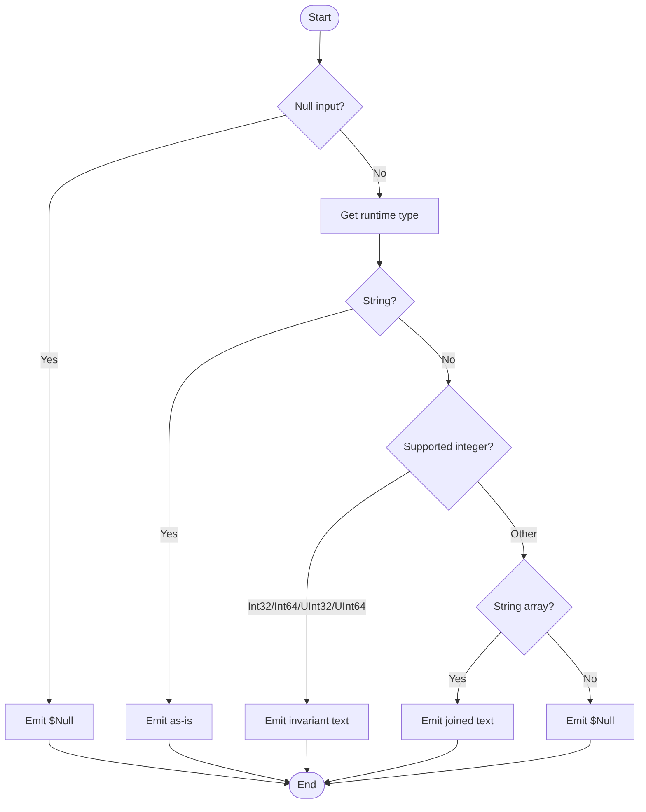

# ConvertTo-NormalizedRegistryValue

## Purpose

`ConvertTo-NormalizedRegistryValue` is a private normalization helper used by
`Get-InstalledApplication` during uninstall-registry discovery. It accepts the
raw `System.Object` returned by `RegistryKey.GetValue()`, converts only the
plan-supported value families into deterministic string-safe text, and lets the
caller ignore unsupported payloads consistently. The caller, not this helper,
remains responsible for excluding the unnamed default registry value before
invocation.

## Parameters

| Name | Type | Required | Default | Description |
|------|------|----------|---------|-------------|
| `Value` | `[System.Object]` | No | `$Null` | Raw registry value object returned by `RegistryKey.GetValue()`. May be `$Null`. |

## Return Value

The function declares `[OutputType([System.String])]` and emits a single
`[System.String]` for supported inputs:

- `[System.String]` is emitted unchanged.
- `[System.Int32]`, `[System.Int64]`, `[System.UInt32]`, and `[System.UInt64]`
  are converted with `CultureInfo.InvariantCulture`.
- `[System.String[]]` is joined with `'; '`. An empty string array therefore
  becomes `''`, not `$Null`.

In the current call path, `REG_EXPAND_SZ` values also arrive here as ordinary
`[System.String]` values because `Get-RegistryValue` delegates to
`RegistryKey.GetValue(String)`, which expands environment names by default.

For `$Null` input and unsupported types, the `Process` block emits `$Null` as a
bare expression. In practice that is observed as no pipeline object, so callers
assigning the result typically see `$null`.

## Execution Flow

## Error Handling

This function has no custom error-handling logic.

- `$Value` is `$Null`: treated as a benign non-match and emits `$Null`.
- Unsupported value types: silently ignored by emitting `$Null`.
- `Throw`, `Write-Warning`, `Write-Error`, and `New-ErrorRecord` are not used.
- There is no `Try/Catch`; if an unexpected runtime exception ever occurred
  while inspecting or converting a supported value, it would bubble to the
  caller unchanged.
- Registry read failures do not originate here; `Get-RegistryValue` is the
  layer that can throw during retrieval.

## Side Effects

This function has no side effects.

## Research Log

| Topic | Finding | Source | Date Verified |
|-------|---------|--------|---------------|
| Search: `"PowerShell Practice and Style"` | New baseline: the community guide is still explicitly described as evolving, with the style guide still marked preview. Its current guidance still favors `CmdletBinding()` and clear function structure, but project-specific rules are expected to take precedence. | https://poshcode.gitbook.io/powershell-practice-and-style | 2026-04-01 |
| Search: `"PSScriptAnalyzer rules readme"` | New baseline: the current rules catalog still includes relevant rules such as `UseApprovedVerbs`, `AvoidUsingCmdletAliases`, `AvoidUsingPositionalParameters`, and `UseBOMForUnicodeEncodedFile`. | https://learn.microsoft.com/en-us/powershell/utility-modules/psscriptanalyzer/rules/readme?view=ps-modules | 2026-04-01 |
| Search: `"PSScriptAnalyzer whats new"` | New baseline: PSScriptAnalyzer 1.24.0 (2025-03-18) raised the minimum supported PowerShell version to 5.1 and added/updated casing behavior in `UseCorrectCasing`. No analyzer change was found that would relax approved-verb expectations relevant here. | https://learn.microsoft.com/en-us/powershell/utility-modules/psscriptanalyzer/whats-new-in-pssa?view=ps-modules | 2026-04-01 |
| Search: `"UseApprovedVerbs"` | New baseline: approved verbs remain required, and Microsoft still directs authors to `Get-Verb` for validation. `ConvertTo` remains an approved verb, so the function name is current. | https://learn.microsoft.com/en-us/powershell/utility-modules/psscriptanalyzer/rules/useapprovedverbs?view=ps-modules | 2026-04-01 |
| Search: `"about_Functions_CmdletBindingAttribute"` | New baseline: `CmdletBinding` still gives advanced functions compiled-cmdlet style binding semantics and common parameters. PowerShell documentation still treats this as the current advanced-function model; no deprecation or replacement was found. | https://learn.microsoft.com/en-us/powershell/module/microsoft.powershell.core/about/about_functions_cmdletbindingattribute?view=powershell-7.5 | 2026-04-01 |
| Search: `"about_Parameters"` | New baseline: current PowerShell documentation still allows both `-Name Value` and `-Name:Value` syntax. This differs from the repo's stricter colon-bound rule, so the audit follows the house standard rather than the broader platform guidance.[1] | https://learn.microsoft.com/en-us/powershell/module/microsoft.powershell.core/about/about_parameters?view=powershell-7.5 | 2026-04-01 |
| Search: `"about_Return"` | SUPERSEDED: the PowerShell documentation is still current, but the 2026-04-01 audit applied it to an earlier `Return`-based reading of this helper. The current source no longer contains `Return`, so that function-specific conclusion is obsolete. | https://learn.microsoft.com/en-us/powershell/module/microsoft.powershell.core/about/about_return?view=powershell-7.5 | 2026-04-01 |
| Search: `"about_Functions_Advanced_Parameters AllowNull"` | New baseline: `AllowNull()` remains valid for advanced-function parameters and is specifically documented for accepting `$null` input. The doc also notes that `AllowNull()` does not help `string`-typed parameters, which does not affect this function because `Value` is `[System.Object]`. | https://learn.microsoft.com/en-us/powershell/module/microsoft.powershell.core/about/about_functions_advanced_parameters?view=powershell-7.5 | 2026-04-01 |
| Search: `"RegistryKey.GetValue Method"` | New baseline: `RegistryKey.GetValue()` still returns `$null` for missing names and for `REG_NONE`/`REG_LINK`, and it expands `REG_EXPAND_SZ` values by default. That means this helper will see expandable strings as ordinary `[System.String]` values and will silently ignore unsupported `REG_NONE`/`REG_LINK` payloads because the caller hands it `$Null`. | https://learn.microsoft.com/en-us/dotnet/api/microsoft.win32.registrykey.getvalue?view=net-9.0 | 2026-04-01 |
| Search: `"RegistryKey.GetValueKind Method"` | New baseline: Microsoft still documents `GetValueKind()` as the API to query raw registry value kinds before retrieval. This is relevant as a design note: the current helper uses the CLR type returned by `GetValue()` instead of branching on `RegistryValueKind`, which is still sufficient for the plan's current supported value families.[3] | https://learn.microsoft.com/en-us/dotnet/api/microsoft.win32.registrykey.getvaluekind?view=net-10.0 | 2026-04-01 |
| Search: `"RegistryValueKind Enum"` | New baseline: the enum still defines `None`, `Unknown`, `String`, `ExpandString`, `Binary`, `DWord`, `MultiString`, and `QWord`. No deprecation or breaking change was found for the value kinds this helper indirectly normalizes or ignores. | https://learn.microsoft.com/en-us/dotnet/api/microsoft.win32.registryvaluekind?view=net-9.0 | 2026-04-01 |
| Search: `"InvariantCulture numeric formatting"` | New baseline: .NET numeric formatting remains culture-sensitive by default, so converting numeric registry values with `CultureInfo.InvariantCulture` is still the correct stable serialization choice for deterministic filtering and output. | https://learn.microsoft.com/en-us/dotnet/standard/base-types/formatting-types | 2026-04-01 |
| Search: `"registry security guidance"` | New baseline: Microsoft still advises least privilege for registry access and warns against storing secrets in plain text in the registry. This helper does not open keys or handle secrets, so no new security-specific change was found for its narrow role. | https://learn.microsoft.com/en-us/dotnet/visual-basic/developing-apps/programming/computer-resources/security-and-the-registry | 2026-04-01 |
| Search: `"UseBOMForUnicodeEncodedFile"` | New nuance: current PSScriptAnalyzer warns about missing BOM only when a file is encoded with a format other than ASCII. The repo's PS 5.1 standard is stricter and still requires BOM on all `.ps1` and `.psd1` files, so the BOM finding below follows the house policy rather than the current analyzer rule.[4] | https://learn.microsoft.com/en-us/powershell/utility-modules/psscriptanalyzer/rules/usebomforunicodeencodedfile?view=ps-modules | 2026-04-01 |
| Search: `"Approved Verbs for PowerShell Commands"` | Microsoft's current approved-verbs table still lists `ConvertTo` as a data verb, confirming the function name remains current. | https://learn.microsoft.com/en-us/powershell/scripting/developer/cmdlet/approved-verbs-for-windows-powershell-commands?view=powershell-7.6 | 2026-04-01 |
| Search: `"best practices for displaying and persisting formatted data"` | Current .NET guidance still recommends invariant culture when persisting non-string data as strings. That directly supports the helper's invariant numeric serialization branch. | https://learn.microsoft.com/en-us/dotnet/standard/base-types/best-practices-display-data | 2026-04-01 |
| Search: `"about_Functions_CmdletBindingAttribute ConfirmImpact SupportsShouldProcess"` | New nuance: current Microsoft guidance says `ConfirmImpact` should be specified only when `SupportsShouldProcess` is also specified. That does not change the house-style PASS for explicit `CmdletBinding` inventories, but it does create a live repo-vs-platform discrepancy that should be tracked.[5] | https://learn.microsoft.com/en-us/powershell/module/microsoft.powershell.core/about/about_functions_cmdletbindingattribute?view=powershell-7.5 | 2026-04-02 |
| Search: `"RegistryKey.GetValue(String) ExpandString DoNotExpandEnvironmentNames"` | New nuance: overload choice matters. `RegistryKey.GetValue(String)` returns expanded `REG_EXPAND_SZ` text, while the overload with `RegistryValueOptions.DoNotExpandEnvironmentNames` preserves raw environment tokens. Because `Get-RegistryValue` calls `GetValue(String)`, expandable strings reach this helper as ordinary `[System.String]` values. | https://learn.microsoft.com/en-us/dotnet/api/microsoft.win32.registrykey.getvalue?view=net-9.0 | 2026-04-02 |
| Search: `"about_Return"` | New baseline: `return` still exits the current scope, while bare expression results still flow to the pipeline. Applied to the current source, that confirms the helper now follows the house soft-return rule because all outputs are emitted as bare expressions and `Return` no longer appears in the body. | https://learn.microsoft.com/en-us/powershell/module/microsoft.powershell.core/about/about_return?view=powershell-7.5 | 2026-04-02 |
| Search: `"PSScriptAnalyzer overview"` | New baseline: the official overview still positions PSScriptAnalyzer as the current static checker for PowerShell scripts and modules, and its rules remain based on PowerShell Team and community best practices. This does not change prior findings, but it supports using live analyzer output as current verification evidence. | https://learn.microsoft.com/en-us/powershell/utility-modules/psscriptanalyzer/overview?view=ps-modules | 2026-04-02 |
| Search: `"CultureInfo.InvariantCulture property"` | New nuance: current .NET guidance still positions `InvariantCulture` as the culture-independent format for persisting data. That reinforces the helper's numeric `ToString(InvariantCulture)` branch and does not change prior findings. | https://learn.microsoft.com/en-us/dotnet/fundamentals/runtime-libraries/system-globalization-cultureinfo-invariantculture | 2026-04-02 |
| Search: `"Registry - Win32 apps"` | New baseline: current Windows registry guidance still says applications should avoid editing registry data that does not belong to them unless it is absolutely necessary. No change is needed here because this helper only transforms already-read in-memory values and performs no writes. | https://learn.microsoft.com/en-us/windows/win32/sysinfo/registry | 2026-04-02 |

## Coding Standards Audit

| Rule | Status | Line(s) | Evidence |
|------|--------|---------|----------|
| Colon-bound parameters | PASS | 21 | `ConvertTo-NormalizedRegistryValue -Value:@('One', 'Two')` |
| PascalCase naming | PASS | 1, 41, 48-49, 53-54 | `Function ConvertTo-NormalizedRegistryValue {`, `Param (`, `Process {`, `$HasNullValue = [System.Boolean]($Null -eq $Value)`, `$ValueType = $Value.GetType()` |
| Full .NET type names (no accelerators) | PASS | 9-11, 24, 40, 44, 49, 54, 59-62, 66, 70, 73 | `[System.String]`, `[System.String[]]`, `[OutputType([System.String])]`, `[System.Object]`, `[System.Boolean]`, `[System.Int32]`, `[System.Globalization.CultureInfo]::InvariantCulture` |
| Object types are the MOST appropriate and specific choice | PASS | 17-18, 44-45, 53-75 | `.PARAMETER Value` / `The raw value returned by RegistryKey.GetValue().`, `[System.Object] $Value`, and explicit runtime gates for `[System.String]`, supported integers, and `[System.String[]]` show the parameter is intentionally typed for heterogeneous registry payloads rather than a narrower but incorrect contract. |
| Single quotes for non-interpolated strings | PASS | 11, 21, 32-38, 42, 73 | `'; '`, `'One'`, `'Two'`, `'None'`, `'Default'`, `''` |
| `$PSItem` not `$_` | N/A | N/A | `$_` does not appear, and the function has no pipeline scriptblocks that would require `$PSItem`. |
| Explicit bool comparisons (`$Var -eq $True`, not just `$Var`) | PASS | 50, 55, 64, 72 | `If ($HasNullValue -eq $True) {`, `If ($IsStringValue -eq $True) {`, `If ($IsNumericValue -eq $True) {`, `If ($IsStringArrayValue -eq $True) {` |
| If conditions are pre-evaluated outside If blocks | PASS | 49-50, 54-55, 58-64, 69-72 | `$HasNullValue = [System.Boolean](...)` then `If ($HasNullValue -eq $True) {`; the same pre-evaluate-then-test pattern is used for `$IsStringValue`, `$IsNumericValue`, and `$IsStringArrayValue`. |
| `$Null` on left side of comparisons | PASS | 49 | `$HasNullValue = [System.Boolean]($Null -eq $Value)` |
| No positional arguments to cmdlets | N/A | N/A | No cmdlets are invoked in the executable function body. |
| No cmdlet aliases | N/A | N/A | No cmdlet aliases are invoked in the executable function body. |
| Switch parameters correctly handled | N/A | N/A | The function declares no switch parameters and invokes no command switches. |
| CmdletBinding with all required properties | PASS | 31-39 | `[CmdletBinding(` with `ConfirmImpact`, `DefaultParameterSetName`, `HelpURI`, `PositionalBinding`, `RemotingCapability`, `SupportsPaging`, and `SupportsShouldProcess` explicitly listed.[5] |
| Leading commas in attributes | FAIL | 31-39, 42 | `[CmdletBinding(` followed by `ConfirmImpact = 'None',` and `[Parameter(ParameterSetName = 'Default')]` omit the house-required leading-comma attribute style. |
| Parameter attributes list all properties explicitly | FAIL | 42 | `[Parameter(ParameterSetName = 'Default')]` omits the explicit property inventory required by house style, including `Mandatory`, `Position`, `ValueFromPipeline`, `ValueFromPipelineByPropertyName`, and `ValueFromRemainingArguments`. |
| OutputType declared | PASS | 40 | `[OutputType([System.String])]` |
| Comment-based help is complete | PASS | 3, 7, 17, 20, 23, 26 | `.SYNOPSIS`, `.DESCRIPTION`, `.PARAMETER Value`, `.EXAMPLE`, `.OUTPUTS`, and `.NOTES` all appear in the help block. |
| Error handling via New-ErrorRecord or appropriate pattern | N/A | 12, 49-75 | The documented contract is `- all other types -> returns $Null (ignored)`, and the executable branches emit only supported strings or `$Null`; there is no reportable error path in scope for this helper. |
| Try/Catch around operations that can fail | N/A | 53, 65-66 | The body only uses `$Value.GetType()` and numeric `ToString([System.Globalization.CultureInfo]::InvariantCulture)` calls; there are no external calls or cmdlet invocations here. |
| Write-Debug at Begin/Process/End block entry and exit (if blocks are used) | FAIL | 48-80 | `Process {` begins immediately with `$HasNullValue = [System.Boolean]($Null -eq $Value)` and closes without any `Write-Debug` entry/exit trace. |
| No variable pollution (no `script:` or `global:` scope leaks) | PASS | 44-45, 49, 53-54, 58, 69 | `$Value`, `$HasNullValue`, `$ValueType`, `$IsStringValue`, `$IsNumericValue`, and `$IsStringArrayValue` are local-scope variables only; no `script:` or `global:` qualifiers appear. |
| 96-character line limit | PASS | 1-81 | Mechanical scan found the longest source line is 71 characters, so no line exceeds the 96-character limit. |
| 2-space indentation (not tabs, not 4-space) | PASS | 31-45, 49-75 | Representative lines use two-space indentation, such as `  [CmdletBinding(` and `    [Parameter(ParameterSetName = 'Default')]`; a tab scan found zero tab characters.[2] |
| OTBS brace style | PASS | 1, 48, 50, 55, 64, 72 | `Function ConvertTo-NormalizedRegistryValue {`, `Process {`, `If ($HasNullValue -eq $True) {`, `} Else {` |
| No commented-out code | PASS | 2-29 | The only block comment is the active help block beginning with `<#`; no disabled executable statements appear elsewhere in the file. |
| Registry access is read-only (if applicable) | N/A | N/A | This helper does not open registry keys or call registry APIs. |
| Approved verb | PASS | 1 | `Function ConvertTo-NormalizedRegistryValue {` uses `ConvertTo`, which remains an approved verb. |
| Pipeline output uses soft-return style instead of `Return` | PASS | 51, 56, 65-67, 73, 75 | `$Null`, `[System.String]$Value`, `[System.String]$Value.ToString(...)`, `[System.String]($Value -join '; ')`, and trailing `$Null` are emitted as bare expressions; `Return` does not appear in the function body. |
| UTF-8 with BOM for PS 5.1-targeted `.ps1` files | PASS | file header | First bytes are `EF BB BF 46`, confirming the file is UTF-8 with BOM.[4] |

[1] Current PowerShell documentation allows both `-Name Value` and
`-Name:Value` syntax, but the repository standard intentionally requires
colon-binding everywhere. This audit follows the repository standard.

[2] PowerShell Practice and Style is advisory and often prefers four-space
indentation, but the repository standard explicitly overrides that with two
spaces. This audit follows the repository standard.

[3] Current .NET registry guidance still recommends `GetValueKind()` when raw
type discrimination matters. The frozen plan only requires this helper to
normalize the CLR objects already returned by `RegistryKey.GetValue()`, so not
branching on `RegistryValueKind` remains plan-aligned here.

[4] Current `UseBOMForUnicodeEncodedFile` guidance is narrower than the repo
rule: Microsoft warns on non-ASCII encoded files without a BOM, while the house
standard requires BOM on all PS 5.1-targeted `.ps1` and `.psd1` files.

[5] Current PowerShell guidance says `ConfirmImpact` should be specified only
when `SupportsShouldProcess` is also specified, but the repository standard
separately requires explicit `CmdletBinding` property inventories. The standards
table audits against the house standard while flagging this mismatch.

## Plan Audit

| Plan Section | Requirement | Status | Line(s) | Details |
|--------------|-------------|--------|---------|---------|
| 4.4 No Interactivity | "`no SupportsShouldProcess`" and "`no ConfirmImpact`" | DEVIATION | `src/Private/ConvertTo-NormalizedRegistryValue.ps1:31-38` | The helper declares `ConfirmImpact = 'None'` and `SupportsShouldProcess = $False` inside `[CmdletBinding(...)]`. Runtime behavior remains non-interactive because `SupportsShouldProcess` is false, but the implementation still contradicts the plan's literal "no ..." wording and is best treated as a template-driven plan deviation.[5] |
| 5.1 Application Record | "raw normalized named registry values as note properties" | ALIGNED | `src/Private/Get-InstalledApplication.ps1:175-185`; `src/Private/Get-InstalledApplication.ps1:231`; `src/Private/ConvertTo-NormalizedRegistryValue.ps1:54-75` | The caller iterates named values, normalizes each raw value, stores only non-null results at `$Props[$ValueName]`, and then constructs the application record from that property bag. |
| 7.4 Registry Value Normalization | "The discovery pass reads all named values from each uninstall subkey exactly once." | ALIGNED | `src/Private/Get-InstalledApplication.ps1:171-180` | `Get-InstalledApplication` materializes `$ValueNames` once, iterates them once, and calls `Get-RegistryValue` once per name before immediate normalization. |
| 7.4 Registry Value Normalization | "`string` -> keep as-is" | ALIGNED | `src/Private/ConvertTo-NormalizedRegistryValue.ps1:54-56` | `$IsStringValue = [System.Boolean]($ValueType -eq [System.String])` then `[System.String]$Value` preserves the original string payload. |
| 7.4 Registry Value Normalization | "numeric scalar -> invariant string" | ALIGNED | `src/Private/ConvertTo-NormalizedRegistryValue.ps1:58-67` | Supported integer CLR types are converted with `ToString([System.Globalization.CultureInfo]::InvariantCulture)`. |
| 7.4 Registry Value Normalization | "`string[]` -> join with `; `" | ALIGNED | `src/Private/ConvertTo-NormalizedRegistryValue.ps1:69-73` | The multi-string branch emits `[System.String]($Value -join '; ')`. |
| 7.4 Registry Value Normalization | "binary and other non-string-safe types -> ignore" | ALIGNED | `src/Private/ConvertTo-NormalizedRegistryValue.ps1:74-75`; `src/Private/Get-InstalledApplication.ps1:182-185` | Unsupported types emit `$Null`, and the caller only stores a normalized value when `$Null -ne $NormalizedValue`. |
| 7.4 Registry Value Normalization | "unnamed default value -> ignore" | ALIGNED | `src/Private/ConvertTo-NormalizedRegistryValue.ps1:14-15`; `src/Private/Get-InstalledApplication.ps1:175-177` | The helper documents that unnamed default-value exclusion belongs to the caller, and the caller enforces that by skipping zero-length value names before reading or normalizing them. |
| 7.4 Registry Value Normalization | "`DisplayVersion` keeps its normalized string value" | ALIGNED | `src/Private/Get-InstalledApplication.ps1:179-185`; `src/Private/Get-InstalledApplication.ps1:258-264`; `src/Private/ConvertTo-NormalizedRegistryValue.ps1:54-75` | The helper emits string-safe text, the caller stores it under the original `DisplayVersion` name, and later reads that same property back as `[System.String]` without rewriting it. |
| 7.4 Registry Value Normalization | "`_ParsedDisplayVersion` stores best-effort `[version]` parsing or `$null`" | ALIGNED | `src/Private/Get-InstalledApplication.ps1:256-272` | The caller initializes `$ParsedVersion = $Null`, attempts `System.Version.TryParse()` only when a normalized `DisplayVersion` exists, and stores the parsed version or `$Null` in `_ParsedDisplayVersion`. |
| 12 File Structure | `src/Private/ConvertTo-NormalizedRegistryValue.ps1` | ALIGNED | `src/Private/ConvertTo-NormalizedRegistryValue.ps1:1` | The function is implemented in the planned private-helper location. |
| 12 Function Responsibilities / 15 Phase 1 | "create normalization/output helpers" | ALIGNED | `src/Private/ConvertTo-NormalizedRegistryValue.ps1:1`; `src/Private/Get-InstalledApplication.ps1:180` | This dedicated helper is directly used during discovery normalization, so it matches the planned helper architecture and is not gratuitous abstraction. |
| 14.2 Critical Unit Tests | "`ConvertTo-NormalizedRegistryValue` handles: `string`, numeric, `string[]`, unsupported types" | ALIGNED | `tests/Private/ConvertTo-NormalizedRegistryValue.Tests.ps1:22-168` | The dedicated test file contains contexts for null input, strings, supported numeric types, `System.String[]`, and unsupported values such as `System.Byte[]`, `System.Boolean`, `System.DateTime`, `System.Collections.Hashtable`, `PSCustomObject`, and `System.Double`. |
| 2 Frozen Product Decisions / 3 Goals | "Keep registry access read-only." | N/A | `src/Private/ConvertTo-NormalizedRegistryValue.ps1:1-81` | This helper does not open or mutate registry handles; read-only access is enforced by the discovery seam functions and their caller. |
| 2 Frozen Product Decisions | "External dependencies must be wrapped behind private seam functions so tests can mock them reliably." | N/A | `src/Private/ConvertTo-NormalizedRegistryValue.ps1:1-81` | The helper has no external dependency to wrap. It only transforms an already-read in-memory value. |
| 4.3 Exit Codes / 10.4 Per-Entry Outcome Mapping | Helper must use script exit codes and uninstall outcomes correctly. | N/A | `src/Private/ConvertTo-NormalizedRegistryValue.ps1:1-81` | This helper does not launch processes, emit PDQ lines, or return script exit codes. Its scope is limited to value normalization. |

The helper's normalization behavior still matches the frozen discovery contract.
The only plan-level mismatch is the literal `CmdletBinding()` metadata in section
4.4: the current implementation remains non-interactive in practice, but it does
not satisfy the plan's stricter "no `SupportsShouldProcess` / no `ConfirmImpact`"
wording.

The design nuance remains that normalization branches on the CLR type returned by
`RegistryKey.GetValue()` rather than on `RegistryValueKind`. Current .NET
guidance still recommends `GetValueKind()` when raw-type discrimination matters,
but the frozen plan does not require that extra branch here.[3]

## Verification Notes

- Direct smoke execution confirmed the observed behavior for `$Null`,
  `[System.String]`, `[System.Int32]`, `[System.String[]]`, and
  `[System.Byte[]]`. Observed results were `<null>`, `Hello`, `42`,
  `one; two`, and `<null>`, respectively.
- `Invoke-Pester` is present locally as Pester 5.7.1, but the dedicated test
  file still could not run in this sandbox because Pester failed to create its
  temporary registry key under `HKCU\Software\Pester` with
  `System.Security.SecurityException`. The framework failure occurred before the
  test assertions ran, so all 26 tests reported failed container setup.
- `Invoke-ScriptAnalyzer` is installed locally as PSScriptAnalyzer 1.24.0 and
  returned no diagnostics for `src/Private/ConvertTo-NormalizedRegistryValue.ps1`.
- Mechanical checks confirmed the source file contains no tab characters, no
  line longer than 96 characters, and a UTF-8 BOM at the file header
  (`EF BB BF 46`).

## Changelog

| Date | Changes |
|------|---------|
| 2026-04-02 | Corrected the stale `Return` narrative after verifying the current helper now emits all outputs as bare expressions, flipped the explicit-bool, pre-evaluated-condition, and soft-return standards findings to match the live source, added the missing `Write-Debug` FAIL for the existing `Process` block, upgraded the section 4.4 `SupportsShouldProcess`/`ConfirmImpact` mismatch from REVIEW to DEVIATION, refreshed verification notes now that PSScriptAnalyzer 1.24.0 is installed locally and reports no diagnostics, and added new 2026-04-02 research rows plus a SUPERSEDED `about_Return` entry. |
| 2026-04-02 | Corrected the stale BOM finding after verifying the source now starts with `EF BB BF`, refreshed outdated `Get-InstalledApplication` line references, added missing plan-alignment coverage for normalized application-record storage plus `DisplayVersion` / `_ParsedDisplayVersion` handling, documented the current `ConfirmImpact` guidance mismatch as a research-backed REVIEW item, and updated verification notes to reflect the current file header and Pester failure mode. |
| 2026-04-01 | Corrected stale audit findings against the current source: removed false FAILs for `CmdletBinding` and comment-based help, added missed FAILs for inline `If` conditions, non-leading-comma attribute formatting, incomplete `[Parameter()]` metadata, and `Return`-based output, clarified the narrower current `UseBOMForUnicodeEncodedFile` rule versus the repo's stricter BOM policy, refreshed plan-alignment evidence, and updated verification notes to reflect the current sandbox and module state. |
| 2026-04-01 | First audit README added for `ConvertTo-NormalizedRegistryValue`. Documented purpose, parameters, return behavior, control flow, research-backed findings, coding-standards audit, plan alignment, verification limits, and the PS 5.1 BOM/encoding issue. |
AUDIT_STATUS:UPDATED