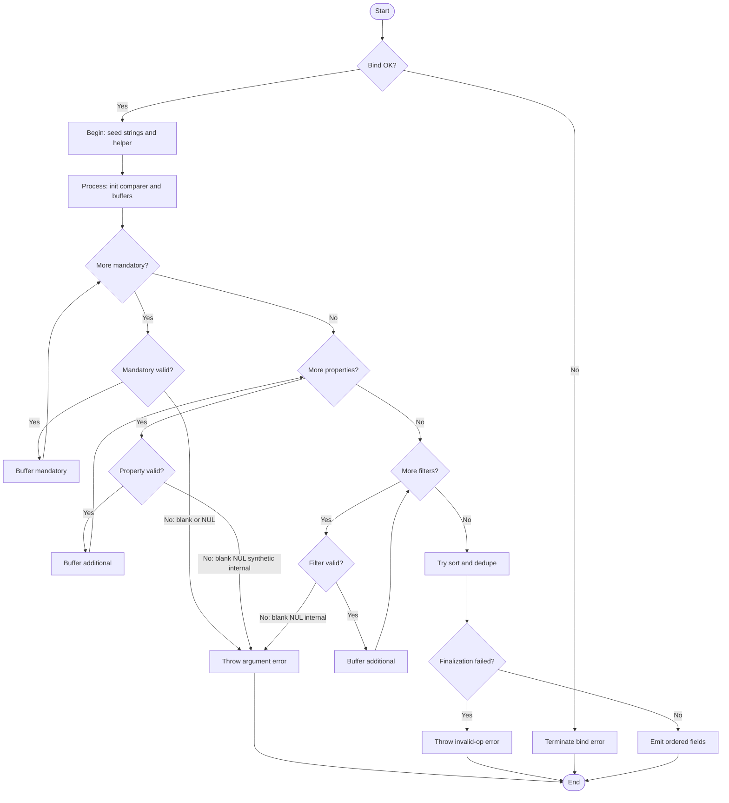

# ConvertTo-OutputFieldList

## Research Log

| Topic | Finding | Source | Date Verified |
|------|---------|--------|---------------|
| Search: PowerShell Practice and Style guide status | The community PowerShell Practice and Style guide is still useful as a baseline, but its own text says the style guide is preview/evolving and the GitHub project has been quiet. Treat it as guidance, not as a current authoritative rule feed. New finding. | https://github.com/PoshCode/PowerShellPracticeAndStyle | 2026-04-01 |
| Search: PowerShell Practice and Style guide status | The GitBook copy still says the best-practices document is evolving, recommends checking back periodically, and marks the style guide as preview. New finding. | https://poshcode.gitbook.io/powershell-practice-and-style | 2026-04-01 |
| Search: PowerShell community style-guide formatting baseline | The current GitBook style guide still recommends four spaces per indentation level and a 115-character line target, but it also explicitly says project-specific rules take precedence. That does not change this helper's audit status because the repo standard intentionally overrides those defaults. New finding. | https://poshcode.gitbook.io/powershell-practice-and-style/style-guide/code-layout-and-formatting | 2026-04-02 |
| Search: current PowerShell static-analysis baseline | Microsoft still positions PSScriptAnalyzer as the standard static checker for PowerShell scripts and modules. New finding. | https://learn.microsoft.com/en-us/powershell/utility-modules/psscriptanalyzer/overview?view=ps-modules | 2026-04-01 |
| Search: recent PSScriptAnalyzer rule changes | The latest public release is `1.25.0` on 2026-03-20. It adds rules such as `AvoidReservedWordsAsFunctionNames`, `UseConsistentParametersKind`, `UseConsistentParameterSetName`, `UseSingleValueFromPipelineParameter`, and an optional `PSUseConstrainedLanguageMode` rule. New finding. | https://github.com/PowerShell/PSScriptAnalyzer/releases | 2026-04-01 |
| Search: approved verb and naming currency | `ConvertTo` remains an approved PowerShell data verb, so the function name is current. New finding. | https://learn.microsoft.com/en-us/powershell/scripting/developer/cmdlet/approved-verbs-for-windows-powershell-commands?view=powershell-7.6 | 2026-04-01 |
| Search: CmdletBinding and positional binding | `CmdletBinding` still defaults `PositionalBinding` to `$true` unless the function disables it explicitly. New finding. | https://learn.microsoft.com/en-us/powershell/module/microsoft.powershell.core/about/about_functions_cmdletbindingattribute?view=powershell-7.5 | 2026-04-01 |
| Search: OutputType behavior | `OutputType` is metadata only; PowerShell does not derive it from the function body or verify it against runtime output. New finding. | https://learn.microsoft.com/en-us/powershell/module/microsoft.powershell.core/about/about_functions_outputtypeattribute?view=powershell-7.5 | 2026-04-01 |
| Search: AllowEmptyCollection validation attribute | `AllowEmptyCollection()` explicitly allows `@()` for collection parameters. That matches the optional extra-name parameters, but `MandatoryFields` is still blocked from empty-array input because it does not opt in. New finding. | https://learn.microsoft.com/en-us/powershell/module/microsoft.powershell.core/about/about_functions_advanced_parameters?view=powershell-7.6 | 2026-04-01 |
| Search: current PowerShell validation attribute for non-empty string collections | `ValidateNotNullOrWhiteSpaceAttribute` still exists and rejects `$null`, empty strings, whitespace-only strings, and empty collections, validating each element of a collection. This changes the audit context: PowerShell does have a built-in boundary validator for this class of input. New finding. | https://learn.microsoft.com/en-us/dotnet/api/system.management.automation.validatenotnullorwhitespaceattribute?view=powershellsdk-7.4.0 | 2026-04-01 |
| Search: output pattern and return behavior | PowerShell still emits the result of each statement to the output stream even without `return`, so the function's soft-output pattern is current. New finding. | https://learn.microsoft.com/en-us/powershell/module/microsoft.powershell.core/about/about_return?view=powershell-7.5 | 2026-04-01 |
| Search: Sort-Object behavior | `Sort-Object` is case-insensitive by default and uses the current culture unless `-Culture` is specified. That matters here because the plan requires deterministic output ordering. New finding. | https://learn.microsoft.com/en-us/powershell/module/microsoft.powershell.utility/sort-object?view=powershell-5.1 | 2026-04-01 |
| Search: current .NET string-comparison guidance | Microsoft now explicitly recommends `Ordinal` or `OrdinalIgnoreCase` for symbolic identifiers such as registry keys, values, file paths, and other culture-agnostic names. This supports the function's use of `StringComparer.OrdinalIgnoreCase` for dedupe, but not its culture-dependent sorting. New finding. | https://learn.microsoft.com/en-us/dotnet/standard/base-types/string-comparison-net-5-plus | 2026-04-01 |
| Search: current .NET collection sort API used by helper | `List<T>.Sort(IComparer<T>)` remains current and sorts with the supplied comparer. The docs also note that the implementation is unstable for equal elements. This changes the prior audit context because the helper now uses `.Sort($Comparer)` instead of `Sort-Object`, so the old culture-dependent ordering finding no longer applies to the current source. New finding. | https://learn.microsoft.com/en-us/dotnet/api/system.collections.generic.list-1.sort?view=net-9.0 | 2026-04-01 |
| Search: current .NET set API used for case-insensitive dedupe | `HashSet<T>(IEqualityComparer<T>)` remains current and is explicitly documented for custom equality comparers such as `StringComparer.OrdinalIgnoreCase`. This matches the helper's case-insensitive dedupe pattern. New finding. | https://learn.microsoft.com/en-us/dotnet/api/system.collections.generic.hashset-1.-ctor?view=net-9.0 | 2026-04-01 |
| Search: API currency for `StringComparer.OrdinalIgnoreCase` and `String.IsNullOrWhiteSpace` | Both APIs remain current in .NET 9, with no deprecation or breaking-change guidance affecting this helper's usage. New finding. | https://learn.microsoft.com/en-us/dotnet/api/system.stringcomparer.ordinalignorecase?view=net-9.0 | 2026-04-01 |
| Search: current API behavior for `String.Contains(String)` | `String.Contains(String)` remains current and performs an ordinal, case-sensitive, culture-insensitive comparison. That makes the helper's NUL check culture-agnostic. New finding. | https://learn.microsoft.com/en-us/dotnet/api/system.string.contains?view=net-9.0 | 2026-04-01 |
| Search: API currency for `StringComparer.OrdinalIgnoreCase` and `String.IsNullOrWhiteSpace` | `String.IsNullOrWhiteSpace` remains the current null/blank test for strings. No deprecation found. New finding. | https://learn.microsoft.com/en-us/dotnet/api/system.string.isnullorwhitespace?view=net-9.0 | 2026-04-01 |
| Search: PowerShell security guidance for helper functions | Current PowerShell security guidance still focuses on avoiding dynamic evaluation and unsafe command construction. This helper does not touch registry, files, credentials, processes, or network resources, and it does not build executable commands, so no new security-specific change was identified. New finding. | https://learn.microsoft.com/en-us/powershell/scripting/security/preventing-script-injection?view=powershell-7.6 | 2026-04-01 |
| Search: current `Import-LocalizedData` behavior | `Import-LocalizedData` still loads localized `.psd1` data into the named binding variable, supports graceful fallback when default in-script strings are already seeded, and as of PowerShell 7.5.5 it also falls back to `en-US` and then `en` when `-UICulture` is omitted. This changes the audit context because the helper now uses the documented fallback-friendly localization pattern. New finding. | https://learn.microsoft.com/en-us/powershell/module/microsoft.powershell.utility/import-localizeddata?view=powershell-7.5 | 2026-04-02 |
| Search: current PowerShell cmdlet error-reporting guidance | Microsoft still recommends `ThrowTerminatingError()` for terminating errors and `WriteError()` for non-terminating errors. This changes the audit context because the helper now follows that guidance by raising validation and finalization failures as terminating `ErrorRecord`s. New finding. | https://learn.microsoft.com/en-us/powershell/scripting/developer/cmdlet/error-reporting-concepts?view=powershell-7.6 | 2026-04-02 |

## Purpose

`ConvertTo-OutputFieldList` is a private helper that `Start-Uninstaller` calls in list mode, blocked multi-match output, and uninstall mode to assemble the ordered field-name list later passed to `Format-OutputLine`. It exists so output-field validation, synthetic/internal-field guarding, case-insensitive deduplication, and deterministic group ordering are implemented once instead of being repeated across the orchestrator branches. The function seeds fallback user-facing strings, optionally overlays localized strings from its companion `.strings.psd1`, validates mandatory, property, and filter-driven names, sorts mandatory and additional groups with `[System.StringComparer]::OrdinalIgnoreCase`, and emits the final logical field list with mandatory names winning over additional duplicates.

## Parameters

| Name | Type | Required | Default | Description |
|------|------|----------|---------|-------------|
| `MandatoryFields` | `System.String[]` | Yes | N/A | Base field names that must always be emitted. Parameter binding rejects omission, `@()`, `@($Null)`, and `@('')`. The function body further rejects whitespace-only names and names containing NUL. |
| `Properties` | `System.String[]` | No | `@()` | Additional raw registry value names requested by the user. Empty collections are allowed. The body rejects explicit `$Null`, empty, or whitespace-only elements, names containing NUL, synthetic fields, and internal fields. |
| `FilterPropertyNames` | `System.String[]` | No | `@()` | Property names inferred from compiled filters that should auto-append to output. Empty collections are allowed. The body rejects explicit `$Null`, empty, or whitespace-only elements, names containing NUL, and internal fields. Synthetic filter fields are allowed. |

## Return Value

The function declares `[System.String[]]`, and its final expression casts the assembled field list to a string array before emitting it. In actual PowerShell runtime behavior, that collection is still enumerated on output: direct callers receive `System.String` items on the pipeline, assignment collects multi-item results into `System.Object[]`, and a single-item result collapses to `System.String` unless the caller explicitly wraps or casts it. The logical success result is the deduplicated ordered field list with mandatory fields first and additional fields second; if parameter binding fails or the function throws during validation or finalization, no successful output is emitted.

## Execution Flow

## Error Handling

- Omitting `MandatoryFields`, passing `@()` to `MandatoryFields`, or supplying `$null` or `''` inside `MandatoryFields` triggers `System.Management.Automation.ParameterBindingValidationException` before the function body runs.
- In `Begin`, the function seeds a fallback `$Strings` hashtable and then calls `Import-LocalizedData -ErrorAction:'SilentlyContinue'`. If the companion `.strings.psd1` file cannot be loaded, the function continues with the fallback strings instead of throwing.
- A whitespace-only mandatory field name throws a terminating `System.ArgumentException` with error ID `ConvertToOutputFieldListMandatoryFieldEmpty` and the message `Mandatory field names must be non-empty.`
- A mandatory field name containing NUL throws a terminating `System.ArgumentException` with error ID `ConvertToOutputFieldListMandatoryFieldContainsNul` and the message `Mandatory field names cannot contain NUL.`
- `Properties = @()` is allowed, but an explicit `$null`, `''`, or whitespace-only element in `Properties` throws a terminating `System.ArgumentException` with error ID `ConvertToOutputFieldListPropertyFieldEmpty` and the message `Each -Properties value must be a named registry value.`
- A `-Properties` entry containing NUL throws a terminating `System.ArgumentException` with error ID `ConvertToOutputFieldListPropertyFieldContainsNul` and the message `Registry property names in -Properties cannot contain NUL.`
- A synthetic `-Properties` entry such as `AppArch` throws a terminating `System.ArgumentException` with error ID `ConvertToOutputFieldListSyntheticPropertyFieldInvalid` and a `Synthetic field '{0}' is not valid in -Properties...` message.
- An internal `-Properties` entry such as `_RegistryHive` throws a terminating `System.ArgumentException` with error ID `ConvertToOutputFieldListInternalPropertyFieldInvalid` and an `Internal field '{0}' is not valid in -Properties.` message.
- `FilterPropertyNames = @()` is allowed, but an explicit `$null`, `''`, or whitespace-only element in `FilterPropertyNames` throws a terminating `System.ArgumentException` with error ID `ConvertToOutputFieldListFilterFieldEmpty` and the message `Filter-driven property names must be non-empty.`
- A filter-driven property name containing NUL throws a terminating `System.ArgumentException` with error ID `ConvertToOutputFieldListFilterFieldContainsNul` and the message `Filter-driven property names cannot contain NUL.`
- An internal filter-driven property name throws a terminating `System.ArgumentException` with error ID `ConvertToOutputFieldListInternalFilterFieldInvalid` and an `Internal field '{0}' is never valid in output field selection.` message.
- The final sort and dedupe phase is wrapped in `Try/Catch`. If `.Sort()`, `$Seen.Add()`, or the final target-list `.Add()` operations inside that block throw, the catch wraps the failure in a terminating `System.InvalidOperationException` with error ID `ConvertToOutputFieldListSortFailed` and an `Unable to finalize output field ordering: {0}` message.
- The function writes no warnings and no non-terminating errors. Because successful output is emitted only after validation and finalization complete, a terminating exception does not produce a partial field list.

## Side Effects

This function has no side effects.

## Coding Standards Audit

| Rule | Status | Line(s) | Evidence |
|------|--------|---------|----------|
| Colon-bound parameters | FAIL | 145-148, 168-171, 211-214 | The help example is now colon-bound, but the local validation helper is still invoked positionally: ``& $ThrowArgumentError $Strings['MandatoryFieldEmpty'] $FieldName 'ConvertToOutputFieldListMandatoryFieldEmpty'``. |
| PascalCase naming | PASS | 1, 49-61, 64-137 | The function and local names follow PascalCase: ``Function ConvertTo-OutputFieldList {``, ``$MandatoryFields``, ``$FilterPropertyNames``, ``$MandatoryBuffer``, ``$AdditionalSorted``. |
| Full .NET type names (no accelerators) | PASS | 47, 50, 55, 60, 99-101, 130-137, 141-142, 243-252, 268 | The file uses fully qualified types such as ``[OutputType([System.String[]])]``, ``[System.Collections.Generic.HashSet[System.String]]::new(...)``, ``[System.Collections.Generic.List[System.String]]::new()``, and ``[System.String]::IsNullOrWhiteSpace(...)``. |
| Object types are the MOST appropriate and specific choice | PASS | 130-137, 268 | The implementation uses a comparer-aware set and typed dynamic lists: ``$Seen = [System.Collections.Generic.HashSet[System.String]]::new($Comparer)``, ``$MandatoryBuffer = [System.Collections.Generic.List[System.String]]::new()``, and ``[System.String[]](@($MandatorySorted) + @($AdditionalSorted))``. |
| Single quotes for non-interpolated strings | REVIEW | 151, 174, 217 | The NUL checks use ``$FieldName.Contains("`0")``. The standard requires single quotes for non-interpolated strings, but the same standards reference explicitly allows the `` `0 `` escape sequence, which requires double quotes. |
| `$PSItem` not `$_` | PASS | 140, 163, 206, 243, 250 | The file consistently uses ``$FieldName = [System.String]$PSItem`` and ``$Seen.Add($PSItem)``; no ``$_`` appears. |
| Explicit bool comparisons | PASS | 141-145, 151-152, 182-185, 192-195, 207-210, 217-218, 243-244, 250-251 | Conditions are explicitly compared to `$True`, for example ``If ($IsSyntheticField -eq $True) {`` and ``If ($WasAdded -eq $True) {``. |
| If conditions are pre-evaluated outside If blocks | PASS | 141-145, 151-152, 182-185, 192-195, 207-210, 225-228, 243-244, 250-251 | Conditions are stored before use, for example ``$IsEmptyFieldName = [System.Boolean](...)`` followed by ``If ($IsEmptyFieldName -eq $True) {``. |
| `$Null` on left side of comparisons | N/A | N/A | The function performs no explicit null comparisons inside conditional logic. |
| No positional arguments to cmdlets | PASS | 91-95, 104-109, 256-264 | Cmdlet and function-style invocations use named parameters, for example ``Import-LocalizedData -BindingVariable:'Strings' -FileName:'ConvertTo-OutputFieldList.strings'`` and ``New-ErrorRecord -ExceptionName:'System.ArgumentException' ...``. |
| No cmdlet aliases | PASS | 91-95, 104-109, 256-264 | The function uses full command names such as ``Import-LocalizedData`` and ``New-ErrorRecord``; no aliases appear. |
| Switch parameters correctly handled | N/A | N/A | The function defines no switch parameters. |
| CmdletBinding with all required properties | PASS | 38-46 | The attribute explicitly lists the house-style properties: ``ConfirmImpact = 'None'``, ``DefaultParameterSetName = 'Default'``, ``HelpURI = ''``, ``PositionalBinding = $False``, ``RemotingCapability = 'None'``, ``SupportsPaging = $False``, and ``SupportsShouldProcess = $False``. |
| OutputType declared | PASS | 47 | The function declares ``[OutputType([System.String[]])]``. |
| `#Requires -Version 5.1` present | FAIL | 36-38 | The file goes directly from ``#>`` to ``[CmdletBinding(``; there is no intervening ``#Requires -Version 5.1`` directive. |
| Comment-based help is complete | PASS | 3-35 | The help block includes ``.SYNOPSIS``, ``.DESCRIPTION``, ``.PARAMETER MandatoryFields``, ``.PARAMETER Properties``, ``.PARAMETER FilterPropertyNames``, ``.EXAMPLE``, ``.OUTPUTS``, and ``.NOTES``. |
| Error handling via `New-ErrorRecord` or appropriate pattern | PASS | 97-110, 255-265 | Validation failures use ``$ErrorRecord = New-ErrorRecord ...`` followed by ``$PSCmdlet.ThrowTerminatingError($ErrorRecord)``, and the `Catch` block uses the same pattern for finalization failures. |
| Try/Catch around operations that can fail | FAIL | 91-95, 159, 202, 235, 238-265 | The sort and final dedupe phase is wrapped in ``Try { ... } Catch { ... }``, but ``Import-LocalizedData -ErrorAction:'SilentlyContinue'`` and the initial ``$MandatoryBuffer.Add(...)`` / ``$AdditionalBuffer.Add(...)`` calls execute outside any `Try`. |
| Write-Debug at Begin/Process/End block entry and exit (if blocks are used) | FAIL | 64, 114 | The function declares ``Begin {`` and ``Process {`` blocks, but there are no ``Write-Debug`` statements anywhere in the file. |
| No variable pollution (`script:` / `global:` leaks) | PASS | 65-137 | All working state is local, for example ``$Strings = @{ ... }``, ``$Comparer = [System.StringComparer]::OrdinalIgnoreCase``, and ``$AdditionalSorted = [System.Collections.Generic.List[System.String]]::new()``. No `script:` or `global:` scope modifiers appear. |
| 96-character line limit | PASS | 88-90, 256-264 | Automated line-length scan found no lines over 96 characters. Long strings and argument lists are wrapped, for example ``SyntheticPropertyFieldInvalid =`` on one line and the message body on the next. |
| 2-space indentation (not tabs, not 4-space) | PASS | 64-95, 139-159, 238-268 | Nested statements use 2-space indentation, for example ``If (...) {`` followed by a 2-space-indented command block. A tab scan found no tab characters. |
| OTBS brace style | PASS | 1, 64, 114, 139-160, 238-266 | The file follows OTBS forms such as ``Function ConvertTo-OutputFieldList {``, ``If (...) {``, and ``} Catch {``. |
| No commented-out code | PASS | 2-36 | The only comments are help documentation such as ``.SYNOPSIS`` and ``.DESCRIPTION``; no disabled statements appear. |
| Registry access is read-only | N/A | N/A | The function does not access the registry. |
| Leading commas in attributes | FAIL | 38-46, 49, 53, 58 | The attribute blocks omit the required leading-comma style, for example ``[CmdletBinding(`` followed by ``ConfirmImpact = 'None',`` and ``[Parameter(Mandatory = $True, ParameterSetName = 'Default')]``. |
| `[Parameter()]` properties listed explicitly | FAIL | 49, 53, 58 | Each parameter attribute lists only a subset of the house-style properties, for example ``[Parameter(Mandatory = $True, ParameterSetName = 'Default')]``. |
| Localized string data for user-facing messages | PASS | 65-95 | The function seeds fallback user-facing strings and imports its companion strings file via ``Import-LocalizedData -BindingVariable:'Strings' -FileName:'ConvertTo-OutputFieldList.strings'``. |
| Fail-fast boundary validation | FAIL | 49-61, 139-236 | Parameter declarations use type metadata and `AllowEmptyCollection`, but whitespace/NUL/synthetic/internal validation still occurs later in `Process`, for example ``$Properties | & { Process { ... If ($IsSyntheticField -eq $True) { ... } }}``. |
| UTF-8 with BOM for PS 5.1-targeted file | PASS | 1 | Byte inspection confirms the file begins with UTF-8 BOM bytes `EF BB BF` before ``Function ConvertTo-OutputFieldList {``. |

* Research note 1: Current Microsoft guidance still aligns with the helper's use of ordinal, case-insensitive comparison for culture-agnostic identifiers.
* Research note 2: `List<T>.Sort(IComparer<T>)` is explicitly documented as unstable for equal elements. That does not break deterministic grouping here, but it means sort stability alone does not define which original casing survives for case-equivalent duplicates.
* Research note 3: PSScriptAnalyzer `1.25.0` adds rules newer than the in-repo standards reference. This audit still evaluates compliance against the repo standard as written.
* Research note 4: The current community style guide still prefers four-space indentation and a 115-character line target, but it also explicitly says project-specific rules take precedence. This audit therefore scores formatting against the repo standard, not the community default.
* Research note 5: `OutputType` metadata does not change runtime output behavior. The helper declares `[System.String[]]`, but PowerShell still enumerates that collection on output unless the caller explicitly wraps or casts it.

## Plan Audit

| Plan Section | Requirement | Status | Line(s) | Details |
|--------------|-------------|--------|---------|---------|
| `12. File Structure` | `ConvertTo-OutputFieldList.ps1` belongs in `src/Private/` and `builds the final ordered output field list`. (`PLAN.md:682`, `PLAN.md:743-744`) | ALIGNED | 1-269 | The helper exists in the planned private file location and its only logical success result is the assembled field-name list. `Start-Uninstaller` delegates to it in list mode, blocked multi-match mode, and uninstall mode rather than duplicating the same logic. |
| `2. Frozen Product Decisions` / `16. Acceptance Checklist` | No deduplication or merge logic. (`PLAN.md:39-40`, `PLAN.md:991`) | REVIEW | 131-137, 242-252 | The helper intentionally deduplicates output field names with a case-insensitive `HashSet`. That conflicts with the broad `no dedupe` wording but matches the more specific output-field contract in section 11.3, so the plan text remains internally inconsistent. |
| `11.3 Additional Output Fields` | Additional output fields are the union of `-Properties` and filter property names that are not already mandatory. (`PLAN.md:618-621`) | ALIGNED | 162-236, 242-252, 268 | Both `-Properties` and `-FilterPropertyNames` are buffered into the additional group, and the later `HashSet` pass suppresses any name that already appeared in the mandatory group. |
| `2. Frozen Product Decisions` / `11.3 Additional Output Fields` | Filter properties auto-append to emitted output if not already present. (`PLAN.md:59`, `PLAN.md:628`, `PLAN.md:998`) | ALIGNED | 205-236, 249-252, 268 | Filter-driven names are buffered in the additional group and only survive into the final suffix when ``$Seen.Add($PSItem) -eq $True``. |
| `11.3 Additional Output Fields` | Comparison is case-insensitive and duplicates collapse case-insensitively. (`PLAN.md:625-626`) | ALIGNED | 130-133, 182-195, 225-228, 242-252 | The helper creates both its sort comparer and dedupe set from ``[System.StringComparer]::OrdinalIgnoreCase`` and uses case-insensitive membership checks when validating synthetic and internal names. |
| `11.2 Mandatory Output Fields` / `11.3 Additional Output Fields` | Mandatory fields come first, additional fields come after, and both groups are sorted alphabetically. (`PLAN.md:585`, `PLAN.md:600`, `PLAN.md:625-627`) | ALIGNED | 238-245, 249-252, 268 | ``$MandatoryBuffer.Sort($Comparer)`` and ``$AdditionalBuffer.Sort($Comparer)`` sort each group, the first `HashSet` pass fills `$MandatorySorted`, the second fills `$AdditionalSorted`, and line 268 concatenates mandatory first then additional. |
| `2. Frozen Product Decisions` / `11.4 -Properties` / `16. Acceptance Checklist` | `-Properties` accepts only named raw registry value names; synthetic fields are invalid; property names must be non-empty and contain no NUL. (`PLAN.md:57-59`, `PLAN.md:633-640`, `PLAN.md:997-999`) | ALIGNED | 162-202 | The helper rejects blank/whitespace values, NUL-containing names, synthetic fields, and internal fields. Any remaining value is treated verbatim as a raw registry value name. |
| `11.3 Additional Output Fields` | Synthetic filter fields may auto-append. (`PLAN.md:628`, `PLAN.md:998`) | ALIGNED | 205-236 | The filter-driven validation block rejects only blank, NUL, and internal names. Synthetic names such as `AppArch` are allowed through to the additional buffer. |
| `5.1 Application Record` | Internal-only fields are never valid in `-Properties` and are never emitted to PDQ. (`PLAN.md:177-178`) | ALIGNED | 192-199, 225-232 | The helper throws on internal names in both `-Properties` and `-FilterPropertyNames`, preventing internal-only fields from entering the output field list. |
| `16. Acceptance Checklist` | Output field ordering is deterministic. (`PLAN.md:999`) | ALIGNED | 130-133, 238-240, 268 | The helper sorts both groups with `StringComparer.OrdinalIgnoreCase` instead of culture-sensitive `Sort-Object`, satisfying the plan's deterministic ordering requirement. |
| `11.4 -Properties` / `11.5 Value Formatting` | Missing requested values emit `<null>` and output values are sanitized to single-line text. (`PLAN.md:641-653`) | N/A | N/A | This helper only assembles field names. Value materialization and line sanitization belong to later stages such as record shaping and `Format-OutputLine`. |

* Research note 1: The plan tension between the broad `no dedupe` wording and section 11.3's explicit duplicate-collapsing rule is still unresolved. This helper follows the more specific output-field contract.
* Research note 2: The helper's runtime output is pipeline-enumerated strings rather than an atomic array object, but the plan only requires it to build the final ordered field list. Current call sites consume that output successfully.

## Verification Notes

- `Invoke-ScriptAnalyzer` is available in this environment and returned no diagnostics for `src\Private\ConvertTo-OutputFieldList.ps1`, both with default rules and with `PSScriptAnalyzerSettings.psd1`. That does not erase the manual house-style findings because the repo standard is stricter than the analyzer's built-in rules.
- `Invoke-Pester tests\Private\ConvertTo-OutputFieldList.Tests.ps1` still cannot complete in this sandbox because Pester 5.7.1 attempts to create `HKCU\Software\Pester`, and the environment denies registry write access. That is an environment limitation, not direct evidence of a defect in this helper.
- The repo's existing `build\testResults.xml` records successful prior execution of `tests\Private\ConvertTo-OutputFieldList.Tests.ps1` and the `Start-Uninstaller` orchestrator tests that assert delegation to this helper.
- Byte inspection confirmed that `src\Private\ConvertTo-OutputFieldList.ps1` starts with a UTF-8 BOM (`EF BB BF`).
- Direct runtime probes confirmed the parameter-boundary split: `MandatoryFields` rejects `@()`, `@($Null)`, and `@('')` during parameter binding, while invalid `Properties` and `FilterPropertyNames` elements reach the function body and throw the documented terminating `System.ArgumentException` records.
- Direct runtime probes also confirmed that the function's final `[System.String[]]` cast is still enumerated by PowerShell on output. Multi-item results collect as `System.Object[]` on assignment, and single-item results collapse to `System.String` unless the caller explicitly wraps or casts them.
- Manual runtime spot checks confirmed the current implementation behavior: mandatory and additional groups sort with ordinal, case-insensitive semantics; duplicates collapse with mandatory names winning; synthetic filter-driven fields such as `AppArch` are allowed to auto-append; and synthetic `-Properties` entries throw the documented validation error.

## Changelog

| Date | Changes |
|------|---------|
| 2026-04-02 | Fourth audit run. Corrected the README to match the current source's `Begin`/`Process` structure, companion strings import, `New-ErrorRecord` plus `ThrowTerminatingError` validation pattern, and `Try/Catch`-wrapped finalization logic; replaced several stale standards findings that were based on the older implementation; updated verification because `Invoke-ScriptAnalyzer` is now available locally; and documented the previously missed runtime output shape where the helper's cast array is still enumerated as strings unless the caller wraps or casts it. |
| 2026-04-02 | Third audit run. Corrected the false UTF-8-with-BOM FAIL after byte-level verification, added the missing `#Requires -Version 5.1` standards finding, recorded the current community style-guide formatting baseline, clarified parameter-binding error types with runtime probes, and documented the plan's no-dedupe versus output-field-dedupe ambiguity. |
| 2026-04-01 | Second audit run. Corrected the README to match the current source: replaced the stale `Sort-Object` and silent-skip narrative with the actual `List<T>.Sort`/`HashSet` implementation, documented the current in-body validation and `ArgumentException` throws, corrected the false plan deviations from the previous run, and added newly observed standards findings for colon-bound help examples, inline condition evaluation, attribute formatting, inline user-facing strings, and missing boundary-validation attributes. |
| 2026-04-01 | First audit run. Added the full function README, recorded current web research, documented execution flow and error behavior, and captured two substantive audit findings: culture-dependent ordering and missing `-Properties` contract enforcement inside this helper. |
AUDIT_STATUS:UPDATED