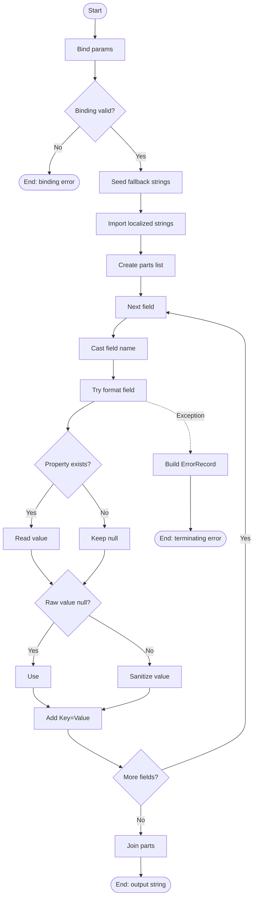

# Format-OutputLine

## Purpose

`Format-OutputLine` renders one record into a single PDQ-friendly `Key=Value | Key=Value`
line using the caller's field order and field-name casing. `Start-Uninstaller` calls it
when emitting list-mode matches, blocked multi-match records, and per-entry uninstall
results so every public line follows the same output contract. The helper exists to
centralize `<null>` handling, single-line value sanitization, and structured catch-path
errors instead of duplicating that logic in multiple output paths.

## Parameters

| Name | Type | Required | Default | Description |
|------|------|----------|---------|-------------|
| Record | `System.Management.Automation.PSObject` | Yes | None | Record-like object to render. Property lookup is performed through `PSObject.Properties[]`, so missing properties are treated as `$Null` and emitted as `<null>`. |
| FieldList | `System.String[]` | Yes | None | Ordered field names to emit. The array order becomes the output order, and each emitted key uses the exact `FieldList` element text rather than the record property's original casing. Parameter binding also rejects `$Null`, `@()`, and empty-string elements before the function body runs. |

## Return Value

The function emits one `[System.String]` on success, such as
`DisplayName=Node.js | Outcome=Succeeded`. Missing properties and explicit `$Null` values
are rendered as the literal text `<null>`, while non-null values are stringified and
sanitized; if a value is only whitespace, the emitted field becomes `Key=` after trimming.
The function does not emit `$Null` on success. If parameter binding fails, such as
`-Record:$Null`, `-FieldList:$Null`, `-FieldList:@()`, or `-FieldList:@('')`, the body
does not run and no output string is produced. If the per-field `Catch` block runs, the
function terminates before joining or emitting any partial line.

## Execution Flow

## Error Handling

- Parameter binding rejects invalid mandatory input before the body runs. Direct runtime
  probes on 2026-04-02 confirmed `-Record:$Null`, `-FieldList:$Null`, `-FieldList:@()`,
  and `-FieldList:@('')` raise `ParameterBindingValidationException`.
- Missing properties are not errors. `$Record.PSObject.Properties[$FieldName]` can be
  `$Null`, in which case the function keeps `$RawValue` as `$Null` and emits `<null>`.
- Explicit `$Null` property values are also not errors; they are normalized to `<null>`.
- The Begin block seeds an in-memory fallback `$Strings` table, then calls
  `Import-LocalizedData -ErrorAction:'SilentlyContinue'`. If the companion
  `Format-OutputLine.strings.psd1` file is missing or unreadable, the function continues
  with the fallback message text instead of terminating.
- Exceptions during property access, value stringification, sanitization, or `List.Add()`
  are caught per field. The catch path calls `New-ErrorRecord` with
  `ExceptionName:'System.InvalidOperationException'`, `ErrorId:'FormatOutputLineFailed'`,
  target object `$FieldName`, and category `InvalidData`, then raises the returned record
  via `$PSCmdlet.ThrowTerminatingError()`.
- The function does not directly call `Write-Error` or `Write-Warning`. Its catch path
  delegates error-record construction to `New-ErrorRecord` and then terminates.
- The final join expression is outside the per-field `Try/Catch`, so an unexpected failure
  there would bubble unchanged.

## Side Effects

This function has no side effects.

## Research Log

| Topic | Finding | Source | Date Verified |
|-------|---------|--------|---------------|
| PowerShell lifecycle product page | Searched `PowerShell lifecycle products powershell PowerShell 7.6 LTS`. Microsoft's lifecycle product page is now an internally consistent official source: it lists `PowerShell 7.6 (LTS)` starting on `2026-03-18` and `PowerShell 7.5` ending on `2026-11-10`. Change: new supporting source; it complements the older, internally inconsistent support-lifecycle article rather than changing this function audit. | [PowerShell - Microsoft Lifecycle](https://learn.microsoft.com/en-us/lifecycle/products/powershell) | 2026-04-02 |
| Terminating error API | Searched `PowerShell ThrowTerminatingError ErrorRecord best practice official`. Microsoft still documents cmdlet-style error reporting around `ErrorRecord` objects and says terminating errors should be surfaced through `ThrowTerminatingError`. Microsoft also advises cmdlets and providers to use `WriteError(ErrorRecord)` or `ThrowTerminatingError(ErrorRecord)` rather than custom `IContainsErrorRecord` exceptions. Change: new context only; it confirms the engine-level pattern used here is current even though the repo's stricter house rule still requires `New-ErrorRecord`. | [Interpreting ErrorRecord Objects](https://learn.microsoft.com/en-us/powershell/scripting/developer/cmdlet/interpreting-errorrecord-objects?view=powershell-7.4), [IContainsErrorRecord Interface](https://learn.microsoft.com/en-us/dotnet/api/system.management.automation.icontainserrorrecord?view=powershellsdk-7.4.0) | 2026-04-02 |
| Import-LocalizedData currency | Searched `Import-LocalizedData PowerShell 7.6`. Microsoft still documents `Import-LocalizedData` as the current cmdlet for loading culture-specific `.psd1` data into a binding variable. No deprecation or replacement surfaced. Change: new supporting source; it confirms this helper's Begin-block localized-string pattern is still current. | [Import-LocalizedData](https://learn.microsoft.com/en-us/powershell/module/microsoft.powershell.utility/import-localizeddata?view=powershell-7.6) | 2026-04-02 |
| PowerShell style guide | Searched `PowerShell Practice and Style guide latest`. The community guide still recommends `[CmdletBinding()]`, OTBS, Verb-Noun naming, 4-space indentation, and a softer 115-character line target. Change: new baseline note only; this audit still uses the repo's stricter 2-space and 96-character house rules. | [PowerShell Practice and Style: Code Layout and Formatting](https://poshcode.gitbook.io/powershell-practice-and-style/style-guide/code-layout-and-formatting) | 2026-04-01 |
| PSScriptAnalyzer latest release (SUPERSEDED) | SUPERSEDED on 2026-04-02. The prior row claimed GitHub showed `1.25.0` as the latest release. Current official release metadata available to this audit does not support that claim, so treat it as a false finding. | [PowerShell/PSScriptAnalyzer Releases](https://github.com/powershell/psscriptanalyzer/releases) | 2026-04-02 |
| PSScriptAnalyzer current release and rules inventory | Searched `PSScriptAnalyzer releases latest 2026` and `PSScriptAnalyzer rules readme`. GitHub currently shows `1.24.0` as the latest published release. Separately, the current Learn rules catalog lists rules such as `AvoidReservedWordsAsFunctionNames`, `UseConsistentParametersKind`, `UseConsistentParameterSetName`, `UseSingleValueFromPipelineParameter`, and `UseConstrainedLanguageMode`. Change: corrects the previous false `1.25.0` release claim and separates current rules-page content from confirmed release metadata. | [PowerShell/PSScriptAnalyzer Releases](https://github.com/powershell/psscriptanalyzer/releases), [PSScriptAnalyzer Rules](https://learn.microsoft.com/en-us/powershell/utility-modules/psscriptanalyzer/rules/readme?view=ps-modules) | 2026-04-02 |
| PSScriptAnalyzer recent breaking change | Searched `PSScriptAnalyzer 1.24.0 breaking changes`. Release `1.24.0` raised the minimum PowerShell version to `5.1` and expanded `UseCorrectCasing` to operators, keywords, and commands. Change: unchanged; still relevant to casing-focused audits. | [PowerShell/PSScriptAnalyzer Releases](https://github.com/powershell/psscriptanalyzer/releases) | 2026-04-01 |
| PowerShell version support (SUPERSEDED) | SUPERSEDED on 2026-04-01. The prior row treated Microsoft's support-lifecycle page as internally consistent. The current official page is not: its summary says the current LTS release is `7.6.0` and there is no current preview release, but the version table still lists `PowerShell 7.6 (preview)`. Windows PowerShell `5.1` support through Windows support channels remains unchanged. | [PowerShell Support Lifecycle](https://learn.microsoft.com/en-us/powershell/scripting/install/powershell-support-lifecycle?view=powershell-7.6) | 2026-04-01 |
| PowerShell version support | Searched `PowerShell support lifecycle 7.6 2026 official`. Microsoft's current lifecycle page says the current Stable release is `7.5.5`, says the current LTS release is `7.6.0`, says there is no current preview release, and separately still shows `PowerShell 7.6 (preview)` in the end-of-support table. Change: corrected the earlier row to reflect the page's current internal inconsistency rather than flattening it into a single clean statement. | [PowerShell Support Lifecycle](https://learn.microsoft.com/en-us/powershell/scripting/install/powershell-support-lifecycle?view=powershell-7.6) | 2026-04-01 |
| Parameter validation patterns | Searched `about_Functions_Advanced_Parameters`. Microsoft still documents validation attributes such as `ValidateCount`, `ValidateLength`, `ValidatePattern`, `ValidateRange`, and related parameter-boundary validation patterns for advanced functions. Change: unchanged; it still supports the audit's emphasis on explicit validation at the parameter boundary. | [about_Functions_Advanced_Parameters](https://learn.microsoft.com/id-id/powershell/module/microsoft.powershell.core/about/about_functions_advanced_parameters?view=powershell-7.5) | 2026-04-01 |
| CmdletBinding guidance | Searched `about_Functions_CmdletBindingAttribute ConfirmImpact SupportsShouldProcess`. Microsoft currently states that `ConfirmImpact` should be specified only when `SupportsShouldProcess` is also specified. Change: new finding; this differs from the repo house style that requires an explicit `CmdletBinding` property list even on non-ShouldProcess helpers. | [about_Functions_CmdletBindingAttribute](https://learn.microsoft.com/ru-ru/powershell/module/microsoft.powershell.core/about/about_functions_cmdletbindingattribute?view=powershell-7.5) | 2026-04-01 |
| Comment-based help currency | Searched `comment-based help keywords powershell 7.6`. Microsoft still documents `.SYNOPSIS`, `.DESCRIPTION`, `.PARAMETER`, `.EXAMPLE`, `.INPUTS`, `.OUTPUTS`, and `.NOTES` as valid help keywords. Change: unchanged; the function's help block now satisfies the documented keyword set. | [Writing Comment-Based Help Topics](https://learn.microsoft.com/en-us/powershell/scripting/developer/help/writing-comment-based-help-topics?view=powershell-7.5) | 2026-04-01 |
| Output pattern | Searched `about_Return PowerShell official`. Microsoft still states that the results of each statement are returned as output even without the `return` keyword. Change: unchanged; the function's trailing expression output pattern remains current. | [about_Return](https://learn.microsoft.com/ga-ie/powershell/module/microsoft.powershell.core/about/about_return?view=powershell-7.5&viewFallbackFrom=powershell-7.3) | 2026-04-01 |
| Type and member access | Searched `about_Type_Accelerators` and `about_Intrinsic_Members`. Microsoft still documents type accelerators as aliases for .NET types, and still documents intrinsic members such as `PSObject` as the standard reflection surface for object members. Change: corrected application of the research to this function; the current source uses the full .NET type name `System.Management.Automation.PSObject`, so the prior type-accelerator finding no longer applies to this file. | [about_Type_Accelerators](https://learn.microsoft.com/ja-jp/powershell/module/microsoft.powershell.core/about/about_type_accelerators?view=powershell-7.6), [about_Intrinsic_Members](https://learn.microsoft.com/en-sg/powershell/module/microsoft.powershell.core/about/about_intrinsic_members?view=powershell-7.6) | 2026-04-01 |
| .NET constructor and collection currency | Searched `List<T> constructors net 10`. Microsoft still documents `List<T>()` constructors as current, and PowerShell still supports the static `.new()` construction form on .NET types. Change: unchanged; no deprecation or replacement surfaced for `[System.Collections.Generic.List[System.String]]::new()`. | [List<T> Constructors](https://learn.microsoft.com/de-de/dotnet/api/system.collections.generic.list-1.-ctor?view=net-10.0), [about_Intrinsic_Members](https://learn.microsoft.com/en-sg/powershell/module/microsoft.powershell.core/about/about_intrinsic_members?view=powershell-7.6) | 2026-04-01 |
| Security posture | Searched `preventing script injection attacks PowerShell 7.6`. Current Microsoft guidance still emphasizes typed input and avoiding dynamic evaluation patterns such as `Invoke-Expression`; this helper does neither dynamic execution nor command construction, so no function-specific security advisory surfaced. Change: unchanged; no new security issue was found for this helper. | [Preventing script injection attacks](https://learn.microsoft.com/en-us/powershell/scripting/security/preventing-script-injection?view=powershell-7.5) | 2026-04-01 |
| Encoding compatibility (SUPERSEDED) | SUPERSEDED on 2026-04-01. The prior row tied this file's BOM finding to a non-ASCII comment character in `Format-OutputLine.ps1`. The current source is ASCII-only, so that function-specific rationale is no longer accurate. The underlying Microsoft guidance about Windows PowerShell encoding behavior remains current. | [about_Character_Encoding](https://learn.microsoft.com/id-id/powershell/module/microsoft.powershell.core/about/about_character_encoding?view=powershell-7.6) | 2026-04-01 |
| Encoding compatibility | Searched `about_Character_Encoding PowerShell 7.6 UTF-8 BOM Windows PowerShell`. Microsoft still documents Windows PowerShell `5.1` as having inconsistent default encoding behavior and still notes that `UTF8` in Windows PowerShell is BOM-bearing. Change: corrected the previous function-specific finding; this file is now ASCII-only, but the repo's PS 5.1 house rule still requires a UTF-8 BOM for `.ps1` files. | [about_Character_Encoding](https://learn.microsoft.com/id-id/powershell/module/microsoft.powershell.core/about/about_character_encoding?view=powershell-7.6) | 2026-04-01 |

## Standards Audit

| Rule | Status | Line(s) | Evidence |
|------|--------|---------|----------|
| Colon-bound parameters | PASS | 23, 77-80, 111-119 | `.EXAMPLE` uses `Format-OutputLine -Record:$Record -FieldList:@('DisplayName', 'Outcome')`, and executable calls also use named colon-bound arguments such as `Import-LocalizedData -BindingVariable:'Strings' -FileName:'Format-OutputLine.strings' -BaseDirectory:$PSScriptRoot -ErrorAction:'SilentlyContinue'` and `New-ErrorRecord -ExceptionName:'System.InvalidOperationException' ... -ErrorId:'FormatOutputLineFailed'`. |
| PascalCase naming | PASS | 1, 43-124 | `Function Format-OutputLine {`, `Param (`, `Begin {`, `Process {`, `Try {`, `Catch {`, `$Record`, `$FieldList`, `$Parts`, `$FieldName`, `$PropertyInfo`, `$RawValue`, `$HasPropertyInfo`, `$HasNullRawValue`, `$Sanitized`, `$RenderedValue`, and `$ErrorRecord` all use PascalCase. |
| Full .NET type names (no accelerators) | PASS | 42, 54, 67, 84, 92, 97, 119, 124 | `[OutputType([System.String])]`, `[System.Management.Automation.PSObject]`, `[System.String[]]`, `[System.Collections.Generic.List[System.String]]::new()`, `[System.Boolean](...)`, `[System.Management.Automation.ErrorCategory]::InvalidData`, and `[System.String]($Parts -join ' | ')` all use full .NET type names. |
| Object types are the MOST appropriate and specific choice | REVIEW | 54, 90 | `[System.Management.Automation.PSObject] $Record` matches the helper's reflective property-bag behavior because the code reads `$Record.PSObject.Properties[$FieldName]`, but the house rule explicitly warns against functional generic types like `PSObject`, so whether this is the most specific acceptable contract is policy-ambiguous. |
| Single quotes for non-interpolated strings | PASS | 34-40, 48, 61, 74, 77-80, 99, 102-104, 111, 118 | `ConfirmImpact = 'None'`, `HelpURI = ''`, `'See function help.'`, `'Unable to format output field ''{0}'': {1}'`, `-BindingVariable:'Strings'`, `'<null>'`, `' '`, `'\s{2,}'`, `'\|'`, `-ExceptionName:'System.InvalidOperationException'`, and `-ErrorId:'FormatOutputLineFailed'` are all single-quoted literals. |
| `$PSItem` not `$_` | PASS | 86-87, 115 | `$FieldList | & { Process {`, `$FieldName = [System.String]$PSItem`, and `$PSItem.Exception.Message` appear; no `$_` token appears in the function body. |
| Explicit bool comparisons (`$Var -eq $True`, not just `$Var`) | PASS | 93, 98 | `If ($HasPropertyInfo -eq $True) {` and `$Sanitized = If ($HasNullRawValue -eq $True) {` use explicit boolean comparisons. |
| If conditions are pre-evaluated outside If blocks | PASS | 92-98 | `$HasPropertyInfo = [System.Boolean]($Null -ne $PropertyInfo)` is evaluated before `If ($HasPropertyInfo -eq $True)`, and `$HasNullRawValue = [System.Boolean]($Null -eq $RawValue)` is evaluated before `If ($HasNullRawValue -eq $True)`. |
| `$Null` on left side of comparisons | PASS | 92, 97 | `$HasPropertyInfo = [System.Boolean]($Null -ne $PropertyInfo)` and `$HasNullRawValue = [System.Boolean]($Null -eq $RawValue)` both place `$Null` on the left. |
| No positional arguments to cmdlets | PASS | 76-80, 110-119 | `Import-LocalizedData -BindingVariable:'Strings' -FileName:'Format-OutputLine.strings' -BaseDirectory:$PSScriptRoot -ErrorAction:'SilentlyContinue'` uses named parameters only, and the catch path calls `New-ErrorRecord -ExceptionName:... -ExceptionMessage:(...) -TargetObject:$FieldName -ErrorId:'FormatOutputLineFailed' -ErrorCategory:(...)` with named arguments only. |
| No cmdlet aliases | PASS | 76-80, 110-119 | The function calls `Import-LocalizedData` and `New-ErrorRecord` by full name; no alias forms such as `ipmo`, `%`, or `?` appear. |
| Switch parameters correctly handled | N/A | N/A | The function declares no `[switch]` parameters and does not pass any switch parameter with an explicit boolean value. |
| CmdletBinding with all required properties | PASS | 33-41 | `[CmdletBinding(` lists `ConfirmImpact`, `DefaultParameterSetName`, `HelpURI`, `PositionalBinding`, `RemotingCapability`, `SupportsPaging`, and `SupportsShouldProcess`. |
| Leading commas in attributes | FAIL | 33-67 | `[CmdletBinding(` is followed by `ConfirmImpact = 'None'`, and each `[Parameter(` block starts with `Mandatory = $True,` rather than the house-style leading-comma form. |
| Parameter attributes list all properties explicitly | PASS | 44-66, 57-65 | Both `[Parameter()]` blocks explicitly list `Mandatory`, `ParameterSetName`, `DontShow`, `HelpMessage`, `Position`, `ValueFromPipeline`, `ValueFromPipelineByPropertyName`, and `ValueFromRemainingArguments`. |
| OutputType declared | PASS | 42 | `[OutputType([System.String])]` is declared immediately before `Param (`. |
| Comment-based help is complete | PASS | 2-31 | `.SYNOPSIS`, `.DESCRIPTION`, `.PARAMETER Record`, `.PARAMETER FieldList`, `.EXAMPLE`, `.OUTPUTS`, and `.NOTES` all appear in the help block. |
| Error handling via New-ErrorRecord or appropriate pattern | PASS | 109-120 | The catch path uses `$ErrorRecord = New-ErrorRecord ... -ErrorId:'FormatOutputLineFailed' -ErrorCategory:([System.Management.Automation.ErrorCategory]::InvalidData)` and then `$PSCmdlet.ThrowTerminatingError($ErrorRecord)`. |
| Try/Catch around operations that can fail | PASS | 89-120 | `Try { ... $Record.PSObject.Properties[$FieldName] ... [System.String]$RawValue ... $RenderedValue.Trim() ... $Parts.Add(...) } Catch { ... }` wraps the per-field formatting path. |
| Write-Debug at Begin/Process/End block entry and exit (if blocks are used) | FAIL | 71-81, 83-125 | `Begin { ... }` and `Process { ... }` blocks are present, but there are no `Write-Debug -Message:'[Format-OutputLine] Entering/Leaving Block: ...'` calls at block entry or exit. |
| No variable pollution (no `script:` or `global:` scope leaks) | PASS | 71-124 | `$Strings`, `$Parts`, `$FieldName`, `$PropertyInfo`, `$RawValue`, `$HasPropertyInfo`, `$HasNullRawValue`, `$Sanitized`, `$RenderedValue`, and `$ErrorRecord` are local variables only; no `script:` or `global:` qualifiers appear. |
| PSScriptAnalyzer zero warnings/errors required | FAIL | 55; local run 2026-04-02 | `Invoke-ScriptAnalyzer -Path 'src\Private\Format-OutputLine.ps1' -Settings 'PSScriptAnalyzerSettings.psd1'` returned `PSReviewUnusedParameter  Warning  55  The parameter 'Record' has been declared but not used.` |
| 96-character line limit | PASS | 1-126 | A local scan on 2026-04-02 found a maximum line length of 84 characters at line 119, so no line exceeds the 96-character limit. |
| 2-space indentation (not tabs, not 4-space) | PASS | 2-125 | `  [CmdletBinding(`, `    [Parameter(`, and `      $Parts.Add(('{0}={1}' -f $FieldName, $Sanitized))` use 2-space indentation; a local scan found `TabLineCount=0`. |
| OTBS brace style | PASS | 1, 71, 83, 86, 89, 93, 98, 109, 126 | `Function Format-OutputLine {`, `Begin {`, `Process {`, `$FieldList | & { Process {`, `Try {`, `If (...) {`, `} Else {`, and `} Catch {` all follow OTBS placement. |
| No commented-out code | PASS | 2-31, 71-125 | The only comments are the contiguous help block `'<#' ... '#>'`; no disabled executable statements appear in the function body. |
| Registry access is read-only | N/A | N/A | The function does not access the registry. |
| UTF-8 with BOM for PS 5.1-targeted `.ps1` files | PASS | 1 | Byte inspection on 2026-04-02 found the file header begins with UTF-8 BOM bytes `EF BB BF`; decoded-text inspection found the only non-ASCII code point is `65279` (the BOM). |

*Note 1: Current community guidance still recommends 4-space indentation and a softer line-length target. This audit still uses the repo's authoritative 2-space and 96-character rules, per the prompt.*

*Note 2: Microsoft's current confirmation guidance ties confirmation metadata to `SupportsShouldProcess`, while this repo's house standard still requires an explicit `CmdletBinding` property list even on non-ShouldProcess helpers. The audit is scored against the house standard as written.*

*Note 3: The direct `Invoke-ScriptAnalyzer` warning on `$Record` may be a tooling false positive caused by the `& { Process { } }` child-scope iteration pattern still reading the outer variable. The repo standard is nevertheless zero analyzer warnings, so the live warning remains a FAIL until resolved or suppressed by policy.*

## Plan Audit

| Plan Section | Requirement | Status | Line(s) | Details |
|--------------|-------------|--------|---------|---------|
| 11.5 Value Formatting | `Before emission: $null -> <null>; replace CR, LF, and TAB with a space; collapse repeated whitespace to a single space; escape literal \| as \|; trim leading/trailing whitespace` | ALIGNED | 97-105 | The implementation follows the plan order: `'<null>'` at line 99, CR/LF/TAB replacement at line 102, whitespace collapse at line 103, pipe escaping at line 104, and trim at line 105. |
| 11.4 `-Properties` | `if the property is absent on a specific entry, emit <null>` | ALIGNED | 90-99 | `$Record.PSObject.Properties[$FieldName]` can be `$Null`, `$RawValue` stays `$Null`, and the null branch emits `'<null>'`. |
| 11.1 Public Output Form | `Each application line is written as: Key=Value \| Key=Value \| Key=Value` | ALIGNED | 108, 124 | Each part is built as `'{0}={1}' -f $FieldName, $Sanitized`, then `[System.String]($Parts -join ' | ')` produces the PDQ line. |
| 8.1 Case Handling | `use PSCustomObject property lookups or an equivalent case-insensitive mechanism` | ALIGNED | 90; runtime verification 2026-04-02 | The helper uses `$Record.PSObject.Properties[$FieldName]`. A direct probe on 2026-04-02 confirmed that a field list entry of `displayname` resolves a `DisplayName` property and emits `displayname=Node.js`. |
| 12 Function Responsibilities | `Format-OutputLine.ps1 - renders deterministic PDQ line output` | ALIGNED | 1; callers 343, 365, 452 | The helper is in the planned private location `src\Private\Format-OutputLine.ps1`, renders fields in caller order, and is called from the three planned emission paths: list-mode output, blocked multi-match output, and per-entry uninstall output. This is necessary shared behavior, not overengineering. |
| 13.2 Strings Files | `Use .strings.psd1 only where a function has reusable user-facing messages` and `no empty strings files` | ALIGNED | 72-80; strings 1-4 | The function has a reusable user-facing error template, imports `Format-OutputLine.strings`, and the companion file contains one non-empty message key: `OutputLineFormatFailed`. |
| 4.4 No Interactivity | `The script must not prompt` and specifically `no ConfirmImpact`, `no SupportsShouldProcess`, `no dependency on an interactive session` | REVIEW | 34, 40; 1-126 | Runtime behavior is non-interactive and `SupportsShouldProcess = $False`, but the private helper still declares `ConfirmImpact = 'None'`. The divergence is textually real, but the plan section is written at the script-contract level rather than specifically for private helper metadata. |
| 14.4 Orchestrator and Output Tests | `line output preserves <null> handling` and `single-line sanitization` | ALIGNED | tests 9-228 | The test file covers line shape, field order, `<null>` emission, CR/LF/TAB replacement, whitespace collapse, pipe escaping, trim behavior, combined sanitization, missing-property handling, and numeric/boolean string conversion. |
| 4.3 Exit Codes / 10.4 Outcome Mapping | Helper must use the correct run-level exit codes and per-entry outcomes | N/A | 1-126 | `Format-OutputLine` formats whatever fields the caller already populated; it does not choose exit codes or map outcomes. |

*Plan note: current Microsoft confirmation guidance would avoid `ConfirmImpact` when `SupportsShouldProcess` is not present, but the frozen plan is still audited exactly as written.*

## Verification Notes

- `Invoke-ScriptAnalyzer -Path 'src\Private\Format-OutputLine.ps1' -Settings 'PSScriptAnalyzerSettings.psd1'` ran successfully on 2026-04-02 and returned one warning: `PSReviewUnusedParameter` on line 55 (`Record`).
- `Invoke-Pester -Path 'tests\Private\Format-OutputLine.Tests.ps1' -CI` still failed before assertions because this sandbox blocks Pester from creating `HKCU\Software\Pester`; all 21 discovered tests failed during container setup rather than due to `Format-OutputLine` assertions.
- The repo also contains `build/testResults.xml` timestamped 2026-04-02 04:52:03 showing a successful `Format-OutputLine` test suite run in a less-restricted environment; I treated that as secondary evidence, not a substitute for the fresh local rerun above.
- Direct runtime probe on 2026-04-02 confirmed that `displayname` resolves `DisplayName` through `PSObject.Properties[]` and emits `displayname=Node.js`.
- Direct runtime probes on 2026-04-02 confirmed that `-Record:$Null`, `-FieldList:$Null`, `-FieldList:@()`, and `-FieldList:@('')` each raise `System.Management.Automation.ParameterBindingValidationException`.
- Direct runtime probe on 2026-04-02 confirmed that forcing value stringification to fail via a custom object whose `ToString()` throws produces a terminating error with fully qualified error ID `FormatOutputLineFailed,Format-OutputLine`, error category `InvalidData`, target object `Boom`, and outer exception type `System.InvalidOperationException`.
- A byte-level file check on 2026-04-02 returned `BOM=UTF8-BOM`; decoded-text inspection found only code point `65279` (the BOM) as non-ASCII, so the file content itself is ASCII-only.

## Changelog

| Date | Changes |
|------|---------|
| 2026-04-02 | Corrected additional stale 2026-04-02 audit claims: the function now clearly uses `New-ErrorRecord`, the null-check branch is fully pre-evaluated, and the function does have `Begin` and `Process` blocks. Updated the standards audit to mark named-parameter and no-alias checks against the actual cmdlets used, added new FAIL findings for missing `Write-Debug` block tracing and the live `PSReviewUnusedParameter` analyzer warning, corrected the PSScriptAnalyzer research trail to `1.24.0` plus the current rules catalog, and refreshed verification notes with current analyzer availability, the blocked Pester rerun, secondary `build/testResults.xml` evidence, and precise BOM/non-ASCII results. |
| 2026-04-02 | Corrected stale audit findings against the current source: the `[Parameter()]` blocks now correctly pass the explicit-property-inventory rule, the catch-path documentation now matches the live `ErrorRecord` + `$PSCmdlet.ThrowTerminatingError()` implementation, the inline-condition finding is narrowed to the remaining sanitization branch, and the encoding finding is now PASS because the file currently has a UTF-8 BOM. Added new research on the structured terminating-error API and the newer Microsoft lifecycle product page, and refreshed verification notes with 2026-04-02 runtime probes including empty-string field rejection and the actual terminating-error shape. |
| 2026-04-01 | Corrected the stale audit to match the current source: the function now has a complete help block, an explicit `CmdletBinding` property list, and per-field `Try/Catch`; added missing standards findings for inline condition evaluation, leading-comma attribute style, and incomplete `Parameter()` property inventories; corrected the encoding finding to reflect an ASCII-only but BOM-less file; and tightened the plan audit around the script-contract `ConfirmImpact` wording. |
| 2026-04-01 | Initial README audit created. Added current PowerShell and PSScriptAnalyzer research, documented control flow and parameter behavior, recorded standards failures for bare `CmdletBinding`, missing `.EXAMPLE`, type accelerator usage, truthy property check, missing explicit error handling, and confirmed the PS 5.1 UTF-8 BOM compatibility issue caused by a non-ASCII comment in a no-BOM file. |
AUDIT_STATUS:UPDATED