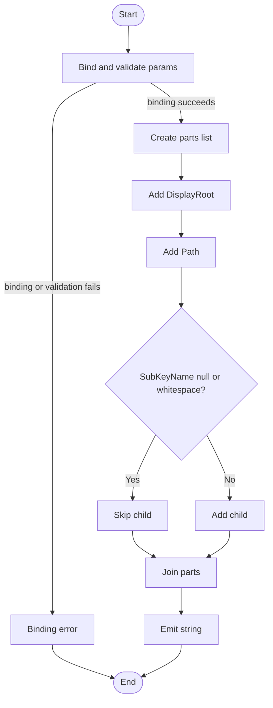

# Format-RegistryPath

## Purpose

`Format-RegistryPath` builds a user-facing registry path string by joining a display root, a registry subkey path, and an optional child key name into one backslash-delimited value. It is called by `Get-InstalledApplication` when that function stamps the synthetic `RegistryPath` field onto discovered application records and when it formats unreadable-path warning text. The helper exists to keep registry-path rendering consistent across later PDQ output and discovery warnings instead of rebuilding the same string inline at each call site.

## Research Log

| Topic | Finding | Source | Date Verified |
|-------|---------|--------|---------------|
| Community style baseline | Search: `PowerShell Practice and Style guide GitHub`. Found the PoshCode guide is still the commonly cited community baseline and still describes itself as evolving rather than frozen. Change: none, first audit row. | https://github.com/PoshCode/PowerShellPracticeAndStyle | 2026-04-01 |
| Approved verb currency | Search: `approved verbs powershell format`. Found `Format` is still an approved PowerShell verb, so the function name remains verb-compliant. Change: none, first audit row. | https://learn.microsoft.com/en-us/powershell/scripting/developer/cmdlet/approved-verbs-for-windows-powershell-commands?view=powershell-7.6 | 2026-04-01 |
| CmdletBinding and positional binding | Search: `about_Functions_CmdletBindingAttribute PositionalBinding powershell`. Found `PositionalBinding` still defaults to `$true`, and disabling positional binding still requires explicitly setting `PositionalBinding = $false`. Change: none, first audit row. | https://learn.microsoft.com/en-us/powershell/module/microsoft.powershell.core/about/about_functions_cmdletbindingattribute?view=powershell-7.5 | 2026-04-01 |
| Parameter validation attributes | SUPERSEDED by row below. Search: `about_Functions_Advanced_Parameters AllowEmptyString ValidateNotNullOrEmpty`. Found `ValidateNotNullOrEmpty` still rejects null and empty values, while modern PowerShell also documents `ValidateNotNullOrWhiteSpace` for whitespace-only rejection. Change: none, first audit row. | https://learn.microsoft.com/powershell/module/microsoft.powershell.core/about/about_functions_advanced_parameters?view=powershell-5.1 | 2026-04-01 |
| Parameter validation attributes (updated) | Search: `ValidateNotNullOrWhiteSpace PowerShell version available`. Found `ValidateNotNullOrWhiteSpace` was added in PowerShell 7.4 (PR #17191) and is not available in PowerShell 5.1. Since this project baselines PS 5.1, `ValidateNotNullOrWhiteSpace` cannot be used as a parameter attribute. The existing `[System.String]::IsNullOrWhiteSpace()` body check remains the only PS 5.1-compatible approach for whitespace rejection. Change: corrects the previous row's implication that `ValidateNotNullOrWhiteSpace` is a viable option for this codebase. | https://github.com/PowerShell/PowerShell/pull/17191 | 2026-04-02 |
| Advanced function block semantics | Search: `about_Functions_Advanced_Methods process block no pipeline PowerShell`. Found advanced functions may implement any subset of `Begin`, `Process`, and `End`, and when the function is invoked outside a pipeline the `Process` block still runs once. Change: yes, this corrects the previous audit's false assumption that block-entry/block-exit tracing was not applicable because the function "did not implement Begin/Process/End blocks." | https://learn.microsoft.com/en-us/powershell/module/microsoft.powershell.core/about/about_functions_advanced_methods?view=powershell-7.6 | 2026-04-02 |
| OutputType guidance | Search: `about_Functions_OutputTypeAttribute powershell`. Found `OutputType` is still documentation metadata only; it does not enforce runtime output correctness. Change: none, first audit row. | https://learn.microsoft.com/en-us/powershell/module/microsoft.powershell.core/about/about_functions_outputtypeattribute?view=powershell-7.5 | 2026-04-01 |
| Comment-based help guidance | Search: `comment based help keywords powershell`. Found current Microsoft help-keyword documentation still treats keywords such as `.EXAMPLE`, `.OUTPUTS`, and `.NOTES` as valid comment-based help sections. Change: none, first audit row. | https://learn.microsoft.com/en-us/powershell/scripting/developer/help/comment-based-help-keywords?view=powershell-7.5 | 2026-04-01 |
| PSScriptAnalyzer current release | SUPERSEDED by row below. Search: `PSScriptAnalyzer release notes latest rules 2025`. Found Microsoft documents PSScriptAnalyzer `1.24.0` on `2025-03-18`, including a raised minimum supported PowerShell version of `5.1` and additional casing fixes in `UseCorrectCasing`. Change: none, first audit row. | https://learn.microsoft.com/en-us/powershell/utility-modules/psscriptanalyzer/whats-new-in-pssa?view=ps-modules | 2026-04-01 |
| PSScriptAnalyzer current release (updated) | SUPERSEDED by row below. Search: `PSScriptAnalyzer 1.25.0 changelog`. A follow-up audit found this row incorrectly copied the `1.24.0` Microsoft Learn release-note items forward to `1.25.0` and incorrectly claimed a new PowerShell `7.2.11` minimum. Change: yes, corrected below. | https://www.powershellgallery.com/packages/PSScriptAnalyzer/1.25.0 | 2026-04-02 |
| PSScriptAnalyzer current release (corrected) | Search: `PSScriptAnalyzer 1.25.0 PowerShell Gallery` and `What's new in PSScriptAnalyzer`. Found PowerShell Gallery lists `1.25.0` as the current version, last published `2026-03-20`, and still declares minimum PowerShell version `5.1`. Microsoft Learn's `What's new` page still stops at `1.24.0`, and its `7.2.11` minimum-version note belongs to `1.22.0`, not `1.25.0`. Change: corrects the previous row's false release date, false minimum-version claim, and release-note attribution. | https://www.powershellgallery.com/packages/PSScriptAnalyzer/1.25.0 https://learn.microsoft.com/en-us/powershell/utility-modules/psscriptanalyzer/whats-new-in-pssa?view=ps-modules | 2026-04-02 |
| PSScriptAnalyzer rule inventory | Search: `psscriptanalyzer rules recommendations`. Found the current rules catalog still includes guidance around approved verbs, aliases, positional parameters, and ShouldProcess-related rules. Change: none, first audit row. | https://learn.microsoft.com/id-id/powershell/utility-modules/psscriptanalyzer/rules-recommendations?view=ps-modules | 2026-04-01 |
| PSScriptAnalyzer rule inventory (updated) | Search: `PSScriptAnalyzer rules readme`. Found the current Microsoft rules catalog now explicitly lists `AvoidReservedWordsAsFunctionNames`, `UseConsistentParametersKind`, `UseConstrainedLanguageMode`, and `UseSingleValueFromPipelineParameter`, and still includes `UseBOMForUnicodeEncodedFile`. None of these newer catalog entries change this function's findings, but the BOM rule now aligns with the file's current encoding state. Change: adds current post-`1.25.0` rule-catalog context. | https://learn.microsoft.com/en-us/powershell/utility-modules/psscriptanalyzer/rules/readme?view=ps-modules | 2026-04-02 |
| Positional-parameter rule nuance | Search: `AvoidUsingPositionalParameters psscriptanalyzer rule`. Found the analyzer rule is narrower than the house standard: it warns only when a command uses three or more positional parameters. Change: none, first audit row. | https://learn.microsoft.com/en-us/powershell/utility-modules/psscriptanalyzer/rules/avoidusingpositionalparameters?view=ps-modules | 2026-04-01 |
| ShouldProcess rule nuance | Search: `UseShouldProcessForStateChangingFunctions rule`. Found the analyzer rule targets state-changing verbs such as `New`, `Set`, `Remove`, `Start`, `Stop`, `Restart`, `Reset`, and `Update`; it does not apply to `Format-*` helpers. Change: none, first audit row. | https://learn.microsoft.com/en-us/powershell/utility-modules/psscriptanalyzer/rules/useshouldprocessforstatechangingfunctions?view=ps-modules | 2026-04-01 |
| Registry security guidance | Search: `registrykey opensubkey read-only microsoft learn`. Found current .NET guidance still states `OpenSubKey` opens read-only by default unless read/write access is explicitly requested. Change: none, first audit row. This function itself does not open the registry, but its callers should continue following this guidance. | https://learn.microsoft.com/en-us/dotnet/api/microsoft.win32.registrykey.opensubkey?view=net-10.0 | 2026-04-01 |
| .NET type currency | Search: `ValidateNotNullOrEmptyAttribute powershell sdk` and `generic types overview dotnet`. Found no deprecation or breaking-change guidance affecting `[System.String]`, `[System.Collections.Generic.List[T]]`, or `ValidateNotNullOrEmptyAttribute` for this function's usage. Change: none, first audit row. | https://learn.microsoft.com/en-us/dotnet/api/system.management.automation.validatenotnulloremptyattribute?view=powershellsdk-7.4.0 | 2026-04-01 |
| Positional metadata precedence | SUPERSEDED by row below. Search: `PositionalBinding Position advanced function parameter precedence PowerShell`. Found current Microsoft parameter docs still state that `Position` determines whether a parameter name is required, so explicit `Position = 0/1/2` leaves a function callable positionally even with `PositionalBinding = $False`. Change: yes, this informed the prior named-only finding. | https://learn.microsoft.com/en-us/powershell/module/microsoft.powershell.core/about/about_functions_advanced_parameters?view=powershell-7.6 | 2026-04-01 |
| Positional metadata precedence (current application) | Search: `PositionalBinding Position advanced function parameter precedence PowerShell`. Re-checked current Microsoft parameter docs against the live source. The documentation rule is unchanged, but this function no longer declares any `Position` metadata, so its named-only contract now holds under `PositionalBinding = $False`. Change: yes, this closes the previous positional-parameter finding. | https://learn.microsoft.com/en-us/powershell/module/microsoft.powershell.core/about/about_functions_advanced_parameters?view=powershell-7.6 | 2026-04-02 |
| Generic list guidance | Search: `"System.Collections.Generic.List<T>" site:learn.microsoft.com net 10`. Found current .NET guidance still presents `List<T>` as the generic, type-safe equivalent of `ArrayList` and notes better performance in most cases. Change: none; confirms `$Parts` uses an appropriate dynamic collection type. | https://learn.microsoft.com/en-us/dotnet/fundamentals/runtime-libraries/system-collections-generic-list%7Bt%7D | 2026-04-01 |

## Parameters

| Name | Type | Required | Default | Description |
|------|------|----------|---------|-------------|
| `DisplayRoot` | `System.String` | Yes | None | User-facing registry root label to place at the start of the rendered path, such as `HKLM` or `HKU`. Null and empty strings are rejected, but whitespace-only values are accepted unchanged. |
| `Path` | `System.String` | Yes | None | Registry subkey path beneath the display root. Null and empty strings are rejected, but whitespace-only values are accepted unchanged. |
| `SubKeyName` | `System.String` | No | `''` | Optional child key name to append. `$Null`, empty, and whitespace-only values are omitted from the final string. |

## Return Value

The function declares `[System.String]` output and, when parameter binding succeeds, emits exactly one backslash-delimited string built from `DisplayRoot`, `Path`, and optionally `SubKeyName`. It never intentionally returns `$Null`, and it does not trim whitespace or normalize the supplied segments; it only omits `SubKeyName` when that value is null, empty, or whitespace-only. It produces no output only when parameter binding fails before the body runs, such as when `DisplayRoot` or `Path` is null, empty, or supplied positionally instead of by name.

## Execution Flow

## Error Handling

- `DisplayRoot` and `Path` are protected by `[ValidateNotNullOrEmpty()]`, so PowerShell raises a parameter-binding validation error before the function body runs if either argument is null or empty.
- `DisplayRoot` and `Path` are not protected against whitespace-only input. Values such as `'  HKLM  '` or `'   '` bind successfully and are emitted unchanged because `ValidateNotNullOrEmpty` does not reject whitespace.
- Because `[CmdletBinding(PositionalBinding = $False)]` is set and no parameter declares `Position`, positional invocation such as `Format-RegistryPath 'HKLM' 'Software\Vendor' 'Child'` fails during parameter binding with `System.Management.Automation.ParameterBindingException`.
- `SubKeyName` is intentionally permissive. `$Null`, empty, and whitespace-only values are silently skipped by the `IsNullOrWhiteSpace` branch instead of raising an error.
- The function contains no `Try/Catch`, `Write-Warning`, or `New-ErrorRecord` logic. Any unexpected runtime exception from list allocation, `.Add()`, or the join operation bubbles to the caller unchanged.

## Side Effects

This function has no side effects.

## Coding Standards Audit

Audit target: `src/Private/Format-RegistryPath.ps1`

| Rule | Status | Line(s) | Evidence |
|------|--------|---------|----------|
| Colon-bound parameters | N/A | `src/Private/Format-RegistryPath.ps1:22` `src/Private/Format-RegistryPath.ps1:83-94` | The help example uses `"Format-RegistryPath -DisplayRoot:'HKLM' -Path:'Software\Vendor\Product'"`, but the executable body contains only `"$Parts.Add(...)"` calls and `"[System.String]($Parts -join '\')"` rather than cmdlet/function invocations whose argument binding can violate this rule. |
| PascalCase naming | PASS | `src/Private/Format-RegistryPath.ps1:1` `src/Private/Format-RegistryPath.ps1:42-94` | `"Function Format-RegistryPath {"`, `"Param ("`, `"$DisplayRoot"`, `"$SubKeyName"`, `"$Parts"`, `"$HasSubKeyName"`, and `"If (...)"` all use PascalCase naming. |
| Full .NET type names (no accelerators) | PASS | `src/Private/Format-RegistryPath.ps1:41` `src/Private/Format-RegistryPath.ps1:52-53` `src/Private/Format-RegistryPath.ps1:65-66` `src/Private/Format-RegistryPath.ps1:77-78` `src/Private/Format-RegistryPath.ps1:83` `src/Private/Format-RegistryPath.ps1:87-88` `src/Private/Format-RegistryPath.ps1:94` | `"[OutputType([System.String])]"`, `"[System.Collections.Generic.List[System.String]]::new()"`, `"[System.String]::IsNullOrWhiteSpace(...)"`, and `"[System.String]($Parts -join '\')"` use full .NET names instead of PowerShell type accelerators. |
| Object types are the most appropriate and specific choice | PASS | `src/Private/Format-RegistryPath.ps1:52-53` `src/Private/Format-RegistryPath.ps1:65-66` `src/Private/Format-RegistryPath.ps1:77-78` `src/Private/Format-RegistryPath.ps1:83` | `DisplayRoot`, `Path`, and `SubKeyName` are typed as `"[System.String]"`, and the accumulator is `"[System.Collections.Generic.List[System.String]]::new()"` rather than a generic `PSObject` or array-concatenation pattern. |
| Single quotes for non-interpolated strings | PASS | `src/Private/Format-RegistryPath.ps1:33-35` `src/Private/Format-RegistryPath.ps1:45-47` `src/Private/Format-RegistryPath.ps1:58-60` `src/Private/Format-RegistryPath.ps1:71-72` `src/Private/Format-RegistryPath.ps1:79` `src/Private/Format-RegistryPath.ps1:94` | `"ConfirmImpact = 'None'"`, `"ParameterSetName = 'Default'"`, `"HelpMessage = 'See function help.'"`, `"$SubKeyName = ''"`, and `"-join '\'"` all use single-quoted literals. |
| `$PSItem` not `$_` | N/A | `src/Private/Format-RegistryPath.ps1:1-96` | No pipeline script block or automatic pipeline variable appears anywhere in the function. |
| Explicit bool comparisons | PASS | `src/Private/Format-RegistryPath.ps1:87-90` | `"$HasSubKeyName = [System.Boolean]( [System.String]::IsNullOrWhiteSpace($SubKeyName) -eq $False )"` and `"If ($HasSubKeyName -eq $True) {"` both use explicit boolean comparisons. |
| If conditions are pre-evaluated outside `If` blocks | PASS | `src/Private/Format-RegistryPath.ps1:87-90` | The condition is first stored in `"$HasSubKeyName"` and only then consumed by `"If ($HasSubKeyName -eq $True) {"`. |
| `$Null` on left side of comparisons | N/A | `src/Private/Format-RegistryPath.ps1:1-96` | The function performs no `$Null` comparison; it relies on `"[System.String]::IsNullOrWhiteSpace(...)"` instead. |
| No positional arguments to cmdlets | N/A | `src/Private/Format-RegistryPath.ps1:83-94` | `"$Parts.Add($DisplayRoot)"` and `"[System.String]($Parts -join '\')"` show that the body contains only .NET calls and a join expression, not cmdlet invocations. |
| No cmdlet aliases | N/A | `src/Private/Format-RegistryPath.ps1:1-96` | No cmdlets are called, so there are no aliases to audit. |
| Switch parameters correctly handled | N/A | `src/Private/Format-RegistryPath.ps1:1-96` | The function defines no `[switch]` parameters and calls no commands with switch arguments. |
| CmdletBinding with all required properties | PASS | `src/Private/Format-RegistryPath.ps1:32-40` | `"[CmdletBinding( ConfirmImpact = 'None', DefaultParameterSetName = 'Default', HelpURI = '', PositionalBinding = $False, RemotingCapability = 'None', SupportsPaging = $False, SupportsShouldProcess = $False )]"` explicitly lists the house-required property set. |
| Function parameters are non-positional / named-only contract | PASS | `src/Private/Format-RegistryPath.ps1:32-40` `src/Private/Format-RegistryPath.ps1:43-76` | `"[CmdletBinding(... PositionalBinding = $False ...)]"` is present, and the parameter blocks contain no `"Position ="` metadata that would re-enable positional binding. |
| OutputType declared | PASS | `src/Private/Format-RegistryPath.ps1:41` | `"[OutputType([System.String])]"` is present. |
| Comment-based help is complete (`Synopsis`, `Description`, `Parameter`, `Example`, `Outputs`, `Notes`) | PASS | `src/Private/Format-RegistryPath.ps1:3-29` | The help block includes `".SYNOPSIS"`, `".DESCRIPTION"`, `".PARAMETER DisplayRoot"`, `".PARAMETER Path"`, `".PARAMETER SubKeyName"`, `".EXAMPLE"`, `".OUTPUTS"`, and `".NOTES"`. |
| Error handling via `New-ErrorRecord` or appropriate pattern | REVIEW | `src/Private/Format-RegistryPath.ps1:43-79` `src/Private/Format-RegistryPath.ps1:82-94` | `"[ValidateNotNullOrEmpty()]"` on `DisplayRoot` and `Path` provides boundary validation, and the body intentionally skips blank `SubKeyName` via `"[System.String]::IsNullOrWhiteSpace(...)"`. The helper still has no `New-ErrorRecord` translation for unexpected in-memory failures, but adding one here may be disproportionate for a pure string-formatting helper. |
| Try/Catch around operations that can fail | N/A | `src/Private/Format-RegistryPath.ps1:83-94` | The body performs only in-memory list construction, `.Add()` calls, and a string join. It makes no I/O, registry, process, or network calls. |
| Write-Debug at Begin/Process/End block entry and exit (if blocks are used) | FAIL | `src/Private/Format-RegistryPath.ps1:82-95` | `"Process {"` is present, but there is no `"Write-Debug"` statement at block entry or exit anywhere in the block. |
| No variable pollution (no `script:` or `global:` scope leaks) | PASS | `src/Private/Format-RegistryPath.ps1:83-90` | `"$Parts = [System.Collections.Generic.List[System.String]]::new()"` and `"$HasSubKeyName = [System.Boolean](...)"` are local working state; no `script:` or `global:` assignments exist. |
| 96-character line limit | PASS | `src/Private/Format-RegistryPath.ps1:1-96` | A local length scan found the longest line at line 22: `"Format-RegistryPath -DisplayRoot:'HKLM' -Path:'Software\Vendor\Product'"` with 77 characters. |
| 2-space indentation (not tabs, not 4-space) | FAIL | `src/Private/Format-RegistryPath.ps1:77-79` | Line 77 uses four spaces for `"    [AllowEmptyString()]"`, but the sibling lines `"  [System.String]"` and `"  $SubKeyName = ''"` drop to two spaces, breaking the two-spaces-per-indent-level pattern for that parameter block. |
| OTBS brace style | PASS | `src/Private/Format-RegistryPath.ps1:1` `src/Private/Format-RegistryPath.ps1:82` `src/Private/Format-RegistryPath.ps1:90-96` | `"Function Format-RegistryPath {"`, `"Process {"`, and `"If (...) {"` place opening braces on the same line, with closing braces on their own lines. |
| No commented-out code | PASS | `src/Private/Format-RegistryPath.ps1:2-30` `src/Private/Format-RegistryPath.ps1:82-94` | The only comments are comment-based help text; there are no disabled executable statements such as `"# $Parts.Add(...)"`. |
| Registry access is read-only (if applicable) | N/A | `src/Private/Format-RegistryPath.ps1:82-94` | The function formats registry path text only. It never opens a registry hive or subkey. |
| Parameter attributes list all properties explicitly | FAIL | `src/Private/Format-RegistryPath.ps1:43-50` `src/Private/Format-RegistryPath.ps1:56-63` `src/Private/Format-RegistryPath.ps1:69-75` | The required parameter blocks stop at `"HelpMessage = 'See function help.'"` / `"ValueFromRemainingArguments = $False"` and omit `"HelpMessageBaseName"` and `"HelpMessageResourceId"`. The optional `SubKeyName` block also omits an explicit `"Mandatory = $False"`. |
| Leading commas in attribute blocks | FAIL | `src/Private/Format-RegistryPath.ps1:33-39` `src/Private/Format-RegistryPath.ps1:44-50` `src/Private/Format-RegistryPath.ps1:57-63` `src/Private/Format-RegistryPath.ps1:70-75` | `"ConfirmImpact = 'None',"`, `"Mandatory = $True"`, `"Mandatory = $True"`, and `"ParameterSetName = 'Default'"` begin without the house-required leading comma. |
| UTF-8 with BOM encoding | PASS | `src/Private/Format-RegistryPath.ps1:1` | A byte-level file check reported leading bytes `EF BB BF` (`239 187 191`), so the file currently satisfies the repo's PS 5.1 encoding rule. |

1. Current PowerShell research and the local audit environment are no longer on the same PSScriptAnalyzer version: PowerShell Gallery lists `1.25.0` as current, but this sandbox only has `1.24.0` installed locally. The repo settings file still allows `Invoke-ScriptAnalyzer` to run cleanly on this helper, which confirms that current analyzer coverage remains looser than the house style in areas like leading-comma formatting, explicit parameter-metadata inventory, and block-entry/block-exit tracing.
2. Current Microsoft parameter documentation still states that the `Position` argument determines whether a parameter name is required. This function no longer declares `Position` on any parameter, so its named-only contract now holds under `PositionalBinding = $False`.
3. `ValidateNotNullOrWhiteSpace` was added in PowerShell 7.4 and is documented in current PS 7.5+ parameter guidance. However, this project baselines PowerShell 5.1, so `ValidateNotNullOrWhiteSpace` cannot be used as a parameter attribute. If whitespace-only `DisplayRoot` and `Path` should be rejected, the only PS 5.1-compatible approach is an explicit `[System.String]::IsNullOrWhiteSpace()` check in the function body with a `New-ErrorRecord` call, similar to the existing `SubKeyName` guard but throwing instead of skipping.
4. Current advanced-methods documentation confirms that a lone `Process` block is still a real lifecycle block, and when the function is not called from a pipeline that block executes once. That is why the `Write-Debug` block-entry/block-exit rule applies here even though the function omits `Begin` and `End`.

## Plan Audit

The rewrite plan now mentions `Format-RegistryPath` by name in both the file-structure and function-responsibility sections. The helper is therefore explicitly part of the frozen architecture, and its remaining plan surface is through the `RegistryPath` synthetic field and the descriptor model's `DisplayRoot` metadata.

| Plan Section | Requirement | Status | Line(s) | Details |
|--------------|-------------|--------|---------|---------|
| `PLAN.md` 5.1 Application Record | Synthetic metadata must include `RegistryPath`. | ALIGNED | `PLAN.md:152-177` `src/Private/Get-InstalledApplication.ps1:233-245` `src/Private/Format-RegistryPath.ps1:82-94` | `Get-InstalledApplication` assigns `-Name:'RegistryPath' -Value:( Format-RegistryPath ... )`, and this helper returns the joined display string used for that field. |
| `PLAN.md` 5.2 Registry View Descriptor | Descriptor records include `DisplayRoot`, `Hive`, `Path`, `View`, `Source`, `InstallScope`, `UserSid`, `UserName`, and `UserIdentityStatus`. | ALIGNED | `PLAN.md:180-195` `src/Private/New-RegistryViewDescriptor.ps1:192-204` `src/Private/New-RegistryViewDescriptor.ps1:214-258` `src/Private/Get-InstalledApplication.ps1:241-243` | `New-RegistryViewDescriptor` computes `DisplayRoot` and passes it into every descriptor constructor branch, and `Get-InstalledApplication` then consumes `Descriptor.DisplayRoot` and `Descriptor.Path` when calling `Format-RegistryPath`. |
| `PLAN.md` 4.4 No Interactivity | The script must not prompt; specifically, `"no SupportsShouldProcess"` and `"no ConfirmImpact"`. | DEVIATION | `PLAN.md:135-145` `src/Private/Format-RegistryPath.ps1:32-39` | The helper is behaviorally non-interactive, but `"[CmdletBinding( ConfirmImpact = 'None', ... SupportsShouldProcess = $False )]"` still contradicts the plan's literal ban on those properties. This looks like a plan-vs-standards documentation conflict, not a prompt bug. |
| `PLAN.md` 11.2 Mandatory Output Fields | `RegistryPath` is a mandatory public output field in both list and uninstall modes. | ALIGNED | `PLAN.md:585-614` `src/Public/Start-Uninstaller.ps1:195-206` `src/Private/Get-InstalledApplication.ps1:239-245` `src/Private/Format-RegistryPath.ps1:82-94` | `Start-Uninstaller` includes `RegistryPath` in both mandatory output field lists, and `Get-InstalledApplication` fills that field through this helper. |
| `PLAN.md` 12 File Structure | `Format-RegistryPath.ps1` is explicitly listed under `src/Private`. | ALIGNED | `PLAN.md:669-707` `src/Private/Format-RegistryPath.ps1:1-96` | The file exists in the exact private-helper location required by the frozen structure. |
| `PLAN.md` 12 Function Responsibilities | `Format-RegistryPath.ps1` "formats the synthetic `RegistryPath` field and related registry path display text used by discovery warnings". | ALIGNED | `PLAN.md:728-730` `src/Private/Get-InstalledApplication.ps1:240-245` `src/Private/Get-InstalledApplication.ps1:311-325` `src/Private/Get-InstalledApplication.ps1:332-345` | The helper is used both when stamping `RegistryPath` onto application records and when composing unreadable-path warning text. Because the plan names this helper directly, its existence is justified rather than overengineered. |
| `PLAN.md` 13.2 Strings Files | Use `.strings.psd1` only where a function has reusable user-facing messages. | ALIGNED | `PLAN.md:781-789` `src/Private/Format-RegistryPath.ps1:1-96` | This helper emits no reusable warnings or errors of its own, so the absence of a companion strings file matches the plan. |
| `PLAN.md` 14.1 Test Layers | Use unit tests for pure helpers in the private test layer. | ALIGNED | `PLAN.md:793-800` `tests/Private/Format-RegistryPath.Tests.ps1:3-33` | A dedicated private Pester file exists for this pure helper. The asset placement matches the plan even though this sandbox cannot execute it successfully. |
| `PLAN.md` 4.3 Exit Codes | Exit codes are defined at script/orchestrator level. | N/A | `PLAN.md:125-133` `src/Private/Format-RegistryPath.ps1:1-96` | This helper returns a string only. It does not set or interpret script exit codes. |
| `PLAN.md` 5.3 Uninstall Result Record / `PLAN.md` 10.4 Outcome Mapping | Outcome values and uninstall-result exit codes apply to uninstall attempts. | N/A | `PLAN.md:197-215` `PLAN.md:558-567` `src/Private/Format-RegistryPath.ps1:1-96` | `Format-RegistryPath` does not create uninstall result records, outcome states, or exit-code mappings. |

The current repo standards and the frozen plan are in tension on `CmdletBinding`: the standards reference requires explicitly listing the full property set, while plan section 4.4 literally says no `ConfirmImpact` and no `SupportsShouldProcess`. This helper follows the standards document, so the recorded plan deviation is textual rather than behavioral.

## Verification Notes

- Direct invocation confirmed the expected `HKLM` output shape: `HKLM\Software\Microsoft\Windows\CurrentVersion\Uninstall\{ABC-123}`.
- Direct invocation confirmed the expected `HKU` output shapes both with and without `SubKeyName`.
- Direct invocation confirmed that both whitespace-only and `$Null` `SubKeyName` values are omitted from the final string.
- Direct invocation confirmed that whitespace-only padding in `DisplayRoot` or `Path` is preserved unchanged, for example `  HKLM  \  Software\Vendor  `.
- Direct positional invocation now fails with `System.Management.Automation.ParameterBindingException`, which matches `PositionalBinding = $False` plus the absence of `Position` metadata in the parameter blocks.
- Direct negative tests confirmed that both an empty `DisplayRoot` and an empty `Path` raise `System.Management.Automation.ParameterBindingValidationException` before the body runs.
- Byte-level file inspection confirmed that `src/Private/Format-RegistryPath.ps1` currently begins with UTF-8 BOM bytes `EF BB BF` (`239 187 191`).
- `Invoke-Pester tests/Private/Format-RegistryPath.Tests.ps1` could not complete in this sandbox because Pester `5.7.1` attempted to create a temporary registry key under `HKCU\Software\Pester`, and registry access is denied in this environment.
- `Invoke-ScriptAnalyzer -Path src/Private/Format-RegistryPath.ps1 -Settings PSScriptAnalyzerSettings.psd1` ran successfully under the locally installed `PSScriptAnalyzer 1.24.0` module and returned no diagnostics.

## Changelog

| Date | Changes |
|------|---------|
| 2026-04-02 | Corrected stale audit content against the live repo and current research. Reclassified the named-only contract and pre-evaluated-`If` findings from FAIL to PASS because the current parameter blocks no longer declare `Position` and the condition is now stored in `$HasSubKeyName` before the `If`. Reclassified `Write-Debug` tracing from false N/A to FAIL because the function does implement a `Process` block, added a new FAIL for the misindented `SubKeyName` type/default lines, corrected the parameter-attribute evidence now that `DontShow` and `HelpMessage` are present, added current advanced-methods research for `Process` block behavior, and replaced stale verification notes about positional invocation and local ScriptAnalyzer availability. |
| 2026-04-02 | Corrected stale audit content after a follow-up convergence check. Reclassified UTF-8 with BOM from FAIL to PASS because `src/Private/Format-RegistryPath.ps1` now begins with `EF BB BF`. Marked the previous `1.25.0` PSScriptAnalyzer row as SUPERSEDED, replaced its false `2026-03-22` date / false `7.2.11` minimum-version claim / misattributed `1.24.0` release notes with verified PowerShell Gallery and Microsoft Learn evidence, added an updated PSScriptAnalyzer rules-catalog row, and fixed stale plan-audit line citations to the current code. |
| 2026-04-02 | Updated research log: marked PSScriptAnalyzer `1.24.0` row as SUPERSEDED and added new row for `1.25.0` (released `2026-03-22`); marked `ValidateNotNullOrWhiteSpace` parameter validation row as SUPERSEDED and added new row clarifying the attribute requires PowerShell 7.4+ and is unavailable on this project's PS 5.1 baseline. Corrected footnote 3 to reflect the PS version constraint and recommend the existing `IsNullOrWhiteSpace` body-check pattern as the only PS 5.1-compatible whitespace rejection approach. |
| 2026-04-01 | Convergence rerun corrected stale findings in the prior README. Reclassified `CmdletBinding` and comment-based help completeness from false FAILs to PASS, corrected plan alignment now that `Format-RegistryPath` and `DisplayRoot` are explicit in `PLAN.md`, documented the real whitespace and `$Null` input behavior, and added missed findings for positional parameter exposure, inline `If` condition evaluation, missing leading-comma attribute formatting, and the still-missing BOM. |
| 2026-04-01 | Initial audit README created. Added the mandatory research log, function documentation, execution flow, coding-standards audit, plan-alignment audit, verification notes, and two concrete plan-drift findings: the undocumented `DisplayRoot` descriptor field and the helper's omission from the frozen private-file list. |
AUDIT_STATUS:UPDATED