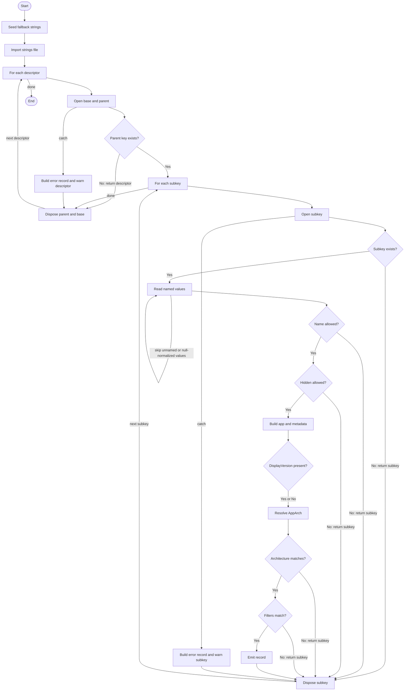

# Get-InstalledApplication

## Purpose

`Get-InstalledApplication` is the private discovery helper that `Start-Uninstaller` calls after `Get-UninstallRegistryPath` has produced registry view descriptors and after `New-CompiledFilter` has compiled the requested filters. It opens each uninstall parent key read-only through the registry seam helpers, enumerates subkeys, normalizes named registry values, applies nameless and hidden gates, stamps synthetic and internal discovery metadata, resolves `AppArch`, evaluates the compiled filters, and emits one matching application record per registry entry. It does not sort, deduplicate, or uninstall anything; it only discovers and shapes application data while warning and continuing on unreadable paths.

## Parameters

| Name | Type | Required | Default | Description |
|------|------|----------|---------|-------------|
| `RegistryPaths` | `System.Management.Automation.PSObject[]` | Yes | None | Registry view descriptor records, normally produced by `Get-UninstallRegistryPath`, that define which uninstall roots to enumerate. |
| `CompiledFilters` | `System.Management.Automation.PSObject[]` | Yes | None | Compiled filter records, normally produced by `New-CompiledFilter`, that are evaluated against each built application record. Empty collections are allowed. |
| `Architecture` | `System.String` | No | `Both` | Architecture gate applied after `AppArch` is resolved. Allowed values are `x86`, `x64`, and `Both`. |
| `IncludeHidden` | `System.Management.Automation.SwitchParameter` | No | Off | Includes entries where normalized `SystemComponent` equals `1`. |
| `IncludeNameless` | `System.Management.Automation.SwitchParameter` | No | Off | Includes entries whose `DisplayName` is missing, empty, or whitespace-only. |

## Return Value

The function emits zero or more application records to the pipeline. Each emitted record contains normalized raw registry values plus synthetic metadata (`AppArch`, `InstallScope`, `IsHidden`, `RegistryPath`, `UserIdentityStatus`, `UserName`, `UserSid`) and internal-only fields (`_ParsedDisplayVersion`, `_RegistryHive`, `_RegistryView`, `_RegistrySource`).

Runtime output is `System.Management.Automation.PSCustomObject` per record. That matches the current `[OutputType()]` attribute, but the comment-based help block still documents `[System.Management.Automation.PSObject[]]`. The function does not emit `$Null` sentinels. It produces no output for descriptors whose uninstall parent key is missing, subkeys that are missing, values whose names are empty, values that normalize to `$Null`, entries rejected by the nameless or hidden gates, entries whose resolved architecture does not match `-Architecture`, or entries that fail `Test-ApplicationMatch`.

## Execution Flow

## Error Handling

- `Begin` seeds `$Strings` with inline fallback warning templates, then calls `Import-LocalizedData -ErrorAction:'SilentlyContinue'`. If the companion strings file is missing or unreadable, discovery still proceeds with the seeded defaults.
- Descriptor-level failures from `Get-RegistryBaseKey`, descriptor-level `Get-RegistrySubKey`, or any later code inside the outer `Try` block are caught, wrapped through `New-ErrorRecord` as `System.InvalidOperationException` with `ReadError`, written to the warning stream as `Cannot access ...`, and processing continues with the next descriptor.
- A missing uninstall parent key is silently skipped because `Get-RegistrySubKey` can return `$Null`, and the function immediately returns from the current descriptor scriptblock without warning.
- Subkey open failures, value enumeration failures, value read failures, normalization failures, metadata stamping failures, version parsing failures, architecture-resolution failures, and filter-evaluation failures inside the inner `Try` block are caught, wrapped through `New-ErrorRecord` as `System.InvalidOperationException` with `ReadError`, written to the warning stream as `Cannot read subkey ...`, and processing continues with the next subkey.
- A missing uninstall subkey is silently skipped because the inner scriptblock returns immediately when `Get-RegistrySubKey` returns `$Null`.
- Empty registry value names are silently skipped because the value loop treats them as the unnamed default value and returns from the current value-item scriptblock.
- Values that normalize to `$Null` are silently ignored and never become note properties on the emitted record.
- Nameless, hidden, architecture-mismatched, and filter-mismatched entries are intentionally skipped with bare `Return` statements and produce no warning or error output.
- The function does not intentionally throw or call `$PSCmdlet.ThrowTerminatingError()`. In this function, `New-ErrorRecord` is used only to create non-fatal `ErrorRecord` objects whose messages are then sent to `Write-Warning`.
- Both `Finally` blocks dispose opened registry handles whenever those handles are non-null.

## Side Effects

The function reads uninstall registry data through private seam functions, reads `Get-InstalledApplication.strings.psd1` through `Import-LocalizedData` when that file is available, writes non-fatal discovery warnings to the warning stream, and disposes opened registry key objects. It does not modify the registry, files, processes, services, or variables outside its local scope.

## Research Log

| Topic | Finding | Source | Date Verified |
|-------|---------|--------|---------------|
| PowerShell Practice and Style baseline | The community `PowerShellPracticeAndStyle` guide is still available, but its maintainers describe it as evolving and pragmatic rather than a fixed ruleset. This repo's house standard is materially stricter than that baseline. | [PoshCode/PowerShellPracticeAndStyle](https://github.com/PoshCode/PowerShellPracticeAndStyle) | 2026-04-01 |
| PSScriptAnalyzer 1.24.0 changes | `PSScriptAnalyzer` 1.24.0 raised its minimum PowerShell baseline to 5.1 and expanded `UseCorrectCasing` to cover operators, keywords, and commands. | [What's new in PSScriptAnalyzer](https://learn.microsoft.com/en-us/powershell/utility-modules/psscriptanalyzer/whats-new-in-pssa?view=ps-modules) | 2026-04-01 |
| PSScriptAnalyzer 1.25.0 currency | SUPERSEDED on 2026-04-01. A prior audit recorded 1.25.0 as the latest published release, but the current GitHub releases page does not show a published 1.25.0 release. RE-CONFIRMED on 2026-04-02: `PSScriptAnalyzer` 1.25.0 was published on 2026-03-20. The 2026-04-01 supersession was itself incorrect. | [PSScriptAnalyzer releases](https://github.com/PowerShell/PSScriptAnalyzer/releases) | 2026-04-02 |
| PSScriptAnalyzer release currency | SUPERSEDED on 2026-04-02. The 2026-04-01 audit stated 1.24.0 was the latest published release. `PSScriptAnalyzer` 1.25.0 was actually published on 2026-03-20, twelve days before that audit. | [PSScriptAnalyzer releases](https://github.com/PowerShell/PSScriptAnalyzer/releases) | 2026-04-01 |
| PSScriptAnalyzer 1.25.0 feature attribution | SUPERSEDED on 2026-04-02. A prior audit attached the official `UseCorrectCasing`, `PSAlignAssignmentStatement`, and `PSAvoidAssignmentToAutomaticVariable` release-note bullets to 1.25.0. Current first-party docs still publish those bullets under 1.24.0, not 1.25.0. | [What's new in PSScriptAnalyzer](https://learn.microsoft.com/en-us/powershell/utility-modules/psscriptanalyzer/whats-new-in-pssa?view=ps-modules) | 2026-04-02 |
| PSScriptAnalyzer 1.25.0 publication vs release-note lag | PowerShell Gallery confirms `PSScriptAnalyzer` 1.25.0 was published on 2026-03-20, but the official "What's new" page still only documents 1.24.0 changes. The gallery page confirms currency; the 1.24.0 doc page does not establish any 1.25.0-specific analyzer-rule changes for this audit. | [PSScriptAnalyzer 1.25.0](https://www.powershellgallery.com/packages/PSScriptAnalyzer/1.25.0); [What's new in PSScriptAnalyzer](https://learn.microsoft.com/en-us/powershell/utility-modules/psscriptanalyzer/whats-new-in-pssa?view=ps-modules) | 2026-04-02 |
| PowerShell 7.6 GA | PowerShell 7.6 LTS reached GA on 2026-03-18, built on .NET 10 LTS. No breaking changes affecting registry access, object construction, `Add-Member`, `New-Object`, or pipeline behavior were identified for this function. The repo's 5.1 baseline remains appropriate. | [Announcing PowerShell 7.6 (LTS) GA Release](https://devblogs.microsoft.com/powershell/announcing-powershell-7-6/) | 2026-04-02 |
| Advanced function binding behavior | Official docs confirm that `CmdletBinding` makes functions behave like compiled cmdlets and that `PositionalBinding` defaults to `$true` unless explicitly disabled. This supports the audit finding that explicit `PositionalBinding = $False` remains necessary under the repo standard. | [about_Functions_CmdletBindingAttribute](https://learn.microsoft.com/en-us/powershell/module/microsoft.powershell.core/about/about_functions_cmdletbindingattribute?view=powershell-7.6) | 2026-04-01 |
| Advanced parameter patterns | Official docs still recommend `switch` parameters for on/off flags and `ValidateSet` for constrained strings. They also recommend basing switch-controlled behavior on the switch value rather than mere bound-parameter presence. | [about_Functions_Advanced_Parameters](https://learn.microsoft.com/en-us/powershell/module/microsoft.powershell.core/about/about_functions_advanced_parameters?view=powershell-7.6) | 2026-04-01 |
| Comment-based help completeness | SUPERSEDED on 2026-04-01. A prior audit applied this guidance to an older copy of the function that lacked `.EXAMPLE`; the current source now includes `.EXAMPLE` and the other required help keywords. | [about_Comment_Based_Help](https://learn.microsoft.com/en-us/powershell/module/microsoft.powershell.core/about/about_comment_based_help?view=powershell-7.5) | 2026-04-01 |
| Comment-based help keywords | Official help docs still show `.PARAMETER`, `.EXAMPLE`, `.OUTPUTS`, and `.NOTES` as first-class comment-based help keywords rendered by `Get-Help`. The current function now includes all of them. | [about_Comment_Based_Help](https://learn.microsoft.com/en-us/powershell/module/microsoft.powershell.core/about/about_comment_based_help?view=powershell-7.5) | 2026-04-01 |
| OutputType accuracy | SUPERSEDED on 2026-04-01. A prior audit described the help block as `[PSCustomObject[]]`; the current source documents `[System.Management.Automation.PSObject[]]`, while runtime emission is still per-record pipeline output. | [about_Functions_OutputTypeAttribute](https://learn.microsoft.com/en-us/powershell/module/microsoft.powershell.core/about/about_functions_outputtypeattribute?view=powershell-7.5) | 2026-04-01 |
| OutputType vs runtime output | SUPERSEDED on 2026-04-02. A prior audit said the attribute declared `System.Management.Automation.PSObject`. The current source now declares `System.Management.Automation.PSCustomObject`. | [about_Functions_OutputTypeAttribute](https://learn.microsoft.com/en-us/powershell/module/microsoft.powershell.core/about/about_functions_outputtypeattribute?view=powershell-7.5) | 2026-04-02 |
| OutputType vs runtime output (updated) | Official docs state that `OutputType` is documentation metadata only and isn't inferred from actual output. That matters here because the current attribute declares `System.Management.Automation.PSCustomObject`, the help block still declares `System.Management.Automation.PSObject[]`, and the function emits individual application records to the pipeline. | [about_Functions_OutputTypeAttribute](https://learn.microsoft.com/en-us/powershell/module/microsoft.powershell.core/about/about_functions_outputtypeattribute?view=powershell-7.5) | 2026-04-02 |
| `New-Object psobject` runtime type | Official docs still show `New-Object -TypeName psobject` plus `Add-Member` producing runtime `System.Management.Automation.PSCustomObject`. That confirms this function's emitted application records are `PSCustomObject` at runtime even though construction still uses `System.Management.Automation.PSObject`. | [about_PSCustomObject](https://learn.microsoft.com/en-us/powershell/module/microsoft.powershell.core/about/about_pscustomobject?view=powershell-7.6) | 2026-04-02 |
| Registry read-only access | `RegistryKey.OpenSubKey(name, writable)` remains current, opens keys read-only when `writable` is `false`, and returns `null` when the key doesn't exist. This validates the read-only seam design and the silent-skip behavior for missing keys. | [RegistryKey.OpenSubKey](https://learn.microsoft.com/en-us/dotnet/api/microsoft.win32.registrykey.opensubkey?view=net-10.0) | 2026-04-01 |
| Registry view selection | `RegistryKey.OpenBaseKey(RegistryHive, RegistryView)` and the `RegistryView` enum remain the current way to target 32-bit and 64-bit registry views. No deprecation or replacement guidance was found. | [RegistryKey.OpenBaseKey](https://learn.microsoft.com/en-us/dotnet/api/microsoft.win32.registrykey.openbasekey?view=net-10.0) | 2026-04-01 |
| Registry value name case handling | `RegistryKey.GetValue()` documents that registry value names are not case-sensitive. `OrderedDictionary()` uses each key's `Object.Equals` implementation by default, and Microsoft docs say a custom comparer is required for case-insensitive string lookups. This changes the prior `8.1 Case Handling` plan finding: `OrderedDictionary::new()` makes the function's pre-object `DisplayName` and `SystemComponent` lookups case-sensitive. | [RegistryKey.GetValue](https://learn.microsoft.com/en-us/dotnet/api/microsoft.win32.registrykey.getvalue?view=net-10.0); [OrderedDictionary Constructor](https://learn.microsoft.com/en-us/dotnet/api/system.collections.specialized.ordereddictionary.-ctor?view=net-9.0) | 2026-04-02 |
| PSCustomObject and Add-Member currency | `New-Object ... -Property` and `Add-Member` remain supported ways to build custom objects, and Microsoft docs still describe them as the pre-`[pscustomobject]` pattern. `[pscustomobject]` remains the shorter option when the final property shape is known up front. | [about_PSCustomObject](https://learn.microsoft.com/en-us/powershell/module/microsoft.powershell.core/about/about_pscustomobject?view=powershell-7.6) | 2026-04-01 |
| Add-Member behavior | `Add-Member` still adds members directly to more input-object types and no longer commonly needs `-PassThru`. No deprecation or security advisory affecting this usage pattern was found. | [Add-Member](https://learn.microsoft.com/en-us/powershell/module/microsoft.powershell.utility/add-member?view=powershell-7.6) | 2026-04-01 |
| Null-or-whitespace gating | `System.String.IsNullOrWhiteSpace()` remains the current convenience and performance helper for null/empty/whitespace checks. No newer replacement or deprecation was found. | [String.IsNullOrWhiteSpace](https://learn.microsoft.com/en-us/dotnet/api/system.string.isnullorwhitespace?view=net-9.0) | 2026-04-01 |
| Version parsing | `System.Version.TryParse()` remains the current non-throwing parser for best-effort version conversion. Failures return `false` and leave the result null, which matches this function's `_ParsedDisplayVersion` behavior. | [Version.TryParse](https://learn.microsoft.com/en-us/dotnet/api/system.version.tryparse?view=net-9.0) | 2026-04-01 |
| Verbose stream guidance | `Write-Verbose` is still the standard stream for detailed command-processing information and is hidden unless verbose output is enabled. No deprecation or replacement was found. | [Write-Verbose](https://learn.microsoft.com/en-us/powershell/module/microsoft.powershell.utility/write-verbose?view=powershell-7.5) | 2026-04-01 |
| Warning stream guidance | SUPERSEDED on 2026-04-01. A prior audit tied this guidance to an older implementation that used verbose output for unreadable subkeys. The current implementation now uses warnings for both descriptor-level and subkey-level read failures. | [Write-Warning](https://learn.microsoft.com/en-us/powershell/module/microsoft.powershell.utility/write-warning?view=powershell-7.6) | 2026-04-01 |
| Warning stream alignment | `Write-Warning` remains the standard stream for visible non-fatal problems and is controlled by `$WarningPreference` and `-WarningAction`. The current implementation aligns with that guidance for unreadable descriptors and unreadable subkeys. | [Write-Warning](https://learn.microsoft.com/en-us/powershell/module/microsoft.powershell.utility/write-warning?view=powershell-7.6) | 2026-04-01 |
| Return semantics in scriptblocks | Official docs confirm that `return` exits the current scope, including a scriptblock. In this function, bare `Return` statements inside nested `& { Process { } }` blocks skip the current descriptor, subkey, or value item rather than terminating the whole function. | [about_Return](https://learn.microsoft.com/en-us/powershell/module/microsoft.powershell.core/about/about_return?view=powershell-7.6) | 2026-04-01 |
| Pester TestRegistry behavior | Pester still scopes `TestRegistry` content to the test container and creates a temporary registry key under `HKCU:\Software\Pester`. In this audit environment, that matters because the sandbox blocks those registry writes and prevents the discovery tests from running locally. | [Isolating Windows Registry Operations using the TestRegistry](https://pester.dev/docs/usage/testregistry) | 2026-04-02 |

## Standards Audit

| Rule | Status | Line(s) | Evidence |
|------|--------|---------|----------|
| Colon-bound parameters | PASS | 133-136, 147-153, 179-180, 241-244, 287-305, 315-345 | `Import-LocalizedData -BindingVariable:'Strings' -FileName:'Get-InstalledApplication.strings' -BaseDirectory:$PSScriptRoot -ErrorAction:'SilentlyContinue'`; `Get-RegistryBaseKey -Hive:$Descriptor.Hive -View:$Descriptor.View`; `Test-ApplicationMatch -Application:$App -CompiledFilters:$CompiledFilters` |
| PascalCase naming | PASS | 1, 57-123, 142-145, 171-183, 188-307 | `Function Get-InstalledApplication {`; parameters are `$RegistryPaths`, `$CompiledFilters`, `$Architecture`, `$IncludeHidden`, `$IncludeNameless`; locals include `$Descriptor`, `$BaseKey`, `$ParentKey`, `$DisplayName`, `$ParsedVersion`, `$AppArch`, `$Matched` |
| Full .NET type names (no accelerators) | REVIEW | 56, 68, 82, 96, 109, 122, 172, 265-267 | The file uses fully qualified type names such as `[System.Management.Automation.PSCustomObject]` and `[System.Collections.Specialized.OrderedDictionary]::new()`, but `System.Version.TryParse(..., [ref]$ParsedVersion)` still uses PowerShell's special `[ref]` syntax. |
| Object types are the most appropriate and specific choice | FAIL | 68, 82, 231 | `[System.Management.Automation.PSObject[]] $RegistryPaths`; `[System.Management.Automation.PSObject[]] $CompiledFilters`; `$App = New-Object -TypeName:'System.Management.Automation.PSObject' -Property:$Props` |
| Single quotes for non-interpolated strings | PASS | 48-50, 95, 128-131, 231-345 | `ConfirmImpact = 'None'`; `ValidateSet('x86', 'x64', 'Both')`; `'Cannot read subkey ''{0}'': {1}'`; `-MemberType:'NoteProperty'` |
| `$PSItem` not `$_` | PASS | 142, 160, 175, 320, 340 | `$Descriptor = $PSItem`; `$SubKeyName = [System.String]$PSItem`; `$PSItem.Exception.Message` |
| Explicit bool comparisons | PASS | 155-156, 168-169, 176-177, 182-183, 192, 205, 213, 227, 263, 298, 307, 328, 349-350 | `If ($MissingParentKey -eq $True) { Return }`; `If ($HasNormalizedValue -eq $True) {`; `If ($Matched -eq $False) { Return }` |
| If conditions are pre-evaluated outside `If` blocks | PASS | 155-156, 168-169, 176-177, 189-205, 210-227, 259-263, 291-298, 327-328, 347-350 | `$ExcludeNamelessEntry = [System.Boolean](...)` before `If ($ExcludeNamelessEntry -eq $True)`; `$ExcludeHiddenEntry = [System.Boolean](...)` before `If ($ExcludeHiddenEntry -eq $True)`; `$ArchitectureMismatch = [System.Boolean](...)` before `If ($ArchitectureMismatch -eq $True)` |
| `$Null` on left side of comparisons | PASS | 155, 168, 182, 217, 260-261, 327, 347-348 | `$MissingParentKey = [System.Boolean]($Null -eq $ParentKey)`; `$HasNormalizedValue = [System.Boolean]($Null -ne $NormalizedValue)`; `If ($HasSubKey -eq $True) { $SubKey.Dispose() }` after `$HasSubKey = [System.Boolean]($Null -ne $SubKey)` |
| No positional arguments to cmdlets | PASS | 133-137, 147-180, 231-245, 287-305, 315-345 | `Get-RegistrySubKeyNames -Key:$ParentKey`; `Get-RegistryValue -Key:$SubKey -Name:$ValueName`; `New-Object -TypeName:'System.Management.Automation.PSObject' -Property:$Props`; `Write-Warning -Message:$ErrorRecord.Exception.Message` |
| No cmdlet aliases | PASS | 133-180, 231-345 | Commands are spelled out as `Import-LocalizedData`, `Get-RegistryBaseKey`, `Get-RegistrySubKey`, `Get-RegistryValue`, `ConvertTo-NormalizedRegistryValue`, `Add-Member`, `Out-Null`, and `Write-Warning`. |
| Switch parameters correctly handled | PASS | 109-123, 198-221, 233-245 | `[System.Management.Automation.SwitchParameter] $IncludeHidden`; `[System.Management.Automation.SwitchParameter] $IncludeNameless`; `$IncludeHidden.IsPresent -eq $True`; bare `-Force` is used on `Add-Member` |
| Leading commas in attributes | FAIL | 47-48, 58-59, 71-72, 85-86, 99-100, 112-113 | `[CmdletBinding(` is followed by `ConfirmImpact = 'None'` instead of `, ConfirmImpact = 'None'`; each `[Parameter(` block begins with `Mandatory = ...` instead of a leading-comma property line. |
| Parameter attributes list all properties | PASS | 58-67, 71-80, 85-94, 99-107, 112-120 | Each `[Parameter()]` block explicitly lists `Mandatory`, `ParameterSetName`, `DontShow`, `HelpMessage`, `Position`, `ValueFromPipeline`, `ValueFromPipelineByPropertyName`, and `ValueFromRemainingArguments`. |
| CmdletBinding with all required properties | PASS | 47-55 | `[CmdletBinding( ConfirmImpact = 'None' , DefaultParameterSetName = 'Default' , HelpURI = '' , PositionalBinding = $False , RemotingCapability = 'None' , SupportsPaging = $False , SupportsShouldProcess = $False )]` |
| OutputType declared | PASS | 56 | `[OutputType([System.Management.Automation.PSCustomObject])]` |
| Comment-based help is complete | PASS | 2-44 | The help block includes `.SYNOPSIS`, `.DESCRIPTION`, `.PARAMETER`, `.EXAMPLE`, `.OUTPUTS`, and `.NOTES`. |
| Error handling via `New-ErrorRecord` or appropriate pattern | PASS | 315-345 | `$ErrorRecord = New-ErrorRecord -ExceptionName:'System.InvalidOperationException' ... -ErrorCategory:([System.Management.Automation.ErrorCategory]::ReadError)` appears in both `Catch` blocks before `Write-Warning -Message:$ErrorRecord.Exception.Message`. |
| Try/Catch around operations that can fail | PASS | 146-351 | Outer registry-open operations are wrapped in `Try { ... } Catch { ... } Finally { ... }`; subkey/value/metadata work is wrapped in its own inner `Try { ... } Catch { ... } Finally { ... }`. |
| Write-Debug at Begin/Process/End block entry and exit | FAIL | 126-138, 140-353 | The function declares `Begin {` and `Process {`, but there is no `Write-Debug -Message:'[Get-InstalledApplication] ...'` call anywhere in the file. |
| No variable pollution | PASS | 127-145, 160-176, 188-307 | State is stored in local variables such as `$Strings`, `$Descriptor`, `$BaseKey`, `$ParentKey`, `$SubKey`, `$DisplayName`, `$SystemComponent`, `$ParsedVersion`, `$IsWow`, and `$Matched`; no `script:` or `global:` qualifiers are used. |
| 96-character line limit | PASS | 231 | Local length measurement found the longest line at line 231 with exactly 96 characters: `$App = New-Object -TypeName:'System.Management.Automation.PSObject' -Property:$Props` |
| 2-space indentation | PASS | 57-123, 126-353 | `Param (` is indented two spaces, attributes four spaces, and nested statements continue in two-space increments throughout the file. |
| OTBS brace style | PASS | 146, 156, 163, 169, 177, 183, 192, 205, 213, 227, 263, 298, 310, 326, 331, 346 | `Try {`; `If ($MissingParentKey -eq $True) { Return }`; `} Catch {`; `} Finally {` |
| No commented-out code | PASS | 2-45 | The only comment block is the function help block beginning with `<#` and ending with `#>`; there are no disabled executable statements. |
| Registry access is read-only | PASS | 147-153, 164-166; `Get-RegistrySubKey.ps1` 67-69 | `Get-InstalledApplication` only opens keys through seam helpers, and the seam enforces read-only access with `$ParentKey.OpenSubKey($Name, $False)`. |
| Localized warning/error strings via companion `.strings.psd1` | PASS | 127-137, 318-345; `Get-InstalledApplication.strings.psd1` 1-7 | `Import-LocalizedData -FileName:'Get-InstalledApplication.strings'`; the companion strings file defines `DescriptorAccessFailed` and `SubKeyReadFailed`, which are used in both `Catch` blocks. |

### Footnotes

1. The repo standard is stricter than current public guidance in several places. Official docs do not require every helper to list every optional `CmdletBinding` property or to use lifecycle blocks when they add no value, but this audit still scores against the repo standard as written.
2. Current official advanced-parameter guidance prefers using the switch variable directly in conditionals, such as `If ($IncludeHidden)`, rather than inspecting `.IsPresent`. This function still passes the narrower house check because `.IsPresent` tracks the effective switch value, including `-IncludeHidden:$False`.
3. PowerShell Gallery confirms `PSScriptAnalyzer` 1.25.0 was published on 2026-03-20, but the official "What's new" page still documents only 1.24.0 release-note bullets. The earlier audit's claim that the documented `UseCorrectCasing`, `PSAlignAssignmentStatement`, and `PSAvoidAssignmentToAutomaticVariable` changes were specific to 1.25.0 was unsupported.
4. `return` is not deprecated. Per current official docs, it exits the current scope or scriptblock; this function relies on that behavior for item-level skips inside nested `& { Process { } }` blocks.
5. Local Pester execution still fails before assertions in this audit environment because Pester 5.7.1 `TestRegistry` setup attempts to create temporary keys under `HKCU:\Software\Pester`, and registry writes are not allowed here. Test-coverage findings below are therefore based on test-source inspection plus that failed local container run.
6. `[ref]` is PowerShell syntax for out-parameters and has no syntactically valid full-.NET-name alternative in the context used by `System.Version.TryParse(...)`.
7. Official .NET docs plus local verification on 2026-04-02 show `[System.Collections.Specialized.OrderedDictionary]::new()` is case-sensitive by default for string keys unless it is constructed with a comparer. That materially changes the earlier `8.1 Case Handling` plan result, which had been based on an `[ordered]` literal rather than the current constructor call.

## Plan Audit

| Plan Section | Requirement | Status | Line(s) | Details |
|--------------|-------------|--------|---------|---------|
| `2. Frozen Product Decisions` | "`Each matching registry record is emitted and processed independently`", "`No deduplication or merge logic`", and "`-IncludeHidden` and `-IncludeNameless` are independent flags.`" | ALIGNED | 158-159, 188-229, 309; `Get-InstalledApplication.Tests.ps1` 289-320, 417-462, 1007-1040 | The function iterates descriptor subkeys independently, emits at most one record per matching subkey, contains no dedupe or merge logic, and applies nameless and hidden gates as separate checks. The current tests cover both inclusion flags and no-dedupe behavior. |
| `4.4 No Interactivity` | "`The script must not prompt`", including "`no SupportsShouldProcess`" and "`no ConfirmImpact`". | REVIEW | 47-55 | Behavior is non-interactive and `SupportsShouldProcess = $False`, but the function still declares `ConfirmImpact = 'None'`. That does not introduce prompting here, yet it is not a literal match for the plan's `no ConfirmImpact` wording. |
| `5. Internal Data Model` | "`Internally, the rewrite still uses typed `PSCustomObject` records for readability and testing.`" | ALIGNED | 56, 231-245, 270-281, 309 | Runtime application records are `PSCustomObject`. The constructor still uses `System.Management.Automation.PSObject`, but official docs and local verification on 2026-04-02 confirm that this construction pattern materializes `System.Management.Automation.PSCustomObject`. |
| `5.1 Application Record` | "`Each discovered registry record becomes one internal application record`" and the record contains raw normalized values plus synthetic and internal-only metadata. | ALIGNED | 171-185, 233-281, 309; `Get-InstalledApplication.Tests.ps1` 155-183, 218-260, 939-948 | The function reads raw named values into `$Props`, builds one record per subkey, stamps `AppArch`, `InstallScope`, `IsHidden`, `RegistryPath`, `UserIdentityStatus`, `UserName`, `UserSid`, `_ParsedDisplayVersion`, `_RegistryHive`, `_RegistryView`, and `_RegistrySource`, and then emits the record only after all discovery gates pass. |
| `5.2 Registry View Descriptor` | "`Get-UninstallRegistryPath` builds these descriptors once. `Get-InstalledApplication` consumes them.`" | ALIGNED | 147-153, 236-254, 275-281 | The implementation consumes descriptor fields such as `Hive`, `View`, `Path`, `DisplayRoot`, `InstallScope`, `UserIdentityStatus`, `UserName`, `UserSid`, and `Source`. It does not rediscover registry roots on its own. |
| `7.3 User Identity Resolution` | "`Resolve the username once per loaded SID during descriptor discovery, not once per application entry.`" | ALIGNED | 236-254; `Get-InstalledApplication.Tests.ps1` 954-1001 | The function only copies `InstallScope`, `UserIdentityStatus`, `UserName`, and `UserSid` from each descriptor. It performs no per-application SID translation, and the current tests cover descriptor metadata passthrough. |
| `7.4 Registry Value Normalization` | "`The discovery pass reads all named values from each uninstall subkey exactly once`", ignores the unnamed default value, and stores best-effort `_ParsedDisplayVersion`. | ALIGNED | 171-185, 256-272; `Get-InstalledApplication.Tests.ps1` 218-260, 821-905 | The value-name loop reads each named value once, skips empty value names, ignores normalized nulls, and separately parses `DisplayVersion` into `_ParsedDisplayVersion`. Tests cover parseable versions, unparseable versions, unnamed default values, and ignored null-normalized values. |
| `7.5 Hidden and Nameless Logic` | Hidden entries are excluded by default, `-IncludeHidden` includes `SystemComponent = 1`, nameless entries are excluded by default, `-IncludeNameless` includes them, and the gates are independent. | ALIGNED | 188-229; `Get-InstalledApplication.Tests.ps1` 289-320, 347-376, 417-462 | The name gate and hidden gate are separate checks, each keyed off its own switch parameter, and both short-circuit the current subkey record when the corresponding flag is absent. Tests cover default exclusion and switch-enabled inclusion for both gates. |
| `7.6 Architecture Detection` | Architecture is synthetic metadata; `Resolve-AppArchitecture` computes `AppArch`, and the function must apply the `-Architecture` gate. | ALIGNED | 233-245, 283-300; `Get-InstalledApplication.Tests.ps1` 501-588 | The function initializes `AppArch`, derives `$IsWow` from the descriptor's registry view, calls `Resolve-AppArchitecture`, stores the result in `AppArch`, and filters on `-Architecture` unless the caller selected `Both`. Current tests cover `x64`, `x86`, and `Both`. |
| `7.7 Read Failures` | "`If a registry hive, parent key, or subkey cannot be read: emit a concise warning` and continue.`" | ALIGNED | 146-156, 163-169, 310-350; `Get-InstalledApplication.Tests.ps1` 700-770 | Descriptor-level failures are caught by the outer `Catch` and written with `Write-Warning`. Subkey-level failures are caught by the inner `Catch` and also written with `Write-Warning`. Both paths continue discovery rather than failing the whole run. |
| `8.1 Case Handling` | "`All property name lookups are case-insensitive`" and the implementation must use `PSCustomObject` property lookups or an equivalent case-insensitive mechanism. | DEVIATION | 172, 189-214 | The function now creates `$Props` with `[System.Collections.Specialized.OrderedDictionary]::new()` and then uses `$Props.Contains('DisplayName')` and `$Props.Contains('SystemComponent')` before the `PSCustomObject` exists. Official .NET docs and local verification show that default `OrderedDictionary` string-key lookup is case-sensitive, so entries whose raw value names are cased as `displayname` or `systemcomponent` will be misclassified. This appears to be a real bug introduced by the move away from an `[ordered]` literal. |
| `12. File Structure` and `Function Responsibilities` | "`src/Private/Get-InstalledApplication.ps1`" and "`enumerates uninstall records and builds normalized application records`". | ALIGNED | 1-354; `Start-Uninstaller.ps1` 295-307 | The function is in the planned private-file location and is called from `Start-Uninstaller` during discovery. Its implementation matches the plan's assigned responsibility, so this helper is necessary under the documented architecture rather than overengineering. |
| `12. External Seams` and `15. Phase 1` | Registry and other external dependencies "`must stay thin`" and discovery must keep external access behind seam functions. | ALIGNED | 147-180, 241-244, 287-305; `Get-RegistrySubKey.ps1` 67-69 | `Get-InstalledApplication` delegates registry access to `Get-RegistryBaseKey`, `Get-RegistrySubKey`, `Get-RegistrySubKeyNames`, `Get-RegistryValueNames`, and `Get-RegistryValue`, and delegates registry-path formatting, normalization, architecture detection, and filter evaluation to helper functions instead of inlining raw API calls. The seam itself enforces read-only `OpenSubKey(..., $False)`. |
| `13.2 Strings Files` | "`Use .strings.psd1 only where a function has reusable user-facing messages`" and "`no empty strings files`". | ALIGNED | 127-137, 318-345; `Get-InstalledApplication.strings.psd1` 1-7 | The function imports a non-empty companion strings file and uses its two message templates for descriptor-level and subkey-level warning text. The inline hashtable seeded in `Begin` is a fallback, not an empty ceremonial strings layer. |
| `15. Phase 3` | Discovery phase work is "`enumerate raw uninstall records`", "`normalize values`", "`stamp synthetic metadata`", "`apply hidden/nameless gates`", and "`apply architecture filter`". | ALIGNED | 158-307 | The implementation follows the Phase 3 sequence directly: enumerate subkeys, normalize values into `$Props`, reject nameless and hidden entries, stamp synthetic metadata and internal discovery fields, resolve `AppArch`, apply the architecture gate, and only then evaluate compiled filters before emission. |
| `14.3 Discovery Tests` | Discovery tests must cover hidden/nameless behavior, unreadable-path continuation, read-only registry opens, one-record-per-entry behavior, and no dedupe. | ALIGNED | `Get-InstalledApplication.Tests.ps1` 115-120, 155-183, 218-260, 289-320, 417-462, 501-588, 700-790, 821-905, 939-1040; `Get-RegistrySubKey.Tests.ps1` 57-65 | Static inspection of the current tests shows coverage for seam usage, synthetic metadata, parsed and unparsed display versions, nameless and hidden gates, architecture filtering, warning-and-continue behavior for unreadable parent paths and subkeys, internal-only field stamping, one-record-per-entry behavior, and no dedupe. Read-only access is covered by the seam test that proves `Get-RegistrySubKey` returns a non-writable handle. |
| Exit codes and uninstall outcomes | The function should implement script exit codes and uninstall outcomes. | N/A | 1-354 | `Get-InstalledApplication` is a discovery helper. Exit-code and uninstall-outcome behavior belongs to `Start-Uninstaller` and the uninstall-resolution helpers. |
| Deterministic ordering | "`After discovery and filtering, matching records are sorted`" in a specific order. | N/A | `Start-Uninstaller.ps1` 316-323 | Sorting is not this function's responsibility. The caller sorts the emitted application records after discovery. |

## Changelog

| Date | Changes |
|------|---------|
| 2026-04-02 | Corrected materially stale documentation against the live source again. Updated the error-handling and side-effects sections to reflect the current `New-ErrorRecord`-plus-`Write-Warning` pattern, documented the real companion `Get-InstalledApplication.strings.psd1` file and fallback string-loading behavior, changed the standards-audit `Error handling via New-ErrorRecord` and localized-strings findings from FAIL to PASS, changed `Write-Debug at Begin/Process/End block entry and exit` from N/A to FAIL because the function now clearly has `Begin` and `Process` blocks, and changed `Full .NET type names` from FAIL to REVIEW because the old `[ordered]` example is gone and only the unavoidable `[ref]` syntax remains. Updated the plan audit by changing `4.4 No Interactivity` from ALIGNED to REVIEW, adding an explicit `13.2 Strings Files` alignment row, and changing `8.1 Case Handling` from ALIGNED to DEVIATION after confirming that the current `OrderedDictionary::new()` property bag is case-sensitive by default. Added new research on registry value-name case handling versus `OrderedDictionary` comparers, refreshed the execution-flow diagram to include string initialization and warning construction, and preserved prior changelog history. |
| 2026-04-02 | Corrected materially stale documentation against the live source. Updated the return-value section and standards audit for the current `[OutputType([System.Management.Automation.PSCustomObject])]`, changed `If conditions are pre-evaluated outside If blocks` from FAIL to PASS, changed `Parameter attributes list all properties` from FAIL to PASS, narrowed the object-type FAIL to the still-generic parameter and constructor types, corrected the leading-comma finding to match the current mixed leading/trailing attribute style, and added a new FAIL for inline user-facing warning strings with no companion `.strings.psd1`. Updated the plan audit by changing `5. Internal Data Model` from REVIEW to ALIGNED based on current `PSCustomObject` runtime behavior and tests, and added an explicit `4.4 No Interactivity` alignment row. Updated the research log to supersede the unsupported claim that the official 1.24.0 `PSScriptAnalyzer` release-note bullets were specific to 1.25.0, added a publication-versus-release-note-lag note for `PSScriptAnalyzer` 1.25.0, added current `PSCustomObject` runtime-type research, added `Pester` `TestRegistry` research to support the local test-execution footnote, and preserved the prior changelog history. |
| 2026-04-02 | Corrected the PSScriptAnalyzer version research: 1.25.0 was published 2026-03-20 and is the current latest release. The 2026-04-01 audit incorrectly superseded the original 1.25.0 finding and incorrectly stated 1.24.0 was latest. Added PowerShell 7.6 GA (March 2026, .NET 10 LTS) to the research log. Added two new standards-audit findings: leading commas in attributes (FAIL, section 1.4) and Parameter attribute completeness (FAIL, section 1.14). Updated footnote 3 to reflect the corrected PSScriptAnalyzer version. Added footnote 6 noting that `[ordered]` and `[ref]` have no syntactically valid full-.NET-name alternatives. |
| 2026-04-01 | Corrected materially stale audit content against the live source. Updated the function documentation to reflect that unreadable subkeys now use `Write-Warning`, refreshed the standards audit for the current explicit help and `CmdletBinding` implementation, replaced the stale `PSScriptAnalyzer 1.25.0` research finding with the current `1.24.0` release state, upgraded `7.7 Read Failures` and `14.3 Discovery Tests` from prior deviations to current alignment, and added a new review note on the plan's "`typed` `PSCustomObject`" wording versus the function's unstamped application-record type. |
| 2026-04-01 | Initial README created for `Get-InstalledApplication`. Added a research log with current PowerShell and .NET sources, documented actual control flow and return semantics, corrected the misleading "early filtering" implication by documenting that filtering happens after record construction, and recorded the plan deviation that unreadable subkeys are logged with `Write-Verbose` instead of `Write-Warning`. |
AUDIT_STATUS:UPDATED