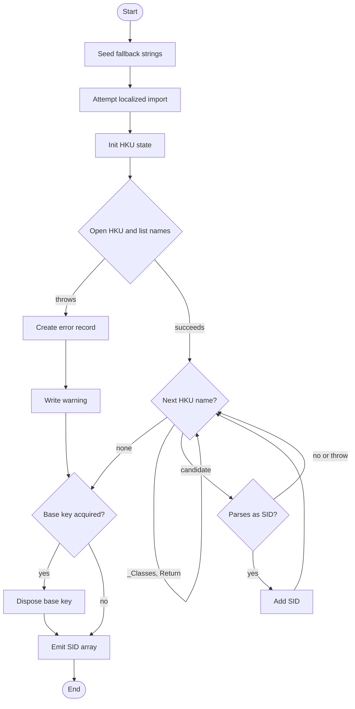

# Get-LoadedUserRegistrySid

## Purpose

`Get-LoadedUserRegistrySid` is a private discovery seam that `Get-UninstallRegistryPath` calls to enumerate already-loaded `HKEY_USERS` hives and reduce them to real user SID strings. It excludes `.DEFAULT`, any hive ending in `_Classes`, and the built-in service-account SIDs, then validates the remaining names by constructing `System.Security.Principal.SecurityIdentifier` objects. The helper exists so loaded-user-hive discovery stays thin, read-oriented, and easy to mock in tests while descriptor construction remains in its caller.

## Parameters

This function takes no parameters.

## Return Value

The function declares `[System.String[]]` output, accumulates matching HKU subkey names in a `[System.Collections.Generic.List[System.String]]`, casts that list to `[System.String[]]`, and emits it as the final pipeline expression. In normal pipeline use, PowerShell enumerates that array so downstream consumers receive zero or more individual `[System.String]` SID values; simple assignment receives `$Null` when nothing is emitted, while `@(...)` produces an empty array. When no loaded user hives match, or when HKU open/enumeration fails and the outer `Catch` only writes a warning, the final emitted array is empty and therefore produces no pipeline objects. If a terminating exception escapes `Begin` or `Finally` before the output expression runs, the function emits no SID output at all.

## Execution Flow

## Error Handling

- `Begin` seeds an inline fallback `$Strings` hashtable, then calls `Import-LocalizedData -ErrorAction:'SilentlyContinue'`. Normal lookup failures are suppressed, so fallback warning text remains available.
- Current `Import-LocalizedData` behavior is important here: a direct repro of the source call showed `-FileName:'Get-LoadedUserRegistrySid.strings'` searches for `Get-LoadedUserRegistrySid.psd1` in a culture subdirectory, not the same-directory `Get-LoadedUserRegistrySid.strings.psd1` file. In practice, this function currently falls back to the inline hashtable instead of loading the companion file.
- If `Get-RegistryBaseKey` throws while opening `HKEY_USERS`, the outer `Catch` creates an `ErrorRecord` through `New-ErrorRecord`, writes only the warning message, and the function emits no SID objects.
- If `Get-RegistrySubKeyNames` throws while enumerating HKU child names, the same outer `Catch` path writes the warning and suppresses SID output.
- Names in the explicit exclusion list and names ending in `_Classes` are skipped silently via `Return` statements inside the child-scope per-item processing script block. Those `Return` statements do not exit the function; they only skip the current HKU name.
- SID validation is guarded by an inner `Try/Catch` around `[System.Security.Principal.SecurityIdentifier]::new($Name)`. Invalid SID text is intentionally ignored, but because the catch block is empty and unqualified, any unexpected exception inside that block is also swallowed.
- The `Finally` block disposes the base registry key whenever one was acquired. `Dispose()` itself is not guarded, so a throwing mock or custom registry object would escape from `Finally` and prevent the final SID array from being emitted.
- Inference from current PowerShell docs: because the outer handler uses `Write-Warning`, callers can escalate that warning with `$WarningPreference = 'Stop'` or `-WarningAction Stop`.

## Side Effects

The function does not modify registry data, files, processes, or caller scope. Its observable operations are attempting to import localized string data, opening and disposing an `HKEY_USERS` registry handle, and possibly writing a warning to the warning stream. In the current source layout, the localized import attempt falls back to inline strings instead of loading the same-directory companion `.strings.psd1` file.

## Research Log

| Topic | Finding | Source | Date Verified |
|-------|---------|--------|---------------|
| Search: `PowerShell Practice and Style guide` | The community PowerShell Practice and Style guide is still available, but the GitBook copy shows it was last updated 5 years ago and presents recommendations rather than a current authoritative spec. Change: none. | https://poshcode.gitbook.io/powershell-practice-and-style/style-guide/introduction | 2026-04-01 |
| Search: `PowerShell docs style guide` | Current Microsoft style guidance still says to use full cmdlet and parameter names and avoid aliases, but it lowercases keywords and operators. That differs from this repo's PascalCase keyword rule. Change: adds a standards-discrepancy note, not a code finding. | https://learn.microsoft.com/en-us/powershell/scripting/community/contributing/powershell-style-guide?view=powershell-7.5 | 2026-04-01 |
| Search: `PSScriptAnalyzer overview` | PSScriptAnalyzer remains the Microsoft-documented static analyzer for PowerShell code, and the current overview still lists Windows PowerShell 5.1 or greater as supported. Change: none. | https://learn.microsoft.com/en-us/powershell/utility-modules/psscriptanalyzer/overview?view=ps-modules | 2026-04-01 |
| Search: `PSScriptAnalyzer what's new` | SUPERSEDED on 2026-04-02. The MS Learn "What's new" page still documents PSScriptAnalyzer 1.24.0 (2025-03-18) as the latest entry. See the corrected current-version row below. | https://learn.microsoft.com/en-us/powershell/utility-modules/psscriptanalyzer/whats-new-in-pssa?view=ps-modules | 2026-04-01 |
| Search: `PSScriptAnalyzer 1.25.0 release` | SUPERSEDED on 2026-04-02. A prior audit recorded 2026-03-22 from a secondary blog post, but the PowerShell Gallery package page currently lists no 1.25.0 release as current. See the corrected 1.24.0 row below. | https://www.powershellgallery.com/packages/PSScriptAnalyzer/1.25.0 https://blog.icewolf.ch/archive/2026/03/22/psscriptanalyzer-1-25-0-has-been-released | 2026-04-02 |
| Search: `PSScriptAnalyzer 1.25.0 current Gallery version` | SUPERSEDED on 2026-04-02. PowerShell Gallery currently redirects the package root to 1.24.0, so the earlier 1.25.0 current-version note is no longer correct. See the corrected row below. | https://www.powershellgallery.com/packages/PSScriptAnalyzer/1.25.0 https://www.powershellgallery.com/packages/PSScriptAnalyzer | 2026-04-02 |
| Search: `PSScriptAnalyzer current Gallery version` | PowerShell Gallery currently lists PSScriptAnalyzer 1.24.0 as the current version with `Last Published` 2025-03-18, and the MS Learn "What's new" page also tops out at 1.24.0. Local module discovery in this environment returns 1.24.0. Change: corrects the prior false 1.25.0 current-version claim and updates local verification expectations. | https://www.powershellgallery.com/packages/PSScriptAnalyzer https://learn.microsoft.com/en-us/powershell/utility-modules/psscriptanalyzer/whats-new-in-pssa?view=ps-modules | 2026-04-02 |
| Search: `AvoidUsingPositionalParameters` | The built-in analyzer rule still warns only when a command uses 3 or more positional parameters, which is looser than this repo's zero-positional house rule. Change: adds a standards-discrepancy note. | https://learn.microsoft.com/en-us/powershell/utility-modules/psscriptanalyzer/rules/avoidusingpositionalparameters?view=ps-modules | 2026-04-01 |
| Search: `about_Functions_CmdletBindingAttribute PositionalBinding` | Microsoft still documents that advanced functions gain common parameters through `CmdletBinding`, and positional binding behavior remains attribute-driven. Omitting explicit `PositionalBinding = $False` does not satisfy this repo's stricter rule. Change: confirms a standards finding. | https://learn.microsoft.com/en-us/powershell/module/microsoft.powershell.core/about/about_functions_cmdletbindingattribute?view=powershell-7.5 | 2026-04-01 |
| Search: `about_Functions_CmdletBindingAttribute ConfirmImpact SupportsShouldProcess` | Microsoft still documents that `ConfirmImpact` should be specified only when `SupportsShouldProcess` is also specified. Change: adds a standards-and-plan discrepancy note because this repo's template explicitly includes `ConfirmImpact` even on non-`ShouldProcess` helpers. | https://learn.microsoft.com/en-us/powershell/module/microsoft.powershell.core/about/about_functions_cmdletbindingattribute?view=powershell-7.5 | 2026-04-01 |
| Search: `about_Functions_OutputTypeAttribute` | `OutputType` is still documentation metadata only. It does not prove that runtime output actually matches the declared type. Change: confirms the need to audit real output paths, not just the attribute. | https://learn.microsoft.com/en-us/powershell/module/microsoft.powershell.core/about/about_functions_outputtypeattribute?view=powershell-7.5 | 2026-04-01 |
| Search: `Write-Warning` | `Write-Warning` writes only to the warning stream, returns no output, and its effect remains controlled by warning preferences and `-WarningAction`. Change: supports documenting the current warning-only catch behavior. | https://learn.microsoft.com/en-us/powershell/module/microsoft.powershell.utility/write-warning?view=powershell-7.5 | 2026-04-01 |
| Search: `about_Try_Catch_Finally` | `try/catch/finally` is still the documented pattern for terminating-error handling, and `finally` remains the correct cleanup location for resource release. Change: supports the cleanup analysis and highlights that work done before the outer `Try` is outside that protection. | https://learn.microsoft.com/en-us/powershell/module/microsoft.powershell.core/about/about_try_catch_finally?view=powershell-7.5 | 2026-04-02 |
| Search: `about_Return` | PowerShell still returns the output of each statement even without `return`, and collections written as output are still enumerated through the pipeline by default. Change: confirms the return-value explanation should distinguish between zero emitted objects, `$Null` in simple assignment, and `@(...)` producing an empty array. | https://learn.microsoft.com/en-us/powershell/module/microsoft.powershell.core/about/about_return?view=powershell-7.5 | 2026-04-02 |
| Search: `RegistryKey OpenBaseKey GetSubKeyNames Dispose` | The .NET APIs used by the helper remain current. `OpenBaseKey` still opens the requested hive and view, `GetSubKeyNames()` still returns subkey names and can throw access/system exceptions, and `Dispose()` should still be called when finished. No newer replacement or deprecation surfaced. Change: supports the catch/finally analysis. | https://learn.microsoft.com/en-us/dotnet/api/microsoft.win32.registrykey.openbasekey?view=net-9.0 https://learn.microsoft.com/en-us/dotnet/api/microsoft.win32.registrykey.getsubkeynames?view=net-9.0 https://learn.microsoft.com/en-us/dotnet/api/microsoft.win32.registrykey.dispose?view=net-9.0 | 2026-04-01 |
| Search: `SecurityIdentifier(String) .NET` | Current .NET docs (verified through net-10.0) still expose `SecurityIdentifier(String)` as the constructor for SID text in SDDL form. No deprecation or recommended replacement surfaced. Change: confirms the current implementation's SID-validation approach is supported and current. | https://learn.microsoft.com/en-us/dotnet/api/system.security.principal.securityidentifier.-ctor?view=net-10.0 | 2026-04-02 |
| Search: `well-known SIDs S-1-5-18 19 20` | Microsoft still documents `S-1-5-18`, `S-1-5-19`, and `S-1-5-20` as System, LocalService, and NetworkService. Change: confirms those exclusions are still correct. | https://learn.microsoft.com/en-us/windows-server/identity/ad-ds/manage/understand-security-identifiers | 2026-04-01 |
| Search: `HKEY_CURRENT_USER symbolic link HKEY_USERS[SID]` and `Microsoft Entra joined device whoami S-1-12` | SUPERSEDED on 2026-04-01. The external documentation remains relevant, but this prior note targeted the old hard-coded `^S-1-5-21-` implementation and no longer describes the current code. See the updated row below. | https://learn.microsoft.com/en-gb/windows/win32/winprog64/shared-registry-keys https://learn.microsoft.com/en-us/troubleshoot/entra/entra-id/dir-dmns-obj/no-local-admin-privileges-azure-ad-joined-device | 2026-04-01 |
| Search: `predefined registry keys HKEY_CURRENT_USER HKEY_USERS` and `Microsoft Entra joined device whoami S-1-12-1` | Microsoft still documents `HKEY_CURRENT_USER` as a mapping to the current user's branch in `HKEY_USERS`, and current Entra troubleshooting output still shows signed-in users carrying `S-1-12-1-...` SIDs. Change: confirms the current `SecurityIdentifier`-based validation aligns with real loaded-user SID shapes and corrects the previous Entra-specific deviation. | https://learn.microsoft.com/en-us/windows/win32/sysinfo/predefined-keys https://learn.microsoft.com/en-us/troubleshoot/entra/entra-id/dir-dmns-obj/no-local-admin-privileges-azure-ad-joined-device | 2026-04-01 |
| Search: `Comment-Based Help Keywords` | `.PARAMETER` and `.EXAMPLE` remain valid help keywords, but Microsoft documents `.PARAMETER` on a per-actual-parameter basis. The repo's zero-parameter helper convention uses `.PARAMETER None`, which is stricter and more explicit than the platform docs require. Change: corrects the prior false FAIL on the current help block. | https://learn.microsoft.com/en-us/powershell/scripting/developer/help/comment-based-help-keywords?view=powershell-7.5 | 2026-04-02 |
| Search: `Import-PowerShellDataFile` | SUPERSEDED on 2026-04-02. The current source no longer uses `Import-PowerShellDataFile`; it now uses `Import-LocalizedData` in `Begin`. See the `Import-LocalizedData` row below. | https://learn.microsoft.com/en-us/powershell/module/microsoft.powershell.utility/import-powershelldatafile?view=powershell-7.5 | 2026-04-02 |
| Search: `Join-Path Test-Path PowerShell 7.5` | SUPERSEDED on 2026-04-02. The current source no longer uses `Join-Path` or `Test-Path` after moving strings loading into `Begin` via `Import-LocalizedData`. | https://learn.microsoft.com/en-us/powershell/module/microsoft.powershell.management/join-path?view=powershell-7.5 https://learn.microsoft.com/en-us/powershell/module/microsoft.powershell.management/test-path?view=powershell-7.5 | 2026-04-02 |
| Search: `Import-LocalizedData FileName BaseDirectory .strings.psd1` | Current docs say `Import-LocalizedData` loads `.psd1` files from language-specific subdirectories and that `-FileName` can include the `.psd1` extension. A local repro of the source call searched for `Get-LoadedUserRegistrySid.psd1` under `src\Private\en-US\`; the same call with `-FileName:'Get-LoadedUserRegistrySid.strings.psd1'` loaded the companion file successfully. Change: corrects the prior false PASS that the current source consumes `Get-LoadedUserRegistrySid.strings.psd1`. | https://learn.microsoft.com/en-us/powershell/module/microsoft.powershell.utility/import-localizeddata?view=powershell-7.5 | 2026-04-02 |
| Search: `PowerShell docs style guide backticks` | Current Microsoft docs explicitly advise avoiding backtick line continuations in examples and prefer splatting or natural breaks. Change: adds a standards-discrepancy note; this repo still requires a visual indicator when backticks are used. | https://learn.microsoft.com/en-us/powershell/scripting/community/contributing/powershell-style-guide?view=powershell-7.5 https://learn.microsoft.com/en-us/powershell/module/microsoft.powershell.core/about/about_parsing?view=powershell-7.4 | 2026-04-02 |
| Search: `AvoidUsingEmptyCatchBlock` | Current PSScriptAnalyzer docs still classify empty catch blocks as a warning, and a local `Invoke-ScriptAnalyzer` run under PSScriptAnalyzer 1.24.0 flags the inner catch at line 86. Change: adds a new standards finding and updates verification notes now that analyzer is installed. | https://learn.microsoft.com/en-us/powershell/utility-modules/psscriptanalyzer/rules/avoidusingemptycatchblock?view=ps-modules | 2026-04-02 |
| Search: `RegistryKey OpenBaseKey OpenSubKey read-only` | Current .NET docs still show `OpenBaseKey` opens a hive/view without an explicit writable flag, while `OpenSubKey(String)` is explicitly read-only and write access requires different overloads. Change: keeps the least-privilege registry verdict at REVIEW rather than PASS. | https://learn.microsoft.com/en-us/dotnet/api/microsoft.win32.registrykey.openbasekey?view=net-9.0 https://learn.microsoft.com/en-us/dotnet/api/microsoft.win32.registrykey.opensubkey?view=net-9.0 | 2026-04-02 |

## Standards Audit

Audit target: `src/Private/Get-LoadedUserRegistrySid.ps1`

| Rule | Status | Line(s) | Evidence |
|------|--------|---------|----------|
| Colon-bound parameters | PASS | 46-50, 70, 91-100 | ``Import-LocalizedData -BindingVariable:'Strings' -FileName:'Get-LoadedUserRegistrySid.strings' -BaseDirectory:$PSScriptRoot -ErrorAction:'SilentlyContinue'``, ``Get-RegistrySubKeyNames -Key:$BaseKey``, ``New-ErrorRecord -ExceptionName:'System.InvalidOperationException' ...``, and ``Write-Warning -Message:$ErrorRecord.Exception.Message`` use named colon-bound arguments when parameters are written explicitly. |
| PascalCase naming | PASS | 1, 29-37, 41, 53, 63, 75, 81, 90, 101 | ``Function Get-LoadedUserRegistrySid {``, ``[CmdletBinding(...)]``, ``Begin``, ``Process``, ``Try``, ``Catch``, ``Finally``, ``If``, ``$BaseKey``, ``$ExcludedNames``, and ``$LoadedSids`` follow the repo's PascalCase rule. |
| Full .NET type names (no accelerators) | PASS | 38, 61, 65-66, 72, 74, 79, 84, 97, 99, 102, 106 | ``[OutputType([System.String[]])]``, ``[System.Collections.Generic.List[System.String]]::new()``, ``[Microsoft.Win32.RegistryHive]::Users``, ``[Microsoft.Win32.RegistryView]::Default``, ``[System.String]$PSItem``, ``[System.Boolean](...)``, ``[System.StringComparison]::OrdinalIgnoreCase``, ``[System.Security.Principal.SecurityIdentifier]::new($Name)``, ``[Microsoft.Win32.RegistryHive]::Users``, ``[System.Management.Automation.ErrorCategory]::ReadError``, ``[System.Boolean]($Null -ne $BaseKey)``, and ``[System.String[]]$LoadedSids`` all use full type names. |
| Object types are the most appropriate and specific choice | PASS | 61, 84, 91-99, 106 | The function accumulates with ``[System.Collections.Generic.List[System.String]]``, validates candidates with ``[System.Security.Principal.SecurityIdentifier]``, reports registry failures with a structured ``ErrorRecord`` via ``New-ErrorRecord``, and emits ``[System.String[]]`` rather than generic object shapes. |
| Single quotes for non-interpolated strings | PASS | 30, 32, 44, 48, 50, 56-59, 78, 92, 98 | ``'None'``, ``''``, ``'Cannot enumerate loaded user registry hives: {0}'``, ``'Get-LoadedUserRegistrySid.strings'``, ``'SilentlyContinue'``, ``'.DEFAULT'``, ``'S-1-5-18'``, ``'S-1-5-19'``, ``'S-1-5-20'``, ``'_Classes'``, ``'System.InvalidOperationException'``, and ``'GetLoadedUserRegistrySidFailed'`` are single-quoted literals. |
| `$PSItem` not `$_` | PASS | 72, 95 | ``$Name = [System.String]$PSItem`` and ``$PSItem.Exception.Message`` use `$PSItem`; `$_` does not appear. |
| Explicit bool comparisons (`$Var -eq $True`, not just `$Var`) | PASS | 75, 77-81, 103 | ``If ($IsExcludedName -eq $True)``, ``...EndsWith(...) -eq $True``, ``If ($IsClassesHive -eq $True)``, and ``If ($HasBaseKey -eq $True)`` use explicit Boolean comparisons rather than truthy shorthand. |
| If conditions are pre-evaluated outside If blocks | PASS | 74-75, 77-81, 102-103 | ``$IsExcludedName = [System.Boolean](...)`` and ``$IsClassesHive = [System.Boolean](...)`` are assigned before their `If` statements, and cleanup uses ``$HasBaseKey = [System.Boolean]($Null -ne $BaseKey)`` before ``If ($HasBaseKey -eq $True)``. |
| `$Null` on left side of comparisons | PASS | 102 | ``$HasBaseKey = [System.Boolean]($Null -ne $BaseKey)`` keeps `$Null` on the left side. |
| No positional arguments to cmdlets | PASS | 46-50, 70, 91-100 | ``Import-LocalizedData``, ``Get-RegistrySubKeyNames``, ``New-ErrorRecord``, and ``Write-Warning`` are all invoked with named parameters rather than positional binding. |
| No cmdlet aliases | PASS | 46-50, 68, 70, 91-100 | The function calls ``Import-LocalizedData``, ``Get-RegistryBaseKey``, ``Get-RegistrySubKeyNames``, ``New-ErrorRecord``, and ``Write-Warning``. No aliases are used. |
| Switch parameters correctly handled | N/A | 1-108 | The function defines no `[switch]` parameters and does not pass explicit values to switch parameters. |
| CmdletBinding with all required properties | PASS | 29-37 | ``[CmdletBinding( ConfirmImpact = 'None' , DefaultParameterSetName = 'Default' , HelpURI = '' , PositionalBinding = $False , RemotingCapability = 'None' , SupportsPaging = $False , SupportsShouldProcess = $False )]`` includes the house-required property inventory. |
| Leading commas in CmdletBinding attributes | FAIL | 29-37 | ``[CmdletBinding(`` is followed by ``ConfirmImpact = 'None'`` instead of the house-required leading-comma form such as ``, ConfirmImpact = 'None'``. |
| OutputType declared | PASS | 38 | ``[OutputType([System.String[]])]`` is present directly above `Param()`. |
| Comment-based help is complete (`Synopsis`, `Description`, `Parameter`, `Example`, `Outputs`, `Notes`) | PASS | 3-26 | The help block contains ``.SYNOPSIS``, ``.DESCRIPTION``, ``.PARAMETER None``, ``.EXAMPLE``, ``.OUTPUTS``, and ``.NOTES``. |
| Begin / Process / End block structure | FAIL | 41-53, 107-108 | The function uses block-specific setup in ``Begin {`` and work in ``Process {``, but there is no ``End {`` block before the function closes at line 108. |
| Error handling via `New-ErrorRecord` or appropriate pattern | FAIL | 83-88, 91-100 | The outer registry-failure path uses ``New-ErrorRecord``, but the inner ``Catch {}`` around ``[System.Security.Principal.SecurityIdentifier]::new($Name)`` suppresses every exception in that block without reporting it. |
| Try/Catch around operations that can fail | FAIL | 41-50, 63-104 | ``Import-LocalizedData ... -ErrorAction:'SilentlyContinue'`` runs outside any explicit `Try/Catch`, and ``$BaseKey.Dispose()`` in `Finally` is also unguarded. A direct repro showed the current `Import-LocalizedData` call fails its lookup and is only masked by `-ErrorAction:'SilentlyContinue'`. |
| Write-Debug at Begin/Process/End block entry and exit (if blocks are used) | FAIL | 41-51, 53-107 | ``Begin {`` and ``Process {`` are present, but there are no `Write-Debug` entry/exit messages anywhere in the function. |
| No variable pollution (no `script:` or `global:` scope leaks) | PASS | 42-106 | ``$Strings``, ``$BaseKey``, ``$ExcludedNames``, ``$LoadedSids``, ``$BaseKeyParams``, ``$AllNames``, ``$Name``, ``$IsExcludedName``, ``$IsClassesHive``, ``$ErrorRecord``, and ``$HasBaseKey`` are local variables. No `script:` or `global:` assignments exist. |
| 96-character line limit | PASS | 1-108 | A local line-length scan reported ``MAXLEN=80`` for `src/Private/Get-LoadedUserRegistrySid.ps1`; no line exceeds the 96-character limit. |
| 2-space indentation (not tabs, not 4-space) | PASS | 29-107 | Representative lines such as ``  [CmdletBinding(``, ``    $BaseKeyParams = @{``, and ``      Write-Warning -Message:$ErrorRecord.Exception.Message`` use 2-space indentation, and a local tab scan reported ``TABS=NONE``. |
| OTBS brace style | PASS | 1, 41, 53, 63, 75, 81, 83, 86, 90, 101, 103 | ``Function Get-LoadedUserRegistrySid {``, ``Begin {``, ``Process {``, ``Try {``, ``If (...) { ... }``, ``} Catch {``, ``} Finally {``, and ``If (...) { $BaseKey.Dispose() }`` follow OTBS brace placement. |
| No commented-out code | PASS | 87 | ``# Non-SID HKU entries are intentionally ignored.`` is an explanatory comment, not disabled code. |
| Registry access is read-only (if applicable) | REVIEW | 63-70 `src/Private/Get-RegistryBaseKey.ps1:68-84` `src/Private/Get-RegistrySubKeyNames.ps1:49-52` | The helper opens `HKEY_USERS` through ``Get-RegistryBaseKey`` and only enumerates child names through ``Get-RegistrySubKeyNames``. However, ``[Microsoft.Win32.RegistryKey]::OpenBaseKey($Hive, $View)`` does not expose an explicit read-only flag, so proof of least-privilege opening remains indirect. |
| Approved verb naming | PASS | 1 | ``Function Get-LoadedUserRegistrySid {`` uses the approved `Get` verb for a read-only helper. |
| `Param()` block present | PASS | 39 | ``Param()`` is present even though the function has no custom parameters. |
| Backtick line continuation has visual indicator comment | FAIL | 46-50, 91-99 | Both the ``Import-LocalizedData`` and ``New-ErrorRecord`` multi-line calls use backticks without the required preceding ``# --- [ Line Continuation ]`` comment. |
| Localized string data is used for user-facing warning text | FAIL | 42-50 `src/Private/Get-LoadedUserRegistrySid.strings.psd1:1-3` | The function seeds an inline fallback table and calls ``Import-LocalizedData -FileName:'Get-LoadedUserRegistrySid.strings'``. Current `Import-LocalizedData` behavior searches language-specific subdirectories for a `.psd1`; a direct repro of this exact call looked for ``Get-LoadedUserRegistrySid.psd1`` under ``src\\Private\\en-US\\``. The companion ``Get-LoadedUserRegistrySid.strings.psd1`` exists, but the current source does not actually load it. |
| UTF-8 with BOM encoding | PASS | 1 | A local byte scan of `src/Private/Get-LoadedUserRegistrySid.ps1` reported ``BOM=True`` with first bytes ``239 187 191``, which satisfies the repo's UTF-8 BOM requirement. |

1. Current Microsoft style guidance lowercases PowerShell keywords and operators, while this repo's standard requires PascalCase keywords. This audit follows the repo standard as written.
2. Current Microsoft style guidance and `about_Parsing` advise avoiding backtick line continuations in favor of splatting or natural breaks. This repo standard still explicitly allows and annotates backticks, so the fail above is against the repo rules, not current Microsoft guidance.
3. Current PSScriptAnalyzer coverage is looser than this repo in at least one audited area: `PSAvoidUsingPositionalParameters` still only triggers when 3 or more positional parameters are supplied. This audit still treats any positional cmdlet binding as a repo failure where applicable.
4. Current PSScriptAnalyzer also documents `PSAvoidUsingEmptyCatchBlock` as a warning, and a local analyzer run under version 1.24.0 flags the inner `Catch {}` at line 86. That reinforces the fail above rather than changing it.
5. Current Microsoft help docs describe `.PARAMETER` entries per actual parameter. This repo's zero-parameter helper convention uses `.PARAMETER None`; the current source follows that convention, so the help block is treated as complete.
6. Current Microsoft `CmdletBinding` docs say `ConfirmImpact` should be specified only when `SupportsShouldProcess` is also specified. The repo template and house rule still require the explicit property inventory, so the standards PASS above coexists with a plan-level deviation below.
7. Current `Import-LocalizedData` docs describe loading `.psd1` files from language-specific subdirectories and allow specifying the full `.psd1` filename. A direct repro showed `-FileName:'Get-LoadedUserRegistrySid.strings'` searches for `Get-LoadedUserRegistrySid.psd1`, not `Get-LoadedUserRegistrySid.strings.psd1`. That means the repo reference's `'<FunctionName>.strings'` example does not load same-directory companion `.strings.psd1` files as written; this audit records that runtime mismatch as a functional finding.

Local verification notes: `Invoke-ScriptAnalyzer` was rerun in this environment with installed `PSScriptAnalyzer 1.24.0` and reported one warning: `PSAvoidUsingEmptyCatchBlock` at `src/Private/Get-LoadedUserRegistrySid.ps1:86`. A local byte scan reported `BOM=True` with first bytes `239 187 191`, a local tab scan reported `TABS=NONE`, and a local line-length scan reported `MAXLEN=80`. A direct repro of the source's `Import-LocalizedData -FileName:'Get-LoadedUserRegistrySid.strings'` call searched for `Get-LoadedUserRegistrySid.psd1` under `src/Private\en-US\` and failed; the same call with `-FileName:'Get-LoadedUserRegistrySid.strings.psd1'` loaded the companion file successfully. A focused `Invoke-Pester` run against `tests/Private/Get-LoadedUserRegistrySid.Tests.ps1` discovered 10 tests, but Pester 5.7.1 failed before assertions because it could not create `HKCU\Software\Pester` under the registry restrictions in this audit environment, so all 10 tests were reported failed at the container level.

## Plan Audit

| Plan Section | Requirement | Status | Line(s) | Details |
|--------------|-------------|--------|---------|---------|
| `PLAN.md` 2, 7.1 | Discovery scope includes loaded `HKU\<SID>` user hives only, and unloaded user hives are out of scope. | ALIGNED | `PLAN.md:32-38` `src/Private/Get-LoadedUserRegistrySid.ps1:63-70` | The function opens `HKEY_USERS`, enumerates already-loaded subkey names only, and never mounts `NTUSER.DAT` or touches offline hives. |
| `PLAN.md` 2, 7.2 | `HKU` enumeration must include only real user SID hives while excluding `.DEFAULT`, `*_Classes`, `S-1-5-18`, `S-1-5-19`, and `S-1-5-20`. | ALIGNED | `PLAN.md:37-38` `PLAN.md:320-325` `src/Private/Get-LoadedUserRegistrySid.ps1:55-60` `src/Private/Get-LoadedUserRegistrySid.ps1:74-85` | The implementation explicitly excludes `.DEFAULT` and the three service SIDs, rejects any name ending in `_Classes`, and validates the remaining names by constructing ``[System.Security.Principal.SecurityIdentifier]`` objects. That also keeps valid Entra-style `S-1-12-1-...` user SIDs instead of hard-coding `S-1-5-21-*`. |
| `PLAN.md` 3, 7.1, 14.3 | Registry discovery must keep registry access read-only. | REVIEW | `PLAN.md:80` `PLAN.md:314` `PLAN.md:855` `src/Private/Get-LoadedUserRegistrySid.ps1:63-70` `src/Private/Get-RegistryBaseKey.ps1:68-84` `src/Private/Get-RegistrySubKeyNames.ps1:49-52` | The helper chain only opens the HKU base key and enumerates child names, and the tests assert that no deeper subkey-open seam is used. However, `OpenBaseKey($Hive, $View)` does not expose an explicit read-only flag, so proof of minimum-rights opening remains indirect. |
| `PLAN.md` 7.7 | If a registry path cannot be read, emit a concise warning and continue discovery. | ALIGNED | `PLAN.md:406-410` `src/Private/Get-LoadedUserRegistrySid.ps1:90-100` `src/Private/Get-UninstallRegistryPath.ps1:58-63` | Registry open/enumeration failures are converted to a concise warning and not rethrown. `Get-UninstallRegistryPath` emits system descriptors before calling this seam, so discovery can continue without user-hive descriptors when SID enumeration warns and returns no output. |
| `PLAN.md` 4.4 | The script must not prompt; specifically, no `SupportsShouldProcess` and no `ConfirmImpact`. | DEVIATION | `PLAN.md:135-145` `src/Private/Get-LoadedUserRegistrySid.ps1:29-37` | Runtime behavior remains non-interactive, but the helper still explicitly declares ``ConfirmImpact = 'None'`` and ``SupportsShouldProcess = $False``. That contradicts the plan text as written. |
| `PLAN.md` 12 | `Get-LoadedUserRegistrySid.ps1` belongs under `src/Private`. | ALIGNED | `PLAN.md:680-688` `src/Private/Get-LoadedUserRegistrySid.ps1:1-108` | The function is implemented in the planned private file location and is not exposed as a public entrypoint. |
| `PLAN.md` 2, 12, 15.1 | External dependencies must be wrapped behind private seam functions, and seams must stay thin and necessary rather than overengineered. | ALIGNED | `PLAN.md:70-71` `PLAN.md:746-758` `PLAN.md:916-918` `src/Private/Get-LoadedUserRegistrySid.ps1:7-13` `src/Private/Get-LoadedUserRegistrySid.ps1:63-106` `src/Private/Get-UninstallRegistryPath.ps1:61-63` | The plan explicitly names this function as an external seam. It stays small, depends only on registry-wrapper seams plus SID parsing, and serves a real caller that needs mockable loaded-user-hive discovery. |
| `PLAN.md` 15.1 | No business logic should be buried in a seam function. | ALIGNED | `PLAN.md:916-918` `src/Private/Get-LoadedUserRegistrySid.ps1:74-85` | The helper's logic is limited to seam-relevant filtering and SID-shape validation. It does not build descriptors, resolve identities, or perform broader discovery orchestration. |
| `PLAN.md` 13.2 | Use `.strings.psd1` only where a function has reusable user-facing messages. | ALIGNED | `PLAN.md:781-789` `src/Private/Get-LoadedUserRegistrySid.ps1:42-50` `src/Private/Get-LoadedUserRegistrySid.strings.psd1:1-3` | The helper has a reusable user-facing warning and a non-empty companion strings file, so the file's existence matches the plan. However, a direct repro shows the current `Import-LocalizedData -FileName:'Get-LoadedUserRegistrySid.strings'` call does not actually load that same-directory file; the source falls back to the inline hashtable instead. |
| `PLAN.md` 14.3 | Discovery tests should cover exclusion of `.DEFAULT`, `*_Classes`, and service SIDs, plus unreadable-path warning behavior. | ALIGNED | `PLAN.md:842-855` `tests/Private/Get-LoadedUserRegistrySid.Tests.ps1:24-72` `tests/Private/Get-LoadedUserRegistrySid.Tests.ps1:87-97` `tests/Private/Get-LoadedUserRegistrySid.Tests.ps1:119-148` | The dedicated private tests cover `.DEFAULT`, `_Classes`, `S-1-5-18`, `S-1-5-19`, `S-1-5-20`, retention of valid on-prem and Entra-style user SIDs, warning behavior on HKU failure, and the expectation that the wrapper seams are used instead of deeper registry opens. |
| `PLAN.md` 4.3, 10.4 | Exit codes and uninstall outcomes must match the script contract. | N/A | `PLAN.md:125-133` `PLAN.md:558-567` `src/Private/Get-LoadedUserRegistrySid.ps1:1-108` | This helper emits SID strings only. It does not assign script exit codes or uninstall outcomes. |
| `PLAN.md` 5.1, 5.2, 5.3 | The application-record, descriptor, and uninstall-result data models must match the frozen contract. | N/A | `PLAN.md:152-215` `src/Private/Get-LoadedUserRegistrySid.ps1:1-108` | `Get-LoadedUserRegistrySid` does not construct application records, registry descriptors, or uninstall result records. It only emits candidate user SID strings for its caller. |

Verification note: a focused `Invoke-Pester` run against `tests/Private/Get-LoadedUserRegistrySid.Tests.ps1` was attempted during this audit. Pester 5.7.1 discovered 10 tests, but the container failed before assertions because Pester attempted to create `HKCU\Software\Pester` and registry writes are denied in this environment, so all 10 tests were reported failed at the framework level.

## Changelog

| Date | Changes |
|------|---------|
| 2026-04-02 | Re-audited against the current source and corrected stale documentation from the previous run: the function now uses `Begin`/`Process` with `Import-LocalizedData`, not the older `Join-Path`/`Test-Path`/`Import-PowerShellDataFile` flow described in the README. Fixed the standards audit to mark pre-evaluated `If` conditions PASS, `Write-Debug` and missing `End` block FAIL, reran ScriptAnalyzer now that `PSScriptAnalyzer 1.24.0` is installed, and recorded the live `PSAvoidUsingEmptyCatchBlock` warning. Added new research and local verification showing the current `Import-LocalizedData -FileName:'Get-LoadedUserRegistrySid.strings'` call does not actually load the same-directory companion `.strings.psd1`, so the prior PASS for localized string consumption was false and the function currently falls back to inline warning text. Corrected the research log's stale `PSScriptAnalyzer 1.25.0` claims to the current Gallery and installed version `1.24.0`, and refreshed local verification notes for today's environment. |
| 2026-04-02 | Corrected multiple stale findings in the README: `.PARAMETER None` is present, the companion `.strings.psd1` file exists and is used, the source file is UTF-8 with BOM, and the backtick continuation comment rule actually fails on the `Join-Path` call. Updated the execution flow and error-handling sections to include the strings-file import branch and the currently unhandled `Import-PowerShellDataFile` failure path. Corrected the PSScriptAnalyzer 1.25.0 Gallery publish date to 2026-03-20, added current research for `Import-PowerShellDataFile` plus `Join-Path`/`Test-Path`, and refreshed local verification notes to reflect that Pester 5.7.1 is installed but blocked by denied registry writes while PSScriptAnalyzer is absent. |
| 2026-04-02 | Added a new standards finding: `[CmdletBinding()]` uses trailing commas instead of the house-required leading-comma format (section 1.4). Updated the PSScriptAnalyzer research row to note that 1.25.0 was released to the PowerShell Gallery on 2026-03-22 and that the MS Learn "What's new" page has not yet been updated; superseded the previous 1.24.0-only row. Re-verified `SecurityIdentifier(String)` constructor against .NET 10.0 docs - no deprecation. |
| 2026-04-01 | Updated the audit for the current implementation. Corrected the function description, flowchart, and return-value analysis to match the new `SecurityIdentifier`-based SID validation path; removed the stale Entra SID deviation from the plan audit; added current research on `SecurityIdentifier(String)` and `CmdletBinding` `ConfirmImpact` guidance; and added a new plan-level deviation for explicit `ConfirmImpact`/`SupportsShouldProcess` declarations; and added a new standards finding for inline warning text without a companion `.strings.psd1` file. |
| 2026-04-01 | First audit run. Added the initial README with function documentation, a research log, a coding-standards audit, and a plan audit. Recorded a new substantive finding: the hard-coded `^S-1-5-21-` filter can exclude valid Microsoft Entra user hives that use `S-1-12-...` SIDs. |
AUDIT_STATUS:UPDATED