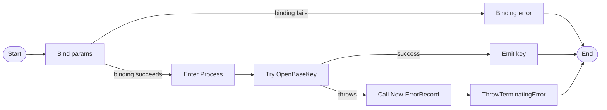

# Get-RegistryBaseKey

## Purpose
`Get-RegistryBaseKey` is a private registry seam that opens a local base hive with an explicit `RegistryView` and returns the resulting `[Microsoft.Win32.RegistryKey]`. Within this repo it is called by `Get-LoadedUserRegistrySid` when enumerating loaded `HKU` SIDs and by `Get-InstalledApplication` when opening each registry descriptor's root hive before subkey traversal. It exists so registry base-key access stays centralized and mockable in Pester instead of scattering `[Microsoft.Win32.RegistryKey]::OpenBaseKey(...)` throughout discovery code, and it translates lower-level open failures into a contextual terminating `ErrorRecord` by routing them through the repo-standard `New-ErrorRecord` helper before calling `$PSCmdlet.ThrowTerminatingError()`.

## Parameters
| Name | Type | Required | Default | Description |
|------|------|----------|---------|-------------|
| `Hive` | `Microsoft.Win32.RegistryHive` | Yes | None | The base registry hive to open, such as `LocalMachine` or `Users`. |
| `View` | `Microsoft.Win32.RegistryView` | Yes | None | The registry view to target, such as `Default`, `Registry32`, or `Registry64`. |

## Return Value
Returns `[Microsoft.Win32.RegistryKey]` for the requested local hive and view when `OpenBaseKey` succeeds. There is no designed `$Null` path and no deliberate no-output path; on success the function writes exactly one registry key object to the pipeline. If the underlying open fails, the `Catch` block calls `New-ErrorRecord` with `ExceptionName = 'System.InvalidOperationException'`, `ErrorId = 'GetRegistryBaseKeyFailed'`, and `ErrorCategory = OpenError`, then raises the returned `ErrorRecord` as a terminating error through `$PSCmdlet.ThrowTerminatingError()`. The returned key is disposable, so callers are responsible for closing or disposing it after use.

## Execution Flow

## Error Handling
- Missing `Hive` or `View` stops execution during mandatory parameter binding before the body runs.
- Invalid string values such as `'NotAHive'` or `'NotAView'` fail during parameter binding before the `Try` block runs because the parameters are enum-typed.
- If `OpenBaseKey` throws, including documented `ArgumentException`, `UnauthorizedAccessException`, or `SecurityException` paths, the `Catch` block creates a contextual `ErrorRecord` through `New-ErrorRecord` with exception name `System.InvalidOperationException`, error ID `GetRegistryBaseKeyFailed`, category `OpenError`, and target object `$Hive`.
- The function raises that `ErrorRecord` as a terminating error through `$PSCmdlet.ThrowTerminatingError()`.
- The function does not directly write warnings and does not silently skip failures. The only indirect warning path would be an unexpected failure inside `New-ErrorRecord` while constructing `System.InvalidOperationException`, which is not expected with this fixed framework type name.

## Side Effects
This function does not modify registry data, files, processes, or outer-scope variables. It does open and return a disposable registry handle, but cleanup responsibility remains with the caller.

## Research Log
| Topic | Finding | Source | Date Verified |
|-------|---------|--------|---------------|
| Search: `PowerShell Practice and Style guide` | The community PowerShell Practice and Style guide still presents itself as pragmatic guidance rather than a rigid rulebook, so this repo's house style is intentionally stricter than the public baseline. | https://poshcode.gitbook.io/powershell-practice-and-style/style-guide/introduction | 2026-04-01 |
| Search: `PowerShell Practice and Style guide tone` | The current verified guidance says the project uses practices and guidelines, not rules, and prefers avoiding absolute language. That confirms this repo's stricter house standard is an intentional divergence from current community guidance, not a contradiction of it. | https://poshcode.gitbook.io/powershell-practice-and-style/introduction/contributing | 2026-04-01 |
| Search: `PSScriptAnalyzer overview` | Microsoft still positions PSScriptAnalyzer as the current static analyzer for PowerShell and documents support for Windows PowerShell 5.1 or higher. | https://learn.microsoft.com/en-us/powershell/utility-modules/psscriptanalyzer/overview?view=ps-modules | 2026-04-01 |
| Search: `PSScriptAnalyzer what's new` | SUPERSEDED by 2026-04-02 entry below. | https://learn.microsoft.com/en-us/powershell/utility-modules/psscriptanalyzer/whats-new-in-pssa?view=ps-modules | 2026-04-01 |
| Search: `PSScriptAnalyzer 1.25.0 release` | PSScriptAnalyzer 1.25.0 was released on 2026-03-20. `UseCorrectCasing` now also auto-corrects operators, keywords, and commands by default. Minimum PS 7 version raised to 7.2.11. PS 5.1 support is unchanged. This supersedes the 1.24.0 entry. | https://www.powershellgallery.com/packages/PSScriptAnalyzer/1.25.0 | 2026-04-02 |
| Search: `UseCorrectCasing rule` | Current PSScriptAnalyzer docs require exact casing for type names, commands, and parameters, but lowercase keywords and operators by default. That means this repo's PascalCase-keyword house rule intentionally diverges from the current analyzer rule behavior. | https://learn.microsoft.com/en-us/powershell/utility-modules/psscriptanalyzer/rules/usecorrectcasing?view=ps-modules | 2026-04-02 |
| Search: `AvoidUsingPositionalParameters` | The built-in rule still warns only when a command uses three or more positional arguments, which is looser than this repo's no-positional-arguments standard. | https://learn.microsoft.com/en-us/powershell/utility-modules/psscriptanalyzer/rules/avoidusingpositionalparameters?view=ps-modules | 2026-04-01 |
| Search: `about_Functions_CmdletBindingAttribute` | `PositionalBinding` still defaults to `$true`, so codebases that forbid positional binding must set it explicitly. | https://learn.microsoft.com/en-us/powershell/module/microsoft.powershell.core/about/about_functions_cmdletbindingattribute?view=powershell-7.5 | 2026-04-01 |
| Search: `about_Functions_OutputTypeAttribute` | `OutputType` remains metadata only; it documents intended output but does not validate runtime output. | https://learn.microsoft.com/en-us/powershell/module/microsoft.powershell.core/about/about_functions_outputtypeattribute?view=powershell-7.5 | 2026-04-01 |
| Search: `about_Functions_Advanced_Parameters` | Current PowerShell guidance still treats strong parameter typing and built-in validation attributes as the normal fail-fast boundary-validation model for advanced functions, which supports using enum-typed parameters here. | https://learn.microsoft.com/es-es/powershell/module/microsoft.powershell.core/about/about_functions_advanced_parameters?view=powershell-7.6 | 2026-04-01 |
| Search: `Comment-Based Help Keywords` | `.EXAMPLE`, `.OUTPUTS`, and `.NOTES` remain current comment-based help keywords, so omitting examples still weakens discoverability even for a small helper. | https://learn.microsoft.com/en-us/powershell/scripting/developer/help/comment-based-help-keywords?view=powershell-7.6 | 2026-04-01 |
| Search: `about_Throw` | PowerShell still documents `throw` as a terminating-error mechanism that can be used inside `catch`, so exception rethrowing remains current PowerShell practice even though this repo standard prefers `New-ErrorRecord` plus `$PSCmdlet.ThrowTerminatingError()`. | https://learn.microsoft.com/lb-lu/powershell/module/microsoft.powershell.core/about/about_throw?view=powershell-5.1 | 2026-04-01 |
| Search: `about_Functions_Advanced_Methods ThrowTerminatingError` | Current PowerShell docs say advanced functions should call `ThrowTerminatingError` for terminating errors and `WriteError` for non-terminating ones. The current implementation now aligns with both that platform guidance and the repo rule by obtaining the `ErrorRecord` from `New-ErrorRecord` before throwing it. | https://learn.microsoft.com/en-us/powershell/module/microsoft.powershell.core/about/about_functions_advanced_methods?view=powershell-7.6 | 2026-04-02 |
| Search: `RegistryKey.OpenBaseKey` | `RegistryKey.OpenBaseKey(RegistryHive, RegistryView)` remains the current API for opening a local base hive/view and its documented exception surface includes `ArgumentException`, `UnauthorizedAccessException`, and `SecurityException`; no deprecation surfaced. | https://learn.microsoft.com/en-us/dotnet/api/microsoft.win32.registrykey.openbasekey?view=net-10.0 | 2026-04-01 |
| Search: `RegistryView enum` | `RegistryView` still defines `Default`, `Registry64`, and `Registry32`, and requesting `Registry64` on a 32-bit operating system still yields the 32-bit view. | https://learn.microsoft.com/en-us/dotnet/api/microsoft.win32.registryview?view=net-10.0 | 2026-04-01 |
| Search: `RegistryKey.OpenSubKey read-only` | Current .NET docs still place explicit read-only versus read/write control on `OpenSubKey` overloads, which means this repo's mechanical proof of least privilege lives in downstream subkey seams rather than `OpenBaseKey` itself. | https://learn.microsoft.com/en-us/dotnet/api/microsoft.win32.registrykey.opensubkey?view=net-8.0 | 2026-04-01 |
| Search: `RegistryKey class IDisposable` | `RegistryKey` remains `IDisposable`, so callers should dispose the handle returned by this helper when they are done with it. | https://learn.microsoft.com/en-us/dotnet/api/microsoft.win32.registrykey?view=net-10.0 | 2026-04-01 |
| Search: `RegistryKey class methods` | Current `RegistryKey` docs still expose mutating members such as `SetValue`, so receiving a `RegistryKey` from `OpenBaseKey` does not by itself prove that subsequent access remains read-only. | https://learn.microsoft.com/ga-ie/dotnet/api/microsoft.win32.registrykey?view=net-11.0 | 2026-04-01 |
| Search: `Security and the Registry` | Microsoft still treats registry operations as security-sensitive and recommends using only the permissions required, which reinforces the repo's least-privilege policy. | https://learn.microsoft.com/en-us/dotnet/visual-basic/developing-apps/programming/computer-resources/security-and-the-registry | 2026-04-01 |
| Search: `Pester quick start mocking` | Pester still documents mocking as a core capability, which supports keeping registry access behind a thin seam function that downstream tests can replace. | https://pester.dev/docs/quick-start/ | 2026-04-01 |
| Search: `Pester quick start current docs` | SUPERSEDED by 2026-04-02 `Pester Mock command` row below. The linked `/docs/v4/quick-start` page is historical v4 documentation, not the current docs baseline. | https://pester.dev/docs/v4/quick-start | 2026-04-01 |
| Search: `Pester Mock command` | Current Pester docs still document `Mock` as the dependency-replacement primitive. `-MockWith` scriptblocks receive injected parameters based on the mocked command signature, which continues to support this seam-based test design. | https://pester.dev/docs/commands/Mock | 2026-04-02 |
| Search: `about_Requires` | Current docs say `#Requires` statements can appear on any line in a script and still apply globally; placing one inside a function does not limit scope. That removes the earlier ambiguity: this file simply lacks `#Requires -Version 5.1`. | https://learn.microsoft.com/en-us/powershell/module/microsoft.powershell.core/about/about_requires?view=powershell-7.5 | 2026-04-02 |

## Standards Audit
| Rule | Status | Line(s) | Evidence |
|------|--------|--------|----------|
| Colon-bound parameters | PASS | 72-82 | The only PowerShell command invocation in the body is `New-ErrorRecord` and every supplied argument is colon-bound: `-ExceptionName:'System.InvalidOperationException'`, `-ExceptionMessage:(...)`, `-TargetObject:$Hive`, `-ErrorId:'GetRegistryBaseKeyFailed'`, and `-ErrorCategory:([System.Management.Automation.ErrorCategory]::OpenError)`. |
| PascalCase naming | PASS | 1, 52, 65 | `Function Get-RegistryBaseKey {`, `$Hive`, and `$View` all use PascalCase identifiers. |
| Full .NET type names (no accelerators) | PASS | 39, 51, 64, 70, 82 | `[OutputType([Microsoft.Win32.RegistryKey])]`, `[Microsoft.Win32.RegistryHive]`, `[Microsoft.Win32.RegistryView]`, `[Microsoft.Win32.RegistryKey]::OpenBaseKey(...)`, and `[System.Management.Automation.ErrorCategory]::OpenError` all use full .NET type names. |
| Object types are the MOST appropriate and specific choice | PASS | 39, 51, 64, 70, 73, 82 | `[Microsoft.Win32.RegistryHive]` and `[Microsoft.Win32.RegistryView]` are the exact enums `OpenBaseKey` expects, `[Microsoft.Win32.RegistryKey]` is the exact handle type returned, and the catch path asks `New-ErrorRecord` for a specific `System.InvalidOperationException` with `OpenError` classification. |
| Single quotes for non-interpolated strings | PASS | 31-37, 45, 58, 73-82 | `ConfirmImpact = 'None'`, `HelpURI = ''`, `HelpMessage = 'See function help.'`, `-ExceptionName:'System.InvalidOperationException'`, `('Unable to open base hive ''{0}'' in view ''{1}'': {2}' -f ...)`, and `-ErrorId:'GetRegistryBaseKeyFailed'` all use single-quoted literals. |
| `$PSItem` not `$_` | PASS | 78 | The catch block uses `$PSItem.Exception.Message`, and there is no `$_` in the function. |
| Explicit bool comparisons (`$Var -eq $True`) | N/A | 1-86 | The function contains no Boolean comparisons. |
| If conditions are pre-evaluated outside If blocks | N/A | 1-86 | The function has no `If` statements, so there are no conditions to pre-evaluate. |
| `$Null` on left side of comparisons | N/A | 1-86 | The function contains no null comparisons. |
| No positional arguments to cmdlets | PASS | 72-82 | The body's only PowerShell command call is `New-ErrorRecord`, and it uses named arguments only: `-ExceptionName:...`, `-ExceptionMessage:(...)`, `-TargetObject:$Hive`, `-ErrorId:...`, `-ErrorCategory:(...)`. |
| No cmdlet aliases | PASS | 72-83 | The body calls `New-ErrorRecord` and `$PSCmdlet.ThrowTerminatingError($ErrorRecord)`; it does not use aliases such as `?`, `%`, `select`, or `gci`. |
| Switch parameters correctly handled | N/A | 40-83 | `Param (` declares only `Hive` and `View`, and the body does not call any command with switch parameters. |
| CmdletBinding with all required properties | PASS | 30-38 | `[CmdletBinding( ConfirmImpact = 'None' , DefaultParameterSetName = 'Default' , HelpURI = '' , PositionalBinding = $False , RemotingCapability = 'None' , SupportsPaging = $False , SupportsShouldProcess = $False )]` explicitly lists the house-style property set. |
| Leading commas in attributes | FAIL | 30-37, 41-49, 54-62 | Section 1.4 requires every line in `[CmdletBinding()]` and `[Parameter()]` to start with a leading comma. The source instead starts with `ConfirmImpact = 'None'` on line 31 and `Mandatory = $True,` on lines 42 and 55. |
| Parameter attributes list ALL properties | PASS | 41-49, 54-62 | Both `[Parameter()]` blocks explicitly list `Mandatory`, `ParameterSetName`, `DontShow`, `HelpMessage`, `Position`, `ValueFromPipeline`, `ValueFromPipelineByPropertyName`, and `ValueFromRemainingArguments`. |
| OutputType declared | PASS | 39 | `[OutputType([Microsoft.Win32.RegistryKey])]` is present immediately above the `Param()` block. |
| Comment-based help is complete | PASS | 3-27 | The help block includes `.SYNOPSIS`, `.DESCRIPTION`, `.PARAMETER Hive`, `.PARAMETER View`, `.EXAMPLE`, `.OUTPUTS`, and `.NOTES`. |
| Error handling via `New-ErrorRecord` or appropriate pattern | PASS | 69-83 | The catch path is `Catch { $ErrorRecord = New-ErrorRecord ... ; $PSCmdlet.ThrowTerminatingError($ErrorRecord) }`, which uses the repo-standard helper and then raises a terminating error. |
| Try/Catch around operations that can fail | PASS | 69-83 | `Try { [Microsoft.Win32.RegistryKey]::OpenBaseKey($Hive, $View) } Catch { ... }` wraps the runtime operation. |
| Write-Debug at Begin/Process/End block entry and exit (if blocks are used) | FAIL | 68-85 | The function uses a `Process {` block, but that block contains only `Try/Catch`; there is no `Write-Debug -Message:'[Get-RegistryBaseKey] Entering Block: Process'` or matching exit message. |
| No variable pollution (no `script:` or `global:` scope leaks) | PASS | 72-83 | The catch block creates only local `$ErrorRecord`, and there are no `script:` or `global:` assignments anywhere in the function. |
| 96-character line limit | PASS | 74-79 | The longest statement is wrapped across multiple lines as `-ExceptionMessage:( 'Unable to open base hive ''{0}'' in view ''{1}'': {2}' -f $Hive, $View, $PSItem.Exception.Message )`; a local scan found a maximum line length of 80 characters. |
| 2-space indentation (not tabs, not 4-space) | FAIL | 51-52, 64-65 | The first parameter declaration is indented as `    [Microsoft.Win32.RegistryHive]` and `    $Hive`, but the second parameter is underindented as `  [Microsoft.Win32.RegistryView]` and `  $View`, so indentation levels are inconsistent within the same `Param()` block. |
| OTBS brace style | PASS | 1, 68-71, 86 | `Function Get-RegistryBaseKey {`, `Process {`, `Try {`, and `} Catch {` all place the opening brace on the same line, and the closing brace stands alone. |
| No commented-out code | PASS | 2-28, 30-85 | The only comments are the active help block `<# ... #>`; the executable body contains no disabled statements. |
| Registry access is read-only (if applicable) | REVIEW | 70 | `[Microsoft.Win32.RegistryKey]::OpenBaseKey($Hive, $View)` selects hive and view only. Unlike `OpenSubKey($Name, $False)` or rights-based overloads, this API surface exposes no explicit read-only or rights argument, so this seam does not mechanically prove least-privilege open semantics on its own. |
| Approved verb naming | PASS | 1 | `Function Get-RegistryBaseKey {` uses the approved `Get` verb for a read-oriented seam. |
| `Param()` block present | PASS | 40-66 | `Param (` is present and declares both function parameters explicitly. |
| `#Requires -Version 5.1` present | FAIL | 1-86 | The file begins with `Function Get-RegistryBaseKey {` and contains no `#Requires -Version 5.1` directive anywhere in the script file. |

Research notes:
1. Current community and analyzer guidance is looser than this repo's standards on topics such as fully enumerated `CmdletBinding` metadata, leading-comma attribute formatting, and no-positional-arguments. `UseCorrectCasing` also now prefers lowercase keywords and operators, which directly diverges from this repo's PascalCase-keyword rule. This audit follows the repo standard as written.
2. Current PowerShell docs explicitly treat `ThrowTerminatingError(ErrorRecord)` as a first-class advanced-function pattern for terminating errors. The current implementation now follows both that platform guidance and the house rule because it gets the `ErrorRecord` from `New-ErrorRecord` before throwing it.
3. `about_Requires` removes the earlier scope ambiguity: a missing `#Requires -Version 5.1` in this `.ps1` file is a direct standards miss, not a script-vs-function nuance.
4. `OpenBaseKey` remains current and non-deprecated, but current .NET docs still do not expose an explicit read-only or rights parameter for that API. That keeps the least-privilege verdict at `REVIEW` for this seam.

## Plan Audit
| Plan Section | Requirement | Status | Line(s) | Details |
|--------------|-------------|--------|--------|---------|
| `12. File Structure` | ``src/Private/`` includes `Get-RegistryBaseKey.ps1` in the private file list. | ALIGNED | `src 1-86` | The implementation lives in `src/Private/Get-RegistryBaseKey.ps1`, exactly where the plan lists it. |
| `12. External Seams` | `These functions exist primarily for testability and must stay thin: ... Get-RegistryBaseKey` | ALIGNED | `src 6-9, 68-83` | The help text explicitly describes a thin seam, and the body contains one delegated `OpenBaseKey` call plus contextual error translation. The plan names `Get-RegistryBaseKey` explicitly as an external seam, so this is necessary rather than overengineering. |
| `2. Frozen Product Decisions` | `External dependencies must be wrapped behind private seam functions so tests can mock them reliably.` | ALIGNED | `src 68-83; tests 40-44, 65-66` | The helper wraps the external registry API in a private function, and downstream tests actively mock `Get-RegistryBaseKey` instead of touching the real registry seam. |
| `15. Phase 1 Acceptance` | `wrappers are tiny` | ALIGNED | `src 68-83` | After the parameter block, the function performs one platform call plus error translation. No discovery, filtering, or orchestration logic is mixed into the seam. |
| `15. Phase 1 Acceptance` | `wrappers have focused tests` | ALIGNED | `tests 5-76` | The dedicated test file covers command existence, mandatory parameters, invalid enum values, missing parameters, and successful opens for multiple hive/view combinations. A targeted `Invoke-Pester -Path 'tests\Private\Get-RegistryBaseKey.Tests.ps1'` run on 2026-04-02 still failed before assertions because Pester 5.7.1 tried to create `HKCU\Software\Pester\TestRegistry` and hit `System.Security.SecurityException: Requested registry access is not allowed.` |
| `15. Phase 1 Acceptance` | `no business logic is buried in a seam function` | ALIGNED | `src 69-83` | The catch block adds context and PowerShell error metadata only. It does not filter records, build domain objects, or make orchestration decisions. |
| `3. Goals`; `7.1 Search Locations`; `15. Phase 3 Acceptance` | `Keep registry access read-only.` / `All registry opens must be read-only.` / `all registry access is read-only` | REVIEW | `src 70` | `OpenBaseKey($Hive, $View)` chooses hive and view only. Unlike downstream `Get-RegistrySubKey`, it does not expose an explicit read-only flag or rights argument, so this helper does not mechanically prove least-privilege access on its own. |
| `7.7 Read Failures` | `emit a concise warning` / `continue with the rest of discovery` / `do not fail the entire run solely because one path was unreadable` | N/A | `src 69-83; caller 331-345` | This seam deliberately raises a terminating error when opening the base hive fails. The plan's warning-and-continue behavior is implemented by discovery callers such as `Get-InstalledApplication`, which catch the seam failure, convert it into a warning, and continue. |
| `14.3 Discovery Tests` | `every registry open is read-only` | REVIEW | `src 70; tests 50-75, 133-140` | Current tests verify successful opens and correct seam usage, but they do not and cannot directly assert a read-only flag at the `OpenBaseKey` layer because the API exposes only hive and view. |
| `16. Acceptance Checklist` | `External dependency seams exist and are unit-testable.` | ALIGNED | `src 68-83; tests 40-44, 65-66` | The seam exists, stays isolated, and is mockable from downstream tests. The current environment still blocks running its dedicated Pester file end-to-end because Pester 5.7.1 cannot create its temporary HKCU registry scratch key. |
| `4.3 Exit Codes` | `0`, `1`, `2`, `3`, and `4` behave exactly as documented. | N/A | `src 40-83` | `Get-RegistryBaseKey` is a private helper that returns a registry handle and does not own script exit-code behavior. |
| `5. Internal Data Model` | Application, descriptor, and uninstall result records must match the documented shapes. | N/A | `src 40-83` | This helper emits a raw `[Microsoft.Win32.RegistryKey]` and does not construct application records, descriptor records, or uninstall result records. |
| `4.4 No Interactivity` | `The script must not prompt.` | N/A | `src 30-83` | This requirement is enforced at the script and orchestrator layers. The helper does not prompt, but it is not the component that owns the top-level non-interactive contract. |

Plan notes:
1. Current .NET documentation still places explicit read-only versus read/write control on `OpenSubKey` overloads rather than `OpenBaseKey`, so if the team wants the plan's read-only rule to be mechanically provable at every seam, that wording may need to distinguish base-hive selection from subkey access.
2. A targeted `Invoke-Pester -Path 'tests\Private\Get-RegistryBaseKey.Tests.ps1'` run on 2026-04-02 still failed before assertions under Pester 5.7.1 because Pester attempted to create `HKCU\Software\Pester\TestRegistry` and hit `System.Security.SecurityException: Requested registry access is not allowed.`

## Changelog

| Date | Changes |
|------|---------|
| 2026-04-02 | Corrected the README to match the current source again: the function now routes open failures through `New-ErrorRecord`, so the return-value, execution-flow, error-handling, and standards-audit sections no longer describe manual `ErrorRecord` construction. Fixed stale standards verdicts by changing `Colon-bound parameters`, `No positional arguments to cmdlets`, `No cmdlet aliases`, and `Error handling via New-ErrorRecord or appropriate pattern` to match the current implementation, and added newly defensible `FAIL` findings for missing `Write-Debug` lifecycle tracing and inconsistent indentation in the second parameter declaration. Added current `UseCorrectCasing` research to document the analyzer-vs-house-style keyword casing divergence, and clarified that the plan's warning-and-continue behavior belongs to discovery callers, not this seam. |
| 2026-04-02 | Corrected stale findings and behavior descriptions after re-auditing the current source. `Parameter attributes list ALL properties` is now `PASS` because both `[Parameter()]` blocks explicitly list the repo-standard property inventory. Updated the return-value, execution-flow, error-handling, and standards-audit sections to reflect the current manual `ErrorRecord` plus `$PSCmdlet.ThrowTerminatingError()` pattern instead of the older direct-wrapper description. Added new research for `about_Functions_Advanced_Methods`, `about_Requires`, and current Pester `Mock` docs; superseded the stale Pester v4 quick-start row; and changed `#Requires -Version 5.1` from `REVIEW` to `FAIL` based on current Microsoft guidance that `#Requires` applies globally anywhere in a script. |
| 2026-04-02 | Added two new standards-audit rows: `Leading commas in attributes` (FAIL - source uses trailing commas in `[CmdletBinding()]` and inline `[Parameter()]` instead of repo-standard leading-comma multi-line format) and `Parameter attributes list ALL properties` (FAIL - `[Parameter()]` blocks list only `Mandatory` and `ParameterSetName`, omitting `DontShow`, `HelpMessage`, `Position`, `ValueFromPipeline`, `ValueFromPipelineByPropertyName`, and `ValueFromRemainingArguments`). Superseded the PSScriptAnalyzer 1.24.0 research-log entry with 1.25.0 (released 2026-03-20; `UseCorrectCasing` now auto-corrects operators, keywords, and commands by default). Updated research note 3 to reflect the 1.25.0 finding. |
| 2026-04-01 | Corrected the README for the current source: documented the new `Try/Catch` and contextual `InvalidOperationException` wrapper, flipped stale standards verdicts to match the implementation, added missing required audit rows (`Object types are the MOST appropriate and specific choice` and `If conditions are pre-evaluated outside If blocks`), expanded the research log for current `throw`, validation, and `RegistryKey` guidance, and replaced the generic test-run note with the specific Pester 5.7.1 `HKCU\Software\Pester\TestRegistry` sandbox failure. |
| 2026-04-01 | First audit run. Added the initial README with function documentation, execution flow, current web research log, standards audit, plan audit, and changelog tracking. |
AUDIT_STATUS:UPDATED