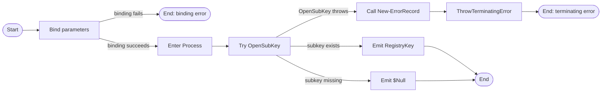

# Get-RegistrySubKey

## Purpose
`Get-RegistrySubKey` is a private registry seam that opens a child subkey from an existing `[Microsoft.Win32.RegistryKey]` in read-only mode and returns the resulting handle or `$Null`. It exists to keep registry access least-privilege and to give discovery code a tiny mockable wrapper instead of calling `RegistryKey.OpenSubKey()` directly throughout the codebase. In the current rewrite, `Get-InstalledApplication` calls it to open both the uninstall parent path and each discovered application subkey.

## Parameters
| Name | Type | Required | Default | Description |
|------|------|----------|---------|-------------|
| `ParentKey` | `[Microsoft.Win32.RegistryKey]` | Yes | None | Parent registry key that the function opens the child subkey from. |
| `Name` | `[System.String]` | Yes | None | Child subkey name or relative path to open beneath `ParentKey`. |

## Return Value
Returns `[Microsoft.Win32.RegistryKey]` when the requested subkey exists and opens successfully. The returned handle is opened read-only. It returns `$Null` when the requested subkey does not exist. If parameter binding fails, or if `OpenSubKey()` throws and the catch block promotes that failure to a terminating error through `New-ErrorRecord` plus `$PSCmdlet.ThrowTerminatingError()`, the function emits no pipeline output.

## Execution Flow

## Error Handling
- Missing required arguments, `$Null` `ParentKey`, empty `Name`, or incompatible argument types cause PowerShell parameter-binding errors before the function body runs.
- A missing subkey is not treated as an error. `RegistryKey.OpenSubKey()` returns `$Null`, and the function emits that `$Null` unchanged.
- Any exception thrown by `OpenSubKey()` is caught and converted into an `ErrorRecord` by `New-ErrorRecord` using exception type `System.InvalidOperationException`, error ID `GetRegistrySubKeyFailed`, category `OpenError`, target object `$Name`, and message `Unable to open subkey '<name>': <inner message>`.
- The function then raises that returned `ErrorRecord` as a terminating error through `$PSCmdlet.ThrowTerminatingError($ErrorRecord)`.
- The current implementation does not preserve the original `OpenSubKey()` exception as an inner exception. `New-ErrorRecord` constructs a fresh `InvalidOperationException` from the formatted message text.
- The function does not call `Write-Warning` or `Write-Error` directly.

## Side Effects
This function has no write side effects. When the subkey exists, it opens and returns a read-only `RegistryKey` handle, and the caller is responsible for disposing that handle.

## Research Log
| Topic | Finding | Source | Date Verified |
|-------|---------|--------|---------------|
| Search: `PowerShell Practice and Style guide` | The community PowerShell Practice and Style guide is still published as a current best-practices baseline for readable, maintainable PowerShell, but it remains guidance rather than an enforceable language rule set. | https://github.com/PoshCode/PowerShellPracticeAndStyle | 2026-04-01 |
| Search: `PSScriptAnalyzer overview` | Microsoft still positions PSScriptAnalyzer as the current static analyzer for PowerShell modules and scripts, with rules based on PowerShell Team and community best practices and support for Windows PowerShell 5.1 or greater. | https://learn.microsoft.com/en-us/powershell/utility-modules/psscriptanalyzer/overview?view=ps-modules | 2026-04-01 |
| Search: `PSScriptAnalyzer what's new` | Current release notes show PSScriptAnalyzer 1.24.0 raised its minimum PowerShell version to 5.1 on 2025-03-18, so current analyzer expectations now assume a 5.1+ baseline. | https://learn.microsoft.com/en-us/powershell/utility-modules/psscriptanalyzer/whats-new-in-pssa?view=ps-modules | 2026-04-01 |
| Search: `AvoidUsingPositionalParameters` | The built-in analyzer rule still recommends full parameter names, but it only warns at three or more positional arguments, which is looser than this repo's house standard. | https://learn.microsoft.com/en-us/powershell/utility-modules/psscriptanalyzer/rules/avoidusingpositionalparameters?view=ps-modules | 2026-04-01 |
| Search: `about_Functions_CmdletBindingAttribute PositionalBinding` | Microsoft documents that `PositionalBinding` defaults to `$true`, so repos that ban positional binding must still set `PositionalBinding = $False` explicitly. | https://learn.microsoft.com/en-us/powershell/module/microsoft.powershell.core/about/about_functions_cmdletbindingattribute?view=powershell-7.5 | 2026-04-01 |
| Search: `comment-based help keywords` | Microsoft still treats `.PARAMETER` and `.EXAMPLE` as first-class comment-based help keywords, so missing examples remain a real help/documentation gap even when the function is otherwise simple. | https://learn.microsoft.com/en-us/powershell/scripting/developer/help/comment-based-help-keywords?view=powershell-7.4 | 2026-04-01 |
| Search: `about_Functions_OutputTypeAttribute` | `OutputType` is still metadata only; Microsoft explicitly documents that the attribute is not derived from or compared against the function's actual runtime output. | https://learn.microsoft.com/en-us/powershell/module/microsoft.powershell.core/about/about_functions_outputtypeattribute?view=powershell-7.5 | 2026-04-01 |
| Search: `about_Return` | PowerShell still returns the result of each statement as output even without `return`, so a single expression on its own line remains a valid pipeline-output pattern for tiny helpers. | https://learn.microsoft.com/en-us/powershell/module/microsoft.powershell.core/about/about_return?view=powershell-7.5 | 2026-04-01 |
| Search: `RegistryKey.OpenSubKey` | Current .NET documentation still lists `RegistryKey.OpenSubKey` as a supported API, documents that missing subkeys return `null`, and confirms that `writable = false` opens the key read-only. The single-argument overload also opens read-only, so the explicit `$False` is redundant but still explicit. | https://learn.microsoft.com/en-us/dotnet/api/microsoft.win32.registrykey.opensubkey?view=net-10.0 | 2026-04-01 |
| Search: `about_Functions_Advanced_Parameters ValidateNotNullOrEmpty` | Current PowerShell guidance still recommends `ValidateNotNullOrEmpty` or `ValidateNotNullOrWhiteSpace` when string parameters must reject empty input, which strengthens the case for fail-fast validation on `Name`. | https://learn.microsoft.com/en-us/powershell/module/microsoft.powershell.core/about/about_functions_advanced_parameters?view=powershell-5.1 | 2026-04-01 |
| Search: `Pester mocking` | Current Pester docs still emphasize that tests can replace the behavior of commands with `Mock`, reinforcing the value of keeping raw registry access behind thin seam functions. | https://pester.dev/docs/quick-start/ | 2026-04-01 |
| Search: `PSScriptAnalyzer 1.24.0 UseCorrectCasing` | Current 1.24.0 release notes say `UseCorrectCasing` now corrects operators, keywords, and commands by default. That strengthens casing-related audit expectations, but it does not change any existing finding for this function because its executable casing is already consistent. | https://learn.microsoft.com/en-us/powershell/utility-modules/psscriptanalyzer/whats-new-in-pssa?view=ps-modules | 2026-04-01 |
| Search: `PowerShell throw catch typed exceptions` | SUPERSEDED on 2026-04-02. Microsoft still documents `throw`/`catch` with typed exceptions as normal PowerShell practice, but this row no longer describes the current implementation because the function no longer uses bare `throw` in its catch path. See the 2026-04-02 `about_Throw` and `ICommandRuntime.ThrowTerminatingError(ErrorRecord)` rows. | https://learn.microsoft.com/en-us/powershell/scripting/learn/deep-dives/everything-about-exceptions?view=powershell-7.5 | 2026-04-01 |
| Search: `RegistryRights enum read key` | Current .NET docs still expose finer-grained registry-rights APIs, but they are optional here. The existing read-only boolean overload remains supported, so this adds nuance rather than changing the previous read-only finding. | https://learn.microsoft.com/en-us/dotnet/api/system.security.accesscontrol.registryrights?view=net-9.0 | 2026-04-01 |
| Search: `about_Throw PowerShell 7.5` | SUPERSEDED on 2026-04-02. Microsoft still documents `throw` as a terminating-error mechanism, but this row's function-specific conclusion is stale because the live source again routes the catch path through `New-ErrorRecord` before calling `$PSCmdlet.ThrowTerminatingError()`. See the newer 2026-04-02 `about_Throw` row. | https://learn.microsoft.com/en-us/powershell/module/microsoft.powershell.core/about/about_throw?view=powershell-7.5 | 2026-04-02 |
| Search: `Cmdlet.ThrowTerminatingError ErrorRecord` | SUPERSEDED on 2026-04-02. The SDK guidance is still current, but this row's finding that the function bypasses `New-ErrorRecord` is no longer true. See the newer 2026-04-02 `ICommandRuntime.ThrowTerminatingError(ErrorRecord)` row. | https://learn.microsoft.com/en-us/dotnet/api/system.management.automation.cmdlet.throwterminatingerror?view=powershellsdk-7.4.0 | 2026-04-02 |
| Search: `RegistryKey.OpenSubKey ObjectDisposedException SecurityException` | Current .NET docs still list `ObjectDisposedException` when the parent key is closed and `SecurityException` when the caller lacks required permissions. This changes the plan/test context: the catch branch is a documented runtime path, and the dedicated disposed-parent test now covers one of those cases. | https://learn.microsoft.com/en-us/dotnet/api/microsoft.win32.registrykey.opensubkey?view=net-10.0 | 2026-04-02 |
| Search: `PowerShell Practice and Style guide current GitBook` | The current guide site still says PowerShell best practices are "always evolving" and the style guide remains in preview, which reinforces treating it as a baseline reference rather than a repository-specific authority. | https://poshcode.gitbook.io/powershell-practice-and-style | 2026-04-02 |
| Search: `about_Throw PowerShell 7.5` | Microsoft still documents `throw` as a terminating-error mechanism, but it does not change the current audit verdict because the live catch path uses `New-ErrorRecord` plus `$PSCmdlet.ThrowTerminatingError()` instead of bare `throw`. | https://learn.microsoft.com/en-us/powershell/module/microsoft.powershell.core/about/about_throw?view=powershell-7.5 | 2026-04-02 |
| Search: `ICommandRuntime.ThrowTerminatingError(ErrorRecord)` | Microsoft still documents `ThrowTerminatingError(ErrorRecord)` as the preferred terminating path when richer `ErrorRecord` metadata is available. Combined with the current source's `New-ErrorRecord` call, the function now matches both the documented PowerShell API pattern and the repo's helper requirement. | https://learn.microsoft.com/en-us/dotnet/api/system.management.automation.icommandruntime.throwterminatingerror?view=powershellsdk-7.4.0 | 2026-04-02 |
| Search: `Pester Mock command` | Official Pester v5 docs still document `Mock`, reinforcing the plan's seam-for-testability pattern and making the direct `Get-RegistrySubKey` mock coverage more authoritative than the earlier quick-start citation alone. | https://pester.dev/docs/commands/mock/ | 2026-04-02 |

## Standards Audit
| Rule | Status | Line(s) | Evidence |
|------|--------|--------|----------|
| Colon-bound parameters | PASS | 71-80 | ``New-ErrorRecord`` is invoked with colon-bound named parameters: ``-ExceptionName:'System.InvalidOperationException'``, ``-ExceptionMessage:(...)``, ``-TargetObject:$Name``, ``-ErrorId:'GetRegistrySubKeyFailed'``, and ``-ErrorCategory:(...)``. |
| PascalCase naming | PASS | 1, 49, 63, 72, 80 | ``Function Get-RegistrySubKey {``, ``[Microsoft.Win32.RegistryKey]``, ``[System.String]``, ``'System.InvalidOperationException'``, and ``[System.Management.Automation.ErrorCategory]::OpenError`` use PascalCase / canonical casing. |
| Full .NET type names (no accelerators) | PASS | 36, 49, 63, 80 | ``[OutputType([Microsoft.Win32.RegistryKey])]``, ``[Microsoft.Win32.RegistryKey]``, ``[System.String]``, and ``[System.Management.Automation.ErrorCategory]::OpenError`` use full .NET type names. |
| Object types are the MOST appropriate and specific choice | PASS | 36, 49, 63 | ``[Microsoft.Win32.RegistryKey]`` is the specific registry-handle type for `ParentKey` and output metadata, and ``[System.String]`` is the correct scalar type for `Name`. |
| Single quotes for non-interpolated strings | PASS | 28-30, 42, 56, 72, 74, 79 | ``ConfirmImpact = 'None'``, ``HelpURI = ''``, ``HelpMessage = 'See function help.'``, ``-ExceptionName:'System.InvalidOperationException'``, ``'Unable to open subkey ''{0}'': {1}'``, and ``-ErrorId:'GetRegistrySubKeyFailed'`` all use single-quoted strings. |
| `$PSItem` not `$_` | PASS | 76 | The catch block uses ``$PSItem.Exception.Message`` and never references ``$_``. |
| Explicit bool comparisons (`$Var -eq $True`) | N/A | 67-83 | The function contains no Boolean comparison expressions. ``$False`` is passed as a literal argument to ``OpenSubKey()``, not compared. |
| If conditions are pre-evaluated outside `If` blocks | N/A | 67-83 | The function contains no `If` blocks. |
| `$Null` on left side of comparisons | N/A | 67-83 | The function contains no null comparisons. |
| No positional arguments to cmdlets | PASS | 71-80 | ``New-ErrorRecord`` uses named parameters throughout: ``-ExceptionName:``, ``-ExceptionMessage:``, ``-TargetObject:``, ``-ErrorId:``, and ``-ErrorCategory:``. |
| No cmdlet aliases | PASS | 71-81 | The only command invocation in the catch path is the full helper name ``New-ErrorRecord``; ``$ParentKey.OpenSubKey(...)`` and ``$PSCmdlet.ThrowTerminatingError(...)`` are method calls, not aliases. |
| Switch parameters correctly handled | N/A | 37-83 | The function defines no switch parameters and invokes no switch-bearing cmdlets. |
| CmdletBinding with all required properties | PASS | 27-35 | ``[CmdletBinding(`` includes explicit ``ConfirmImpact = 'None'``, ``DefaultParameterSetName = 'Default'``, ``HelpURI = ''``, ``PositionalBinding = $False``, ``RemotingCapability = 'None'``, ``SupportsPaging = $False``, and ``SupportsShouldProcess = $False``. |
| Leading commas in attributes | FAIL | 27-35, 38-60 | The house style requires each attribute-property line to begin with a comma, but the source uses ``ConfirmImpact = 'None'`` and ``Mandatory = $True,`` instead of ``, ConfirmImpact = 'None'`` and ``, Mandatory = $True``. |
| OutputType declared | PASS | 36 | ``[OutputType([Microsoft.Win32.RegistryKey])]`` is present directly above the `Param()` block. |
| Comment-based help is complete | PASS | 3-24 | The help block contains ``.SYNOPSIS``, ``.DESCRIPTION``, ``.PARAMETER ParentKey``, ``.PARAMETER Name``, ``.EXAMPLE``, ``.OUTPUTS``, and ``.NOTES``. |
| Parameter validation at the boundary | PASS | 48-63 | ``[ValidateNotNull()]`` guards `ParentKey` and ``[ValidateNotNullOrEmpty()]`` guards `Name` before the function body runs. |
| `[Parameter()]` attributes list all properties explicitly | PASS | 38-60 | Each parameter attribute explicitly lists ``Mandatory``, ``ParameterSetName``, ``DontShow``, ``HelpMessage``, ``Position``, ``ValueFromPipeline``, ``ValueFromPipelineByPropertyName``, and ``ValueFromRemainingArguments``. |
| Error handling via `New-ErrorRecord` or appropriate pattern | PASS | 70-81 | The catch block calls ``New-ErrorRecord`` to build the terminating ``ErrorRecord`` and then raises it with ``$PSCmdlet.ThrowTerminatingError($ErrorRecord)``. |
| Try/Catch around operations that can fail | PASS | 68-82 | The registry open is wrapped in ``Try { $ParentKey.OpenSubKey($Name, $False) } Catch { ... }``. |
| Write-Debug at Begin/Process/End block entry and exit (if blocks are used) | FAIL | 67-83 | ``Process {`` is present, but there are no ``Write-Debug`` statements anywhere in the function. |
| No variable pollution (no `script:` or `global:` scope leaks) | PASS | 37-83 | The function contains only parameter declarations, a `Process` block, a `Try/Catch`, and a local ``$ErrorRecord`` variable; there are no ``$script:...`` or ``$global:...`` assignments. |
| 96-character line limit | PASS | 1-84 | A local scan of the file found ``MAXLEN=80``, and representative lines such as ``$ParentKey.OpenSubKey($Name, $False)`` remain below the 96-character limit. |
| 2-space indentation (not tabs, not 4-space) | PASS | 27-83 | Representative lines such as ``  [CmdletBinding(``, ``  Process {``, ``    Try {``, and ``      $ParentKey.OpenSubKey($Name, $False)`` use 2-space indentation, and a local scan found ``TAB_LINES=`` empty. |
| OTBS brace style | PASS | 1, 67, 68, 70, 84 | ``Function Get-RegistrySubKey {``, ``Process {``, ``Try {``, and ``} Catch {`` follow OTBS, and the closing brace stands alone on line 84. |
| No commented-out code | PASS | 2-25 | ``<# ... #>`` is active comment-based help; there are no disabled executable statements. |
| Registry access is read-only | PASS | 69 | ``$ParentKey.OpenSubKey($Name, $False)`` explicitly requests a read-only handle. |
| Approved verb naming | PASS | 1 | ``Function Get-RegistrySubKey {`` uses the approved `Get` verb for a read-only retrieval seam. |
| `Param()` block present | PASS | 37 | ``Param (`` is present and declares the function parameters explicitly. |
| `#Requires -Version 5.1` | REVIEW | 1-84 | The file begins with ``Function Get-RegistrySubKey {`` and contains no `#Requires`; the standards text is script-oriented, while this repo stores dot-sourced helper functions in standalone `.ps1` files. |

Research notes:
1. Current PoshCode guidance still describes community PowerShell best practices as evolving and its style guide as preview, so this audit continues to treat the repo standard as authoritative where they differ.
2. Current .NET documentation still shows that `OpenSubKey(String)` already opens a subkey read-only, so the explicit `$False` is redundant from an API perspective. It still satisfies the repo's "explicit over implicit" and least-privilege preferences.
3. Current .NET documentation also lists disposed-key and permission failures for `OpenSubKey`, so the helper's catch path is tied to documented API behavior rather than defensive speculation.
4. Current PSScriptAnalyzer defaults remain looser than this repo in at least one relevant place: `PSAvoidUsingPositionalParameters` still is not a full substitute for the house "named parameters only" rule.
5. Current PowerShell SDK guidance still prefers `ThrowTerminatingError(ErrorRecord)` when richer error metadata is needed, and the live source now pairs that documented API with the repo's required `New-ErrorRecord` helper instead of bypassing it.

## Plan Audit
| Plan Section | Requirement | Status | Line(s) | Details |
|--------------|-------------|--------|--------|---------|
| 12. File Structure | `Get-RegistrySubKey.ps1` must live under `src/Private/`. | ALIGNED | `src/Private/Get-RegistrySubKey.ps1:1-84` | The function exists in the planned private-helper location and is not implemented as a public entrypoint. |
| 2. Frozen Product Decisions; 12. External Seams | `External dependencies must be wrapped behind private seam functions so tests can mock them reliably.` | ALIGNED | `src/Private/Get-RegistrySubKey.ps1:6-8,67-83`; `src/Private/Get-InstalledApplication.ps1:147-153,164-166`; `tests/Private/Get-InstalledApplication.Tests.ps1:65-76,115-120` | The help text explicitly describes a thin seam, `Get-InstalledApplication` uses it for both parent and child opens, and higher-level discovery tests mock it directly. That means the function is justified by the plan rather than being overengineering. |
| 12. External Seams | `Get-RegistrySubKey` exists primarily for testability and must stay thin. | ALIGNED | `src/Private/Get-RegistrySubKey.ps1:67-83` | The executable body still contains one registry-open call plus a small exception-wrapper path. It adds no discovery, filtering, or normalization logic. |
| 15. Phase 1 Acceptance | `no business logic is buried in a seam function` | ALIGNED | `src/Private/Get-RegistrySubKey.ps1:67-83` | The function only opens a subkey, returns the raw handle or `$Null`, and wraps failures. Discovery policy remains in `Get-InstalledApplication`. |
| 3. Goals; 7.1 Search Locations; 14.3 Discovery Tests; 15. Phase 3 Acceptance | `Keep registry access read-only`; `All registry opens must be read-only`; `every registry open is read-only`; `all registry access is read-only`. | ALIGNED | `src/Private/Get-RegistrySubKey.ps1:69`; `tests/Private/Get-RegistrySubKey.Tests.ps1:57-63` | The implementation explicitly passes `$False` to `OpenSubKey`, and the dedicated seam test verifies that the returned handle cannot create a child key. |
| 15. Phase 1 Acceptance | `wrappers are tiny` | ALIGNED | `src/Private/Get-RegistrySubKey.ps1:27-83` | Aside from metadata and parameter declarations, the body is a single `OpenSubKey` attempt with a small exception-wrapper path. |
| 15. Phase 1 Acceptance | `wrappers have focused tests` | ALIGNED | `tests/Private/Get-RegistrySubKey.Tests.ps1:7-84` | The dedicated test file stays focused on this seam's metadata, existing-key success, missing-key `$Null`, read-only behavior, and disposed-parent failure handling. |
| 3. Goals | `Ensure every high-risk branch has direct tests.` | ALIGNED | `src/Private/Get-RegistrySubKey.ps1:68-81`; `tests/Private/Get-RegistrySubKey.Tests.ps1:41-80` | The success path is covered by the existing-key and missing-key tests, and the catch branch is covered by the disposed-parent-key test that asserts an `InvalidOperationException`. |
| 7.7 Read Failures | `If a registry hive, parent key, or subkey cannot be read, discovery should warn and continue.` | N/A | `src/Private/Get-RegistrySubKey.ps1:68-81`; `src/Private/Get-InstalledApplication.ps1:315-325,335-345` | This seam opens a subkey and throws on failure. The warning-and-continue behavior belongs to the discovery caller, which catches these failures and emits warnings. |
| 4.4 No Interactivity | `The script must not prompt.` Specifically: `no SupportsShouldProcess`; `no ConfirmImpact`. | REVIEW | `src/Private/Get-RegistrySubKey.ps1:27-35` | The function sets `SupportsShouldProcess = $False`, so it cannot prompt through ShouldProcess. However, it still declares `ConfirmImpact = 'None'`, which is behaviorally inert here but textually at odds with the plan's `no ConfirmImpact` wording. |
| 4.3 Exit Codes; 5. Internal Data Model | Exit-code and record-shape rules belong to the script/orchestrator and record-construction layers. | N/A | `src/Private/Get-RegistrySubKey.ps1:37-83` | This helper returns only a `RegistryKey` handle or `$Null`; it does not emit PDQ lines, construct application/result records, or own script exit behavior. |

## Changelog

| Date | Changes |
|------|---------|
| 2026-04-02 | Corrected materially stale audit drift after the live source switched back to the repo's `New-ErrorRecord` helper. Updated the execution-flow and error-handling sections to describe the real catch path, removed the false claim that the original `OpenSubKey()` exception is preserved as an inner exception, superseded the stale `about_Throw` / `ThrowTerminatingError` research rows, added fresh official research on the PowerShell Practice and Style guide site and the Pester `Mock` command, changed `Colon-bound parameters`, `No positional arguments to cmdlets`, `No cmdlet aliases`, and `Error handling via New-ErrorRecord or appropriate pattern` from stale `N/A` / `FAIL` verdicts to PASS, and corrected `Write-Debug at Begin/Process/End block entry and exit` from false `N/A` to FAIL because the function does have a `Process` block. |
| 2026-04-02 | Corrected stale audit drift after the function's catch path changed from a bare `throw` explanation to direct `ErrorRecord` construction plus `$PSCmdlet.ThrowTerminatingError()`, and after the dedicated test file gained explicit disposed-parent failure coverage. Refreshed the research log with current `about_Throw`, `ThrowTerminatingError`, and documented `OpenSubKey` exception guidance; marked the old throw-specific research row as superseded; flipped the false `[Parameter()]` standards failure to PASS; replaced the old error-handling evidence with the remaining repo-specific `New-ErrorRecord` gap; flipped the false plan deviation on the untested catch branch to ALIGNED; and added the missed plan check that no business logic is buried in this seam. |
| 2026-04-01 | Corrected stale audit drift after the function gained explicit `CmdletBinding` metadata, boundary validation, an `.EXAMPLE`, and a `Try/Catch` that wraps failures in `InvalidOperationException`. Refreshed the research log with current exception, casing, and registry-rights guidance; flipped the now-false standards findings to PASS; added missed standards gaps for leading commas and explicit `[Parameter()]` property lists; and added a new plan finding for the untested catch branch plus a review note about `ConfirmImpact = 'None'`. |
| 2026-04-01 | First audit run. Added the initial README with function documentation, execution flow, current web research log, standards audit, plan audit, and changelog tracking. |
AUDIT_STATUS:UPDATED