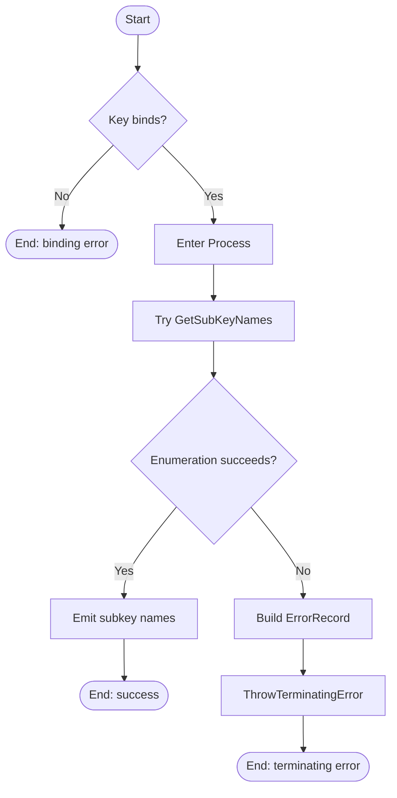

# Get-RegistrySubKeyNames

## Research Log

| Topic | Finding | Source | Date Verified |
|------|---------|--------|---------------|
| Search: `PowerShell Practice and Style code layout and formatting` | New baseline. The guide still recommends OTBS, `CmdletBinding()`, and PascalCase for public identifiers, but it also explicitly says project-specific rules take precedence. It still recommends four-space indentation and lower-case language keywords, which differs from this repo's house style.[1] | https://poshcode.gitbook.io/powershell-practice-and-style/style-guide/code-layout-and-formatting | 2026-04-01 |
| Search: `PSScriptAnalyzer rules catalog` | New baseline. The current rules list still includes `AvoidUsingPositionalParameters`, `AvoidUsingCmdletAliases`, `ProvideCommentHelp`, `UseApprovedVerbs`, `UseBOMForUnicodeEncodedFile`, and `UseOutputTypeCorrectly`. It also now lists newer rules such as `AvoidReservedWordsAsFunctionNames`, `UseConsistentParametersKind`, `UseConsistentParameterSetName`, and `UseSingleValueFromPipelineParameter`. | https://learn.microsoft.com/en-us/powershell/utility-modules/psscriptanalyzer/rules/readme?view=ps-modules | 2026-04-01 |
| Search: `PSScriptAnalyzer releases latest` | SUPERSEDED on 2026-04-02. The previous README recorded 1.25.0 as the latest public release, but current official sources now surface 1.24.0 as the latest documented release. See the new 2026-04-02 row below. | https://github.com/powershell/psscriptanalyzer/releases | 2026-04-01 |
| Search: `UseApprovedVerbs` | New baseline. PSScriptAnalyzer still requires approved verbs and still directs authors to `Get-Verb`. `Get` remains current, so the function name is not outdated. | https://learn.microsoft.com/en-us/powershell/utility-modules/psscriptanalyzer/rules/useapprovedverbs?view=ps-modules | 2026-04-01 |
| Search: `about_Functions_CmdletBindingAttribute` | New baseline. `CmdletBinding` remains the current advanced-function model, and `PositionalBinding` still defaults to `$true` unless it is disabled explicitly. That makes the repo's `PositionalBinding = $False` rule a stricter local standard, not a platform change.[2] | https://learn.microsoft.com/en-us/powershell/module/microsoft.powershell.core/about/about_functions_cmdletbindingattribute?view=powershell-7.5 | 2026-04-01 |
| Search: `about_Functions_Advanced_Parameters ValidateNotNull` | New baseline. Built-in validation attributes such as `ValidateNotNull`, `ValidateNotNullOrEmpty`, and `ValidateNotNullOrWhiteSpace` remain the current fail-fast parameter-validation pattern. This does not supersede any prior finding here because PowerShell already rejects `-Key:$null` during binding for this mandatory typed parameter. | https://learn.microsoft.com/en-us/powershell/module/microsoft.powershell.core/about/about_functions_advanced_parameters?view=powershell-7.6 | 2026-04-01 |
| Search: `RegistryKey.GetSubKeyNames` | SUPERSEDED on 2026-04-01. The prior run correctly noted that `RegistryKey.GetSubKeyNames()` returns only immediate child names and documents registry/security failure modes, but it incorrectly tied those API exceptions to this seam's direct bubble-up behavior. The current implementation now catches method failures and wraps them. | https://learn.microsoft.com/en-us/dotnet/api/microsoft.win32.registrykey.getsubkeynames?view=net-9.0 | 2026-04-01 |
| Search: `RegistryKey.GetSubKeyNames` | SUPERSEDED on 2026-04-02. The API exception list remains current, but the previous README's claim that this function preserved the original registry failure in an inner-exception chain is no longer correct for the current implementation. See the new 2026-04-02 row below.[3] | https://learn.microsoft.com/en-us/dotnet/api/microsoft.win32.registrykey.getsubkeynames?view=net-9.0 | 2026-04-01 |
| Search: `RegistryKey class security` | New baseline. `RegistryKey` remains a current sealed `IDisposable` type with no deprecation found. Microsoft still warns not to store security data in the registry and not to expose `RegistryKey` objects in a way that could enable unbounded subkey creation. | https://learn.microsoft.com/en-us/dotnet/api/microsoft.win32.registrykey?view=net-10.0 | 2026-04-01 |
| Search: `RegistryKey.OpenSubKey read-only` | New baseline. `OpenSubKey(String)` still opens subkeys read-only, and the `Boolean` overload only requests write access when `writable` is `$true`. That confirms the plan's read-only-open requirement is still current for the seam functions that acquire registry handles. | https://learn.microsoft.com/en-us/dotnet/api/microsoft.win32.registrykey.opensubkey?view=net-9.0 | 2026-04-01 |
| Search: `about_Return` | New baseline. PowerShell still returns the result of each statement even without `return`, and collections are still unrolled one item at a time on the pipeline. For this function, that means the underlying `string[]` becomes pipeline `string` items unless the caller captures the result. | https://learn.microsoft.com/en-us/powershell/module/microsoft.powershell.core/about/about_return?view=powershell-7.5 | 2026-04-01 |
| Search: `about_Functions_OutputTypeAttribute` | New baseline. `OutputType` is still documentation metadata only and is not checked against actual runtime output. That matters here because `[OutputType([System.String[]])]` describes the intended result shape, but callers still observe normal PowerShell array enumeration behavior. | https://learn.microsoft.com/en-us/powershell/module/microsoft.powershell.core/about/about_functions_outputtypeattribute?view=powershell-7.5 | 2026-04-01 |
| Search: `about_Try_Catch_Finally` | New baseline. `try`/`catch` remains the current PowerShell mechanism for handling terminating errors. This changes the previous audit's factual claim that the function had no structured error handling: the current source does wrap the registry method call in `Try/Catch`. | https://learn.microsoft.com/en-us/powershell/module/microsoft.powershell.core/about/about_try_catch_finally?view=powershell-7.6 | 2026-04-01 |
| Search: `about_Throw` | New baseline. `throw` still raises a terminating error. That means the repo's historical throw-based pattern remains platform-valid even though this function no longer uses it and the house style prefers `New-ErrorRecord` with `$PSCmdlet.ThrowTerminatingError(...)`.[4] | https://learn.microsoft.com/en-us/powershell/module/microsoft.powershell.core/about/about_throw?view=powershell-7.5 | 2026-04-01 |
| Search: `RegistryKey.GetSubKeyNames .NET API deprecation security advisory 2026` | Re-verified. No deprecation or security advisory found for `RegistryKey.GetSubKeyNames()`. The method is documented through .NET 10.0 with no breaking changes. | https://learn.microsoft.com/en-us/dotnet/api/microsoft.win32.registrykey.getsubkeynames?view=net-10.0 | 2026-04-02 |
| Search: `RegistryKey class .NET 10 sealed IDisposable` | Re-verified. `RegistryKey` remains a current sealed `IDisposable` type in .NET 10.0 with no deprecation. Consistent with the 2026-04-01 finding. | https://learn.microsoft.com/en-us/dotnet/api/microsoft.win32.registrykey?view=net-10.0 | 2026-04-02 |
| Search: `PowerShell about_Throw terminating error 2026` | Re-verified. `throw` still raises a terminating error. The `about_Throw` page was last updated 2026-01-18 with no behavioral changes. Consistent with the 2026-04-01 finding. | https://learn.microsoft.com/en-us/powershell/module/microsoft.powershell.core/about/about_throw?view=powershell-7.5 | 2026-04-02 |
| Search: `about_Functions_Advanced_Parameters ValidateNotNull 2026` | Re-verified. `ValidateNotNull` remains the current fail-fast validation attribute. The `about_Functions_Advanced_Parameters` page was last updated 2026-01-18 with no changes affecting this function. Consistent with the 2026-04-01 finding. | https://learn.microsoft.com/en-us/powershell/module/microsoft.powershell.core/about/about_functions_advanced_parameters?view=powershell-7.5 | 2026-04-02 |
| Search: `PowerShell Practice and Style guide code layout formatting 2026` | Re-verified. The PoshCode guide still recommends OTBS, `CmdletBinding()`, PascalCase, and four-space indentation. Still explicitly defers to project-specific rules. No changes since the 2026-04-01 finding. | https://poshcode.gitbook.io/powershell-practice-and-style/style-guide/code-layout-and-formatting | 2026-04-02 |
| Search: `PSScriptAnalyzer latest release 2026` | SUPERSEDED on 2026-04-02. The prior re-verification repeated the unsupported 1.25.0 release assumption. See the corrected 2026-04-02 row below. | https://github.com/powershell/psscriptanalyzer/releases | 2026-04-02 |
| Search: `about_Functions_Advanced_Parameters Position PositionalBinding` | SUPERSEDED on 2026-04-02. The PowerShell behavior is still current, but the function no longer sets `Position = 0`; unnamed `Key` input is no longer accepted. See the new 2026-04-02 row below.[6] | https://learn.microsoft.com/en-us/powershell/module/microsoft.powershell.core/about/about_functions_advanced_parameters?view=powershell-7.6 | 2026-04-02 |
| Search: `about_Functions_CmdletBindingAttribute ConfirmImpact SupportsShouldProcess` | New baseline. Microsoft still documents `ConfirmImpact` as something to specify only when `SupportsShouldProcess` is also specified. That conflicts with this repo's house style, which requires all `CmdletBinding` properties to be listed explicitly, so the audit continues against the house style and notes the discrepancy.[2] | https://learn.microsoft.com/en-us/powershell/module/microsoft.powershell.core/about/about_functions_cmdletbindingattribute?view=powershell-7.5 | 2026-04-02 |
| Search: `What's new in PSScriptAnalyzer 2026` | New baseline. The current official "What's new in PSScriptAnalyzer" page still tops out at 1.24.0 and documents that `UseSingularNouns` became configurable in 1.24.0. This supersedes the previous README's unsupported 1.25.0 release claims and matters here because the function name triggers that rule.[7] | https://learn.microsoft.com/en-us/powershell/utility-modules/psscriptanalyzer/whats-new-in-pssa?view=ps-modules | 2026-04-02 |
| Search: `PSUseSingularNouns PSScriptAnalyzer` | New baseline. `PSUseSingularNouns` remains a warning-level rule and still says cmdlets should use singular nouns. Combined with a local analyzer run under this repo's settings, this changes the standards audit because `Get-RegistrySubKeyNames` currently produces a real analyzer warning.[7] | https://learn.microsoft.com/en-us/powershell/utility-modules/psscriptanalyzer/rules/usesingularnouns?view=ps-modules | 2026-04-02 |
| Search: `System.Management.Automation.Cmdlet.ThrowTerminatingError docs` | New baseline. Microsoft still documents `ThrowTerminatingError(ErrorRecord)` as the supported terminating-error mechanism for cmdlets and advanced functions. That aligns with the current implementation's `New-ErrorRecord` + `$PSCmdlet.ThrowTerminatingError(...)` pattern and supersedes the previous throw-based interpretation.[4] | https://learn.microsoft.com/en-us/dotnet/api/system.management.automation.cmdlet.throwterminatingerror?view=powershellsdk-7.4.0 | 2026-04-02 |
| Search: `RegistryKey.GetSubKeyNames SecurityException UnauthorizedAccessException net 10` | New baseline. `RegistryKey.GetSubKeyNames()` still returns only immediate child names and still documents registry and security failure modes. In the current implementation those failures are caught and reported as a new `InvalidOperationException` ErrorRecord with category `ReadError`; direct local probing showed the original registry exception is no longer preserved as `InnerException`.[3] | https://learn.microsoft.com/en-us/dotnet/api/microsoft.win32.registrykey.getsubkeynames?view=net-10.0 | 2026-04-02 |
| Search: `about_Functions_Advanced_Parameters Position argument makes parameter name optional` | New baseline. `Position` still makes parameter names optional, but the current source no longer declares `Position` for `Key`. Combined with `PositionalBinding = $False`, unnamed calls are now rejected, which changes the coding-standards audit back to PASS for named-only binding.[6] | https://learn.microsoft.com/en-us/powershell/module/microsoft.powershell.core/about/about_functions_advanced_parameters?view=powershell-7.6 | 2026-04-02 |

## Purpose

`Get-RegistrySubKeyNames` is a private registry seam that enumerates the immediate child-key names beneath a supplied `Microsoft.Win32.RegistryKey`. In this rewrite, `Get-InstalledApplication` and `Get-LoadedUserRegistrySid` call it when they need to enumerate uninstall-entry or loaded-user-hive subkeys. It exists so those callers can mock registry-name enumeration in tests, and the current implementation also normalizes enumeration failures into a consistent terminating `ErrorRecord`.

## Parameters

| Name | Type | Required | Default | Description |
|------|------|----------|---------|-------------|
| `Key` | `[Microsoft.Win32.RegistryKey]` | Yes | N/A | The already-open registry key whose immediate subkey names should be enumerated. Parameter binding rejects `$null` before the body runs, and unnamed positional arguments are currently rejected because the function disables positional binding and does not declare `Position`. |

## Return Value

The underlying .NET method returns a `[System.String[]]` containing the names of the current key's immediate subkeys. PowerShell writes that array to the success pipeline as individual `[System.String]` items, so a plain assignment such as `$Names = Get-RegistrySubKeyNames -Key:$BaseKey` re-aggregates those items into a `System.Object[]` whose elements are strings; callers that require a typed string array must cast or assign into a `[System.String[]]` variable. If the key has no subkeys, the method returns an empty array and the function emits no success output. The function never intentionally returns `$Null`; parameter-binding failures and enumeration failures terminate instead.

## Execution Flow

## Error Handling

- Missing `-Key`: PowerShell raises a `ParameterBindingException` before the body runs because the parameter is mandatory.
- `-Key:$null`: PowerShell raises a `ParameterBindingValidationException` before line 49 executes because the parameter is decorated with `[ValidateNotNull()]`.
- Unnamed first argument: PowerShell raises a `ParameterBindingException` with `PositionalParameterNotFound` because the function disables positional binding and does not declare `Position`.
- Successful enumeration: the function emits zero or more subkey names and produces no warning or error output.
- Registry method failure: the `Try/Catch` on lines 50-63 catches the method invocation failure, creates an `ErrorRecord` through `New-ErrorRecord`, and calls `$PSCmdlet.ThrowTerminatingError($ErrorRecord)`. The surfaced terminating error has exception type `System.InvalidOperationException`, message prefix `Unable to enumerate subkey names:`, error id `GetRegistrySubKeyNamesFailed`, category `ReadError`, and target object `$Key`. Direct local probing showed that the original registry exception is no longer preserved as `InnerException`; it survives only in the formatted message text.[3]
- The function does not call `Write-Warning` or `Write-Error` directly.

## Side Effects

This function has no side effects. It reads registry metadata through the supplied key and does not create, modify, close, or dispose registry handles.

## Coding Standards Audit

| Rule | Status | Line(s) | Evidence |
|------|--------|--------|----------|
| Colon-bound parameters | PASS | 53-61 | The `New-ErrorRecord` call uses colon-bound named arguments throughout, for example `-ExceptionName:'System.InvalidOperationException'`, `-TargetObject:$Key`, and `-ErrorCategory:([System.Management.Automation.ErrorCategory]::ReadError)`. |
| PascalCase naming | PASS | 1, 24-25, 33-35, 49-52 | `Function Get-RegistrySubKeyNames {`, `[CmdletBinding(`, `[OutputType([System.String[]])]`, `Param (`, `Process {`, `Try {`, and `} Catch {` all follow PascalCase house style. |
| Full .NET type names (no accelerators) | PASS | 33, 45, 61 | `[OutputType([System.String[]])]`, `[Microsoft.Win32.RegistryKey]`, and `([System.Management.Automation.ErrorCategory]::ReadError)` use full .NET type names rather than accelerators. |
| Object types are the MOST appropriate and specific choice | PASS | 33, 45, 54, 61 | `[Microsoft.Win32.RegistryKey]` requires the exact registry-handle type, `[System.String[]]` documents the intended logical result shape, and `-ExceptionName:'System.InvalidOperationException'` with `ReadError` is more specific than a generic exception/category pair. |
| Single quotes for non-interpolated strings | PASS | 25-31, 39, 54, 56, 60 | The source uses single-quoted literals such as `ConfirmImpact = 'None'`, `HelpMessage = 'See function help.'`, `-ExceptionName:'System.InvalidOperationException'`, and `'Unable to enumerate subkey names: {0}' -f`. |
| `$PSItem` not `$_` | PASS | 57 | The catch block uses `$PSItem.Exception.Message`, and `$_` does not appear in the file. |
| Explicit bool comparisons (`$Var -eq $True`, not just `$Var`) | N/A | N/A | The function has no boolean conditions. |
| If conditions are pre-evaluated outside If blocks | N/A | N/A | The function has no `If`, `ElseIf`, or `Else` blocks. |
| `$Null` on left side of comparisons | N/A | N/A | The function performs no null comparisons. |
| No positional arguments to cmdlets | PASS | 53-61 | The function's only cmdlet/function invocation in the executable body is `New-ErrorRecord`, and every supplied argument is named. |
| No cmdlet aliases | PASS | 49-62 | The executable body uses `$Key.GetSubKeyNames()`, `New-ErrorRecord`, and `$PSCmdlet.ThrowTerminatingError(...)`; no aliases appear. |
| Switch parameters correctly handled | N/A | N/A | The function declares no switch parameters and invokes none. |
| Named parameters only | PASS | 24-28, 35-43 | `[CmdletBinding(` includes `PositionalBinding = $False`, and the `[Parameter()]` block lists `Mandatory`, `ParameterSetName`, `DontShow`, `HelpMessage`, `ValueFromPipeline`, `ValueFromPipelineByPropertyName`, and `ValueFromRemainingArguments` but no `Position = ...`, so the current metadata does not allow unnamed binding.[6] |
| CmdletBinding with all required properties | PASS | 24-32 | `[CmdletBinding( ConfirmImpact = 'None', DefaultParameterSetName = 'Default', HelpURI = '', PositionalBinding = $False, RemotingCapability = 'None', SupportsPaging = $False, SupportsShouldProcess = $False )]` explicitly lists the property set required by the house style.[2] |
| OutputType declared | PASS | 33 | `[OutputType([System.String[]])]` is present. |
| Comment-based help is complete (Synopsis, Description, Parameter, Example, Outputs, Notes) | PASS | 2-22 | The help block includes `.SYNOPSIS`, `.DESCRIPTION`, `.PARAMETER Key`, `.EXAMPLE`, `.OUTPUTS`, and `.NOTES`. |
| Error handling via New-ErrorRecord or appropriate pattern | PASS | 50-62 | The catch path is `Catch { $ErrorRecord = New-ErrorRecord ...; $PSCmdlet.ThrowTerminatingError($ErrorRecord) }`, which matches the house standard's preferred pattern.[4] |
| Try/Catch around operations that can fail | PASS | 50-63 | `Try { $Key.GetSubKeyNames() } Catch { ... }` wraps the documented failure point.[3] |
| Write-Debug at Begin/Process/End block entry and exit (if blocks are used) | FAIL | 49-64 | The function uses `Process { ... }` but contains no `Write-Debug -Message:'[Get-RegistrySubKeyNames] Entering Block: Process'` or matching leave message anywhere in the block. |
| No variable pollution (no `script:` or `global:` scope leaks) | PASS | 46, 53-62 | The function uses only local `$Key` and `$ErrorRecord` variables plus automatic `$PSItem` / `$PSCmdlet`; no `script:` or `global:` qualifiers appear. |
| 96-character line limit | PASS | 61 | Mechanical scan found `MaxLineLength=80`, and the longest line is `-ErrorCategory:([System.Management.Automation.ErrorCategory]::ReadError)`. |
| 2-space indentation (not tabs, not 4-space) | PASS | 24-25, 35-36, 49-50 | Representative lines use two-space indentation, for example `  [CmdletBinding(`, `    ConfirmImpact = 'None',`, `  Process {`, and `    Try {`; a tab scan found no tab characters. |
| OTBS brace style | PASS | 1, 49-52, 65 | `Function Get-RegistrySubKeyNames {`, `Process {`, `Try {`, and `} Catch {` follow OTBS, and the closing brace is alone on line 65. |
| No commented-out code | PASS | 2-22, 24-64 | The only comments are comment-based help. Executable code begins at `[CmdletBinding(` on line 24, and there are no disabled statements. |
| Registry access is read-only (if applicable) | N/A | N/A | This wrapper does not open registry keys and therefore cannot choose read-only versus writable access; it only reads subkey names from the provided `RegistryKey`. |
| Approved verb | PASS | 1 | `Function Get-RegistrySubKeyNames {` uses `Get`, which remains an approved PowerShell verb. |
| PSScriptAnalyzer zero warnings/errors | FAIL | 1 | `Function Get-RegistrySubKeyNames {` currently triggers `PSUseSingularNouns`; `Invoke-ScriptAnalyzer -Path 'src\Private\Get-RegistrySubKeyNames.ps1' -Settings 'PSScriptAnalyzerSettings.psd1'` returned `Warning Line 1 The cmdlet 'Get-RegistrySubKeyNames' uses a plural noun.`[7] |
| Leading commas in attributes | FAIL | 24-32, 35-43 | `[CmdletBinding(` uses trailing commas such as `ConfirmImpact = 'None',`, and the first `[Parameter()]` property line is `Mandatory = $True` rather than a leading-comma line as required by the house style.[5] |
| `[Parameter()]` properties listed explicitly | FAIL | 35-43 | The `[Parameter()]` block explicitly lists `Mandatory`, `ParameterSetName`, `DontShow`, `HelpMessage`, `ValueFromPipeline`, `ValueFromPipelineByPropertyName`, and `ValueFromRemainingArguments`, but it omits an explicit `Position = ...` property even though the house standard says every `[Parameter()]` property must be stated. |
| Localized string data used for user-facing errors and warnings | FAIL | 55-57 | The error text is inline: `'Unable to enumerate subkey names: {0}' -f $PSItem.Exception.Message`, and the function contains no `Import-LocalizedData` block or companion `Get-RegistrySubKeyNames.strings.psd1` file. |
| UTF-8 with BOM for PS 5.1-targeted `.ps1` files | PASS | 1 (byte header) | Byte inspection shows the file starts with `EF BB BF 46` (`UTF-8 BOM` + `Function`), so the `.ps1` satisfies the repository's BOM requirement. |

[1] The current PowerShell Practice and Style guide is still evolving and still says project-specific rules take precedence. This audit therefore follows the repository's stricter two-space indentation and PascalCase keyword casing where the two guides differ.

[2] Current Microsoft documentation still supports shorthand `[CmdletBinding()]`, defaults `PositionalBinding` to `$True`, and says `ConfirmImpact` should normally be specified only when `SupportsShouldProcess` is also specified. The repository standard is stricter in a different direction because it requires an explicit property list even for read-only helpers, so this audit follows the house standard as written.

[3] The .NET API still documents that `RegistryKey.GetSubKeyNames()` returns only immediate child names and can throw `SecurityException`, `ObjectDisposedException`, `UnauthorizedAccessException`, and `IOException`. In the current implementation those failures are caught, converted into a new `InvalidOperationException` `ErrorRecord`, and re-raised through `$PSCmdlet.ThrowTerminatingError(...)`; the statement about the missing `InnerException` is based on direct local smoke verification.

[4] Microsoft still documents `ThrowTerminatingError(ErrorRecord)` as the supported terminating-error mechanism for cmdlets and advanced functions. The method itself throws a `PipelineStoppedException` internally, but PowerShell callers of this helper observe the supplied `ErrorRecord` with its `InvalidOperationException`; that caller-observable detail is an inference from the SDK docs plus local smoke verification.

[5] The house style (section 1.4, "Leading Commas in Attributes") requires every property line in `[CmdletBinding()]` and `[Parameter()]` to begin with a leading comma, with the first line being a blank comma. This allows any individual property line to be commented out without breaking the attribute syntax. The source currently uses a mixed conventional style instead.

[6] Current Microsoft docs still say the `Position` argument makes parameter names optional and takes precedence over `CmdletBinding(PositionalBinding = $False)`. The current source no longer sets `Position` for `Key`, and a direct local smoke test confirmed unnamed binding now fails with `PositionalParameterNotFound`.

[7] Current PSScriptAnalyzer guidance still prefers singular nouns, and the `PSUseSingularNouns` rule remains enabled by default even though it is now configurable. The project plan and file structure intentionally use the pluralized name `Get-RegistrySubKeyNames`, so this audit records a standards-level analyzer warning alongside plan alignment.

## Plan Audit

| Plan Section | Requirement | Status | Line(s) | Details |
|--------------|-------------|--------|--------|---------|
| `2. Frozen Product Decisions`, `12. External Seams` | "`External dependencies must be wrapped behind private seam functions so tests can mock them reliably.`" and seam list includes `Get-RegistrySubKeyNames`. | ALIGNED | `PLAN.md:70`; `PLAN.md:754`; `src/Private/Get-RegistrySubKeyNames.ps1:6-8,49-62`; `src/Private/Get-InstalledApplication.ps1:158`; `src/Private/Get-LoadedUserRegistrySid.ps1:70` | The plan explicitly requires this seam, and both discovery helpers call it in production code. That makes the function necessary rather than overengineering. |
| `12. File Structure` | `src/Private/Get-RegistrySubKeyNames.ps1` | ALIGNED | `PLAN.md:690`; `src/Private/Get-RegistrySubKeyNames.ps1:1` | The function is implemented in the planned private-helper location, not in `Public/`. |
| `15. Implementation Sequence - Phase 1` | "`create registry wrapper functions`" | ALIGNED | `PLAN.md:907-918`; `src/Private/Get-RegistrySubKeyNames.ps1:1-65` | This file is one of the registry wrappers introduced in Phase 1. |
| `15. Implementation Sequence - Phase 1` | "`wrappers are tiny`" | ALIGNED | `PLAN.md:916`; `src/Private/Get-RegistrySubKeyNames.ps1:49-62` | The executable body is one registry enumeration call plus a small exception-translation wrapper. No business filtering or output reshaping occurs here. |
| `15. Implementation Sequence - Phase 1` | "`wrappers have focused tests`" | ALIGNED | `PLAN.md:917`; `tests/Private/Get-RegistrySubKeyNames.Tests.ps1:7-48` | The dedicated test file checks command presence, parameter metadata, and real enumeration behavior against a live base key. |
| `15. Implementation Sequence - Phase 1` | "`no business logic is buried in a seam function`" | ALIGNED | `PLAN.md:918`; `src/Private/Get-RegistrySubKeyNames.ps1:51-62` | The function does not interpret, filter, or reshape subkey names. Its only added behavior beyond delegation is converting failures into a standardized terminating `ErrorRecord`. |
| `16. Acceptance Checklist` | "`External dependency seams exist and are unit-testable.`" | ALIGNED | `PLAN.md:1008`; `tests/Private/Get-RegistrySubKeyNames.Tests.ps1:7-48`; `tests/Private/Get-InstalledApplication.Tests.ps1:76`; `tests/Private/Get-LoadedUserRegistrySid.Tests.ps1:44-46,146` | The function has its own focused tests, and higher-level discovery tests mock it successfully as an external seam dependency. |
| `7.7 Read Failures` | "`emit a concise warning`", "`continue with the rest of discovery`", and "`do not fail the entire run solely because one path was unreadable`" | N/A | `PLAN.md:408-410`; `src/Private/Get-RegistrySubKeyNames.ps1:52-62`; `src/Private/Get-LoadedUserRegistrySid.ps1:90-100`; `src/Private/Get-InstalledApplication.ps1:315-345` | This seam deliberately surfaces a terminating read error. The plan-level warn-and-continue behavior is implemented by higher-level discovery callers after they catch seam failures. |
| `3. Goals`, `7.1 Search Locations`, `14.3 Discovery Tests`, `15. Phase 3` | "`Keep registry access read-only.`", "`All registry opens must be read-only.`", and "`all registry access is read-only`" | N/A | `PLAN.md:80`; `PLAN.md:314`; `PLAN.md:943`; `src/Private/Get-RegistrySubKeyNames.ps1:51` | This helper enumerates an already-open key and never calls `OpenSubKey` or `OpenBaseKey` itself. Read-only enforcement belongs to the seam functions that acquire handles. |
| `4.3 Exit Codes`, `10.4 Per-Entry Outcome Mapping` | Script exit codes and uninstall outcomes must match the documented contract. | N/A | N/A | This seam returns subkey names only. It does not launch processes, map uninstall outcomes, or choose script exit codes. |
| `5. Internal Data Model` | Application records, registry view descriptors, and uninstall result records must match the documented shapes. | N/A | N/A | This seam does not construct application records, registry view descriptors, or uninstall result records. |

No plan contradiction was found for this helper. The only notable tension is external to the plan itself: the frozen plan explicitly names this seam `Get-RegistrySubKeyNames`, while current analyzer guidance still warns on plural nouns. The implementation is therefore plan-aligned but not analyzer-clean.[7]

## Verification Notes

- Byte inspection of `src\Private\Get-RegistrySubKeyNames.ps1` showed the file header `EF BB BF 46`, confirming UTF-8 with BOM.
- Direct smoke execution against `RegistryHive.LocalMachine` / `RegistryView.Default` succeeded and returned six names, including `SOFTWARE` and `SYSTEM`.
- A command-metadata probe showed the `Key` parameter's `Position` is unset (`Int32.MinValue`), and a positional-binding smoke check confirmed the current behavior: `Get-RegistrySubKeyNames $BaseKey` failed with `PositionalParameterNotFound`.
- A plain assignment smoke check produced `ASSIGN_Type=System.Object[]` with `System.String` elements, confirming the runtime-output nuance documented in the Return Value section.
- A closed-key probe confirmed the current wrapper behavior: calling the function with a closed `HKCU\Software` key raises a terminating `System.InvalidOperationException` with `FullyQualifiedErrorId=GetRegistrySubKeyNamesFailed,Get-RegistrySubKeyNames`, `ErrorCategory=ReadError`, `TargetObject` of type `Microsoft.Win32.RegistryKey`, and no `InnerException`.
- `Invoke-Pester tests\Private\Get-RegistrySubKeyNames.Tests.ps1` still could not complete in this environment because Pester 5.7.1 attempted to create `HKCU\Software\Pester`, and the sandbox denied registry write access with `System.Security.SecurityException`. The container failed before the individual assertions could execute.
- `PSScriptAnalyzer` is installed in this environment at version 1.24.0. `Invoke-ScriptAnalyzer -Path 'src\Private\Get-RegistrySubKeyNames.ps1' -Settings 'PSScriptAnalyzerSettings.psd1'` completed and reported one warning: `PSUseSingularNouns` on line 1.

## Changelog

| Date | Changes |
|------|---------|
| 2026-04-02 | Corrected the stale README after additional source and environment drift. Updated the documentation to reflect the current named-only `Key` binding, the `New-ErrorRecord` + `$PSCmdlet.ThrowTerminatingError(...)` failure path, the lack of preserved `InnerException`, and the function's current `Process` block. Added current web research for `ThrowTerminatingError` and `PSUseSingularNouns`, recorded the live `Invoke-ScriptAnalyzer` result and installed analyzer version, added new coding-standard FAILs for missing lifecycle `Write-Debug`, plural-noun analyzer warning, and inline/non-localized error text, and refreshed all verification notes and line references. |
| 2026-04-02 | Corrected two factual errors in the previous README: the source file is UTF-8 with BOM (`EF BB BF`), so the prior BOM FAIL was false, and the generated README had stray preamble text that did not belong in the document. Added a new coding-standard FAIL for effective positional binding (`Position = 0` overrides `PositionalBinding = $False`), refreshed related research and footnotes, updated plan cross-references to current caller line numbers, and expanded verification notes with BOM and positional-binding smoke checks. |
| 2026-04-02 | Added missed coding-standard finding: `[CmdletBinding()]` and `[Parameter()]` blocks use trailing commas instead of the house style's required leading-comma format (section 1.4). Added footnote [5]. Re-verified all research log entries against current web sources; no superseded findings. No source code changes detected since the prior run. |
| 2026-04-01 | Corrected the stale prior audit after source changes. Updated the research log, superseded the obsolete unhandled-exception interpretation, fixed the documentation to reflect the current explicit `CmdletBinding`, `.EXAMPLE`, `Try/Catch`, and wrapped `InvalidOperationException` behavior, refreshed the standards and plan audits, and expanded verification notes with the closed-key probe and current sandbox limitations. |
| 2026-04-01 | First audit run. Added the full README for `Get-RegistrySubKeyNames`, recorded current web research, documented purpose and control flow, captured the seam's real unhandled-exception behavior, audited it against the house coding standard, and confirmed it remains plan-aligned as a thin, testable private registry wrapper. |
AUDIT_STATUS:UPDATED