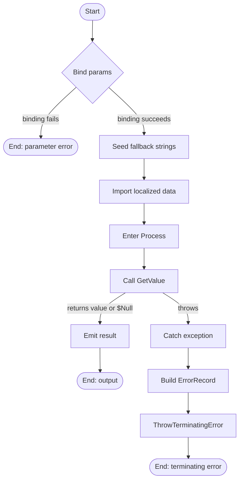

# Get-RegistryValue

## Purpose

`Get-RegistryValue` is the private registry-read seam that fetches one raw value from
an already-open `Microsoft.Win32.RegistryKey`. `Get-InstalledApplication` calls it
while walking uninstall subkeys so discovery tests can mock individual registry value
reads instead of mocking `RegistryKey.GetValue()` directly. The function stays thin,
preserves the underlying .NET lookup behavior including case-insensitive value names
and support for the unnamed default value when `-Name:''` is passed, and adds
contextual terminating errors when the underlying registry read throws.

## Parameters

| Name | Type | Required | Default | Description |
|------|------|----------|---------|-------------|
| `Key` | `Microsoft.Win32.RegistryKey` | Yes | None | Open registry key to read from. The caller is responsible for choosing the hive, view, and access mode before passing the key in. |
| `Name` | `System.String` | Yes | None | Registry value name to retrieve. `[AllowEmptyString()]` is applied so `''` can target the unnamed `(Default)` value. |

## Return Value

The function emits one `[System.Object]` result from `RegistryKey.GetValue(String)`.
It returns the raw registry value when the named value exists and `$Null` when the
name does not exist. Because `-Name:''` is accepted, callers can also target the
unnamed `(Default)` value.

Under current .NET behavior, the value-name lookup is case-insensitive. Because this
function uses the single-argument `GetValue(String)` overload, `REG_EXPAND_SZ` values
are returned with embedded environment variables expanded, while `REG_NONE` and
`REG_LINK` surface as `$Null` instead of usable data. If parameter binding fails, or
if `GetValue()` throws and the catch block rethrows a terminating error, the function
produces no pipeline output.

## Execution Flow

## Error Handling

- Missing mandatory `-Key` or `-Name` values are rejected by PowerShell parameter
  binding before the body runs.
- `-Key` is also protected by `[ValidateNotNull()]`, so a bound `$Null` registry key
  is rejected before `Process` executes.
- `-Name:''` is accepted intentionally because `[AllowEmptyString()]` is present; it
  is not treated as a validation error.
- The `Begin` block seeds a fallback `$Strings` hashtable, then calls
  `Import-LocalizedData -ErrorAction:'SilentlyContinue'`. If no localized data file
  can be loaded for the current UI culture, the fallback message table remains in
  place and execution continues.
- Exceptions from `$Key.GetValue($Name)` are caught and wrapped through
  `New-ErrorRecord` as a structured terminating error with exception type
  `[System.InvalidOperationException]`, error ID `GetRegistryValueFailed`, category
  `ReadError`, and target object `$Name`.
- The wrapped error message format is
  `Unable to read registry value '<Name>': <InnerMessage>`.
- The current implementation does **not** preserve the caught exception as the new
  exception's `.InnerException`; it preserves only the caught exception's message text
  inside the new message.
- Current .NET documentation for `RegistryKey.GetValue(String)` lists
  `SecurityException`, `ObjectDisposedException`, `IOException`, and
  `UnauthorizedAccessException` as possible failures.
- A missing value name is not an error path here; the underlying method returns
  `$Null`.
- `REG_NONE` and `REG_LINK` are also non-throwing `$Null` cases under the underlying
  API.

## Side Effects

This function has no side effects. It reads from the provided registry key and
attempts to load localized string data from the companion
`Get-RegistryValue.strings.psd1` file; it does not modify the registry, files,
processes, or variables outside its scope.

## Research Log

| Topic | Finding | Source | Date Verified |
|-------|---------|--------|---------------|
| PowerShell style baseline | Searched `PowerShell Practice and Style guide latest`. Found the community baseline is still current, still describes itself as evolving, and still recommends OTBS-style layout, 4-space indentation, and a softer 115-character line target. Change: unchanged; this repo remains intentionally stricter. | [PowerShell Practice and Style](https://poshcode.gitbook.io/powershell-practice-and-style) | 2026-04-01 |
| PSScriptAnalyzer rule baseline | Searched `PSScriptAnalyzer rules recommendations latest`. Found the current rule catalog still covers cmdlet design, help completeness, positional parameter avoidance, and related best-practice checks. Change: unchanged. | [PSScriptAnalyzer rules](https://learn.microsoft.com/en-us/powershell/utility-modules/psscriptanalyzer/rules/readme?view=ps-modules) | 2026-04-01 |
| PSScriptAnalyzer release currency | SUPERSEDED on 2026-04-02: `1.25.0` has been released; see updated row below. | [PowerShell/PSScriptAnalyzer releases](https://github.com/PowerShell/PSScriptAnalyzer/releases) | 2026-04-01 |
| PSScriptAnalyzer release currency | Searched `PSScriptAnalyzer releases 2026`. Found version `1.25.0` published 2026-03-20, superseding the previously documented `1.24.0`. Change: updated version reference. | [PowerShell Gallery PSScriptAnalyzer 1.25.0](https://www.powershellgallery.com/packages/PSScriptAnalyzer/1.25.0) | 2026-04-02 |
| PSScriptAnalyzer casing guidance | Searched `UseCorrectCasing psscriptanalyzer`. Found the current rule wants exact cmdlet and type casing plus lowercase keywords and operators. Change: unchanged; this still conflicts with the repo's PascalCase-keyword house standard, so the standards audit follows the repo rule as written and notes the discrepancy. | [UseCorrectCasing](https://learn.microsoft.com/en-us/powershell/utility-modules/psscriptanalyzer/rules/usecorrectcasing?view=ps-modules) | 2026-04-01 |
| CmdletBinding and positional binding | SUPERSEDED on 2026-04-01: the prior row tied this guidance to a standards failure on minimal `[CmdletBinding()]`. The guidance is still current, but the source now explicitly sets `PositionalBinding = $False` and related metadata. | [about_Functions_CmdletBindingAttribute](https://learn.microsoft.com/en-us/powershell/module/microsoft.powershell.core/about/about_functions_cmdletbindingattribute?view=powershell-7.5) | 2026-04-01 |
| CmdletBinding and positional binding | Searched `about_Functions_CmdletBindingAttribute PositionalBinding`. Found advanced functions still default `PositionalBinding` to `$True` unless it is explicitly set to `$False`. Change: corrected the previous README; current source complies on this point. | [about_Functions_CmdletBindingAttribute](https://learn.microsoft.com/en-us/powershell/module/microsoft.powershell.core/about/about_functions_cmdletbindingattribute?view=powershell-7.5) | 2026-04-01 |
| CmdletBinding confirmation metadata | Searched `about_Functions_CmdletBindingAttribute ConfirmImpact SupportsShouldProcess`. Found current docs say `ConfirmImpact` should be specified only when `SupportsShouldProcess` is also specified. Change: new discrepancy note; this supports the plan's literal `4.4` wording but does not change the standards audit, which still follows the repo's house rules. | [about_Functions_CmdletBindingAttribute](https://learn.microsoft.com/en-us/powershell/module/microsoft.powershell.core/about/about_functions_cmdletbindingattribute?view=powershell-7.5) | 2026-04-02 |
| Comment-based help completeness | SUPERSEDED on 2026-04-01: the prior row tied this guidance to a missing `.EXAMPLE` finding. The guidance is still current, but the source now includes `.EXAMPLE`. | [Comment-Based Help Keywords](https://learn.microsoft.com/en-us/powershell/scripting/developer/help/comment-based-help-keywords?view=powershell-7.5) | 2026-04-01 |
| Comment-based help completeness | Searched `comment-based help keywords powershell`. Found `.EXAMPLE` remains a standard help keyword and should be repeated for each example. Change: corrected the previous README; current source includes the required example section. | [Comment-Based Help Keywords](https://learn.microsoft.com/en-us/powershell/scripting/developer/help/comment-based-help-keywords?view=powershell-7.5) | 2026-04-01 |
| Advanced parameter validation | Searched `about_Functions_Advanced_Parameters AllowEmptyString`. Found `[AllowEmptyString()]` remains the supported way to let a mandatory `[string]` parameter accept `''`. Change: unchanged; this still validates the `Name` parameter design. | [about_Functions_Advanced_Parameters](https://learn.microsoft.com/en-us/powershell/module/microsoft.powershell.core/about/about_functions_advanced_parameters?view=powershell-7.6) | 2026-04-01 |
| Registry API behavior | Searched `RegistryKey.GetValue official`. Found no deprecation or replacement; lookup is case-insensitive, `''` or `$Null` targets the unnamed default value, missing names return `null`, and `REG_NONE` or `REG_LINK` return `null` rather than usable data. Change: unchanged. | [RegistryKey.GetValue](https://learn.microsoft.com/en-us/dotnet/api/microsoft.win32.registrykey.getvalue?view=net-9.0) | 2026-04-01 |
| Registry value expansion options | Searched `RegistryValueOptions DoNotExpandEnvironmentNames`. Found the non-expanding overload still exists, so using `GetValue(String)` is still the choice that preserves expanded `REG_EXPAND_SZ` behavior. Change: added current overload rationale to the README. | [RegistryValueOptions Enum](https://learn.microsoft.com/en-us/dotnet/api/microsoft.win32.registryvalueoptions?view=net-10.0) | 2026-04-01 |
| Registry read security guidance | Searched `RegistryKey GetValue deprecation security advisory` and `RegistryKey OpenSubKey read-only false`. No function-specific CVE or replacement surfaced; current official guidance still centers on permission, disposed-key, and deleted-key failures, and read-only opens remain the least-privilege pattern. Change: unchanged. | [RegistryKey.OpenSubKey](https://learn.microsoft.com/en-us/dotnet/api/microsoft.win32.registrykey.opensubkey?view=net-10.0) | 2026-04-01 |
| Terminating error handling pattern | Searched `about_Try_Catch_Finally PowerShell latest`. Found `try/catch` remains the standard way to handle terminating errors in scripts and functions. Change: corrected the previous README's claim that this function has no error handling; it now wraps `GetValue()` failures in a terminating catch path. | [about_Try_Catch_Finally](https://learn.microsoft.com/en-us/powershell/module/microsoft.powershell.core/about/about_try_catch_finally?view=powershell-7.6) | 2026-04-01 |
| Throw behavior | SUPERSEDED on 2026-04-02: this row focused on bare `throw`, but the current helper terminates via `$PSCmdlet.ThrowTerminatingError()` and preserves a structured `ErrorRecord`; see updated row below. | [about_Throw](https://learn.microsoft.com/en-us/powershell/module/microsoft.powershell.core/about/about_throw?view=powershell-7.5) | 2026-04-01 |
| Terminating error API | Searched `Cmdlet.ThrowTerminatingError PowerShell`. Found current PowerShell guidance still treats `ThrowTerminatingError(ErrorRecord)` as the structured terminating-error API when you need to preserve `ErrorRecord` metadata. Change: updated the error-handling framing to match the current implementation. | [Terminating Errors](https://learn.microsoft.com/en-us/powershell/scripting/developer/cmdlet/terminating-errors?view=powershell-7.6) | 2026-04-02 |
| Output pattern currency | Searched `about_Return PowerShell`. Found PowerShell still emits the result of each statement even without an explicit `return`. Change: unchanged; this confirms the function's one-line output pattern is still current. | [about_Return](https://learn.microsoft.com/en-us/powershell/module/microsoft.powershell.core/about/about_return?view=powershell-7.5) | 2026-04-01 |
| `#Requires` directive scope | Searched `about_Requires`. Found current docs say `#Requires` can appear on any line in a script and still applies globally; placing it inside a function does not limit scope. Change: removed the older placement ambiguity; this `.ps1` file simply lacks the repo-required `#Requires -Version 5.1`. | [about_Requires](https://learn.microsoft.com/en-us/powershell/module/microsoft.powershell.core/about/about_requires?view=powershell-7.6) | 2026-04-02 |
| PowerShell version support | SUPERSEDED on 2026-04-02: PowerShell 7.6.0 LTS has been released; see updated row below. | [PowerShell Support Lifecycle](https://learn.microsoft.com/en-us/powershell/scripting/install/powershell-support-lifecycle?view=powershell-7.6) | 2026-04-01 |
| PowerShell version support | Searched `PowerShell support lifecycle 2026`. Found PowerShell 7.6.0 LTS released 2026-03-18; PS 7.4 LTS supported until 2026-11-10; PS 5.1 still supported through Windows support channels. Change: updated to reflect the new LTS release; no function-specific change is required. | [PowerShell Support Lifecycle](https://learn.microsoft.com/en-us/powershell/scripting/install/powershell-support-lifecycle?view=powershell-7.6) | 2026-04-02 |
| Localized string loading pattern | Searched `Import-LocalizedData PowerShell 7.6`. Found `Import-LocalizedData` still supports loading translated `.psd1` data into a binding variable, replacing a default in-script string table, and suppressing missing-culture errors with `-ErrorAction:SilentlyContinue`. Change: validates the current fallback-plus-import pattern in `Begin`, but the standards audit still follows the repo's stricter rule that all user-facing strings live in the companion `.strings.psd1`. | [Import-LocalizedData](https://learn.microsoft.com/en-us/powershell/module/microsoft.powershell.utility/import-localizeddata?view=powershell-7.6) | 2026-04-02 |
| Pester TestRegistry behavior | Searched `Pester TestRegistry documentation`. Found current Pester docs say TestRegistry creates a temporary key under `HKCU:\Software\Pester`, which explains why local `Invoke-Pester` fails in a registry-write-denied sandbox. Change: new verification context only; no function behavior change. | [Isolating Windows Registry Operations using the TestRegistry](https://pester.dev/docs/v4/usage/testregistry) | 2026-04-02 |

## Standards Audit

| Rule | Status | Line(s) | Evidence |
|------|--------|---------|----------|
| Colon-bound parameters | PASS | 70-74, 81-90 | `Import-LocalizedData -BindingVariable:'Strings' -FileName:'Get-RegistryValue.strings' -BaseDirectory:$PSScriptRoot -ErrorAction:'SilentlyContinue'`; `New-ErrorRecord -ExceptionName:'System.InvalidOperationException' -ExceptionMessage:(...) -TargetObject:$Name -ErrorId:'GetRegistryValueFailed' -ErrorCategory:(...)` |
| PascalCase naming | PASS | 1, 27, 37, 65, 77-80 | `Function Get-RegistryValue {`; `[CmdletBinding(`; `Param (`; `Begin {`; `Process {`; `Try {`; `} Catch {` |
| Full .NET type names (no accelerators) | PASS | 36, 48, 61, 82, 90 | `[OutputType([System.Object])]`; `[Microsoft.Win32.RegistryKey]`; `[System.String]`; `-ExceptionName:'System.InvalidOperationException'`; `[System.Management.Automation.ErrorCategory]::ReadError` |
| Object types are the most appropriate and specific choice | PASS | 36, 48, 61, 79 | `[Microsoft.Win32.RegistryKey] $Key` is the exact dependency type, `[System.String] $Name` matches registry value names, and `[System.Object]` is appropriate because `RegistryKey.GetValue(String)` can return multiple registry value types or `$Null`; the emitted value comes directly from `$Key.GetValue($Name)`. |
| Single quotes for non-interpolated strings | PASS | 28-30, 40, 42, 53, 55, 68, 71-72, 82, 89 | `ConfirmImpact = 'None'`; `ParameterSetName = 'Default'`; `HelpMessage = 'See function help.'`; `'Unable to read registry value ''{0}'': {1}'`; `-FileName:'Get-RegistryValue.strings'`; `-ExceptionName:'System.InvalidOperationException'`; `-ErrorId:'GetRegistryValueFailed'` |
| `$PSItem` not `$_` | PASS | 80, 86 | `} Catch {`; `$PSItem.Exception.Message` |
| Explicit bool comparisons | N/A | 1-94 | The function contains no Boolean condition or comparison. |
| If conditions are pre-evaluated outside `If` blocks | N/A | 1-94 | The function contains no `If`, `ElseIf`, or `Switch` block. |
| `$Null` on left side of comparisons | N/A | 1-94 | The function contains no null comparison. |
| No positional arguments to cmdlets | PASS | 70-74, 81-90 | `Import-LocalizedData -BindingVariable:'Strings' -FileName:'Get-RegistryValue.strings' -BaseDirectory:$PSScriptRoot -ErrorAction:'SilentlyContinue'`; `New-ErrorRecord -ExceptionName:'System.InvalidOperationException' ... -ErrorCategory:(...)` |
| No cmdlet aliases | PASS | 70-74, 81-90 | The function invokes full command names only: `Import-LocalizedData` and `New-ErrorRecord`. |
| Switch parameters correctly handled | N/A | 27-63 | The function declares no switch parameters and invokes none. |
| Leading commas in attributes | FAIL | 27-35, 38-59 | `[CmdletBinding(` is followed by `ConfirmImpact = 'None'` instead of `, ConfirmImpact = 'None'`, and both `[Parameter(` blocks begin with `Mandatory = $True` instead of a leading-comma first property. |
| Parameter attributes list ALL properties explicitly | FAIL | 38-59 | Both `[Parameter(` blocks list `Mandatory`, `ParameterSetName`, `DontShow`, `HelpMessage`, `ValueFromPipeline`, `ValueFromPipelineByPropertyName`, and `ValueFromRemainingArguments`, but neither block includes an explicit `Position = ...` property. |
| CmdletBinding with all required properties | PASS | 27-35 | `[CmdletBinding( ConfirmImpact = 'None' ; DefaultParameterSetName = 'Default' ; HelpURI = '' ; PositionalBinding = $False ; RemotingCapability = 'None' ; SupportsPaging = $False ; SupportsShouldProcess = $False )]` |
| OutputType declared | PASS | 36 | `[OutputType([System.Object])]` |
| Comment-based help is complete | PASS | 2-25 | `.SYNOPSIS`; `.DESCRIPTION`; `.PARAMETER Key`; `.PARAMETER Name`; `.EXAMPLE`; `.OUTPUTS`; `.NOTES` |
| Error handling via `New-ErrorRecord` or appropriate pattern | PASS | 80-91 | `} Catch {`; `$ErrorRecord = New-ErrorRecord`; `-ExceptionName:'System.InvalidOperationException'`; `-ErrorId:'GetRegistryValueFailed'`; `$PSCmdlet.ThrowTerminatingError($ErrorRecord)` |
| Try/Catch around operations that can fail | PASS | 78-92 | `Try {`; `$Key.GetValue($Name)`; `} Catch {`; `$PSCmdlet.ThrowTerminatingError($ErrorRecord)` |
| Begin / Process / End blocks present when localized data is used | FAIL | 65-94 | The function uses `Begin {` and `Process {` and loads localized data with `Import-LocalizedData`, but it closes immediately after `Process` and has no `End { ... }` block. |
| Write-Debug at Begin/Process/End block entry and exit (if blocks are used) | FAIL | 65-93 | `Begin {`; `Process {`; `Try {`; `} Catch {` appear, but there is no `Write-Debug -Message:'[Get-RegistryValue] Entering Block: Begin'` or corresponding leave tracing anywhere in the file. |
| No variable pollution | PASS | 49, 62, 66, 81 | The function uses parameter variables `$Key` and `$Name`, plus local assignments `$Strings = @{` and `$ErrorRecord = New-ErrorRecord`; there are no `Script:` or `Global:` scope writes. |
| 96-character line limit | PASS | 90 | `-ErrorCategory:([System.Management.Automation.ErrorCategory]::ReadError)` is the longest line at 80 characters; a scan on 2026-04-02 found no line over 96. |
| 2-space indentation (not tabs, not 4-space) | PASS | 27, 38, 65, 78, 81 | `  [CmdletBinding(`; `    [Parameter(`; `  Begin {`; `    Try {`; `      $ErrorRecord = New-ErrorRecord` and a local scan returned `HasTabs = False`. |
| OTBS brace style | PASS | 1, 65, 77-80, 94 | `Function Get-RegistryValue {`; `Begin {`; `Process {`; `Try {`; `} Catch {`; `}` |
| No commented-out code | PASS | 2-25 | The only comments are active comment-based help lines inside `<# ... #>`. |
| Registry access is read-only (if applicable) | PASS | 79 | `$Key.GetValue($Name)` |
| Localized string data for user-facing messages | FAIL | 66-74; `src/Private/Get-RegistryValue.strings.psd1:1-4` | The companion strings file now exists and is loaded via `Import-LocalizedData`, but the same user-facing message is still embedded inline as fallback text: `$Strings = @{ RegistryValueReadFailed = 'Unable to read registry value ''{0}'': {1}' }`. |
| UTF-8 with BOM encoding | PASS | 1-94 | `Function Get-RegistryValue {` is preceded by a UTF-8 BOM; a byte scan on 2026-04-02 returned `HasBom = True`. |
| `#Requires -Version 5.1` present | FAIL | 1-94 | The file begins with `Function Get-RegistryValue {` and contains no `#Requires -Version 5.1` directive anywhere in the script file. |

*Note: current `PSScriptAnalyzer` `UseCorrectCasing` guidance prefers lowercase
keywords and operators. This audit still grades casing against the repo's
authoritative standard, which explicitly requires PascalCase keywords. Current
Microsoft `CmdletBinding` guidance also says `ConfirmImpact` should only be
specified when `SupportsShouldProcess` is specified. Current Microsoft
`Import-LocalizedData` guidance also allows default in-script fallback strings plus
`-ErrorAction:SilentlyContinue`; this standards table still follows the repo's
stricter "all user-facing messages live in `.strings.psd1`" rule as written.*

## Plan Audit

| Plan Section | Requirement | Status | Line(s) | Details |
|--------------|-------------|--------|---------|---------|
| 12 | `Get-RegistryValue.ps1` belongs in `src/Private/`. | ALIGNED | `PLAN.md:669-692`; `src/Private/Get-RegistryValue.ps1:1-94` | The function is implemented at the planned private-helper path and is not exposed as a public entrypoint. |
| 2, 12, 15, 16 | `External dependencies must be wrapped behind private seam functions so tests can mock them reliably.` `These functions exist primarily for testability and must stay thin:` `wrappers are tiny` `no business logic is buried in a seam function` `External dependency seams exist and are unit-testable.` | ALIGNED | `PLAN.md:70`; `PLAN.md:746-758`; `PLAN.md:907-918`; `PLAN.md:1008`; `src/Private/Get-RegistryValue.ps1:77-91`; `src/Private/Get-InstalledApplication.ps1:179`; `tests/Private/Get-RegistryValue.Tests.ps1:5-74` | The plan explicitly names `Get-RegistryValue` as an external seam. The implementation remains a thin wrapper around one registry read plus contextual exception translation, it has a real caller in `Get-InstalledApplication`, and it has a dedicated private test file. |
| 3, 14.1, 15 | `Ensure every high-risk branch has direct tests.` `Use three layers:` `Unit tests for pure helpers and filter logic` `wrappers have focused tests` | ALIGNED | `PLAN.md:82`; `PLAN.md:795-800`; `PLAN.md:916-917`; `tests/Private/Get-RegistryValue.Tests.ps1:47-74` | The dedicated seam tests cover an existing value, a missing value, `-Name:''`, and the catch path via a disposed key. The live Pester run in this environment is blocked by registry sandboxing, but the high-risk branch is directly represented in the test file. |
| 3, 7.1, 14.3, 15, 16 | `Keep registry access read-only.` `All registry opens must be read-only.` `every registry open is read-only` `all registry access is read-only` | ALIGNED | `PLAN.md:80`; `PLAN.md:314`; `PLAN.md:855`; `PLAN.md:942-944`; `src/Private/Get-RegistryValue.ps1:79` | This seam performs only `$Key.GetValue($Name)` on an already-open handle. It does not open keys, request write access, or mutate registry state. |
| 7.7 | `If a registry hive, parent key, or subkey cannot be read:` `emit a concise warning` `continue with the rest of discovery` `do not fail the entire run solely because one path was unreadable` | ALIGNED | `PLAN.md:404-410`; `src/Private/Get-RegistryValue.ps1:80-91`; `src/Private/Get-InstalledApplication.ps1:310-325`; `src/Private/Get-InstalledApplication.ps1:331-345` | The seam does not swallow read failures; it throws a contextual terminating error. `Get-InstalledApplication` catches that per subkey and per descriptor, emits `Write-Warning`, and continues discovery, which matches the plan's warning-and-continue behavior. |
| 13.2 Strings Files | `Use .strings.psd1 only where a function has reusable user-facing messages.` | ALIGNED | `PLAN.md:781-789`; `src/Private/Get-RegistryValue.ps1:66-74`; `src/Private/Get-RegistryValue.strings.psd1:1-4` | The function now has a non-empty companion strings file with a reusable user-facing error message, and the `Begin` block imports it. This corrects the previous README's strings-file deviation finding. |
| 7.4 | `The discovery pass reads all named values from each uninstall subkey exactly once.` `unnamed default value -> ignore` | N/A | `PLAN.md:347-368`; `src/Private/Get-RegistryValue.ps1:51-62`; `src/Private/Get-InstalledApplication.ps1:175-179` | This rule belongs to discovery orchestration, not to the seam itself. `Get-RegistryValue` intentionally allows `-Name:''` to mirror the underlying API, while `Get-InstalledApplication` skips empty value names before calling the seam. |
| 4.4 | `The script must not prompt.` Specifically: `no SupportsShouldProcess` `no ConfirmImpact` `no Read-Host` `no GUI` `no dependency on an interactive session` | DEVIATION | `PLAN.md:135-145`; `src/Private/Get-RegistryValue.ps1:27-34` | Runtime behavior is non-interactive, but the helper explicitly declares `ConfirmImpact = 'None'` and `SupportsShouldProcess = $False`. That matches the repo's helper template, yet contradicts the plan text as written. |
| 4.3, 10.4 | `Exit codes 0, 1, 2, 3, and 4 behave exactly as documented.` `Per-Entry Outcome Mapping` | N/A | `PLAN.md:125-133`; `PLAN.md:558-567`; `src/Private/Get-RegistryValue.ps1:1-94` | This seam does not choose exit codes, produce result records, or map uninstall outcomes such as `Blocked`, `Failed`, `Succeeded`, or `TimedOut`. |
| 5.1, 5.2, 5.3 | Internal application, descriptor, and uninstall-result records must match the frozen data model. | N/A | `PLAN.md:152-215`; `src/Private/Get-RegistryValue.ps1:1-94` | The function emits a single raw registry value (`[System.Object]` or `$Null`), not application records, descriptor records, or uninstall result records. |

## Verification Notes

- Manual smoke execution on 2026-04-02 via `build/Start-Uninstaller.Functions.ps1`
  against `HKLM\SOFTWARE\Microsoft\Windows\CurrentVersion` returned a
  `System.String` for `ProgramFilesDir`, returned `$Null` for a nonexistent value
  name, and accepted `-Name:''` without throwing.
- A disposed-key smoke execution on 2026-04-02 threw
  `System.InvalidOperationException` with fully qualified error ID
  `GetRegistryValueFailed,Get-RegistryValue`; the outer message included the original
  method-invocation failure text, but `.InnerException` was `$Null`. This corrects
  the previous README's false claim that the wrapped exception preserved the original
  exception as an inner exception.
- A byte and line scan on 2026-04-02 confirmed `HasBom = True`, `HasTabs = False`,
  and `MaxLineLength = 80` for `src/Private/Get-RegistryValue.ps1`.
- `Invoke-Pester tests/Private/Get-RegistryValue.Tests.ps1` discovered 7 tests on
  2026-04-02, but the container failed during Pester 5.7.1 `TestRegistry` setup
  because it attempted to create `HKCU:\Software\Pester` and the environment denied
  registry write access.
- `Invoke-ScriptAnalyzer` against `src/Private/Get-RegistryValue.ps1`, both with the
  default invocation and with `PSScriptAnalyzerSettings.psd1`, emitted no findings in
  this environment. The standards and plan tables therefore capture repo-specific
  rules and literal plan requirements that go beyond default analyzer coverage.

## Changelog

| Date | Changes |
|------|---------|
| 2026-04-02 | Corrected the README after re-verifying the current live source. Updated the documentation for the current `Begin`/`Process` + `Import-LocalizedData` + `New-ErrorRecord` implementation; fixed the false claim that the wrapped `InvalidOperationException` preserves an inner exception; flipped the plan strings-file finding from deviation to alignment; re-scored standards findings for colon-bound parameters, positional arguments, `New-ErrorRecord` usage, missing lifecycle tracing, missing `End` block, and localized-string handling; added current `Import-LocalizedData` research; and refreshed verification notes with live smoke, Pester, analyzer, BOM, and line-length results. |
| 2026-04-02 | Corrected the prior 2026-04-02 audit after re-verifying the live source and tests. Fixed stale findings for UTF-8 BOM encoding, catch-path test coverage, and the catch block's actual structured `ErrorRecord` implementation; added missing standards rows for leading commas in attributes, incomplete `[Parameter()]` property inventories, inline user-facing strings with no companion `.strings.psd1`, and missing `#Requires -Version 5.1`; added plan rows for private-file placement, strings-file deviation, read-failure alignment, and the plan's literal no-`ConfirmImpact`/no-`SupportsShouldProcess` requirement; and refreshed verification notes with current smoke results and current file-metadata scans. |
| 2026-04-02 | Updated research log: PSScriptAnalyzer `1.25.0` released 2026-03-20 supersedes previously documented `1.24.0`; PowerShell `7.6.0` LTS released 2026-03-18 updates the lifecycle finding. No source or test changes detected; all standards and plan findings remain unchanged. Re-verified BOM and line-length measurements. |
| 2026-04-01 | Corrected the stale `Get-RegistryValue` audit after source changes. Updated the purpose, return, flow, and error sections for the new `Try/Catch` and wrapped `InvalidOperationException` path; fixed standards findings for `CmdletBinding`, help completeness, and error handling; added the missing object-type rule; corrected the encoding finding to a BOM-only failure; and recorded the missing direct test for the new catch branch. |
| 2026-04-01 | Initial README audit for `Get-RegistryValue`. Added purpose, parameter, return, error, and side-effect documentation; recorded current research; added standards and plan audits; and documented verification limits. |
AUDIT_STATUS:UPDATED