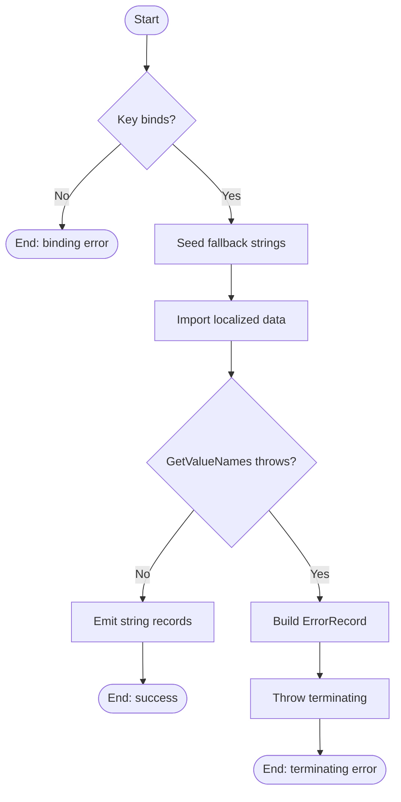

# Get-RegistryValueNames

## Purpose

`Get-RegistryValueNames` is a private registry seam that wraps `[Microsoft.Win32.RegistryKey]::GetValueNames()` for uninstall-record discovery. Its current direct caller is `Get-InstalledApplication`, which invokes it once per uninstall subkey so registry value-name enumeration can be mocked in tests instead of coupling discovery logic directly to the .NET API. The helper stays intentionally narrow: it seeds fallback user-facing text, attempts localized string import in `Begin`, emits raw value names unchanged in `Process`, wraps enumeration failures with `New-ErrorRecord`, and leaves unnamed-default handling, normalization, filtering, warning emission, and warning-and-continue behavior to its caller.

## Parameters

| Name | Type | Required | Default | Description |
|------|------|----------|---------|-------------|
| `Key` | `Microsoft.Win32.RegistryKey` | Yes | N/A | The registry key whose value names should be enumerated. Parameter binding rejects an omitted argument, and `[ValidateNotNull()]` rejects an explicit `$Null` before the function body runs. |

## Return Value

The function declares `[OutputType([System.String[]])]`, but its success path is the bare expression `$Key.GetValueNames()`. Because PowerShell enumerates arrays written to the pipeline, the runtime output is zero, one, or many `[System.String]` records rather than a single array object: no records if the registry key has no values, one string if it has exactly one value name, or multiple strings if it has multiple value names. Callers that force array context with `@(...)` receive a collection of names, and if the key contains an unnamed default value the emitted sequence includes `''` unchanged for the caller to interpret or ignore.

There is no successful `$Null` path. If parameter binding fails, a terminating error occurs in `Begin`, or the `Catch` block throws, the function produces no successful pipeline output.

## Execution Flow

## Error Handling

- Omitting `-Key` causes a PowerShell parameter-binding error before the function body runs.
- Passing `-Key $Null` causes a `ParameterBindingValidationException` before the function body runs because `[ValidateNotNull()]` rejects `$Null`.
- `Begin` seeds `$Strings` with fallback text, then calls `Import-LocalizedData -ErrorAction:'SilentlyContinue'`. Missing localized-data lookup noise is therefore suppressed and the fallback table remains available.
- `Import-LocalizedData` is outside the function's only `Try/Catch`, so any other terminating import failure would stop execution before `Process` begins.
- If `$Key.GetValueNames()` throws, the function catches the exception, calls `New-ErrorRecord` with `ExceptionName = 'System.InvalidOperationException'`, formats the message from `RegistryValueNamesEnumerationFailed`, sets `TargetObject` to the supplied key, sets error ID `GetRegistryValueNamesFailed`, sets category `ReadError`, and rethrows with `$PSCmdlet.ThrowTerminatingError(...)`.
- Direct manual failure-path verification with a disposed registry key produced an outer `System.InvalidOperationException` whose message began with `Unable to enumerate registry value names: ...`. The observed `FullyQualifiedErrorId` was `GetRegistryValueNamesFailed,Get-RegistryValueNames`, the category was `ReadError`, and `InnerException` was absent.
- Current .NET documentation still lists underlying `GetValueNames()` failure cases such as `SecurityException`, `ObjectDisposedException`, `UnauthorizedAccessException`, and `IOException`.
- The function does not call `Write-Warning`, `Write-Verbose`, or `Write-Debug` itself, and it does not silently swallow registry enumeration failures.

## Side Effects

This function has no external side effects. It reads the supplied registry key and attempts to load localized string data for user-facing messages. It does not modify the registry, write files, launch processes, or leak variables outside local scope.

## Research Log

| Topic | Finding | Source | Date Verified |
|-------|---------|--------|---------------|
| Search: `RegistryKey.GetValueNames()` return and exception contract | Current .NET docs still state that `GetValueNames()` returns an empty array when a key has no values, includes the empty string when an unnamed default value exists, and can throw `SecurityException`, `ObjectDisposedException`, `UnauthorizedAccessException`, or `IOException`. New finding. | https://learn.microsoft.com/en-us/dotnet/api/microsoft.win32.registrykey.getvaluenames?view=net-9.0 | 2026-04-01 |
| Search: `ValidateNotNull` binding behavior | Microsoft still documents `ValidateNotNull` as the validation attribute that rejects `$null` input at bind time. That directly matches this helper's explicit null-rejection behavior. New finding. | https://learn.microsoft.com/en-us/powershell/module/microsoft.powershell.core/about/about_functions_advanced_parameters?view=powershell-7.5 | 2026-04-01 |
| Search: `CmdletBinding` `ConfirmImpact` guidance | Microsoft currently documents `ConfirmImpact` as something to specify only when `SupportsShouldProcess` is also specified. That does not change the house-style audit, but it does make the plan's blanket `no ConfirmImpact` rule closer to current platform guidance than this repo's helper template. New finding. | https://learn.microsoft.com/en-us/powershell/module/microsoft.powershell.core/about/about_functions_cmdletbindingattribute?view=powershell-7.6 | 2026-04-01 |
| Search: Pester typed-mock relaxation | Pester still documents `-RemoveParameterType` on `Mock` as a way to relax strong parameter typing so strongly typed commands can be mocked more easily. That directly supports the downstream test pattern used with this `RegistryKey` seam. New finding. | https://pester.dev/docs/commands/Mock | 2026-04-01 |
| Search: PowerShell Practice and Style guide status | The community PowerShell Practice and Style guide still presents itself as evolving guidance rather than a rigid rule set. That supports using it as a baseline, but not as a substitute for this repo's stricter house standard. New finding. | https://poshcode.gitbook.io/powershell-practice-and-style/best-practices/introduction | 2026-04-01 |
| Search: current PowerShell static-analysis baseline | Microsoft still positions PSScriptAnalyzer as the standard static checker for PowerShell scripts and modules. New finding. | https://learn.microsoft.com/en-us/powershell/utility-modules/psscriptanalyzer/overview?view=ps-modules | 2026-04-01 |
| Search: recent PSScriptAnalyzer rule changes | SUPERSEDED by corrected 2026-04-02 entries below. | https://learn.microsoft.com/en-us/powershell/utility-modules/psscriptanalyzer/whats-new-in-pssa?view=ps-modules | 2026-04-01 |
| Search: PSScriptAnalyzer 1.25.0 release | SUPERSEDED by corrected 2026-04-02 entry below. Prior audit misattributed `1.24.0` changes to `1.25.0`. | https://github.com/PowerShell/PSScriptAnalyzer/releases | 2026-04-02 |
| Search: corrected PSScriptAnalyzer 1.25.0 release details | PSScriptAnalyzer `1.25.0` is the current latest release on GitHub. New release items include `UseConsistentParametersKind`, `UseConsistentParameterSetName`, `UseSingleValueFromPipelineParameter`, and optional `UseConstrainedLanguageMode`; it also updates `UseCorrectCasing` docs/diagnostics. This changes the previous finding because the single-key-hashtable and PowerShell `5.1` minimum items belonged to `1.24.0`, not `1.25.0`. Updated finding. | https://github.com/PowerShell/PSScriptAnalyzer/releases | 2026-04-02 |
| Search: current `UseCorrectCasing` guidance | Microsoft now explicitly documents `UseCorrectCasing` as requiring lowercase language keywords and operators, with command/parameter/type names matching canonical casing. That conflicts with this repo's PascalCase house rule and means current analyzer guidance diverges from the repo standard. New finding. | https://learn.microsoft.com/en-us/powershell/utility-modules/psscriptanalyzer/rules/usecorrectcasing?view=ps-modules | 2026-04-02 |
| Search: current `UseSingularNouns` guidance | Current PSScriptAnalyzer guidance still says cmdlet names should use singular nouns, classifies the rule as `Warning`, and allows suppression or a noun allow list. That changes this audit because the local analyzer flags `Get-RegistryValueNames` even though the plan explicitly names the seam that way. New finding. | https://learn.microsoft.com/en-us/powershell/utility-modules/psscriptanalyzer/rules/usesingularnouns?view=ps-modules | 2026-04-02 |
| Search: CmdletBinding positional binding behavior | `CmdletBinding` still defaults `PositionalBinding` to `$true` unless the function disables it explicitly. New finding. | https://learn.microsoft.com/en-us/powershell/module/microsoft.powershell.core/about/about_functions_cmdletbindingattribute?view=powershell-7.6 | 2026-04-01 |
| Search: OutputType behavior | `OutputType` remains metadata only and PowerShell does not verify it against the function's actual runtime output. New finding. | https://learn.microsoft.com/en-us/powershell/module/microsoft.powershell.core/about/about_functions_outputtypeattribute?view=powershell-7.5 | 2026-04-01 |
| Search: comment-based help requirements | Microsoft still documents `.PARAMETER` and `.EXAMPLE` as current comment-based-help keywords. Platform help treats examples as optional, so the repo standard is stricter than the platform docs when it requires them. New finding. | https://learn.microsoft.com/en-us/powershell/module/microsoft.powershell.core/about/about_comment_based_help?view=powershell-7.6 | 2026-04-01 |
| Search: parameter validation guidance | `ValidateNotNullOrEmpty` still rejects `$null`, empty string, and empty arrays at bind time. New finding. | https://learn.microsoft.com/en-us/powershell/module/microsoft.powershell.core/about/about_functions_advanced_parameters?view=powershell-7.5 | 2026-04-01 |
| Search: output pattern and return behavior | PowerShell still returns the result of each statement even without an explicit `return`, so this helper's bare-expression output pattern remains current. New finding. | https://learn.microsoft.com/en-us/powershell/module/microsoft.powershell.core/about/about_return?view=powershell-7.5 | 2026-04-01 |
| Search: RegistryKey and GetValueNames API currency | `Microsoft.Win32.RegistryKey` remains current, implements `IDisposable`, and still documents `GetValueNames()` as the value-name enumeration API. No deprecation or replacement surfaced. New finding. | https://learn.microsoft.com/en-us/dotnet/api/microsoft.win32.registrykey?view=net-9.0 | 2026-04-01 |
| Search: registry security and read-only access | `OpenSubKey(name, writable)` still documents `$False` as the read-only access pattern and `$True` only when write access is needed. That reinforces the repo plan's read-only registry rule, even though this helper receives an already-open key. New finding. | https://learn.microsoft.com/en-us/dotnet/api/microsoft.win32.registrykey.opensubkey?view=net-9.0 | 2026-04-01 |
| Search: seam and mocking pattern validation | Pester still documents command mocking as a primary testing capability, which supports keeping registry enumeration behind a thin private seam. New finding. | https://pester.dev/docs/quick-start/ | 2026-04-01 |
| Search: approved verb guidance | `Get` remains an approved PowerShell verb, so `Get-RegistryValueNames` uses a current Verb-Noun pattern. New finding. | https://learn.microsoft.com/en-us/powershell/module/microsoft.powershell.utility/get-verb?view=powershell-7.5 | 2026-04-01 |
| Search: Pester 6 development status | Pester `5.7.1` remains the current stable release. Pester 6 is still in pre-release (`6.0.0-alpha5` on the releases page), so the docs and local environment remain aligned with the current v5 `Mock` behavior used by this repo. Existing finding remains current. | https://github.com/pester/Pester/releases | 2026-04-02 |
| Search: `Import-PowerShellDataFile` behavior | SUPERSEDED by corrected 2026-04-02 `Import-LocalizedData` entries below. This helper no longer uses `Import-PowerShellDataFile`, so the prior implementation-specific relevance note is stale. | https://learn.microsoft.com/en-us/powershell/module/microsoft.powershell.utility/import-powershelldatafile?view=powershell-7.5 | 2026-04-02 |
| Search: `Import-LocalizedData` current guidance | SUPERSEDED by corrected 2026-04-02 entries below. Prior audit described the wrong implementation and overstated the certainty that the source-time companion file was loaded. | https://learn.microsoft.com/en-us/powershell/module/microsoft.powershell.utility/import-localizeddata?view=powershell-7.5 | 2026-04-02 |
| Search: corrected `Import-LocalizedData` guidance | `Import-LocalizedData` remains the PowerShell cmdlet intended for UI-culture-specific user messages, and Microsoft still documents `-ErrorAction SilentlyContinue` as the supported way to suppress missing-file noise when fallback text exists. Current docs also note that, starting in PowerShell `7.5.5`, lookup falls back to `en-US` and then `en` for `<language>-<region>` cultures when `-UICulture` is not specified. Updated finding. | https://learn.microsoft.com/en-us/powershell/module/microsoft.powershell.utility/import-localizeddata?view=powershell-7.5 | 2026-04-02 |
| Search: localized `.psd1` layout for `Import-LocalizedData` | Current Microsoft internationalization guidance says translated `.psd1` files are stored in culture-named subdirectories under the script directory, and `Import-LocalizedData` resolves the file from the subdirectory matching `$PSUICulture`. This changes the previous README's assumption that a same-directory companion `.strings.psd1` is definitely imported at source time. New finding. | https://learn.microsoft.com/en-us/powershell/module/microsoft.powershell.core/about/about_script_internationalization?view=powershell-7.5 | 2026-04-02 |
| Search: advanced-function terminating error methods | Microsoft still documents `$PSCmdlet.ThrowTerminatingError(...)` as the advanced-function method for terminating errors and explicitly notes that advanced functions can also use `throw` and `Write-Error`. That means the repo's `New-ErrorRecord` wrapper requirement is stricter than current platform guidance. New finding. | https://learn.microsoft.com/en-us/powershell/module/microsoft.powershell.core/about/about_functions_advanced_methods?view=powershell-7.6 | 2026-04-02 |

## Standards Audit

| Rule | Status | Line(s) | Evidence |
|------|--------|---------|----------|
| Colon-bound parameters | PASS | 54-58, 65-73 | `Import-LocalizedData -BindingVariable:'Strings' -FileName:'Get-RegistryValueNames.strings' -BaseDirectory:$PSScriptRoot -ErrorAction:'SilentlyContinue'` and `New-ErrorRecord -ExceptionName:'System.InvalidOperationException' ... -TargetObject:$Key -ErrorId:'GetRegistryValueNamesFailed' -ErrorCategory:([System.Management.Automation.ErrorCategory]::ReadError)` use named colon-bound parameters. |
| PascalCase naming | PASS | 1, 24-31, 34-46, 49, 61-64 | `Function Get-RegistryValueNames {`, `Param (`, `Begin {`, `Process {`, `Try {`, and `} Catch {` follow the repo's PascalCase convention. |
| Full .NET type names (no accelerators) | PASS | 33, 45, 73 | `[OutputType([System.String[]])]`, `[Microsoft.Win32.RegistryKey]`, and `[System.Management.Automation.ErrorCategory]::ReadError` use full .NET type names. |
| Object types are the MOST appropriate and specific choice | FAIL | 33, 45, 63 | `[Microsoft.Win32.RegistryKey] $Key` is the exact parameter type, but `[OutputType([System.String[]])]` is not the most accurate runtime contract because the bare `$Key.GetValueNames()` expression is enumerated by PowerShell into individual `[System.String]` pipeline records. |
| Single quotes for non-interpolated strings | PASS | 25-31, 39, 52, 56, 66, 72 | `ConfirmImpact = 'None'`, `HelpMessage = 'See function help.'`, `RegistryValueNamesEnumerationFailed = 'Unable to enumerate registry value names: {0}'`, `'Get-RegistryValueNames.strings'`, and `'GetRegistryValueNamesFailed'` all use single quotes. |
| `$PSItem` not `$_` | PASS | 69 | The catch path formats the message from `$PSItem.Exception.Message`; `$_` does not appear. |
| Explicit bool comparisons (`$Var -eq $True`) | N/A | 1-77 | The function contains no `If` condition to evaluate. |
| If conditions are pre-evaluated outside If blocks | N/A | 1-77 | The function contains no `If` statement. |
| `$Null` on left side of comparisons | N/A | 1-77 | The function performs no explicit null comparison. |
| No positional arguments to cmdlets | PASS | 54-58, 65-73 | The function's cmdlet calls name every argument: `Import-LocalizedData -BindingVariable:... -FileName:... -BaseDirectory:... -ErrorAction:...` and `New-ErrorRecord -ExceptionName:... -ExceptionMessage:... -TargetObject:... -ErrorId:... -ErrorCategory:...`. |
| No cmdlet aliases | PASS | 54-58, 65-73 | The body uses full cmdlet/function names: `Import-LocalizedData` and `New-ErrorRecord`. |
| Switch parameters correctly handled | N/A | 1-77 | The function defines no switch parameters and does not call any switch-bearing command with an explicit switch value. |
| Leading commas in attributes | FAIL | 25, 36 | `ConfirmImpact = 'None'` and `Mandatory = $True` omit the required leading comma on the first property line in `[CmdletBinding()]` and `[Parameter()]`. |
| CmdletBinding with all required properties | PASS | 24-31 | `[CmdletBinding( ConfirmImpact = 'None' , DefaultParameterSetName = 'Default' , HelpURI = '' , PositionalBinding = $False , RemotingCapability = 'None' , SupportsPaging = $False , SupportsShouldProcess = $False )]` declares the house-required property set. |
| Positional binding disabled | PASS | 28, 35-43 | `PositionalBinding = $False` is declared, and the `[Parameter()]` block contains no `Position = ...` entry that would re-enable positional binding for `Key`. |
| PSScriptAnalyzer zero warnings/errors required | FAIL | 1 | `Function Get-RegistryValueNames {` uses the plural noun `ValueNames`, and `Invoke-ScriptAnalyzer -Path 'src/Private/Get-RegistryValueNames.ps1' -Settings 'PSScriptAnalyzerSettings.psd1'` returned `PSUseSingularNouns` on line 1. |
| OutputType declared | PASS | 33 | `[OutputType([System.String[]])]` is present directly above the `Param()` block. |
| Comment-based help is complete | PASS | 2-21 | The help block includes `.SYNOPSIS`, `.DESCRIPTION`, `.PARAMETER`, `.EXAMPLE`, `.OUTPUTS`, and `.NOTES`. |
| `[Parameter()]` properties listed explicitly | FAIL | 35-43 | The attribute explicitly lists `Mandatory`, `ParameterSetName`, `DontShow`, `HelpMessage`, `ValueFromPipeline`, `ValueFromPipelineByPropertyName`, and `ValueFromRemainingArguments`, but omits `Position`. |
| Error handling via `New-ErrorRecord` or appropriate pattern | PASS | 62-74 | `Catch { $ErrorRecord = New-ErrorRecord ... ; $PSCmdlet.ThrowTerminatingError($ErrorRecord) }` uses the repo's error helper and terminating-error API. |
| Try/Catch around operations that can fail | FAIL | 54-58, 62-74 | `$Key.GetValueNames()` is wrapped in `Try/Catch`, but `Import-LocalizedData -BindingVariable:'Strings' ... -ErrorAction:'SilentlyContinue'` sits outside the only `Try/Catch` block. |
| Begin/Process/End blocks used when localized data is loaded | PASS | 49-61 | The function loads localized strings in `Begin { ... Import-LocalizedData ... }` and performs per-call work in `Process { ... }`. |
| Write-Debug at Begin/Process/End block entry and exit | FAIL | 49-76 | The function uses `Begin {` and `Process {`, but no `Write-Debug -Message:'[Get-RegistryValueNames] Entering/Leaving Block: ...'` call appears in either block. |
| No variable pollution (`script:` / `global:` leaks) | PASS | 50-74 | The function assigns only local variables such as `$Strings` and `$ErrorRecord`; no `script:` or `global:` scope modifiers appear. |
| 96-character line limit | PASS | 1-77 | A local scan found no lines over 96 characters. |
| 2-space indentation (not tabs, not 4-space) | PASS | 24-76 | Lines such as `  [CmdletBinding(`, `  Begin {`, and `  Process {` use 2-space indentation, and a local scan found no tab characters. |
| OTBS brace style | PASS | 1, 49, 61, 62, 64, 77 | `Function Get-RegistryValueNames {`, `Begin {`, `Process {`, `Try {`, and `} Catch {` follow OTBS brace placement. |
| No commented-out code | PASS | 2-22 | The only block comment is active comment-based help: `<# ... #>`. There is no disabled executable code. |
| Localized string data for user-facing messages | PASS | 50-58; `Get-RegistryValueNames.strings.psd1:1-4` | The function seeds `$Strings`, loads `Import-LocalizedData -BindingVariable:'Strings' -FileName:'Get-RegistryValueNames.strings' -BaseDirectory:$PSScriptRoot` in `Begin`, and a non-empty companion strings file exists with `RegistryValueNamesEnumerationFailed = 'Unable to enumerate registry value names: {0}'`. |
| Registry access is read-only | PASS | 63 | `$Key.GetValueNames()` enumerates existing value names only; the function does not call any registry-writing API. |
| Approved verb naming | PASS | 1 | `Function Get-RegistryValueNames {` uses the approved `Get` verb for a read-only helper. |

Research notes:

- Current upstream `UseCorrectCasing` guidance requires lowercase keywords and operators, while this repo's house standard requires PascalCase keywords and operators. Because `PSScriptAnalyzerSettings.psd1` includes `IncludeRules = @('*')`, current analyzer formatting guidance and current repo style remain in direct tension.
- Current upstream `PSUseSingularNouns` guidance conflicts with both the local function name and the plan's explicitly named seam `Get-RegistryValueNames`. This audit therefore records the analyzer warning as a standards failure while still evaluating plan naming/path requirements against the plan as written.
- Current Microsoft internationalization guidance describes culture-specific subdirectories for `Import-LocalizedData`, while the repo standard describes same-directory companion `.strings.psd1` files. This audit still scores standards compliance against the repo standard, but the runtime documentation above intentionally says the function attempts localized import rather than assuming the same-directory file is always loaded.
- Current Microsoft guidance still says `ConfirmImpact` should be specified only when `SupportsShouldProcess` is also specified. That does not change the house-style verdict here, but it does matter in the plan audit below.
- `OutputType` remains metadata only, so the presence of `[OutputType([System.String[]])]` does not override PowerShell's normal enumeration of the returned array into string records.

## Plan Audit

| Plan Section | Requirement | Status | Line(s) | Details |
|--------------|-------------|--------|---------|---------|
| `PLAN.md` 12 | `Get-RegistryValueNames.ps1` belongs in `src/Private/`. | ALIGNED | `PLAN.md:692` `src/Private/Get-RegistryValueNames.ps1:1-77` | The function is implemented at the planned private-helper path and is not exposed as a public entrypoint. |
| `PLAN.md` 2, 12, 15.1 | External dependencies must be wrapped behind thin private seams, and the seam should be necessary rather than overengineering. | ALIGNED | `PLAN.md:70-71` `PLAN.md:748-755` `PLAN.md:916-918` `src/Private/Get-RegistryValueNames.ps1:6-8` `src/Private/Get-RegistryValueNames.ps1:49-74` `src/Private/Get-InstalledApplication.ps1:171` `tests/Private/Get-InstalledApplication.Tests.ps1:77` | The plan explicitly lists this helper as an external seam. It remains narrow, has a real caller in `Get-InstalledApplication`, and is mocked downstream in orchestrator tests, so it serves a concrete testability purpose. |
| `PLAN.md` 15.1 | Wrappers are tiny. | ALIGNED | `PLAN.md:916` `src/Private/Get-RegistryValueNames.ps1:49-74` | The helper has one parameter, one registry enumeration call, one localized-message initialization step, and one exception-translation path. That remains a small seam rather than buried workflow logic. |
| `PLAN.md` 15.1 | Wrappers have focused tests. | ALIGNED | `PLAN.md:917` `tests/Private/Get-RegistryValueNames.Tests.ps1:7-47` | A dedicated private test file exists for this seam and focuses on command presence, parameter typing, and successful delegation to registry enumeration. |
| `PLAN.md` 3, 14.1, 14.3 | Every high-risk branch should have direct tests. | DEVIATION | `PLAN.md:82` `PLAN.md:842-855` `tests/Private/Get-RegistryValueNames.Tests.ps1:7-47` | The dedicated test file covers metadata and happy-path enumeration only. There is no direct automated test of the seam's `Catch`/`ThrowTerminatingError` branch or the localized-data fallback/import path, even though the error branch controls discovery warning-and-continue behavior upstream. |
| `PLAN.md` 15.1 | No business logic is buried in a seam function. | ALIGNED | `PLAN.md:918` `src/Private/Get-RegistryValueNames.ps1:49-74` | The function does not normalize, filter, or interpret registry data. It only prepares message text, enumerates value names, and adds error context if enumeration fails. |
| `PLAN.md` 7.4 | The discovery pass reads all named values from each uninstall subkey exactly once. | ALIGNED | `PLAN.md:349` `src/Private/Get-InstalledApplication.ps1:171` `src/Private/Get-RegistryValueNames.ps1:63` | `Get-InstalledApplication` captures `@(Get-RegistryValueNames -Key:$SubKey)` once per uninstall subkey, and this helper performs one `GetValueNames()` call per invocation. |
| `PLAN.md` 7.4 | Unnamed default value -> ignore. | ALIGNED | `PLAN.md:357-363` `src/Private/Get-InstalledApplication.ps1:174-177` `tests/Private/Get-InstalledApplication.Tests.ps1:833-840` | This seam returns raw names unchanged, including `''` when present. The caller immediately treats zero-length names as unnamed default values and ignores them. |
| `PLAN.md` 7.7 | If a registry hive, parent key, or subkey cannot be read, emit a concise warning and continue discovery. | ALIGNED | `PLAN.md:854-856` `src/Private/Get-RegistryValueNames.ps1:62-74` `src/Private/Get-InstalledApplication.ps1:310-345` | The seam does not swallow registry read failures; it throws a terminating helper error. `Get-InstalledApplication` catches that per-subkey, converts it to a concise warning, and continues discovery, which matches the plan's warning-and-continue requirement. |
| `PLAN.md` 3, 7.1, 14.3 | Keep registry access read-only, and every registry open must be read-only. | N/A | `PLAN.md:80` `PLAN.md:314` `PLAN.md:855` `src/Private/Get-RegistryValueNames.ps1:63` | This helper does not open registry keys. It only enumerates value names from an already-open handle, so least-privilege proof belongs to the key-opening seams. |
| `PLAN.md` 13.2 Strings Files | Use `.strings.psd1` only where a function has reusable user-facing messages; no empty strings files. | ALIGNED | `PLAN.md:783-789` `src/Private/Get-RegistryValueNames.ps1:50-58` `src/Private/Get-RegistryValueNames.strings.psd1:1-4` | The function has a reusable user-facing error message and a non-empty companion strings file. The seeded fallback table makes the behavior deterministic even when localized lookup is suppressed or unavailable. |
| `PLAN.md` 4.4 | The script must not prompt; specifically, no `SupportsShouldProcess` and no `ConfirmImpact`. | DEVIATION | `PLAN.md:137-145` `src/Private/Get-RegistryValueNames.ps1:24-31` | Runtime behavior is non-interactive, but the helper still explicitly declares `ConfirmImpact = 'None'` and `SupportsShouldProcess = $False`. Because helpers are inlined into the built script, that still contradicts the plan text as written. This appears template-driven rather than behavioral. |
| `PLAN.md` 4.3, 10.4 | Exit codes and uninstall outcomes must follow the documented contract. | N/A | `PLAN.md:125-133` `PLAN.md:558-567` `src/Private/Get-RegistryValueNames.ps1:33-74` | This helper emits registry value names only. It does not assign script exit codes or uninstall outcomes. |
| `PLAN.md` 5.1, 5.2, 5.3 | Internal application, descriptor, and uninstall-result records must match the frozen data model. | N/A | `PLAN.md:151-205` `src/Private/Get-RegistryValueNames.ps1:33-74` | The function emits registry value-name strings, not application records, descriptor records, or uninstall result objects. |

Research note:

- Current `PSUseSingularNouns` guidance conflicts with the planned function name. This audit therefore records the naming/path rows above as `ALIGNED` to the plan while separately failing analyzer compliance in the standards audit.
- Current Microsoft guidance that `ConfirmImpact` should only accompany `SupportsShouldProcess` makes the plan's `4.4` wording more consistent with platform docs than the repo's helper template.

## Verification Notes

- `Invoke-ScriptAnalyzer` is installed locally as PSScriptAnalyzer `1.24.0`. Running it against `src\Private\Get-RegistryValueNames.ps1` with and without `PSScriptAnalyzerSettings.psd1` returned the same single warning: `PSUseSingularNouns` on line 1.
- Current upstream GitHub releases show PSScriptAnalyzer `1.25.0` as latest, so the local analyzer run may under-report newer-rule diagnostics. Even so, the function already fails the repo's zero-warning requirement in the present environment.
- `Invoke-Pester tests\Private\Get-RegistryValueNames.Tests.ps1` failed before assertions executed because Pester `5.7.1` attempted to create `HKCU\Software\Pester`, and registry writes are blocked in this audit environment.
- Direct manual verification succeeded by dot-sourcing `src\Private\New-ErrorRecord.ps1` and `src\Private\Get-RegistryValueNames.ps1`, opening `HKLM\SOFTWARE\Microsoft\Windows\CurrentVersion` read-only, and calling `Get-RegistryValueNames -Key:$SubKey`. The call returned `Count=11` and `ContainsProgramFilesDir=True`.
- Direct manual failure-path verification succeeded by disposing the same subkey before invocation. The function threw `System.InvalidOperationException`; the message began with `Unable to enumerate registry value names: ...`; `FullyQualifiedErrorId` was `GetRegistryValueNamesFailed,Get-RegistryValueNames`; category was `ReadError`; and `InnerException` was absent.
- Direct binding verification showed `(Get-Command 'Get-RegistryValueNames').Parameters['Key']` has `Position = -2147483648`, and a positional invocation `Get-RegistryValueNames $SubKey` raised `ParameterBindingException`. That confirms the current source truly enforces named-only binding.
- The localized-data path was not isolated at runtime because the seeded fallback text and the companion `Get-RegistryValueNames.strings.psd1` entry are identical. Current Microsoft docs also describe `Import-LocalizedData` lookup via culture-named subdirectories, so the safest description is that the function attempts localized import and falls back to the seeded table when lookup is suppressed or unavailable.

## Changelog

| Date | Changes |
|------|---------|
| 2026-04-02 | Re-audited the real current `8.1.0` source, which now uses `Begin`/`Process`, `Import-LocalizedData`, and `New-ErrorRecord` instead of the `Join-Path`/`Import-PowerShellDataFile` path described in the stale README. Corrected the purpose, flowchart, error handling, side effects, and return-value contract to match the actual source and PowerShell's array-enumeration behavior; fixed the previous false claim that the failure path preserves an `InnerException`; flipped stale standards findings for positional binding, localized-data loading, lifecycle blocks, and `New-ErrorRecord`; added new standards findings for the inaccurate runtime output contract behind `[OutputType([System.String[]])]`, missing explicit `Position` in `[Parameter()]`, absent `Write-Debug`, and the live `PSUseSingularNouns` analyzer warning; added a new plan deviation for the untested high-risk catch branch; refreshed the research log with current `UseSingularNouns` and `Import-LocalizedData` file-layout guidance; and replaced the old verification note that claimed ScriptAnalyzer was unavailable with today's actual analyzer, Pester, binding, and manual runtime checks. |
| 2026-04-02 | Corrected the stale README against the real `8.1.0` source. Added the strings-file detection/import branch to the purpose, flowchart, return-value, error-handling, and side-effects sections; replaced false standards verdicts (`Colon-bound parameters`, `Explicit bool comparisons`, `No positional arguments to cmdlets`, `No cmdlet aliases`, `[Parameter()]` explicit properties, and missing strings-file claims) with line-accurate results; corrected `Positional binding disabled` from a false pass to a fail because `Position = 0` overrides `PositionalBinding = $False`; added new standards findings for the unwrapped `Import-PowerShellDataFile` path and the missing `Begin`/`Import-LocalizedData` localized-string pattern; flipped the plan `13.2 Strings Files` verdict from `DEVIATION` to `ALIGNED`; corrected the research log with the real `PSScriptAnalyzer 1.25.0` release details and current `UseCorrectCasing` guidance; and refreshed verification notes with today's actual analyzer/Pester/manual checks. |
| 2026-04-02 | Updated research log: superseded PSScriptAnalyzer `1.24.0` entry with `1.25.0` (released 2026-03-22); noted expanded `UseCorrectCasing` rule now covers operators and keywords with no new standards findings for this function; added Pester 6 development status note. No source code or standards/plan verdict changes. |
| 2026-04-01 | Corrected the README for the current `8.1.0` implementation. Updated the purpose, return-value, flowchart, and error-handling sections to match the added `Try/Catch` and `InvalidOperationException` wrapper; flipped stale standards findings for explicit `CmdletBinding`, disabled positional binding, complete help, and `Try/Catch` coverage; added new standards and plan findings for leading-comma attribute style, incomplete `[Parameter()]` property lists, inline user-facing error text without a companion `.strings.psd1`, and the plan-level `no ConfirmImpact` / `no SupportsShouldProcess` conflict; expanded the research log with current `GetValueNames()` exception/default-value behavior, `ValidateNotNull` behavior, `ConfirmImpact` guidance, and Pester typed-mock guidance; and added manual verification of the new failure path. |
| 2026-04-01 | First audit run. Added the initial README with function documentation, current web research, a full standards audit, a full plan audit, and verification notes including the sandbox-limited Pester result and successful manual registry read. |
AUDIT_STATUS:UPDATED