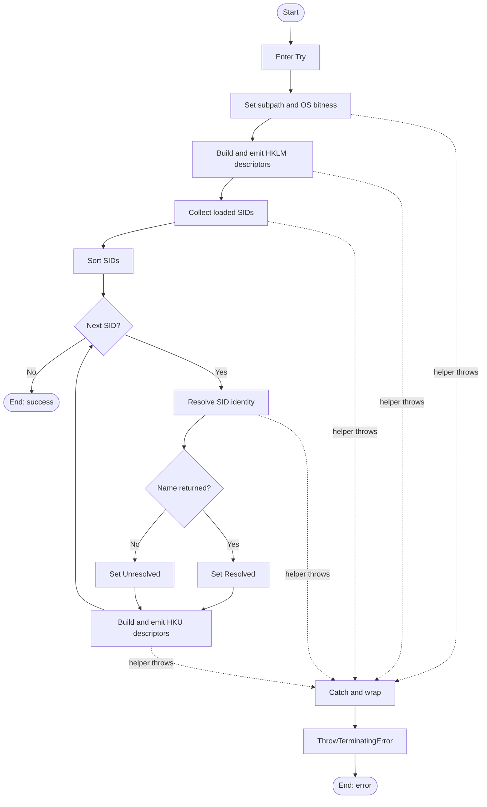

# Get-UninstallRegistryPath

## Purpose

`Get-UninstallRegistryPath` is the private discovery helper that builds the registry-view descriptor list used for uninstall discovery. `Start-Uninstaller` calls it once, captures its emitted descriptors, and passes them to `Get-InstalledApplication`. The function exists to centralize the standard uninstall subpath, expand each root into the correct 32-bit and 64-bit registry views through `New-RegistryViewDescriptor`, and attach HKU user identity metadata once per loaded SID in deterministic SID order instead of resolving identity once per uninstall entry.

## Parameters

This function takes no parameters.

## Return Value

The function emits one or more `StartUninstallerRegistryViewDescriptor` objects to the pipeline. The help block now documents `[StartUninstallerRegistryViewDescriptor[]]`, while `[OutputType([StartUninstallerRegistryViewDescriptor])]` declares the per-object pipeline type. The concrete class defines `DisplayRoot`, `Hive`, `Path`, `View`, `Source`, `InstallScope`, `UserSid`, `UserName`, and `UserIdentityStatus`. `New-RegistryViewDescriptor` also stamps the emitted records with the `StartUninstaller.RegistryViewDescriptor` PSTypeName for downstream formatting and tests.

On a successful run, HKLM descriptors are emitted first. On a 64-bit OS, the function emits 2 HKLM descriptors plus 2 descriptors per loaded SID; on a 32-bit OS, it emits 1 HKLM descriptor plus 1 descriptor per loaded SID. Loaded HKU SIDs are sorted with `StringComparer.OrdinalIgnoreCase` before emission, so HKU descriptor groups are deterministic even if registry enumeration order is not.

The function does not intentionally emit `$Null`. If `Get-LoadedUserRegistrySid` returns no SIDs, including its own warning-and-continue path, this function emits only HKLM descriptors. If a terminating exception occurs after some descriptors have already been emitted, direct pipeline callers can observe partial output before the terminating error is raised.

## Execution Flow

## Error Handling

- The whole function body is wrapped in a local `Try/Catch`.
- Any terminating exception from `Get-Is64BitOperatingSystem`, `Get-LoadedUserRegistrySid`, `Resolve-SidIdentity`, or `New-RegistryViewDescriptor` inside that `Try` block is wrapped in a new `System.InvalidOperationException` error record through `New-ErrorRecord`.
- The wrapper message is prefixed with `Unable to build uninstall registry descriptors:` and includes the original exception message text.
- The catch path does not preserve the original exception as `InnerException`; it creates a fresh `System.InvalidOperationException` with a formatted message.
- The catch block creates an `ErrorRecord` with error ID `GetUninstallRegistryPathFailed`, category `InvalidOperation`, and target object `$SubPath`, then raises it with `$PSCmdlet.ThrowTerminatingError(...)`.
- A SID translation miss is not treated as an error. If `Resolve-SidIdentity` returns `$Null`, the function sets `UserIdentityStatus = 'Unresolved'` and still emits HKU descriptors.
- If `Get-LoadedUserRegistrySid` handles HKU enumeration failure internally by warning and returning no SIDs, this function adds no extra warning and continues with HKLM-only output.
- The function has no local `Write-Warning`, `Write-Verbose`, or `Write-Debug` path of its own.
- Because HKLM descriptors are emitted before HKU enumeration begins, callers can observe partial output if a later terminating error occurs.

## Side Effects

This function has no direct side effects. It emits descriptor objects and invokes dependency helpers that read OS bitness, loaded HKU SIDs, and SID-to-name mappings, but it does not modify registry state, files, processes, or caller scope.

## Research Log

| Topic | Finding | Source | Date Verified |
|-------|---------|--------|---------------|
| Search: `"PowerShell Practice and Style guide"` | The `PowerShellPracticeAndStyle` guide is still published as an unofficial community baseline, but it remains guidance rather than a mandatory rulebook. This repo's house standard is materially stricter. | [PoshCode/PowerShellPracticeAndStyle](https://github.com/PoshCode/PowerShellPracticeAndStyle) | 2026-04-01 |
| Search: `"PSScriptAnalyzer what's new"` | Current official release notes show `PSScriptAnalyzer` 1.24.0 raised its minimum PowerShell version to 5.1 and expanded `UseCorrectCasing`. That is newer than many older house-style assumptions. | [What's new in PSScriptAnalyzer](https://learn.microsoft.com/en-us/powershell/utility-modules/psscriptanalyzer/whats-new-in-pssa?view=ps-modules) | 2026-04-01 |
| Search: `"PSScriptAnalyzer releases"` | SUPERSEDED. Earlier on 2026-04-02 this audit recorded that only `1.24.0` could be independently confirmed and that `1.25.0` plus `UseConsistentParametersKind` remained unverified. A later same-day recheck against the GitHub releases page showed that conclusion was incorrect. | [PSScriptAnalyzer releases](https://github.com/PowerShell/PSScriptAnalyzer/releases) | 2026-04-02 |
| Search: `"PSScriptAnalyzer releases"` | GitHub's releases page now lists `PSScriptAnalyzer` `1.25.0` (2026-03-20) as latest. Its published notes mention new rules including `AvoidReservedWordsAsFunctionNames`, `UseConsistentParametersKind`, `UseConsistentParameterSetName`, and `UseSingleValueFromPipelineParameter`. | [PSScriptAnalyzer releases](https://github.com/PowerShell/PSScriptAnalyzer/releases) | 2026-04-02 |
| Search: `"PSScriptAnalyzer security advisories GitHub"` | GitHub's security overview currently shows no published advisories for `PowerShell/PSScriptAnalyzer`; no new CVE-driven module action surfaced for this audit. | [PowerShell/PSScriptAnalyzer Security](https://github.com/PowerShell/PSScriptAnalyzer/security) | 2026-04-01 |
| Search: `"AvoidUsingPositionalParameters"` | The built-in analyzer rule still warns only when 3 or more positional arguments are used, which is looser than this repo's stricter no-positional-arguments rule. | [AvoidUsingPositionalParameters](https://learn.microsoft.com/en-us/powershell/utility-modules/psscriptanalyzer/rules/avoidusingpositionalparameters?view=ps-modules) | 2026-04-01 |
| Search: `"about_Functions_CmdletBindingAttribute PositionalBinding"` | `PositionalBinding` still defaults to `$true` when omitted, so bare `[CmdletBinding()]` does not satisfy a house rule that disables positional binding explicitly. | [about_Functions_CmdletBindingAttribute](https://learn.microsoft.com/en-us/powershell/module/microsoft.powershell.core/about/about_functions_cmdletbindingattribute?view=powershell-7.6) | 2026-04-01 |
| Search: `"about_Functions_CmdletBindingAttribute ConfirmImpact SupportsShouldProcess"` | Microsoft still documents that `ConfirmImpact` should be specified only when `SupportsShouldProcess` is also specified. That differs from this repo's template-driven practice of spelling out `ConfirmImpact = 'None'` on read-only helpers. | [about_Functions_CmdletBindingAttribute](https://learn.microsoft.com/en-us/powershell/module/microsoft.powershell.core/about/about_functions_cmdletbindingattribute?view=powershell-7.6) | 2026-04-02 |
| Search: `"about_Functions_OutputTypeAttribute"` | `OutputType` remains documentation metadata only. It isn't validated against runtime output, so return-shape accuracy still requires manual audit. | [about_Functions_OutputTypeAttribute](https://learn.microsoft.com/en-us/powershell/module/microsoft.powershell.core/about/about_functions_outputtypeattribute?view=powershell-7.5) | 2026-04-01 |
| Search: `"Comment-Based Help Keywords"` | SUPERSEDED. The previous audit tied this helper's documentation gap to a missing `.EXAMPLE`. The current source now includes `.EXAMPLE`, so that source-specific conclusion is no longer accurate. | [Comment-Based Help Keywords](https://learn.microsoft.com/en-us/powershell/scripting/developer/help/comment-based-help-keywords?view=powershell-7.6) | 2026-04-01 |
| Search: `"Comment-Based Help Keywords"` | SUPERSEDED. The previous audit said the remaining repo-standard help miss was an absent `.PARAMETER` placeholder. The current source now includes `.PARAMETER None`, so that source-specific conclusion is no longer accurate. | [Comment-Based Help Keywords](https://learn.microsoft.com/en-us/powershell/scripting/developer/help/comment-based-help-keywords?view=powershell-7.6) | 2026-04-02 |
| Search: `"Comment-Based Help Keywords"` | `.PARAMETER` remains a per-parameter help keyword, `.EXAMPLE` remains a first-class help keyword, and `.OUTPUTS` remains the documented place to describe returned types. The current helper now satisfies the repo's help-section completeness requirement, but its `.OUTPUTS` text can still be audited separately for specificity. | [Comment-Based Help Keywords](https://learn.microsoft.com/en-us/powershell/scripting/developer/help/comment-based-help-keywords?view=powershell-7.6) | 2026-04-02 |
| Search: `"about_Script_Blocks return keyword exits scriptblock"` | Scriptblocks still create a child scope, and `return` still exits the current scriptblock. That matters here because the codebase still uses `& { Process { } }` patterns in nearby discovery seams. | [about_Script_Blocks](https://learn.microsoft.com/en-us/powershell/module/microsoft.powershell.core/about/about_script_blocks?view=powershell-7.6) | 2026-04-01 |
| Search: `"RegistryView enum"` | `RegistryView.Default`, `Registry64`, and `Registry32` remain the supported way to target Windows registry views. No newer replacement or deprecation was found. | [RegistryView Enum](https://learn.microsoft.com/en-us/dotnet/api/microsoft.win32.registryview?view=net-8.0) | 2026-04-02 |
| Search: `"RegistryHive enum"` | `RegistryHive.LocalMachine` and `RegistryHive.Users` remain the current enum values for HKLM and HKU descriptor roots. No deprecation or breaking change surfaced. | [RegistryHive Enum](https://learn.microsoft.com/en-us/dotnet/api/microsoft.win32.registryhive?view=net-9.0) | 2026-04-01 |
| Search: `"SecurityIdentifier Translate NTAccount"` | SID-to-account translation still uses `SecurityIdentifier.Translate(Type)`, and unresolved mappings still surface as API exceptions. That still matches the repo's best-effort `Resolve-SidIdentity` seam design. | [SecurityIdentifier.Translate(Type)](https://learn.microsoft.com/en-us/dotnet/api/system.security.principal.securityidentifier.translate?view=net-8.0) | 2026-04-02 |
| Search: `"RegEnumKeyEx subkeys order"` | SUPERSEDED. Win32 registry enumeration still does not guarantee subkey order, but this is no longer a live determinism gap for `Get-UninstallRegistryPath` because the current implementation now sorts loaded SIDs before HKU emission. | [RegEnumKeyExA function](https://learn.microsoft.com/en-us/windows/win32/api/winreg/nf-winreg-regenumkeyexa) | 2026-04-01 |
| Search: `"RegEnumKeyEx subkeys order"` | `RegEnumKeyEx*` still does not guarantee subkey order. `Get-UninstallRegistryPath` now compensates by sorting `$LoadedSids` before emission, so HKU descriptor groups are deterministic even if HKU enumeration order changes. | [RegEnumKeyExA function](https://learn.microsoft.com/en-us/windows/win32/api/winreg/nf-winreg-regenumkeyexa) | 2026-04-02 |
| Search: `"StringComparer.OrdinalIgnoreCase best practice"` | Current .NET guidance still recommends ordinal or ordinal-ignore-case comparison for non-linguistic identifiers. Using `StringComparer.OrdinalIgnoreCase` to sort SID strings matches that guidance and avoids culture-sensitive ordering drift. | [Best Practices for Comparing Strings in .NET](https://learn.microsoft.com/en-us/dotnet/standard/base-types/string-comparison-net-5-plus) | 2026-04-01 |
| Search: `"registry key security and access rights"` | Windows registry security guidance still separates `KEY_READ` from write rights. That reinforces the plan's read-only discovery design and keeps this helper appropriately limited to descriptor construction rather than writable registry access. | [Registry Key Security and Access Rights](https://learn.microsoft.com/en-us/windows/win32/sysinfo/registry-key-security-and-access-rights) | 2026-04-01 |
| Search: `"PowerShell foreach keyword vs ForEach-Object performance"` | The `foreach` keyword remains faster than `ForEach-Object` for in-memory loops, but this repo's house standard (section 1.13) explicitly prohibits the `foreach` keyword in favor of the `& { Process { } }` pipeline pattern. The prohibition is a house-style decision, not a universal community recommendation. | [ForEach vs ForEach-Object issue](https://github.com/PoshCode/PowerShellPracticeAndStyle/issues/65) | 2026-04-02 |
| Search: `"about_Requires"` | `#Requires` remains a script-level parse-time prerequisite check. Microsoft notes it can appear on any line and even inside a function, but its scope is still global. That means this repo's "every function file includes `#Requires -Version 5.1`" rule is a house-style packaging requirement, not a PowerShell language necessity. | [about_Requires](https://learn.microsoft.com/en-us/powershell/module/microsoft.powershell.core/about/about_requires?view=powershell-7.6) | 2026-04-02 |
| Search: `"ThrowTerminatingError ErrorRecord"` | Microsoft still recommends `ThrowTerminatingError(ErrorRecord)` over throwing raw exceptions because the error record carries additional error context. That supports this function's current catch-and-rethrow pattern, even though the repo's local `New-ErrorRecord` helper is stricter. | [Terminating Errors](https://learn.microsoft.com/en-us/powershell/scripting/developer/cmdlet/terminating-errors?view=powershell-7.5) | 2026-04-02 |

## Standards Audit

| Rule | Status | Line(s) | Evidence |
|------|--------|---------|----------|
| Colon-bound parameters | REVIEW | 58, 72, 90, 93-101 | `Resolve-SidIdentity -Sid:$UserSid` and the `New-ErrorRecord` call use literal colon-bound syntax, but `New-RegistryViewDescriptor @SystemDescriptorParams` and `New-RegistryViewDescriptor @UserDescriptorParams` rely on splatting. The house rule does not explicitly say whether splatting satisfies the literal `-Name:'Value'` requirement. |
| PascalCase naming | PASS | 1, 46, 69-74, 92 | `Function Get-UninstallRegistryPath {`, `Try {`, `$LoadedSids | & { Process {`, `$IdentityStatus = If (...) {`, and `} Catch {` all use PascalCase keywords and identifiers. |
| Prohibited `foreach` keyword (use `& { Process { } }`) | PASS | 61-62, 69-91 | The function uses the required pipeline form: `Get-LoadedUserRegistrySid | & { Process { [System.String]$PSItem } }` and `$LoadedSids | & { Process { ... } }`; the `foreach` keyword does not appear. |
| Full .NET type names (no accelerators) | PASS | 47, 49, 54-55, 64-66, 70-73, 81, 93-101 | `[System.Boolean]`, `[System.Array]`, `[System.StringComparer]`, `[System.String]`, and `[System.Management.Automation.ErrorCategory]` use full type names rather than aliases such as `[bool]` or `[string]`. |
| Object types are the MOST appropriate and specific choice (not just a functional generic type like PSObject or Array) | PASS | 23-24, 40; `src/Private/A.Types.ps1` 42-74 | The help block now says `.OUTPUTS [StartUninstallerRegistryViewDescriptor[]]`, the attribute declares `[OutputType([StartUninstallerRegistryViewDescriptor])]`, and the concrete class explicitly defines `DisplayRoot`, `Hive`, `Path`, `View`, `Source`, `InstallScope`, `UserSid`, `UserName`, and `UserIdentityStatus`. |
| Single quotes for non-interpolated strings | PASS | 44, 51, 53, 56, 75, 77, 82-83, 85, 94, 100 | Non-interpolated literals use single quotes, for example `'Software\Microsoft\Windows\CurrentVersion\Uninstall'`, `'HKLM'`, `'System'`, `'Resolved'`, `'Unresolved'`, and `'GetUninstallRegistryPathFailed'`. |
| `$PSItem` not `$_` | PASS | 62, 70, 97 | The function uses `$PSItem` in the SID scriptblocks and catch-message construction; `$_` does not appear. |
| Explicit bool comparisons (`$Var -eq $True`, not just `$Var`) | PASS | 73-74 | The SID-resolution branch is written as `$HasResolvedName = [System.Boolean]($Null -ne $ResolvedName)` followed by `If ($HasResolvedName -eq $True) {`. |
| If conditions are pre-evaluated outside If blocks | PASS | 72-74 | The condition is pre-evaluated into `$HasResolvedName = [System.Boolean]($Null -ne $ResolvedName)` before the `If`. |
| `$Null` on left side of comparisons | PASS | 73 | The null comparison is written as `$Null -ne $ResolvedName`. |
| No positional arguments to cmdlets | PASS | 58, 72, 90, 93-101 | The function uses splatting or named parameters only: `New-RegistryViewDescriptor @SystemDescriptorParams`, `Resolve-SidIdentity -Sid:$UserSid`, `New-RegistryViewDescriptor @UserDescriptorParams`, and the colon-bound `New-ErrorRecord` call. |
| No cmdlet aliases | PASS | 47, 62, 72, 90, 93-102 | The function calls `Get-Is64BitOperatingSystem`, `Get-LoadedUserRegistrySid`, `Resolve-SidIdentity`, `New-RegistryViewDescriptor`, and `New-ErrorRecord` by full name. |
| Switch parameters correctly handled | N/A | 1-105 | The function defines no parameters and does not pass explicit values to any switch parameters. |
| CmdletBinding with all required properties | PASS | 31-39 | `[CmdletBinding(` includes `ConfirmImpact`, `DefaultParameterSetName`, `HelpURI`, `PositionalBinding`, `RemotingCapability`, `SupportsPaging`, and `SupportsShouldProcess`. |
| Leading commas in CmdletBinding attributes | FAIL | 31-39 | The attribute uses trailing commas (`ConfirmImpact = 'None',`) instead of the required leading-comma form from section 1.4. |
| OutputType declared | PASS | 40 | `[OutputType([StartUninstallerRegistryViewDescriptor])]` is declared immediately above `Param()`. |
| Comment-based help is complete (Synopsis, Description, Parameter, Example, Outputs, Notes) | PASS | 2-29 | The help block contains `.SYNOPSIS`, `.DESCRIPTION`, `.PARAMETER None`, `.EXAMPLE`, `.OUTPUTS`, and `.NOTES`. |
| Error handling via New-ErrorRecord or appropriate pattern | PASS | 92-102 | The catch block creates an error record via `New-ErrorRecord` and raises it with `$PSCmdlet.ThrowTerminatingError($ErrorRecord)`. |
| Try/Catch around operations that can fail | PASS | 46-103 | The function body is enclosed in `Try { ... } Catch { ... }`, covering dependency calls and descriptor construction. |
| Write-Debug at Begin/Process/End block entry and exit (if blocks are used) | FAIL | 43-104 | The function declares `Process {`, but `Write-Debug` does not appear anywhere in the file. |
| No variable pollution (no `script:` or `global:` scope leaks) | PASS | 44-102 | Working state stays in local variables such as `$SubPath`, `$LoadedSids`, `$ResolvedName`, `$HasResolvedName`, and `$ErrorRecord`; no `script:` or `global:` modifiers appear. |
| 96-character line limit | PASS | 1-105 | A file-wide scan returned `MaxLineLength=87;Line=101`; the longest line is still below the 96-character limit. |
| 2-space indentation (not tabs, not 4-space) | PASS | 1-105 | File-wide scans returned `INDENTATION_OK` and `NO_TABS_FOUND`; representative lines include `  [CmdletBinding(` and `      UserIdentityStatus = 'System'`. |
| OTBS brace style | PASS | 1, 46, 69, 74, 76, 92 | Braces follow OTBS forms such as `Function ... {`, `Try {`, `Process {`, `} Else {`, and `} Catch {`. |
| No commented-out code | PASS | 1-105 | The only comments are inside the help block (`<# ... #>`); there are no executable lines commented out elsewhere in the file. |
| Line continuation visual indicator | FAIL | 93-100 | The catch block uses backtick continuations in `New-ErrorRecord \`` lines, but there is no preceding `# --- [ Line Continuation ] ————↴` comment. |
| Registry access is read-only (if applicable) | N/A | 1-105 | This function does not open registry keys directly; it only builds descriptor metadata and delegates registry access to seam helpers. |
| UTF-8 with BOM for PS 5.1-targeted files | PASS | 1 | A byte scan returned `UTF8-BOM`; the file is BOM-encoded. |
| `#Requires -Version 5.1` present | FAIL | 29-31 | The help block ends at line 29 and the next construct is `[CmdletBinding(` on line 31; `#Requires -Version 5.1` is absent. |
| Localized user-facing messages are externalized to a companion `.strings.psd1` | FAIL | 93-101; `src/Private` | The catch path hardcodes `'Unable to build uninstall registry descriptors: {0}' -f ...` inline, and `src/Private/Get-UninstallRegistryPath.strings.psd1` is absent. |

### Footnotes

1. Official `Cmdlet.ThrowTerminatingError(ErrorRecord)` guidance still prefers throwing an `ErrorRecord` over throwing a raw exception because the error record carries additional context. This function matches that pattern by creating the record through `New-ErrorRecord` and then calling `$PSCmdlet.ThrowTerminatingError(...)`.
2. Microsoft help-keyword guidance does not require a `.PARAMETER` section for a parameterless function, but the repo standard does. The current source satisfies that repo-specific requirement with `.PARAMETER None`.
3. `OutputType` is metadata only, so this audit treats `[OutputType([StartUninstallerRegistryViewDescriptor])]` and help `.OUTPUTS [StartUninstallerRegistryViewDescriptor[]]` as complementary rather than contradictory: the attribute documents the per-object pipeline type, while the help text documents collection shape.
4. PowerShell treats `#Requires` as a script-level parse-time directive even if it appears inside a function or lower in a file. This audit still scores the repo's house rule literally against the standalone function file.
5. The house standard does not explicitly say whether hashtable splatting satisfies the literal "colon-bound parameters" rule. Because this function uses both splatting and literal colon-bound syntax, that row is scored as REVIEW rather than guessed PASS.
6. Microsoft documents that `ConfirmImpact` should be specified only when `SupportsShouldProcess` is specified. The house standard and frozen plan still take precedence for this audit, so the standards row checks explicit property presence while the plan row separately flags the non-interactivity mismatch.
7. The project plan's `13.2 Strings Files` guidance is looser than the house standard's `1.11` requirement. This audit keeps the stricter standards verdict and therefore scores the missing companion `Get-UninstallRegistryPath.strings.psd1` as a standards failure.

## Plan Audit

| Plan Section | Requirement | Status | Line(s) | Details |
|--------------|-------------|--------|---------|---------|
| `2. Frozen Product Decisions` | "`Discovery scope is: HKLM native uninstall view`, `HKLM WOW6432Node view on 64-bit OS`, and `loaded HKU<SID> user hives only`." | ALIGNED | `Get-UninstallRegistryPath.ps1` 44-90; `New-RegistryViewDescriptor.ps1` 211-267 | `$SubPath` is the standard uninstall path, HKLM descriptors are emitted first, 64-bit expansion is delegated to `New-RegistryViewDescriptor`, and HKU roots come only from `Get-LoadedUserRegistrySid`. |
| `5.2 Registry View Descriptor` | "`Get-UninstallRegistryPath` builds these descriptors once. `Get-InstalledApplication` consumes them.`" Required fields are `DisplayRoot`, `Hive`, `Path`, `View`, `Source`, `InstallScope`, `UserSid`, `UserName`, and `UserIdentityStatus`. | ALIGNED | `A.Types.ps1` 42-74; `Start-Uninstaller.ps1` 288-307; `Get-InstalledApplication.ps1` 18-20, 233-254; `New-RegistryViewDescriptor.ps1` 206-267 | `Start-Uninstaller` captures `@(Get-UninstallRegistryPath)` once and passes it to `Get-InstalledApplication`. The local class and descriptor helper define and stamp the exact planned fields, and discovery copies those fields onto application records downstream. |
| `7.1 Search Locations` | "`The script searches: HKLM\Software\Microsoft\Windows\CurrentVersion\Uninstall`" and "`HKU\<SID>\Software\Microsoft\Windows\CurrentVersion\Uninstall`". | ALIGNED | `Get-UninstallRegistryPath.ps1` 44-58, 80-90; `New-RegistryViewDescriptor.ps1` 211-267 | `$SubPath` is hard-coded to the standard uninstall location. HKLM uses it directly, HKU paths are composed as `'{0}\{1}' -f $UserSid, $SubPath`, and the helper emits `Registry64`, `Registry32`, or `Default` views as planned. |
| `7.2 Loaded User Hives` | "`Get-UninstallRegistryPath` is responsible for loaded `HKU` discovery." Include only real SID-shaped user hives and exclude `.DEFAULT`, `*_Classes`, `S-1-5-18`, `S-1-5-19`, and `S-1-5-20`. | ALIGNED | `Get-UninstallRegistryPath.ps1` 61-90; `Get-LoadedUserRegistrySid.ps1` 63-106; `tests/Private/Get-LoadedUserRegistrySid.Tests.ps1` 24-72 | The responsibility is implemented through the `Get-LoadedUserRegistrySid` seam. That helper excludes the reserved names, skips `_Classes`, validates real SID strings with `SecurityIdentifier`, and the tests prove it keeps valid user SIDs while excluding the forbidden entries. |
| `7.3 User Identity Resolution` | "`Resolve the username once per loaded SID during descriptor discovery, not once per application entry.`" Also: `UserName` is best-effort, `InstallScope = 'System'` for HKLM, `InstallScope = 'User'` for HKU, and `UserIdentityStatus` values are `System`, `Resolved`, or `Unresolved`. | ALIGNED | `Get-UninstallRegistryPath.ps1` 48-56, 69-90; `Resolve-SidIdentity.ps1` 53-66; `tests/Private/Get-UninstallRegistryPath.Tests.ps1` 189-235 | HKLM descriptors are stamped with `InstallScope = 'System'` and `UserIdentityStatus = 'System'`. Each HKU SID is resolved once at line 72, then mapped to `Resolved` or `Unresolved` before descriptor emission. |
| `7.7 Read Failures` | "`If a registry hive, parent key, or subkey cannot be read: emit a concise warning and continue with the rest of discovery.`" | ALIGNED | `Get-LoadedUserRegistrySid.ps1` 63-106; `Get-UninstallRegistryPath.ps1` 61-63; `tests/Private/Get-LoadedUserRegistrySid.Tests.ps1` 87-97 | HKU discovery failure is handled in the seam: `Get-LoadedUserRegistrySid` catches enumeration failure, writes `Cannot enumerate loaded user registry hives: ...`, returns no SIDs, and this function then continues with HKLM-only descriptors. |
| `12. File Structure` | "`Get-UninstallRegistryPath.ps1` must live under `src/Private/`." | ALIGNED | `src/Private/Get-UninstallRegistryPath.ps1` 1-105 | The implementation lives in the planned private-helper location. |
| `12. Function Responsibilities` | `Get-UninstallRegistryPath` "`builds machine/user registry descriptors`." | ALIGNED | `Get-UninstallRegistryPath.ps1` 43-90 | The function emits HKLM descriptors first, then HKU descriptors per loaded SID. That matches the planned responsibility and shows the helper is necessary rather than gratuitous abstraction. |
| `12. External Seams` | "`External dependencies must be wrapped behind private seam functions so tests can mock them reliably.`" | ALIGNED | `Get-UninstallRegistryPath.ps1` 47, 62, 72, 93; `tests/Private/Get-UninstallRegistryPath.Tests.ps1` 15-17, 62-64, 86-88, 171-173, 193-194, 221-222 | The function depends on seam helpers for OS bitness, loaded SID enumeration, SID translation, and error-record creation, and the unit tests mock the discovery seams directly. |
| `14.3 Discovery Tests` | "`HKLM` 32-bit and 64-bit path generation" must be tested. | ALIGNED | `tests/Private/Get-UninstallRegistryPath.Tests.ps1` 13-79 | The tests verify 64-bit HKLM emits two descriptors, 32-bit HKLM emits one descriptor, and the expected `Source`, `View`, `InstallScope`, and `Path` values are produced. |
| `14.3 Discovery Tests` | User SID filtering must exclude `.DEFAULT`, `*_Classes`, and service SIDs. | ALIGNED | `tests/Private/Get-LoadedUserRegistrySid.Tests.ps1` 24-72 | The seam tests assert that `.DEFAULT`, `S-1-5-18`, `S-1-5-19`, `S-1-5-20`, and `_Classes` entries are excluded before this function consumes the SID list. |
| `14.3 Discovery Tests` | SID resolution success and failure must be tested. | ALIGNED | `tests/Private/Get-UninstallRegistryPath.Tests.ps1` 189-235 | The tests verify both the resolved path (`UserIdentityStatus = 'Resolved'`, populated `UserName`) and the unresolved path (`UserIdentityStatus = 'Unresolved'`, null `UserName`). |
| `14.3 Discovery Tests` | "`filter by UserIdentityStatus = Unresolved`, `filter by exact UserName`, `filter by InstallScope = System`." | REVIEW | `tests/Private/Get-UninstallRegistryPath.Tests.ps1` 199-235; `tests/Private/Get-InstalledApplication.Tests.ps1` 160-178, 988-1001; `tests/Private/Test-ApplicationMatch.Tests.ps1` 455-459 | The helper and discovery tests verify those metadata fields are stamped correctly, and the filter engine has an explicit `InstallScope` match test. I did not find a direct discovery-path test that filters discovered application records by exact `UserName` or `UserIdentityStatus = Unresolved`, so the plan's named coverage requirement is only partially evidenced. |
| `14.3 Discovery Tests` | "`unreadable path warns and continues`." | ALIGNED | `tests/Private/Get-LoadedUserRegistrySid.Tests.ps1` 87-97 | The HKU-discovery seam is tested by forcing `Get-RegistryBaseKey` to throw and asserting a warning plus empty output rather than a terminating failure. |
| `14.3 Discovery Tests` | "`every registry open is read-only`." | ALIGNED | `Get-LoadedUserRegistrySid.ps1` 64-70; `tests/Private/Get-LoadedUserRegistrySid.Tests.ps1` 119-145 | This helper does not open registry keys directly. Its HKU seam uses `Get-RegistryBaseKey` with `RegistryView.Default`, and the test asserts that `Get-RegistrySubKey` is not used here. |
| `15. Phase 3 Acceptance` | Phase 3 requires "`all discovery records are deterministic`" and "`user identity metadata is correct`". | ALIGNED | `Get-UninstallRegistryPath.ps1` 61-90; `tests/Private/Get-UninstallRegistryPath.Tests.ps1` 167-235 | The function sorts `$LoadedSids` before emission, and the tests verify HKU descriptor groups are emitted in SID order regardless of enumeration order. Identity metadata is stamped once per SID and tested for both resolved and unresolved cases. |
| `4.4 No Interactivity` | "`The script must not prompt.` Specifically: `no SupportsShouldProcess`, `no ConfirmImpact`, `no Read-Host`, and `no GUI`." | DEVIATION | `Get-UninstallRegistryPath.ps1` 31-38 | The helper is behaviorally non-interactive and contains no `Read-Host` or GUI path, but it still literally declares `ConfirmImpact = 'None'` and `SupportsShouldProcess = $False`, which contradicts the plan text as written. This still looks like a template carryover rather than a runtime prompt bug. |
| `4.3 Exit Codes` / `5.3 Uninstall Result Record` / `10.4 Per-Entry Outcome Mapping` | The plan defines script exit codes and uninstall outcomes such as `Blocked`, `Failed`, `Succeeded`, and `TimedOut`. | N/A | `Get-UninstallRegistryPath.ps1` 1-105 | This helper only emits registry descriptor records. It does not perform uninstall work, map outcomes, or assign script exit codes. |

## Changelog

| Date | Changes |
|------|---------|
| 2026-04-02 | Corrected the README against the live helper instead of the previous audit's stale assumptions. Fixed the return-value and standards sections to reflect that the help block now documents `[StartUninstallerRegistryViewDescriptor[]]`, so the type-specificity finding is now PASS rather than FAIL. Restored the live line-continuation finding because the catch block still uses unannotated backtick continuations, added a new FAIL for missing `Write-Debug` lifecycle tracing in the existing `Process` block, and added the previously missed house-standard FAIL for the absent companion `Get-UninstallRegistryPath.strings.psd1` despite an inline user-facing error message. Corrected the error-handling narrative to note that `New-ErrorRecord` creates a fresh `InvalidOperationException` without preserving the original exception as `InnerException`, added current research on `ConfirmImpact` versus `SupportsShouldProcess`, and flagged a partial discovery-test coverage gap for exact `UserName` and `UserIdentityStatus = Unresolved` filtering as REVIEW rather than silently assuming full evidence. |
| 2026-04-02 | Corrected the README to match the current source after the helper moved away from the old `foreach`/generic-`PSObject` implementation. Updated the return-type documentation to `StartUninstallerRegistryViewDescriptor`, fixed the standards audit to mark PascalCase naming, the prohibited-`foreach` rule, explicit boolean comparison, pre-evaluated conditions, comment-based help completeness, terminating-error handling, line-continuation applicability, and UTF-8 BOM status correctly, and retained only the remaining live issues: leading-comma `[CmdletBinding()]` formatting, generic `.OUTPUTS` help text, missing `#Requires -Version 5.1`, and the plan's literal non-interactivity attribute mismatch. Superseded the stale research row about a missing `.PARAMETER` placeholder, corrected the earlier same-day PSScriptAnalyzer 1.25.0 false negative, and added current research on `about_Requires` and `ThrowTerminatingError(ErrorRecord)`. |
| 2026-04-02 | Added three new standards-audit findings: (1) prohibited `foreach` keyword at line 62 per section 1.13, scored separately from the existing PascalCase casing violation; (2) trailing commas in `[CmdletBinding()]` at lines 29-35 instead of required leading-comma form per section 1.4; (3) missing line-continuation visual indicator comments above backtick continuations at lines 44-52 and 71-79 per sections 1.3/1.4. Revised the PSScriptAnalyzer 1.25.0 research entry to note that version 1.25.0 and the `UseConsistentParametersKind` rule could not be independently verified through web search; `AvoidReservedWordsAsFunctionNames` was confirmed to exist but its release version is unverified. Refreshed verification dates on `RegistryView`, `SecurityIdentifier.Translate`, and `RegEnumKeyEx` research entries. Added new research entry documenting that the `foreach` keyword prohibition is a house-style rule, not a universal community recommendation. |
| 2026-04-01 | Corrected the README against the current source: documented the whole-function `Try/Catch`, deterministic HKU SID sorting, wrapped `InvalidOperationException` behavior, partial-output edge case, and updated tests. Replaced stale standards findings with current line-backed verdicts, added missing checks for condition pre-evaluation, type specificity, and `#Requires -Version 5.1`, and corrected the plan audit to mark determinism aligned while flagging the literal `ConfirmImpact`/`SupportsShouldProcess` plan mismatch. Added research updates for comment-based help, registry enumeration ordering, ordinal SID sorting guidance, registry security guidance, and current PSScriptAnalyzer security status. |
| 2026-04-01 | First audit run. Created the initial README for `Get-UninstallRegistryPath`, added current-source research with URLs, documented actual control flow and return behavior, recorded strict house-style failures in the source, and flagged the unsorted HKU SID ordering as a determinism review item against the project plan. |
AUDIT_STATUS:UPDATED