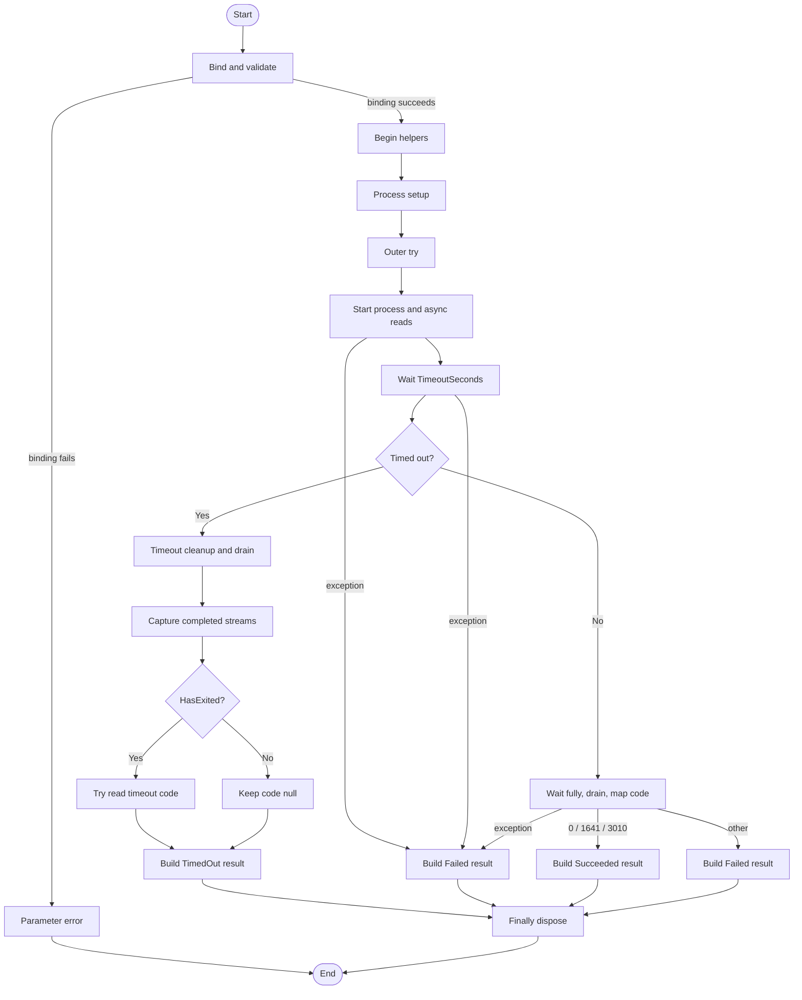

# Invoke-SilentProcess

## Purpose

`Invoke-SilentProcess` is the private process-execution helper that
`Start-Uninstaller` calls after `Resolve-UninstallCommand` has produced a
supported executable path and raw argument string. It launches the child
process with hidden-window and no-shell settings, drains stdout and stderr
asynchronously to avoid redirected-stream deadlocks, enforces the per-entry
timeout, and returns one structured execution result with `Outcome`,
`ExitCode`, and `Message`. It exists so the public orchestrator can treat
process execution as one testable seam instead of coordinating
`System.Diagnostics.Process`, stream capture, timeout cleanup, and exit-code
mapping inline.

## Parameters

| Name | Type | Required | Default | Description |
|------|------|----------|---------|-------------|
| `FileName` | `System.String` | Yes | None | Executable path to launch. Empty and `$Null` values are rejected by parameter validation. In practice, because `UseShellExecute = $False`, .NET also permits a simple executable name that can be resolved from `PATH` when the caller does not pass a fully qualified path. |
| `Arguments` | `System.String` | No | `''` | Raw command-line argument string forwarded to `ProcessStartInfo.Arguments` unchanged. Empty string is explicitly allowed. Quoting, escaping, trust validation, and the underlying `Arguments` length limit remain the caller's responsibility. |
| `TimeoutSeconds` | `System.Int32` | No | `600` | Per-process timeout in seconds. The valid range is `1..3600`. |

## Return Value

After parameter binding succeeds, each invocation emits exactly one
`[StartUninstallerProcessResult]` instance by placing
`[StartUninstallerProcessResult]::new(...)` on the pipeline. That class is
defined in `src/Private/A.Types.ps1` and contains `Outcome`
(`System.String`), `ExitCode` (`System.Nullable[System.Int32]`), and
`Message` (`System.String`); the executable code reflects that with
`[OutputType([StartUninstallerProcessResult])]` and the three constructor
calls in the function body. The comment-based help `.OUTPUTS` line is stale
and still says `[System.Management.Automation.PSObject]`, but the function
does not construct or emit a generic `PSObject`.

- Success path: returns `Outcome = 'Succeeded'`, the actual process exit code,
  and one of the exact success messages for exit codes `0`, `1641`, or `3010`.
- Non-success completed-process path: returns `Outcome = 'Failed'`, the actual
  exit code, and a message beginning with `Exit code <n>.`; when captured
  stderr and/or stdout contain non-whitespace text, the function appends
  normalized `stderr: ...` and `stdout: ...` details.
- Timeout path: returns `Outcome = 'TimedOut'`, the actual exit code if one can
  be read after timeout cleanup, otherwise `ExitCode = $Null`, and a message
  beginning with `Process timed out after <n> seconds.`; timeout messages use
  the same optional stdout/stderr enrichment.
- Outer-catch path: returns `Outcome = 'Failed'`, `ExitCode = $Null`, and a
  message beginning with `Failed to start process`.
- Captured stream snippets are normalized before they are appended to
  `Message`: CR, LF, and TAB become spaces, repeated whitespace collapses,
  surrounding whitespace is trimmed, and each stream is truncated to 200
  characters.

There is no designed `$Null` return and no deliberate no-output path once the
`Begin`/`Process` lifecycle starts. Parameter binding and validation failures
happen before those blocks run, so those cases throw and produce no result
object from this function.

## Execution Flow

Flow notes:

- The `Begin` block defines `Format-CapturedStreamText`,
  `Get-ResultMessage`, `$SuccessCodes`, and `$DrainWaitMs`. There is no
  `End` block.
- `Timeout cleanup and drain` groups three local `Try/Catch` blocks:
  `Stop-ProcessTree`, a short post-kill `WaitForExit`, and `Task.WaitAll` for
  the stdout/stderr tasks. Failures are wrapped through `New-ErrorRecord`, but
  only their exception messages are written to the verbose stream.
- `Capture completed streams` reads `Task.Result` only when each async read
  task finished with `TaskStatus = RanToCompletion`.
- `Build Failed result` on the completed-process path uses
  `Get-ResultMessage` to append normalized child output when useful. The outer
  catch also builds a `Failed` result, but its message always starts with
  `Failed to start process '<FileName>': ...`, even when the exception happened
  after launch.
- `Build Succeeded result` uses only the base success message and intentionally
  does not append captured child output.

## Error Handling

- Missing `FileName`, empty `FileName`, or an out-of-range `TimeoutSeconds`
  value trigger parameter binding or validation errors before the function body
  starts. In those cases the function does not return its result object.
- The outer `Try/Catch` converts exceptions raised during process start,
  redirected stream task creation, timed waiting, indefinite waiting,
  completed-path exit-code access, or result construction into a `Failed`
  result with `ExitCode = $Null`.
- Because that outer catch wraps the whole process-execution body, it always
  formats the message as `Failed to start process '<FileName>': ...`, even when
  the exception happened after the process had already started.
- If `Process.Start($StartInfo)` returns `$Null` and the next line dereferences
  `$Process.StandardOutput`, that null dereference is also absorbed by the outer
  catch and surfaces as the same `Failed to start process` result.
- On timeout, failures from `Stop-ProcessTree`, the short post-kill
  `WaitForExit`, and `Task.WaitAll` are each caught locally, passed through
  `New-ErrorRecord`, and then reduced to `Write-Verbose` messages. The function
  still returns `Outcome = 'TimedOut'`.
- On the completed-process path, failures from the final `Task.WaitAll` use the
  same `New-ErrorRecord` plus verbose-only pattern, so late stream-drain
  problems do not change the exit-code mapping once the process has exited.
- Captured stdout/stderr are best-effort. The function reads `Task.Result` only
  when each read task finished with `TaskStatus = RanToCompletion`.
- Timeout exit codes are also best-effort. The function reads
  `$Process.ExitCode` only if `$Process.HasExited -eq $True`; if that read
  throws, the local catch silently leaves `ExitCode = $Null`.
- The function itself does not call `Write-Warning`, `Write-Error`, or `Throw`
  after parameter binding. Its only designed side-channel diagnostics are
  verbose messages from the local cleanup and drain catches.

## Side Effects

This function starts an external process, redirects and drains its stdout and
stderr streams, may terminate the full process tree through `Stop-ProcessTree`
on timeout, writes verbose diagnostic messages when cleanup or stream-drain
steps fail, and disposes the `System.Diagnostics.Process` object before exit. It
does not access the registry, modify files, perform network operations, or
write to outer scopes.

## Research Log

The prior `PSCustomObject`-specific row remains superseded because this helper
still returns a named class instance instead. All previously retained rows
remain current, and this run added rows for current `ConfirmImpact` guidance,
advanced parameter-validation behavior, `UseShellExecute = $False` executable
resolution, and `ReadToEndAsync` exception semantics because those findings
affect the parameter, standards, and error-handling audit.

| Topic | Finding | Source | Date Verified |
|-------|---------|--------|---------------|
| Search: `PowerShell Practice and Style guide current` | The community PowerShell Practice and Style guide is still active, but it explicitly describes itself as evolving guidance and says the style guide remains in preview. This repo's house standard is materially stricter than the public baseline. | https://poshcode.gitbook.io/powershell-practice-and-style | 2026-04-01 |
| Search: `PSScriptAnalyzer what's new latest rules` | Current PSScriptAnalyzer release notes still show 1.24.0 as the published baseline and note two relevant changes: the minimum supported PowerShell version is now 5.1 and `UseCorrectCasing` was expanded. That is newer than older assumptions about analyzer scope. | https://learn.microsoft.com/en-us/powershell/utility-modules/psscriptanalyzer/whats-new-in-pssa?view=ps-modules | 2026-04-01 |
| Search: `about_Functions_CmdletBindingAttribute PositionalBinding default` | Microsoft still documents `PositionalBinding` as defaulting to `$true`, so codebases that forbid positional binding must set it explicitly rather than relying on `[CmdletBinding()]` alone. | https://learn.microsoft.com/en-us/powershell/module/microsoft.powershell.core/about/about_functions_cmdletbindingattribute?view=powershell-7.6 | 2026-04-01 |
| Search: `Comment-Based Help Keywords .EXAMPLE .OUTPUTS .NOTES` | `.SYNOPSIS`, `.DESCRIPTION`, `.PARAMETER`, `.EXAMPLE`, `.OUTPUTS`, and `.NOTES` all remain first-class comment-based help keywords. That supports treating the missing `.EXAMPLE` section as an actual documentation gap, not a legacy convention. | https://learn.microsoft.com/en-us/powershell/scripting/developer/help/comment-based-help-keywords?view=powershell-7.6 | 2026-04-01 |
| Search: `about_Functions_OutputTypeAttribute` | `OutputType` still reports intended output metadata only. Microsoft explicitly says the attribute value is not derived from the function code or compared to actual output, so it can be inaccurate. | https://learn.microsoft.com/en-us/powershell/module/microsoft.powershell.core/about/about_functions_outputtypeattribute?view=powershell-7.5 | 2026-04-01 |
| Search: `Process.Start(ProcessStartInfo) returns null exceptions` | `Process.Start(ProcessStartInfo)` is still current, is not deprecated, and Microsoft still documents that it can return `null` or a process whose `HasExited` property is already `true`. The current function does not defensively check for a `null` return before dereferencing `StandardOutput`. | https://learn.microsoft.com/en-us/dotnet/api/system.diagnostics.process.start?view=net-10.0 | 2026-04-01 |
| Search: `Process.WaitForExit Int32 and WaitForExit()` | `WaitForExit(Int32)` still returns a `bool` timeout result, and `WaitForExit()` still waits indefinitely. Microsoft also still recommends following a successful timed wait with parameterless `WaitForExit()` when redirected output uses asynchronous event handlers, which aligns with this function's two-stage wait pattern in principle. | https://learn.microsoft.com/en-us/dotnet/api/system.diagnostics.process.waitforexit?view=net-10.0 | 2026-04-01 |
| Search: `RedirectStandardOutput RedirectStandardError deadlock async read` | Microsoft still warns that redirected stdout/stderr can deadlock if the parent waits before draining the streams. Asynchronous read patterns remain the recommended way to avoid deadlock when both streams are redirected. This validates the legacy audit fix that introduced asynchronous draining. | https://learn.microsoft.com/en-us/dotnet/api/system.diagnostics.processstartinfo.redirectstandardoutput?view=net-10.0 | 2026-04-01 |
| Search: `ProcessStartInfo.ArgumentList vs Arguments` | `ProcessStartInfo.ArgumentList` is the newer safer API when arguments are available as discrete tokens because it escapes them automatically. `Arguments` remains supported, but Microsoft says `ArgumentList` should be preferred when the caller is not sure how to escape arguments correctly. | https://learn.microsoft.com/en-us/dotnet/api/system.diagnostics.processstartinfo.argumentlist?view=net-10.0 | 2026-04-01 |
| Search: `ProcessStartInfo.Arguments trusted input` | `ProcessStartInfo.Arguments` still represents a single raw argument string. That means quoting and escaping remain the caller's responsibility, which matters here because `Invoke-SilentProcess` accepts and forwards `Arguments` unchanged. | https://learn.microsoft.com/en-us/dotnet/api/system.diagnostics.processstartinfo.arguments?view=net-10.0 | 2026-04-01 |
| Search: `CA3006 process command injection` | Microsoft still flags process launch as a command-injection surface when untrusted input reaches a process command. The current guidance is to avoid starting processes from untrusted input when possible, or validate against a known safe character and length set. | https://learn.microsoft.com/en-us/dotnet/fundamentals/code-analysis/quality-rules/ca3006 | 2026-04-01 |
| Search: `ProcessStartInfo.CreateNoWindow` | `CreateNoWindow` still works only when `UseShellExecute` is `false`; Microsoft also notes it is ignored when `UserName` and `Password` are specified. That matches the current launch configuration and confirms the helper is depending on direct process creation, not the shell. | https://learn.microsoft.com/en-us/dotnet/api/system.diagnostics.processstartinfo.createnowindow?view=net-10.0 | 2026-04-01 |
| Search: `.NET 8 ProcessStartInfo.WindowStyle honored when UseShellExecute false` | Microsoft published a .NET 8 compatibility note stating that `WindowStyle` is now honored even when `UseShellExecute = false`. That is a cross-runtime behavior change: on Windows PowerShell 5.1 / .NET Framework, `CreateNoWindow` is the stronger guarantee, while on PowerShell 7+ / .NET 8+ `WindowStyle = Hidden` may now take effect too. | https://learn.microsoft.com/en-us/dotnet/core/compatibility/core-libraries/8.0/processstartinfo-windowstyle | 2026-04-01 |
| Search: `UseCorrectCasing PowerShell keywords operators lowercase` | Current `UseCorrectCasing` guidance still enforces exact casing for type names and command or parameter names, but lowercase for language keywords and operators. That conflicts with this repo's house standard, which deliberately requires PascalCase keywords, so analyzer-era community guidance and repo policy now diverge on this point. | https://learn.microsoft.com/en-us/powershell/utility-modules/psscriptanalyzer/rules/usecorrectcasing?view=ps-modules | 2026-04-01 |
| Search: `Process.Kill(Boolean) entire process tree net 10` | Current .NET exposes `Process.Kill(Boolean)` to terminate a process and optionally its descendants, but Microsoft notes that `WaitForExit()` and `HasExited` reflect the root process, not necessarily every descendant. For this PowerShell 5.1-baseline repo, the existing `Stop-ProcessTree` seam remains defensible, but newer runtimes do have a built-in tree-kill API. | https://learn.microsoft.com/en-us/dotnet/api/system.diagnostics.process.kill?view=net-10.0 | 2026-04-01 |
| Search: `about_PSCustomObject New-Object psobject property` | SUPERSEDED on 2026-04-02: Microsoft still documents that `New-Object -TypeName psobject -Property @{...}` yields a `System.Management.Automation.PSCustomObject` with note properties, but that is no longer the construction path used by `Invoke-SilentProcess`. | https://learn.microsoft.com/en-us/powershell/module/microsoft.powershell.core/about/about_pscustomobject?view=powershell-7.5 | 2026-04-01 |
| Search: `about_Classes PowerShell 5.1 custom types [ClassName]::new()` | Microsoft still documents that PowerShell classes are available starting in version 5.0, the class name becomes the runtime type, and instances can be created with `[ClassName]::new(...)`. That validates that the current helper returns `StartUninstallerProcessResult` objects rather than generic `PSObject` output. | https://learn.microsoft.com/en-us/powershell/module/microsoft.powershell.core/about/about_classes?view=powershell-5.1 | 2026-04-02 |
| Search: `ProcessStartInfo.UseShellExecute redirected streams official guidance` | Microsoft's supplemental `UseShellExecute` guidance still says setting `UseShellExecute` to `false` is what enables redirected input, output, and error streams, and that `UseShellExecute = false` limits `Process` launch to executables. That remains directly relevant to this helper's launch configuration. | https://learn.microsoft.com/en-us/dotnet/fundamentals/runtime-libraries/system-diagnostics-processstartinfo-useshellexecute | 2026-04-02 |
| Search: `about_Functions_CmdletBindingAttribute ConfirmImpact SupportsShouldProcess` | Microsoft still documents that `ConfirmImpact` should be specified only when `SupportsShouldProcess` is also specified. That means this helper's `ConfirmImpact = 'None'` is not just a plan-style disagreement; it also diverges from current platform guidance. | https://learn.microsoft.com/en-us/powershell/module/microsoft.powershell.core/about/about_functions_cmdletbindingattribute?view=powershell-7.6 | 2026-04-02 |
| Search: `about_Functions_Advanced_Parameters ValidateRange ValidateNotNullOrEmpty` | PowerShell still raises binding errors for `ValidateRange` and `ValidateNotNullOrEmpty` violations before the function body runs. That confirms `TimeoutSeconds` and `FileName` validation failures produce no result object from `Invoke-SilentProcess`. | https://learn.microsoft.com/en-us/powershell/module/microsoft.powershell.core/about/about_functions_advanced_parameters?view=powershell-7.5 | 2026-04-02 |
| Search: `ProcessStartInfo WorkingDirectory UseShellExecute false FileName PATH` | Microsoft still documents that when `UseShellExecute = false`, `WorkingDirectory` is not used to locate the executable and `FileName` can be either a fully qualified path or a simple executable name resolved via `PATH`. That refines this helper's `FileName` contract: callers are not required to pass a fully qualified path. | https://learn.microsoft.com/en-us/dotnet/fundamentals/runtime-libraries/system-diagnostics-processstartinfo-useshellexecute | 2026-04-02 |
| Search: `StreamReader ReadToEndAsync current exception behavior` | `ReadToEndAsync()` still stores non-usage exceptions on the returned task and throws usage exceptions synchronously. That validates this helper's pattern of keeping task creation inside the outer `Try/Catch` and reading `Task.Result` only after `RanToCompletion`. | https://learn.microsoft.com/en-us/dotnet/api/system.io.streamreader.readtoendasync?view=net-9.0 | 2026-04-02 |

## Standards Audit

| Rule | Status | Line(s) | Evidence |
|------|--------|---------|----------|
| Colon-bound parameters | PASS | 108-109, 163, 174, 295-298 | `Format-CapturedStreamText -Text:$Stderr`, `Stop-ProcessTree -ProcessId:$Process.Id`, `Write-Verbose -Message:$CleanupErrorRecord.Exception.Message`, and `Get-ResultMessage -BaseMessage:$BaseMessage -Stdout:$StdoutText -Stderr:$StderrText` all use named colon-bound syntax. |
| PascalCase naming | PASS | 1, 65-66, 93-94, 131-149 | `Function Invoke-SilentProcess {`, `Function Format-CapturedStreamText {`, `Function Get-ResultMessage {`, `$SuccessCodes`, `$DrainWaitMs`, `$StartInfo`, and `$TimeoutSeconds` follow PascalCase naming. |
| Full .NET type names (no accelerators) | PASS | 31, 51, 61, 69, 107, 136, 173, 193-194 | Examples include `[System.Management.Automation.PSObject]`, `[System.String]`, `[System.Int32]`, `[System.Collections.Generic.List[System.String]]::new()`, `[System.Diagnostics.ProcessStartInfo]::new()`, `[System.Management.Automation.ErrorCategory]::OperationStopped`, and `[System.Threading.Tasks.Task[]]@($StdoutTask, $StderrTask)`. |
| Object types are the most appropriate and specific choice | PASS | `Invoke-SilentProcess.ps1` 47, 235-244, 300-303, 317-320; `A.Types.ps1` 26-39 | `[OutputType([StartUninstallerProcessResult])]` and `[StartUninstallerProcessResult]::new(...)` use a dedicated result type, and the class defines exactly `[System.String]$Outcome`, `[System.Nullable[System.Int32]]$ExitCode`, and `[System.String]$Message`. |
| Single quotes for non-interpolated strings | PASS | 57, 77, 80-81, 115, 172, 205, 285-288, 310 | Examples include `$Arguments = ''`, `''`, `'[\r\n\t]'`, `'\s{2,}'`, `('stderr: {0}' -f $NormalizedStdErr)`, `'InvokeSilentProcessTimeoutCleanupFailed'`, `'Success.'`, and `'Failed to start process ''{0}'': {1}' -f`. |
| `$PSItem` not `$_` | PASS | 169, 184, 202, 258, 312 | Catch blocks use `$PSItem.Exception.Message`, and a full-file search found no `$_` token. |
| Explicit bool comparisons (`$Var -eq $True`) | PASS | 76, 85, 114, 120, 161, 214, 221, 227, 291-292, 324 | Examples include `If ($IsBlankText -eq $True) {`, `If ($TimedOut -eq $True) {`, `If ($HasCompletedStdout -eq $True) {`, `If ($HasExitedAfterCleanup -eq $True) {`, `If ($IsSuccess -eq $True) {`, and `If ($HasProcess -eq $True) { $Process.Dispose() }`. |
| If conditions are pre-evaluated outside `If` blocks | PASS | 73-76, 84-85, 111-114, 160-161, 210-214, 217-221, 226-227, 323-324 | Representative pairs include `$TimedOut = [System.Boolean]($Exited -eq $False)` followed by `If ($TimedOut -eq $True) {`, and `$HasProcess = [System.Boolean]($Null -ne $Process)` followed by `If ($HasProcess -eq $True) { $Process.Dispose() }`. |
| `$Null` on left side of comparisons | PASS | 323-324 | `$HasProcess = [System.Boolean]($Null -ne $Process)` keeps `$Null` on the left side of the comparison. |
| No positional arguments to cmdlets | PASS | 108-109, 163, 174, 295-298 | `Format-CapturedStreamText -Text:$Stderr`, `Stop-ProcessTree -ProcessId:$Process.Id`, `Write-Verbose -Message:$CleanupErrorRecord.Exception.Message`, and `Get-ResultMessage -BaseMessage:$BaseMessage -Stdout:$StdoutText -Stderr:$StderrText` all bind by parameter name. |
| No cmdlet aliases | PASS | 163, 174, 189, 207, 263 | The function calls `Stop-ProcessTree` and `Write-Verbose` by their full names, and a full-file search found no aliases such as `gci`, `where`, `?`, or `%`. |
| Switch parameters correctly handled | N/A | 48-63, 65-327 | The function declares no `[System.Management.Automation.SwitchParameter]` parameters and does not pass explicit values to any switch parameter in the body. |
| CmdletBinding with all required properties | PASS | 38-45 | `[CmdletBinding( ConfirmImpact = 'None', DefaultParameterSetName = 'Default', HelpURI = '', PositionalBinding = $False, RemotingCapability = 'None', SupportsPaging = $False, SupportsShouldProcess = $False )]` explicitly lists the repo's expected properties. |
| OutputType declared | PASS | 47 | `[OutputType([StartUninstallerProcessResult])]` is present above the `Param()` block. |
| Comment-based help is complete | PASS | 3-35 | The help block includes `.SYNOPSIS`, `.DESCRIPTION`, `.PARAMETER FileName`, `.PARAMETER Arguments`, `.PARAMETER TimeoutSeconds`, `.EXAMPLE`, `.OUTPUTS`, and `.NOTES`. |
| Error handling via `New-ErrorRecord` or appropriate pattern | FAIL | 165-174, 180-189, 198-207, 227-231, 254-263, 307-320 | Major catch paths now call `New-ErrorRecord`, for example `$CleanupErrorRecord = New-ErrorRecord ...` and `$ErrorRecord = New-ErrorRecord ...`, but the timeout exit-code read still uses `Catch { $ExitCode = $Null }` with no `New-ErrorRecord` or other reporting, and the cleanup/drain catches downgrade their records to `Write-Verbose -Message:$...Exception.Message` only. |
| Try/Catch around operations that can fail | PASS | 151-325, 162-174, 177-189, 192-207, 228-231, 248-263, 306-320 | The full execution path is wrapped in `Try { ... } Catch { ... } Finally { ... }`, and timeout cleanup, timeout wait, timeout drain, timeout exit-code access, and final `Task.WaitAll` each add local `Try/Catch` protection. |
| Write-Debug at Begin/Process/End block entry and exit (if blocks are used) | FAIL | 65-133, 135-327 | The function does define lifecycle blocks as `Begin {` and `Process {`, but neither block contains `Write-Debug -Message:'[Invoke-SilentProcess] Entering Block: ...'` or matching leave messages. |
| No variable pollution (no `script:` or `global:` scope leaks) | PASS | 145-149 | Working state is kept in local variables such as `$Process = $Null`, `$StdoutTask = $Null`, `$StderrTask = $Null`, `$StdoutText = [System.String]::Empty`, and a full-file search found no `script:` or `global:` assignments. |
| 96-character line limit | PASS | 1-327 | The longest live line is line 173, `-ErrorCategory:([System.Management.Automation.ErrorCategory]::OperationStopped)`, at 91 characters, so the file stays under the 96-character limit. |
| 2-space indentation (not tabs, not 4-space) | PASS | 38-63, 65-133, 135-327 | Representative lines such as `  [CmdletBinding(`, `    [System.String]`, and `      $TimedOut = [System.Boolean]($Exited -eq $False)` use 2-space indentation, and a full-file search found no tab characters. |
| OTBS brace style | PASS | 1, 76, 78, 85, 151, 162, 245, 306, 322-324 | The function uses `Function Invoke-SilentProcess {`, `If (...) {`, `} Else {`, `Try {`, `} Catch {`, and `} Finally {` with opening braces on the same line as their control keywords. |
| No commented-out code | PASS | 2-36 | The only comment block is the comment-based help `<# ... #>`; there are no disabled executable statements. |
| Registry access is read-only (if applicable) | N/A | 1-327 | This function does not access the registry. |

Standards notes:

1. Current `UseCorrectCasing` guidance prefers lowercase keywords and operators,
   but this repo's authoritative standard explicitly requires PascalCase
   keywords. The table above scores against the repo standard, not the newer
   analyzer guidance.
2. Current Microsoft `CmdletBinding` guidance now also says `ConfirmImpact`
   should be specified only when `SupportsShouldProcess` is specified. The
   standards table above still scores against the house rule set, which
   requires explicit property enumeration and does not currently reconcile that
   guidance.
3. The helper's result-object architecture still means many operational
   failures are surfaced as `StartUninstallerProcessResult` data instead of
   emitted error records. The table therefore fails the error-handling rule
   only on the remaining silent and verbose-only paths, not on absence of
   `New-ErrorRecord` usage.
4. The comment-based help `.OUTPUTS` line still says
   `[System.Management.Automation.PSObject]`, but the executable metadata and
   runtime object are `StartUninstallerProcessResult`. The completeness check
   stays PASS because the section exists; the content mismatch is documented in
   the Return Value section.

## Plan Audit

| Plan Section | Requirement | Status | Line(s) | Details |
|--------------|-------------|--------|---------|---------|
| `12. File Structure` | `src/Private/Invoke-SilentProcess.ps1` must exist as a private helper. | ALIGNED | `Invoke-SilentProcess.ps1` 1-327 | The implementation is in the planned private location and is not exposed as a public entrypoint. |
| `12. Function Responsibilities` | `Invoke-SilentProcess.ps1` `launches, drains, waits, times out, and captures exit status`. | ALIGNED | `Invoke-SilentProcess.ps1` 136-155, 157-244, 246-303 | The function configures `ProcessStartInfo`, starts async stdout/stderr reads, waits with a timeout, performs timeout cleanup, and returns mapped `Outcome`, `ExitCode`, and `Message` values. |
| `12. Function Responsibilities`; `2. Frozen Product Decisions`; `12. External Seams` | Process execution should remain behind a private seam rather than being inlined into `Start-Uninstaller`. | ALIGNED | `Invoke-SilentProcess.ps1` 1-327; `Start-Uninstaller.ps1` 418-421 | The plan explicitly assigns launch and timeout work to `Invoke-SilentProcess`, and the orchestrator consumes it through one call site, so this helper is plan-required rather than overengineering. |
| `4.4 No Interactivity` | Execution must be non-interactive: `no SupportsShouldProcess`, `no ConfirmImpact`, `no Read-Host`, `no GUI`, and `no dependency on an interactive session`. | DEVIATION | `Invoke-SilentProcess.ps1` 38-45, 139-141 | The helper is non-interactive in practice because `SupportsShouldProcess = $False`, `UseShellExecute = $False`, `CreateNoWindow = $True`, and `WindowStyle = Hidden`, but the plan literally says `no ConfirmImpact` and the function still declares `ConfirmImpact = 'None'`. Current Microsoft `CmdletBinding` guidance also says `ConfirmImpact` should be specified only when `SupportsShouldProcess` is specified. |
| `5. Internal Data Model` | `Internally, the rewrite still uses typed PSCustomObject records for readability and testing.` | DEVIATION | `Invoke-SilentProcess.ps1` 47, 235-244, 300-303, 317-320; `A.Types.ps1` 26-39 | This helper returns a PowerShell class instance, `StartUninstallerProcessResult`, not a `PSCustomObject`. The field shape matches the plan, but the representation no longer does. |
| `10.1 Launch Rules` | Every launched process must use hidden window, no shell UI, and redirected stdout/stderr. | ALIGNED | `Invoke-SilentProcess.ps1` 136-143 | The launch configuration is `WindowStyle = Hidden`, `CreateNoWindow = $True`, `UseShellExecute = $False`, `RedirectStandardOutput = $True`, and `RedirectStandardError = $True`. |
| `10.1 Launch Rules` | Child process output is captured only to avoid deadlocks and to enrich failure messages when useful. | ALIGNED | `Invoke-SilentProcess.ps1` 154-155, 210-243, 266-299 | The function starts async drain tasks immediately, then uses `Get-ResultMessage` to append normalized stderr/stdout details only on `Failed` and `TimedOut` results. Successful outcomes keep only the base success message. |
| `10.2 Timeout and Process Tree Kill`; `2. Frozen Product Decisions` | Timeouts must attempt to kill the full process tree and return `TimedOut`. | ALIGNED | `Invoke-SilentProcess.ps1` 157-244 | On timeout the function calls `Stop-ProcessTree -ProcessId:$Process.Id`, performs bounded post-kill cleanup, and returns `Outcome = 'TimedOut'`. |
| `10.4 Per-Entry Outcome Mapping` | Timed-out processes should report the actual exit code if available, otherwise `<null>`. | ALIGNED | `Invoke-SilentProcess.ps1` 225-244 | The timeout path initializes `$ExitCode = $Null`, checks `If ($HasExitedAfterCleanup -eq $True)`, tries to read `$Process.ExitCode`, and returns that value when available. |
| `10.3 Exit Code Interpretation` | Success codes are `0`, `1641`, and `3010`, with exact message mapping for those values and `Exit code <n>.` otherwise. | ALIGNED | `Invoke-SilentProcess.ps1` 131, 281-303 | `$SuccessCodes = @(0, 1641, 3010)` and the `Switch ($Code)` block map `0`, `1641`, `3010`, and `Default { 'Exit code {0}.' -f $Code }` exactly as the plan specifies. |
| `5.3 Uninstall Result Record` | Each uninstall attempt must yield `Outcome`, `ExitCode`, and `Message`, which the orchestrator composes into the full result record. | ALIGNED | `Invoke-SilentProcess.ps1` 47, 235-244, 300-320; `A.Types.ps1` 26-39; `Start-Uninstaller.ps1` 418-428 | The helper always returns the execution-specific trio, and `Start-Uninstaller` copies `Outcome`, `ExitCode`, and `Message` from `$ExecutionResult` onto the application record before formatting output. |
| `2. Frozen Product Decisions`; `12. External Seams` | External dependencies must stay behind private seam functions so tests can mock them reliably. | ALIGNED | `Invoke-SilentProcess.ps1` 163 | The timeout path delegates process-tree termination to `Stop-ProcessTree` instead of embedding descendant enumeration directly in this helper. |
| `2. Frozen Product Decisions`; `14.4 Orchestrator and Output Tests` | Timeouts count as per-entry failures and should drive aggregate exit `3`. | ALIGNED | `Invoke-SilentProcess.ps1` 236; `Start-Uninstaller.ps1` 418-458 | This helper returns `Outcome = 'TimedOut'`, and the public orchestrator marks any execution result whose `Outcome -eq 'Succeeded'` test fails as a failure and sets aggregate exit code `3` when any uninstall attempt fails or times out. |
| `14.2 Critical Unit Tests` | `Invoke-SilentProcess` tests must cover success, reboot-required, reboot-initiated, timeout, and launch failure. | ALIGNED | `Invoke-SilentProcess.Tests.ps1` 9-141 | The dedicated Pester file contains all five required scenarios, plus failure-message enrichment, timeout-message enrichment, large stdout coverage, large stderr coverage, and parameter-validation coverage. A local `Invoke-Pester` run on 2026-04-02 still failed before test bodies executed because Pester 5.7.1 attempted to create `HKCU\Software\Pester` and the sandbox denied registry write access. |
| `Phase 4 Acceptance` | Timeout behavior is deterministic. | ALIGNED | `Invoke-SilentProcess.ps1` 132, 157-196, 248-252; `Invoke-SilentProcess.Tests.ps1` 58-82 | The timeout path uses the caller-supplied timeout, a fixed 5000 ms post-kill `WaitForExit`, and a fixed 5000 ms `Task.WaitAll` drain window before returning. The repository also contains a dedicated test asserting prompt return after timeout. |
| `4.3 Exit Codes`; `11. PDQ Output Contract` | The built script owns final script exit codes and PDQ line output. | N/A | `Invoke-SilentProcess.ps1` 1-327 | `Invoke-SilentProcess` is a private helper that returns an internal execution object. It does not own script-level exit codes or PDQ line formatting. |

Plan notes:

1. Current .NET guidance still favors `ArgumentList` or
   `Start(String, IEnumerable<String>)` when tokenized arguments are available,
   but the frozen plan still models `Resolve-UninstallCommand` as producing a
   raw `Arguments` string. This audit scores the helper against the plan as
   written rather than against a redesigned command model.
2. Current PowerShell guidance now agrees with plan section 4.4 that
   `ConfirmImpact` should be specified only alongside `SupportsShouldProcess`;
   the helper still carries `ConfirmImpact = 'None'`, so this is no longer just
   a plan-versus-style disagreement.
3. The helper now returns a named PowerShell class instead of the plan's
   documented `PSCustomObject` representation. That appears to be broader
   architecture drift, not a function-specific behavior bug.
4. The dedicated test file is present and aligned with the plan, but live
   Pester execution in this environment remains blocked by sandboxed `HKCU`
   registry restrictions rather than by a function-specific test failure.

## Changelog

| Date | Changes |
|------|---------|
| 2026-04-02 | Corrected stale audit conclusions after re-reading the live source. Fixed the false standards FAIL on pre-evaluated `If` conditions, corrected the false `Write-Debug` N/A to a real FAIL because the function does define `Begin` and `Process` blocks without entry/exit tracing, and updated the error-handling narrative to reflect current `New-ErrorRecord` usage plus the still-silent timeout exit-code catch. Refreshed line references throughout, added research on current `ConfirmImpact` guidance, advanced parameter validation, `UseShellExecute = $False` executable resolution, and `ReadToEndAsync` exception behavior, and re-verified that local Pester execution is still blocked by Pester 5.7.1 attempting to create `HKCU\\Software\\Pester` under the sandbox. |
| 2026-04-02 | Corrected the README to match the current source again after the helper moved from generic PowerShell-object output to the named `StartUninstallerProcessResult` class. Updated the return-value section, standards table, and plan audit to reflect the typed class result, the stale in-source `.OUTPUTS` help text, the literal plan conflict around `ConfirmImpact`, and the new internal-model drift from `PSCustomObject` to classes. Added fresh research on PowerShell class instantiation and current `UseShellExecute` guidance, and re-verified that local Pester execution is still blocked by Pester 5.7.1 attempting to create `HKCU\\Software\\Pester` under the sandbox. |
| 2026-04-01 | Corrected the README to match the current source: failure and timeout messages now document captured stdout/stderr enrichment, timeout results now document actual exit-code capture when available, and the return-value section now distinguishes runtime `PSCustomObject` behavior from `OutputType` metadata. Corrected prior false findings in both audits, including comment-based help completeness, explicit `CmdletBinding` property enumeration, the removed plan deviations around message enrichment and timeout exit codes, and refreshed the standards table with the missing object-specificity and pre-evaluated-condition checks. Added new research on current `UseCorrectCasing` guidance, built-in `Process.Kill(Boolean)` tree-kill support, and `PSObject` versus `PSCustomObject` runtime behavior. |
| 2026-04-01 | First audit run. Added the initial README with function documentation, current web research, a standards audit, a plan audit, and documented two substantive plan deviations: timeout exit codes are always returned as `$Null`, and captured child output is never used to enrich failure messages. |
AUDIT_STATUS:UPDATED