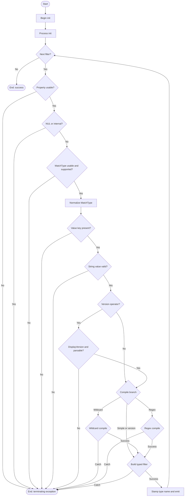

# New-CompiledFilter

## Purpose

`New-CompiledFilter` is the private filter-engine helper that validates incoming
filter hashtables and converts them into compiled filter objects for the rest of
the uninstall pipeline. `Start-Uninstaller` calls it during pre-processing, and
`Test-ApplicationMatch` consumes the emitted objects while evaluating
application records. The function exists to fail fast on malformed filter
definitions and to move wildcard, regex, and version parsing work out of the
per-application match loop.

## Parameters

| Name | Type | Required | Default | Description |
|------|------|----------|---------|-------------|
| `Filter` | `System.Collections.Hashtable[]` | Yes | None | One or more filter definitions to validate and compile. Each hashtable must contain `Property`, `Value`, and `MatchType`. |

## Return Value

The function emits one object per successfully compiled input hashtable.
`[OutputType()]` declares `[StartUninstallerCompiledFilter]`, and direct smoke
execution on 2026-04-02 confirmed the concrete emitted runtime type is
`StartUninstallerCompiledFilter` with leading `PSTypeName`
`StartUninstaller.CompiledFilter`.

Each emitted object contains `Property`, stringified `Value`, normalized
`MatchType`, and the helper fields `CompiledWildcard`, `CompiledRegex`, and
`CompiledVersion`; only the field relevant to the selected match mode is
populated. In the `Wildcard` branch, the function also adds an in-memory
`Options` note property to the compiled `WildcardPattern` so downstream code and
tests can inspect the exact `WildcardOptions` used.

The comment-based help block has drifted behind the runtime contract: its
`.OUTPUTS` section still says `[System.Management.Automation.PSObject[]]`, but
the function now constructs `[StartUninstallerCompiledFilter]` instances.

The function never intentionally returns `$Null`. If parameter binding fails or
the first processed filter throws, nothing is emitted. Because compilation is
streamed one filter at a time, a later invalid filter can terminate the call
after earlier compiled filters have already been written to a downstream
pipeline consumer.

## Execution Flow

## Error Handling

- PowerShell parameter binding rejects a missing or null/empty `-Filter`
  argument before the function body runs.
- `Import-LocalizedData` is called with `-ErrorAction:'SilentlyContinue'`, so a
  missing or unreadable companion `New-CompiledFilter.strings.psd1` file does
  not stop execution; the in-function default `$Strings` table remains in use.
- The local `$ThrowArgumentError` helper creates a `New-ErrorRecord` for
  `System.ArgumentException` and raises it as a terminating error through
  `$PSCmdlet.ThrowTerminatingError()`.
- Missing `Property`, empty `Property`, or whitespace-only `Property` throws
  `System.ArgumentException`.
- A `Property` value containing a NUL character throws
  `System.ArgumentException`.
- Internal-only properties `_ParsedDisplayVersion`, `_RegistryHive`,
  `_RegistryView`, and `_RegistrySource` throw `System.ArgumentException`.
- Missing, empty, or unsupported `MatchType` throws
  `System.ArgumentException`.
- Missing `Value` throws `System.ArgumentException`.
- `Simple`, `Wildcard`, and `Regex` filters reject `$Null` or empty-string
  `Value` with `System.ArgumentException`.
- `EQ`, `GT`, `GTE`, `LT`, and `LTE` reject any property other than
  `DisplayVersion` with `System.ArgumentException`.
- Version operators reject unparseable version strings with
  `System.ArgumentException`.
- The wildcard compilation branch wraps both `WildcardPattern` construction and
  the subsequent `Add-Member` call in one `Try/Catch`. Any failure in that
  branch is rethrown as a terminating `System.ArgumentException` with the
  invalid-wildcard error ID.
- Invalid regex patterns are caught around `Regex` construction and rethrown as
  terminating `System.ArgumentException` with the property name and inner parser
  message.
- Typed object construction and `PSTypeNames.Insert()` are wrapped in `Try/Catch`
  and rethrown as a terminating `System.InvalidOperationException` via
  `New-ErrorRecord`.
- The function never writes warnings or non-terminating errors of its own.
- A late failure does not retract objects that were already streamed earlier in
  the same pipeline.

## Side Effects

This function does not modify external state. It only attempts to read the
optional companion `New-CompiledFilter.strings.psd1` file, allocates in-memory
helper objects, adds an `Options` note property to the compiled wildcard
object, and inserts `StartUninstaller.CompiledFilter` at the front of the
emitted object's `PSTypeNames` collection.

## Research Log

| Topic | Finding | Source | Date Verified |
|-------|---------|--------|---------------|
| Search: `PowerShell Practice and Style guide latest` | The community style guide is still the current baseline and explicitly says the guide is still evolving. Change: first audit entry; this repo intentionally remains stricter than that baseline on indentation, line length, and keyword casing. | https://poshcode.gitbook.io/powershell-practice-and-style | 2026-04-01 |
| Search: `PSScriptAnalyzer rules latest` | Current rule documentation still lists the core design and style rules relevant here, including `ProvideCommentHelp`, `UseApprovedVerbs`, `UseShouldProcessForStateChangingFunctions`, and `UseBOMForUnicodeEncodedFile`. Change: first audit entry. | https://learn.microsoft.com/en-us/powershell/utility-modules/psscriptanalyzer/rules/readme?view=ps-modules | 2026-04-01 |
| Search: `PSScriptAnalyzer latest release` | The latest published gallery page found in research is `PSScriptAnalyzer` `1.24.0`, published on 2025-03-18, with minimum PowerShell version `5.1`. Change: first audit entry. | https://www.powershellgallery.com/packages/PSScriptAnalyzer/1.24.0 | 2026-04-01 |
| Search: `PSScriptAnalyzer what's new 1.24.0` | `PSScriptAnalyzer` `1.24.0` added enabled-by-default `UseCorrectCasing` coverage for operators, keywords, and commands. Change: new audit entry; this sharpens the mismatch between current analyzer defaults and the repo's PascalCase-keyword house rule. | https://learn.microsoft.com/en-us/powershell/utility-modules/psscriptanalyzer/whats-new-in-pssa?view=ps-modules | 2026-04-01 |
| Search: `UseCorrectCasing PSScriptAnalyzer` | Current `UseCorrectCasing` guidance prefers exact cmdlet/type casing but lowercase keywords and operators. Change: first audit entry; this conflicts with the repo's PascalCase-keyword house rule, so the standards audit below follows the repo standard as written. | https://learn.microsoft.com/en-us/powershell/utility-modules/psscriptanalyzer/rules/usecorrectcasing?view=ps-modules | 2026-04-01 |
| Search: `CmdletBinding PositionalBinding official` | `CmdletBinding` still defaults `PositionalBinding` to `$true` unless explicitly disabled. Change: first audit entry; this reinforces the standards requirement to set `PositionalBinding` explicitly. | https://learn.microsoft.com/en-us/powershell/module/microsoft.powershell.core/about/about_functions_cmdletbindingattribute?view=powershell-7.5 | 2026-04-01 |
| Search: `comment-based help keywords PowerShell official` | Comment-based help remains the supported help model for functions, and example/help sections are still standard help keywords. Change: first audit entry. | https://learn.microsoft.com/en-us/powershell/scripting/developer/help/writing-comment-based-help-topics?view=powershell-7.5 | 2026-04-01 |
| Search: `advanced parameter validation PowerShell official` | PowerShell still recommends parameter attributes and validation attributes for advanced functions. Change: first audit entry; the current function uses built-in validation for `Filter`, while `MatchType` validation stays manual because it also normalizes to canonical casing. | https://learn.microsoft.com/en-us/powershell/module/microsoft.powershell.core/about/about_functions_advanced_parameters?view=powershell-5.1 | 2026-04-01 |
| Search: `about_Throw PowerShell 7.5` | PowerShell still documents `throw` as the standard way to raise a terminating error. Change: new audit entry; the repo's `New-ErrorRecord` requirement remains stricter than current platform guidance, so the standards table continues to score against the repo rule. | https://learn.microsoft.com/id-id/powershell/module/microsoft.powershell.core/about/about_throw?view=powershell-7.5 | 2026-04-01 |
| Search: `Regex timeout untrusted input official` | Current .NET guidance warns that untrusted regex patterns should use an explicit timeout to reduce DoS risk. Change: first audit entry; `New-CompiledFilter` currently constructs caller-supplied regex patterns without a timeout. | https://learn.microsoft.com/en-us/dotnet/standard/base-types/best-practices-regex | 2026-04-01 |
| Search: `Regex constructor TimeSpan official` | The timeout-capable `Regex(String, RegexOptions, TimeSpan)` constructor remains available. Change: new audit entry; the existing regex-timeout risk is actionable without leaving PowerShell 5.1 compatibility because the platform already exposes a timeout overload. | https://learn.microsoft.com/es-es/dotnet/api/system.text.regularexpressions.regex.-ctor?view=net-8.0 | 2026-04-01 |
| Search: `RegexOptions.Compiled official` | `RegexOptions.IgnoreCase`, `RegexOptions.CultureInvariant`, and `RegexOptions.Compiled` remain current. Newer .NET guidance prefers source-generated regex when patterns are known at compile time, but that is not applicable here because patterns are supplied at runtime. Change: first audit entry. | https://learn.microsoft.com/en-us/dotnet/standard/base-types/regular-expression-options | 2026-04-01 |
| Search: `WildcardPattern official` | Microsoft Learn samples and SDK guidance still use `new WildcardPattern(pattern, WildcardOptions.IgnoreCase)` with no deprecation or replacement surfaced. Change: first audit entry. | https://learn.microsoft.com/en-us/powershell/scripting/developer/cmdlet/creating-a-cmdlet-to-access-a-data-store?view=powershell-7.5 | 2026-04-01 |
| Search: `Version.TryParse official` | `System.Version.TryParse` remains the current supported way to validate and parse version strings without throwing. Change: first audit entry. | https://learn.microsoft.com/en-us/dotnet/api/system.version.tryparse?view=net-9.0 | 2026-04-01 |
| Search: `Select-Object official` | `Select-Object` remains current, `-First` is still a named parameter, and the cmdlet still has the `select` alias even though the repo correctly avoids aliases. Change: first audit entry. | https://learn.microsoft.com/en-us/powershell/module/microsoft.powershell.utility/select-object?view=powershell-5.1 | 2026-04-01 |
| Search: `about_Return official` | PowerShell still emits the result of each statement without requiring an explicit `return`. Change: first audit entry; this matches the function's final `$CompiledFilter` pipeline output pattern. | https://learn.microsoft.com/en-us/powershell/module/microsoft.powershell.core/about/about_return?view=powershell-7.5 | 2026-04-01 |
| Search: `Pester latest PowerShell Gallery` | PowerShell Gallery still lists `Pester` `5.7.1` as the current stable version. Change: new audit entry; the local verification failure is consistent with this environment's registry restrictions, not stable-version drift. | https://www.powershellgallery.com/packages/pester | 2026-04-01 |
| Search: `Add-Member note property official` | `Add-Member` remains the supported way to add custom properties to an object instance. Change: new audit entry; this validates the helper's supported pattern of annotating `CompiledWildcard` with an `Options` note property for downstream inspection. | https://learn.microsoft.com/en-us/powershell/module/microsoft.powershell.utility/add-member?view=powershell-7.5 | 2026-04-02 |
| Search: `ValidateSet IgnoreCase PowerShell official` | `ValidateSetAttribute` still defaults `IgnoreCase` to `true`. Inference: case-insensitive `MatchType` validation could be expressed with `ValidateSet`, but this function's manual validation remains justified because it also canonicalizes accepted values and applies cross-field rules such as restricting version operators to `DisplayVersion`. Change: new audit entry. | https://learn.microsoft.com/en-us/dotnet/api/system.management.automation.validatesetattribute.ignorecase?view=powershellsdk-7.4.0 | 2026-04-02 |
| Search: `Import-LocalizedData official about data files constrained language` | `Import-LocalizedData` remains current, and PowerShell still processes imported data files in constrained language mode. Change: new audit entry; this supports the companion `.strings.psd1` pattern and clarifies that the localized-data dependency is configuration data rather than arbitrary script execution. | https://learn.microsoft.com/en-us/powershell/module/microsoft.powershell.core/about/about_data_files?view=powershell-7.5 | 2026-04-02 |

## Standards Audit

| Rule | Status | Line(s) | Evidence |
|------|--------|---------|----------|
| Colon-bound parameters | PASS | 89-93, 102-107, 277-281, 322-331 | `Import-LocalizedData -BindingVariable:'Strings' -FileName:'New-CompiledFilter.strings' -BaseDirectory:$PSScriptRoot -ErrorAction:'SilentlyContinue'`; `Add-Member -MemberType:'NoteProperty' -Name:'Options' -Value:$WildcardOptions -Force` |
| PascalCase naming | PASS | 1, 36-46, 62, 95, 112, 137, 189, 263, 268, 282, 291, 311, 321 | `Function New-CompiledFilter {`; `[CmdletBinding(`; `Begin {`; `Process {`; `If ($HasUsableProperty -eq $False) {`; `Foreach ($KnownMatchType in $AllMatchTypes) {`; `Switch ($MatchType) {`; `Try {`; `} Catch {` |
| Full .NET type names (no accelerators) | FAIL | 246 | `[ref]$ParsedVersion` uses the `ref` accelerator instead of a full .NET type name. |
| Object types are the MOST appropriate and specific choice | PASS | 45, 58, 312-318 | `[OutputType([StartUninstallerCompiledFilter])]`; `[System.Collections.Hashtable[]] $Filter`; `$CompiledFilter = [StartUninstallerCompiledFilter]::new(` |
| Single quotes for non-interpolated strings | FAIL | 145 | `$Property.Contains("`0")` uses a non-interpolated double-quoted string literal for the NUL check. |
| `$PSItem` not `$_` | PASS | 130, 286, 301, 327 | `$Def = $PSItem`; `$PSItem.Exception.Message` |
| Explicit bool comparisons (`$Var -eq $True`, not just `$Var`) | PASS | 137, 146, 156, 168, 179, 193, 201, 212, 217, 230, 234, 249 | `If ($HasUsableProperty -eq $False) {`; `If ($MatchesRequestedType -eq $True) {`; `If ($IsVersionOp -eq $True) {` |
| If conditions are pre-evaluated outside If blocks | PASS | 132-137, 163-179, 188-193, 209-217, 225-249 | `$HasUsableProperty = [System.Boolean](...)`; `If ($HasUsableProperty -eq $False) {`; `$IsSupportedMatchType = [System.Boolean](...)`; `If ($IsSupportedMatchType -eq $False) {` |
| `$Null` on left side of comparisons | PASS | 214 | `$Null -eq $Value -or` |
| No positional arguments to cmdlets | PASS | 89-93, 102-107, 277-281, 322-331 | `Import-LocalizedData -BindingVariable:'Strings' ...`; `New-ErrorRecord -ExceptionName:'System.ArgumentException' ...`; `Add-Member -MemberType:'NoteProperty' -Name:'Options' -Value:$WildcardOptions -Force` |
| No cmdlet aliases | PASS | 89-93, 102-107, 277-281, 322-331 | `Import-LocalizedData`; `New-ErrorRecord`; `Add-Member` |
| Switch parameters correctly handled | PASS | 281 | `-Force` is passed in bare form, which matches the standard for enabling a switch parameter. |
| CmdletBinding with all required properties | PASS | 36-44 | `[CmdletBinding(` with `ConfirmImpact`, `DefaultParameterSetName`, `HelpURI`, `PositionalBinding`, `RemotingCapability`, `SupportsPaging`, and `SupportsShouldProcess` explicitly populated. |
| OutputType declared | PASS | 45 | `[OutputType([StartUninstallerCompiledFilter])]` |
| Comment-based help is complete (Synopsis, Description, Parameter, Example, Outputs, Notes) | PASS | 3-33 | `.SYNOPSIS`; `.DESCRIPTION`; `.PARAMETER Filter`; `.EXAMPLE`; `.OUTPUTS`; `.NOTES` |
| Error handling via New-ErrorRecord or appropriate pattern | PASS | 95-108, 322-332 | `$ErrorRecord = New-ErrorRecord -ExceptionName:'System.ArgumentException' ...`; `$PSCmdlet.ThrowTerminatingError($ErrorRecord)`; `$ErrorRecord = New-ErrorRecord -ExceptionName:'System.InvalidOperationException' ...` |
| Try/Catch around operations that can fail | FAIL | 89-93 | `Import-LocalizedData -BindingVariable:'Strings' -FileName:'New-CompiledFilter.strings' -BaseDirectory:$PSScriptRoot -ErrorAction:'SilentlyContinue'` is not wrapped in `Try/Catch`; the wildcard, regex, and typed-object compile paths are wrapped, so the remaining miss is localized-data loading. |
| Write-Debug at Begin/Process/End block entry and exit (if blocks are used) | FAIL | 62, 112 | `Begin {`; `Process {`; no `Write-Debug` invocation exists anywhere in the file. |
| No variable pollution (no script: or global: scope leaks) | PASS | 62-335 | `$Strings = @{ ... }`; `$ThrowArgumentError = { ... }`; `$CompiledFilter` stays local, and no `script:` or `global:` qualifiers appear anywhere in the function. |
| 96-character line limit | PASS | 1-338 | Automated scan on 2026-04-02 found no lines over 96 characters in `src/Private/New-CompiledFilter.ps1`. |
| 2-space indentation (not tabs, not 4-space) | PASS | 36-45, 95-108, 263-281 | `  [CmdletBinding(`; `    $ErrorRecord = New-ErrorRecord`; `      'Wildcard' {`; automated scan on 2026-04-02 found no tab characters. |
| OTBS brace style | PASS | 1, 62, 112, 129, 137, 263, 268, 282, 291, 297, 311, 321 | `Function New-CompiledFilter {`; `Begin {`; `Process {`; `$Filter | & { Process {`; `If (...) {`; `Switch ($MatchType) {`; `Try {`; `} Catch {` |
| No commented-out code | PASS | 265 | `# Exact string match uses the raw value directly.` is explanatory commentary, and the file contains no disabled statements. |
| Registry access is read-only (if applicable) | N/A | 1-338 | This function does not access the registry. |

*Note 1: current `PSScriptAnalyzer` `1.24.0` extends `UseCorrectCasing`
coverage to operators, keywords, and commands by default. This audit still
grades casing against the repo's authoritative PascalCase-keyword standard.*

*Note 2: current .NET regex guidance still recommends an explicit timeout for
untrusted patterns, and the timeout-capable `Regex` constructor remains
available. The standards reference does not currently score timeout usage as its
own rule, so that risk stays recorded in the research log rather than as a
separate standards failure.*

*Note 3: `PSScriptAnalyzer` `1.24.0` with the repo's current settings reports
no findings for `src/Private/New-CompiledFilter.ps1` on 2026-04-02. This audit
still records stricter house-rule failures that the analyzer configuration does
not enforce, including `[ref]`, the double-quoted NUL literal, and missing
lifecycle `Write-Debug` tracing.*

## Plan Audit

| Plan Section | Requirement | Status | Line(s) | Details |
|--------------|-------------|--------|---------|---------|
| 12, 15 | "`New-CompiledFilter.ps1` validates and compiles filter definitions" and exists as a dedicated Phase 2 helper. | ALIGNED | 1, 112-335 | The plan explicitly assigns filter-definition validation and compilation to this private helper, so the function is necessary rather than overengineering. Its body validates the incoming hashtable shape, normalizes `MatchType`, pre-compiles matcher artifacts, and emits one compiled record per input filter. |
| 12 | "`New-CompiledFilter.ps1` belongs under `src/Private`." | ALIGNED | 1 | The implementation lives in the private-function location the plan assigns to it: `src/Private/New-CompiledFilter.ps1`. |
| 4.2, 6.1 | "`Filter` is a required `hashtable[]`, and each filter has `Property`, `Value`, and `MatchType`." | ALIGNED | 47-59, 132-207 | `-Filter` is mandatory and strongly typed as `System.Collections.Hashtable[]`, and the body explicitly requires the `Property`, `MatchType`, and `Value` keys before compilation continues. |
| 6.2 | "`Property` is required and cannot be empty, whitespace-only, or contain NUL; `Property` cannot target the unnamed default registry value; `Value` is required; string match types reject null/empty `Value`; `MatchType` is required and case-insensitive." | ALIGNED | 132-228 | The helper enforces every listed rule. Rejecting empty or whitespace-only `Property` values also blocks the unnamed default registry value, whose registry name is the empty string. `MatchType` is checked case-insensitively, then normalized to canonical casing. |
| 5.1, 6.2, 16 | "Internal-only fields are never valid in filters," while synthetic metadata remains valid for filtering. | ALIGNED | 116-121, 153-161; Tests 391-403 | The helper blacklists `_ParsedDisplayVersion`, `_RegistryHive`, `_RegistryView`, and `_RegistrySource`. At the same time, it still accepts synthetic metadata fields because it rejects only the internal-only blacklist, not the synthetic names defined by the plan. |
| 2, 6.3, 16 | "String matching is case-insensitive and culture-invariant," and the supported match types are `Simple`, `Wildcard`, `Regex`, `EQ`, `GT`, `GTE`, `LT`, and `LTE`. | ALIGNED | 113-126, 176-198, 209-226, 225-257, 263-307; Test-ApplicationMatch 99-125 | Wildcard compilation uses `WildcardOptions.IgnoreCase` plus `CultureInvariant`, regex compilation uses `IgnoreCase` plus `CultureInvariant`, and version operators are explicitly restricted to `DisplayVersion`. The simple exact-match semantics are realized downstream by `Test-ApplicationMatch` with `System.StringComparison::OrdinalIgnoreCase`, which is culture-insensitive. |
| 6.3, 16 | "`DisplayVersion` still supports `Simple`, `Wildcard`, and `Regex` against the raw string value." | ALIGNED | 225-257, 263-307; Tests 406-428 | The `DisplayVersion` restriction is enforced only inside the version-operator branch. `Simple`, `Wildcard`, and `Regex` continue through the normal string-match compilation path. |
| 5 | "The rewrite still uses typed `PSCustomObject` records internally." | DEVIATION | 45, 312-320; A.Types 1-23 | This helper no longer emits a typed `PSCustomObject`-style record. It now constructs a `StartUninstallerCompiledFilter` class instance and then stamps `StartUninstaller.CompiledFilter` into `PSTypeNames`. This looks like intentional implementation drift from the frozen plan, not a runtime bug, but it no longer matches the plan's internal-data-model wording. |
| 2, 8.1 | "Filter property names are case-insensitive," using `PSCustomObject` property lookup or equivalent. | ALIGNED | 143, 174, 198; Test-ApplicationMatch 89-93 | `New-CompiledFilter` preserves the caller-supplied property string, and downstream matching resolves it through `Application.PSObject.Properties[$CompiledFilter.Property]`, which is the plan's required case-insensitive lookup mechanism. |
| 6.5 | "All filters use `AND` logic." | N/A | 47-335; Test-ApplicationMatch 82-88 | This helper compiles filters independently and emits one record per input hashtable. The plan's `AND` semantics are implemented later by `Test-ApplicationMatch`, not here. |
| 4.3, 5.3, 10.4 | "Exit codes `0`-`4` and uninstall outcomes are mapped by the orchestrator." | N/A | 36-338 | `New-CompiledFilter` does not set exit codes or uninstall outcomes. Those behaviors belong to `Start-Uninstaller` and the uninstall result pipeline, not to this compile helper. |
| 14.2, 15, 16 | "Critical unit tests cover filter validation and version-operator behavior," "all filter types pass direct tests," and "invalid filter definitions fail fast." | REVIEW | Tests 9-435 | The repository contains direct tests for missing keys, invalid match types, internal-only properties, wildcard/regex/version compilation, match-type normalization, multiple filters, and `DisplayVersion` edge cases. However, `Invoke-Pester tests/Private/New-CompiledFilter.Tests.ps1` still cannot prove a passing result in this environment: on 2026-04-02, Pester 5.7.1 discovered 63 tests and then failed the container before test logic ran while trying to create `HKCU\Software\Pester`. |

## Verification Notes

- Direct smoke execution on 2026-04-02 confirmed canonicalization
  (`wildcard` -> `Wildcard`), leading `PSTypeName`
  `StartUninstaller.CompiledFilter`, concrete emitted runtime type
  `StartUninstallerCompiledFilter`, and `CompiledWildcard.Options =
  IgnoreCase, CultureInvariant`.
- Direct smoke execution on 2026-04-02 confirmed rejection of
  `_RegistryHive` and rejection of `GT` on `Publisher` with
  `System.ArgumentException`.
- A mixed valid/invalid call confirmed that a later terminating exception does
  not retract earlier compiled filters already written to a downstream pipeline
  consumer.
- Normalized comparison on 2026-04-02 confirmed
  `src/Private/New-CompiledFilter.ps1` and the extracted
  `Function New-CompiledFilter` body in `build/Start-Uninstaller.Functions.ps1`
  are identical after trimming trailing newlines.
- Source inspection on 2026-04-02 found a help-block drift: the function's
  `.OUTPUTS` comment still advertises
  `[System.Management.Automation.PSObject[]]`, while `[OutputType()]` and
  runtime behavior now use `StartUninstallerCompiledFilter`.
- `Invoke-Pester tests/Private/New-CompiledFilter.Tests.ps1` still cannot
  verify behavior in this environment. Pester 5.7.1 discovered 63 tests, but
  the framework then failed before test logic ran because it could not create
  `HKCU\Software\Pester`; the run therefore reported 63 failed tests caused by
  the environment rather than by asserted function regressions.
- `PSScriptAnalyzer` `1.24.0` is installed in this environment, and
  `Invoke-ScriptAnalyzer -Path:'src/Private/New-CompiledFilter.ps1'
  -Settings:'PSScriptAnalyzerSettings.psd1'` returned no findings on
  2026-04-02.
- Automated scans on 2026-04-02 found no lines longer than 96 characters and
  no tab characters in `src/Private/New-CompiledFilter.ps1`.

## Changelog

| Date | Changes |
|------|---------|
| 2026-04-02 | Corrected stale audit findings after another same-day convergence pass. Removed obsolete references to `Select-Object`, bare `throw`, and the claim that the function had no lifecycle blocks; refreshed the standards table to pass explicit-bool, pre-evaluated-condition, and `New-ErrorRecord` handling while newly failing missing lifecycle `Write-Debug` tracing; updated error handling to document the silent localized-strings fallback and the wrapped typed-object construction path; refreshed verification notes to reflect the now-installed `PSScriptAnalyzer` `1.24.0` and its zero findings under repo settings; added current `ValidateSet` and localized-data research; and cleaned the saved README body so the audit status marker is no longer embedded inside the document itself. |
| 2026-04-02 | Corrected the README after fresh source convergence. Updated the return contract from the stale `PSObject`/`PSCustomObject` description to the live `StartUninstallerCompiledFilter` runtime type, documented the `CompiledWildcard.Options` note-property annotation and in-memory `PSTypeName` mutation, refreshed the standards audit to pass object-type specificity while failing the double-quoted NUL literal and the still-unwrapped `Select-Object`/`Add-Member`/typed-construction paths under the repo's stricter house rules, corrected the plan audit to record the new class-based deviation from the frozen `PSCustomObject` data-model wording, added current `Add-Member` research, and replaced the stale verification notes with 2026-04-02 runtime, build-parity, and Pester findings. |
| 2026-04-01 | Corrected stale audit findings after source convergence: the function now has a real `.EXAMPLE` block, rejects internal-only filter fields, wraps wildcard compilation in `Try/Catch`, and no longer violates the 96-character limit. Added the missing standards rows for condition pre-evaluation and object-type specificity, refreshed the `CmdletBinding` verdict, documented wildcard error handling and partial pipeline emission on late failure, expanded the research log with current `UseCorrectCasing`, `throw`, regex-timeout-constructor, and Pester release findings, and updated the verification notes against the live source, build output, and test environment. |
| 2026-04-01 | Initial README audit for `New-CompiledFilter`. Added purpose, parameter, return, flow, error, and side-effect documentation; recorded current research; added standards and plan audits; documented verification limits; and corrected the audit model to flag the missing internal-only-field filter guard. |
AUDIT_STATUS:UPDATED