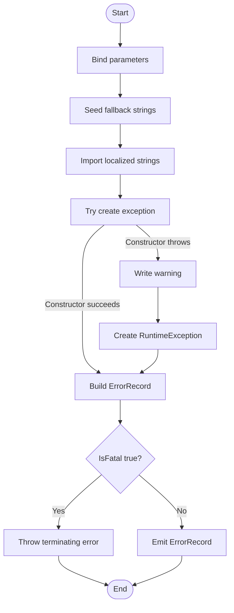

# New-ErrorRecord

## Purpose

`New-ErrorRecord` is a private helper that creates a
`System.Management.Automation.ErrorRecord` from caller-supplied exception
metadata and either returns that record or raises it as a terminating error.
It exists to keep error construction consistent across the codebase, and the
current source tree calls it from 25 private-helper call sites such as
`Get-RegistryBaseKey`, `ConvertTo-OutputFieldList`, `Invoke-SilentProcess`, and
`Test-ApplicationMatch`. In practice, callers use it when they need a stable
`ErrorId`, a specific `ErrorCategory`, and an optional `TargetObject` without
duplicating the same `ErrorRecord` boilerplate in every function.

## Parameters

| Name | Type | Required | Default | Description |
|------|------|----------|---------|-------------|
| `ExceptionName` | `System.String` | Yes | None | Full .NET exception type name passed to `New-Object -TypeName`. If the type cannot be created, the function falls back to `System.Management.Automation.RuntimeException`. |
| `ExceptionMessage` | `System.String` | Yes | None | Human-readable message supplied to the exception constructor. |
| `TargetObject` | `System.Object` | No | `$Null` | Context object associated with the error record. This is forwarded unchanged to the `ErrorRecord` constructor. |
| `ErrorId` | `System.String` | Yes | None | Stable, searchable identifier assigned to the created `ErrorRecord`. |
| `ErrorCategory` | `System.Management.Automation.ErrorCategory` | Yes | None | PowerShell error category applied to the created `ErrorRecord`. |
| `IsFatal` | `System.Boolean` | No | `$False` | When `$True`, the function raises the created error record with `$PSCmdlet.ThrowTerminatingError()`. When `$False`, it emits the record to the pipeline. |

## Return Value

The function declares `[System.Management.Automation.ErrorRecord]` output and,
on its normal non-fatal path, emits exactly one `ErrorRecord` whose
`Exception`, `FullyQualifiedErrorId`, `CategoryInfo`, and `TargetObject`
properties are populated from the supplied parameters and runtime behavior.

If `ExceptionName` resolves successfully, the embedded exception is an instance
of that requested type. If exception construction fails, the function writes a
warning, substitutes `System.Management.Automation.RuntimeException`, and still
returns an `ErrorRecord` on the non-fatal path.

The function does not intentionally return `$Null`. It produces no pipeline
output when parameter binding fails before execution or when `-IsFatal:$True`
causes `$PSCmdlet.ThrowTerminatingError()` to stop execution. Because the
fallback path uses `Write-Warning`, a caller that promotes warnings to
terminating errors can also stop the function before it emits a record.

## Execution Flow

## Error Handling

- Parameter binding rejects missing mandatory parameters and empty values for
  `ExceptionName`, `ExceptionMessage`, and `ErrorId` before the function body
  runs.
- `Import-LocalizedData` uses `-ErrorAction:'SilentlyContinue'`, so missing or
  unreadable localized data does not stop execution. The inline fallback
  `$Strings` hashtable remains in place instead.
- `New-Object -TypeName:$ExceptionName` is wrapped in `Try/Catch`. If type
  construction fails, the catch block writes a warning and replaces the
  requested type with `System.Management.Automation.RuntimeException`.
- When `-IsFatal:$True`, the function calls
  `$PSCmdlet.ThrowTerminatingError($ErrorRecord)` and does not emit the record.
- When `-IsFatal:$False`, the function emits the created `ErrorRecord` and
  leaves it to the caller to decide whether to call `Write-Error`,
  `ThrowTerminatingError`, `Write-Warning`, or another reporting path.
- The function never calls `Write-Error` directly, never uses bare `throw`, and
  never silently swallows exception-construction failures.

## Side Effects

This function has no persistent side effects. It does not modify the registry,
filesystem, processes, services, or caller-scoped variables. It does read a
local companion strings file when available, it can emit a warning to the
warning stream when exception-type creation fails, and it can raise a
terminating error when `-IsFatal:$True`.

## Research Log

| Topic | Finding | Source | Date Verified |
|-------|---------|--------|---------------|
| PowerShell style baseline | The PowerShell Practice and Style guide is still a living baseline rather than a fixed rulebook. It explicitly describes itself as evolving guidance, which means this repo can intentionally be stricter than the community baseline. | https://poshcode.gitbook.io/powershell-practice-and-style | 2026-04-02 |
| PSScriptAnalyzer currency | Microsoft still positions PSScriptAnalyzer as the current static analyzer for PowerShell scripts and modules, with documented support for Windows PowerShell 5.1+ and PowerShell 7.2.11+ on supported platforms. | https://learn.microsoft.com/en-us/powershell/utility-modules/psscriptanalyzer/overview?view=ps-modules | 2026-04-02 |
| Recent PSScriptAnalyzer changes | The latest documented PSScriptAnalyzer release remains 1.24.0 and includes a minimum PowerShell version of 5.1 plus expanded `PSUseCorrectCasing` behavior. This does not change the repo audit baseline, but it confirms the analyzer guidance is still moving. | https://learn.microsoft.com/en-us/powershell/utility-modules/psscriptanalyzer/whats-new-in-pssa?view=ps-modules | 2026-04-02 |
| Current casing guidance | The current `PSUseCorrectCasing` rule prefers exact cmdlet and type casing plus lowercase keywords and operators. That differs from this repo's PascalCase-keyword standard, so the audit still grades against the repo reference as instructed. | https://learn.microsoft.com/en-us/powershell/utility-modules/psscriptanalyzer/rules/usecorrectcasing?view=ps-modules | 2026-04-02 |
| CmdletBinding behavior | Current Microsoft guidance still says advanced functions default `PositionalBinding` to `$True` unless it is explicitly disabled, and says `ConfirmImpact` should be specified only when `SupportsShouldProcess` is also specified. This reinforces the explicit `PositionalBinding = $False` choice here while also documenting a standards-versus-current-guidance discrepancy. | https://learn.microsoft.com/en-us/powershell/module/microsoft.powershell.core/about/about_functions_cmdletbindingattribute?view=powershell-7.5 | 2026-04-02 |
| OutputType behavior | `OutputType` remains metadata only. PowerShell does not derive it from the function body and does not verify that runtime output matches the declared type. | https://learn.microsoft.com/en-us/powershell/module/microsoft.powershell.core/about/about_functions_outputtypeattribute?view=powershell-7.5 | 2026-04-02 |
| Parameter validation and flag guidance | Built-in validators such as `ValidateNotNullOrEmpty` remain the current boundary-validation mechanism, and Microsoft still recommends switch parameters for presence/absence flags. That strengthens the audit finding against `IsFatal` being modeled as `[System.Boolean]` rather than a switch-style flag. | https://learn.microsoft.com/en-us/powershell/module/microsoft.powershell.core/about/about_functions_advanced_parameters?view=powershell-7.6 | 2026-04-02 |
| Localization pattern | `Import-LocalizedData` remains the supported way to import `.psd1` text resources selected by UI culture. `about_Script_Internationalization` still documents the fallback pattern where a pre-seeded variable remains in place when a localized file is not found. | https://learn.microsoft.com/en-us/powershell/module/microsoft.powershell.core/about/about_script_internationalization?view=powershell-7.6 | 2026-04-02 |
| Dynamic .NET object creation | `New-Object` remains a supported way to construct .NET objects, and no deprecation or replacement requirement surfaced for the dynamic type-name scenario used by this function. Because `ExceptionName` is a runtime string, `New-Object -TypeName` is still a valid choice. | https://learn.microsoft.com/en-us/powershell/module/microsoft.powershell.utility/new-object?view=powershell-7.5 | 2026-04-02 |
| Error container currency | `System.Management.Automation.ErrorRecord` remains the canonical PowerShell error container carrying exception, error id, category, and target object data. No newer replacement surfaced for this pattern. | https://learn.microsoft.com/en-us/dotnet/api/system.management.automation.errorrecord?view=powershellsdk-7.4.0 | 2026-04-02 |
| Error-reporting pattern validation | Current PowerShell guidance for advanced functions still distinguishes non-terminating errors from terminating errors and points to `WriteError` versus `ThrowTerminatingError`. This helper's fatal path is current, while its non-fatal path intentionally returns an `ErrorRecord` to let callers choose how to report it. | https://learn.microsoft.com/en-us/powershell/module/microsoft.powershell.core/about/about_functions_advanced_methods?view=powershell-7.5 | 2026-04-02 |
| Warning-stream behavior | `Write-Warning` remains the standard warning-stream cmdlet and its behavior is still caller-controllable through common parameters and preference variables. That matters here because the fallback warning can be promoted or suppressed by the caller. | https://learn.microsoft.com/en-us/powershell/module/microsoft.powershell.utility/write-warning?view=powershell-7.5 | 2026-04-02 |
| Security check | Current Microsoft security guidance still recommends relying on parameter binding instead of string execution patterns such as `Invoke-Expression`. This helper does not execute input text, touch credentials, or access network, registry, or process resources, so no new security advisory directly changes its implementation. | https://learn.microsoft.com/en-us/powershell/scripting/security/preventing-script-injection?view=powershell-7.5 | 2026-04-02 |

## Standards Audit

| Rule | Status | Line(s) | Evidence |
|------|--------|---------|----------|
| Colon-bound parameters | PASS | 141-145, 150-155 | `Import-LocalizedData -BindingVariable:'Strings' -FileName:'New-ErrorRecord.strings' -BaseDirectory:$PSScriptRoot -ErrorAction:'SilentlyContinue'`, `New-Object -TypeName:$ExceptionName -ArgumentList:@($ExceptionMessage)`, and `Write-Warning -Message:(...)` all use named, colon-bound arguments. |
| PascalCase naming | PASS | 1, 48-58, 69-133, 136-176 | `Function New-ErrorRecord {`, `Param (`, `$ExceptionName`, `$ExceptionMessage`, `$TargetObject`, `$ErrorId`, `$ErrorCategory`, `$IsFatal`, `Begin`, `Process`, `Try`, `Catch`, and `If` all follow the repo's PascalCase convention. |
| Full .NET type names (no accelerators) | PASS | 57, 69, 82, 95, 108, 120, 132, 159, 164 | The source uses `[OutputType([System.Management.Automation.ErrorRecord])]`, `[System.String]`, `[System.Object]`, `[System.Boolean]`, `[System.Management.Automation.ErrorCategory]`, `[System.Management.Automation.RuntimeException]::new(...)`, and `[System.Management.Automation.ErrorRecord]::new(...)`. |
| Object types are the most appropriate and specific choice | REVIEW | 69, 95-96, 120-121 | `[System.Object] $TargetObject = $Null` is defensible because `ErrorRecord` target objects are intentionally arbitrary context objects, but `[System.String] $ExceptionName` leaves some ambiguity about whether a typed exception input such as `[System.Type]` would be a more specific contract. |
| Single quotes for non-interpolated strings | PASS | 49-55, 63, 76, 89, 102, 138-145 | Examples include `ConfirmImpact = 'None'`, `DefaultParameterSetName = 'Default'`, `HelpURI = ''`, `HelpMessage = 'See function help.'`, `ExceptionTypeFallbackWarning = 'Could not create exception type ''{0}''...'`, and `-FileName:'New-ErrorRecord.strings'`. |
| `$PSItem` not `$_` | PASS | 157 | The catch block uses `$PSItem.Exception.Message`; the file contains no `$_`. |
| Explicit bool comparisons (`$Var -eq $True`) | PASS | 171 | The only boolean branch is explicit: `If ($IsFatal -eq $True) {`. |
| If conditions are pre-evaluated outside `If` blocks | FAIL | 171 | `If ($IsFatal -eq $True) {` evaluates the condition inline instead of storing it in a typed variable before the branch. |
| `$Null` on left side of comparisons | N/A | 1-177 | The function does not perform any explicit `$Null` comparisons. |
| No positional arguments to cmdlets | PASS | 141-145, 150-155 | `Import-LocalizedData`, `New-Object`, and `Write-Warning` are all called with named parameters such as `-BindingVariable:'Strings'`, `-TypeName:$ExceptionName`, and `-Message:(...)`. |
| No cmdlet aliases | PASS | 141-155 | The executable body calls canonical cmdlets: `Import-LocalizedData`, `New-Object`, and `Write-Warning`. |
| Switch parameters correctly handled | FAIL | 123-133 | `IsFatal` is declared as `[System.Boolean] $IsFatal = $False` even though it behaves as a presence/absence control flag. The repo standard prefers `[Switch]` for flags. |
| Leading commas in attributes | FAIL | 49, 60, 73, 86, 99, 112, 124 | The first property lines in `[CmdletBinding(...)]` and each `[Parameter(...)]` block omit the house-required leading comma style: `ConfirmImpact = 'None'`, `Mandatory = $True`, and `Mandatory = $False`. |
| CmdletBinding with all required properties | PASS | 48-56 | `[CmdletBinding( ConfirmImpact = 'None' , DefaultParameterSetName = 'Default' , HelpURI = '' , PositionalBinding = $False , RemotingCapability = 'None' , SupportsPaging = $False , SupportsShouldProcess = $False )]` explicitly lists the repo's required metadata fields. |
| OutputType declared | PASS | 57 | `[OutputType([System.Management.Automation.ErrorRecord])]` is declared directly above `Param (`. |
| Comment-based help is complete | PASS | 2-46 | The help block contains `.SYNOPSIS`, `.DESCRIPTION`, `.PARAMETER` entries for all six parameters, `.EXAMPLE`, `.OUTPUTS`, and `.NOTES`. |
| Error handling via `New-ErrorRecord` or appropriate pattern | REVIEW | 149-175 | As the bootstrap helper itself, `New-ErrorRecord` cannot meaningfully call `New-ErrorRecord` for its own internal failures. It uses `Try/Catch`, `Write-Warning`, `RuntimeException` fallback, and `$PSCmdlet.ThrowTerminatingError($ErrorRecord)`, which is defensible, but it does not literally follow the repo's "all errors via New-ErrorRecord" rule. |
| Try/Catch around operations that can fail | FAIL | 141-145, 149-153 | `New-Object -TypeName:$ExceptionName` is wrapped in `Try/Catch`, but `Import-LocalizedData ... -ErrorAction:'SilentlyContinue'` can also fail and is not wrapped. The repo standard requires `Try/Catch` around failure-prone commands rather than silent suppression. |
| Write-Debug at Begin/Process/End block entry and exit | FAIL | 136-176 | The function defines `Begin {` and `Process {`, but there are no `Write-Debug` statements anywhere in the file. |
| Begin/Process/End structure | FAIL | 136-176 | The function uses `Begin {` and `Process {` because it loads localized data, but there is no `End {` block for matching teardown or block-exit tracing. |
| No variable pollution (no `script:` or `global:` scope leaks) | PASS | 137-145, 150-175 | Working state is local: `$Strings = @{}`, `$Exception = ...`, and `$ErrorRecord = ...`. The source contains no `script:` or `global:` assignments. |
| 96-character line limit | FAIL | 139 | Line 139 is 101 characters long: `'Could not create exception type ''{0}''. Falling back to RuntimeException. Inner error: {1}'`. |
| 2-space indentation (not tabs, not 4-space) | PASS | 48-58, 59-67, 136-176 | Representative lines show 2-space and 4-space nesting, not tabs: `  [CmdletBinding(`, `    [Parameter(`, `  Begin {`, and `    Try {`. |
| OTBS brace style | PASS | 1, 136, 148, 153, 171, 176-177 | The file uses same-line opening braces and OTBS continuations: `Function New-ErrorRecord {`, `Begin {`, `Process {`, `} Catch {`, and `If ($IsFatal -eq $True) {`. |
| No commented-out code | PASS | 2-46, 48-177 | The only block comment is the active help block `<# ... #>`. The executable body contains no `#`-prefixed disabled statements. |
| Registry access is read-only (if applicable) | N/A | 1-177 | The function does not access the registry at all. Its body is limited to `Import-LocalizedData`, `New-Object`, `Write-Warning`, `ErrorRecord` construction, and `ThrowTerminatingError()`. |
| Backtick continuation uses the required visual indicator comment | FAIL | 33-38, 141-152 | The help example and executable code use raw backtick continuations such as `New-ErrorRecord \`` and `Import-LocalizedData \`` without the repo-required `# --- [ Line Continuation ]` marker above them. |

Research notes:

1. Current Microsoft guidance says `ConfirmImpact` should be specified only when
   `SupportsShouldProcess` is also specified, and current `PSUseCorrectCasing`
   guidance prefers lowercase keywords and operators. The table above still
   audits against the repo's reference standard as instructed.
2. A local file-byte check on 2026-04-02 found that
   `src/Private/New-ErrorRecord.ps1` is saved without a UTF-8 BOM, which
   conflicts with standard sections 1.2, 1.16, and 1.17 even though that
   encoding finding is file metadata rather than line-scoped source text.

## Plan Audit

| Plan Section | Requirement | Status | Line(s) | Details |
|--------------|-------------|--------|---------|---------|
| 12. File Structure | The plan's private-function inventory should describe the helpers that ship in the rewrite. | DEVIATION | PLAN.md:669-702; src/Private/New-ErrorRecord.ps1:1-177 | `New-ErrorRecord.ps1` exists under `src/Private`, but the plan's file tree does not list it. The omission is plan drift, not dead code, because the helper is implemented and used throughout the repo. |
| 12. Function Responsibilities | The plan should assign each private helper a documented responsibility. | DEVIATION | PLAN.md:709-744; src/Private/Get-RegistryBaseKey.ps1:72-83; src/Private/ConvertTo-OutputFieldList.ps1:104-110 | The plan gives no responsibility entry for `New-ErrorRecord`, even though callers use it as the shared factory for exception, error id, category, and target-object packaging. |
| 12. File Structure (Public vs Private) | Internal-only helpers belong under `src/Private`. | ALIGNED | src/Private/New-ErrorRecord.ps1:1-177 | The function is not a public entrypoint and is correctly stored under `src/Private`. The deviation is that the plan forgot to document it there. |
| 4.1 Built Artifact | The built artifact must define all private/public helper functions it needs. | ALIGNED | PLAN.md:100-106; build/Start-Uninstaller.ps1:2412-2555 | The compiled script includes `Function New-ErrorRecord {` and the same localized-string import path, so the build currently ships this helper. |
| 4.4 No Interactivity | The script contract says `no SupportsShouldProcess` and `no ConfirmImpact`. | DEVIATION | PLAN.md:141-148; src/Private/New-ErrorRecord.ps1:48-56 | The helper is non-interactive in practice, but it still explicitly declares `ConfirmImpact = 'None'` and `SupportsShouldProcess = $False`, which violates the plan's literal metadata ban. |
| 13.2 Strings Files | Use `.strings.psd1` only where a function has reusable user-facing messages, and do not keep empty strings files. | ALIGNED | PLAN.md:781-789; src/Private/New-ErrorRecord.ps1:137-145; src/Private/New-ErrorRecord.strings.psd1:1-4 | The function imports `New-ErrorRecord.strings`, and the companion file contains the reusable warning text `ExceptionTypeFallbackWarning = 'Could not create exception type ...'`. |
| 3. Goals / 14.1-14.2 Test Strategy | Ensure every high-risk branch has direct tests, with unit tests for helper logic. | DEVIATION | PLAN.md:77-82, 793-840; tests/Private/New-ErrorRecord.Tests.ps1 missing | This helper has two material branches: invalid exception-type fallback and fatal versus non-fatal behavior. No dedicated `tests/Private/New-ErrorRecord.Tests.ps1` exists, and no current test file directly targets the helper. |
| Overall architecture | If the plan does not mention this function, verify whether the function is justified or overengineering. | REVIEW | PLAN.md:669-758; src call sites: 25 current uses; build/Start-Uninstaller.ps1:2412-2555 | The plan never names `New-ErrorRecord`, but the implementation depends on it at 25 current source call sites and includes it in the build artifact. It is therefore not gratuitous abstraction, but the plan should either document it explicitly as a shared error helper or intentionally remove the pattern. |
| 4.3 Exit Codes / 5 Internal Data Model / 10.4 Outcome Mapping | Check exit-code, result-outcome, and internal-record compliance only if this helper participates in those contracts. | N/A | src/Private/New-ErrorRecord.ps1:1-177 | `New-ErrorRecord` only creates or throws `System.Management.Automation.ErrorRecord` objects. It does not build application records, uninstall result records, PDQ output lines, or run exit codes. |

Research note:

1. Plan section 4.4 conflicts with the repo's house template that always lists
   `CmdletBinding` properties explicitly. The table above still grades against
   the plan's literal wording, not the template habit.

## Verification Notes

- A 2026-04-02 runtime check confirmed that an invalid `ExceptionName` writes
  one warning and still returns a `System.Management.Automation.ErrorRecord`
  whose embedded exception is `System.Management.Automation.RuntimeException`.
- A 2026-04-02 runtime check confirmed that `-IsFatal:$True` raises a catchable
  terminating `ErrorRecord` with a fully qualified error id of
  `FatalErr,New-ErrorRecord`.
- A 2026-04-02 local file-byte check confirmed that
  `src/Private/New-ErrorRecord.ps1` currently has no UTF-8 BOM.

## Changelog

| Date | Changes |
|------|---------|
| 2026-04-02 | First audit run. Added the initial `docs/New-ErrorRecord/README.md` with function documentation, a web-verified research log, a line-specific standards audit, a plan audit, runtime verification notes, and the first documented findings for plan drift, missing direct tests, line-length overflow, missing debug tracing, missing `End` block, raw backtick continuations, Boolean flag usage for `IsFatal`, and missing UTF-8 BOM encoding. |
AUDIT_STATUS:UPDATED