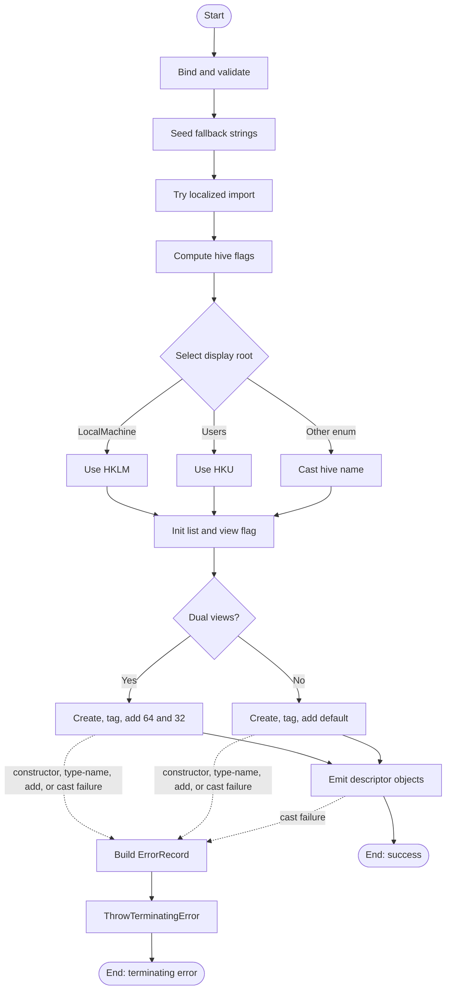

# New-RegistryViewDescriptor

## Purpose

`New-RegistryViewDescriptor` is a private discovery helper that converts one logical uninstall registry root into the view-specific descriptor objects needed by the current OS. `Get-UninstallRegistryPath` calls it for the machine uninstall root and for each loaded `HKU\<SID>` uninstall root, and `Get-InstalledApplication` later consumes the resulting display-root, hive, path, view, source, and identity metadata. The function exists to centralize descriptor construction, `HKLM` versus `HKU` display-root derivation, 32-bit versus 64-bit registry-view expansion, localized-or-fallback error message setup, and terminating error translation in one place.

## Parameters

| Name | Type | Required | Default | Description |
|------|------|----------|---------|-------------|
| `Hive` | `Microsoft.Win32.RegistryHive` | Yes | None | Registry hive to describe. Current callers pass `LocalMachine` and `Users`; the function maps those to `HKLM` and `HKU` display roots and falls back to the enum name string for any other hive value. |
| `Path` | `System.String` | Yes | None | Registry subkey path beneath the selected hive. `[ValidateNotNullOrEmpty()]` rejects null or empty input during parameter binding. |
| `SourcePrefix` | `System.String` | Yes | None | User-facing source prefix used to build the emitted `Source` field, for example `HKLM` or `HKU\S-1-5-21-...`. `[ValidateNotNullOrEmpty()]` rejects null or empty input during parameter binding. |
| `Is64BitOS` | `System.Boolean` | Yes | None | Caller-supplied OS-width fact. `$True` emits native and WOW descriptors; `$False` emits one default-view descriptor. |
| `InstallScope` | `System.String` | Yes | None | Install scope stamped onto every descriptor. Valid values are `System` and `User`. |
| `UserSid` | `System.String` | No | Declared as `$Null` | Optional SID metadata, normally for `HKU` descriptors. The default is declared as `$Null`, but current runtime behavior emits an empty string on the descriptor when null flows through the typed descriptor constructor and properties. |
| `UserName` | `System.String` | No | Declared as `$Null` | Optional resolved username metadata. Like `UserSid`, null currently arrives on emitted descriptors as an empty string rather than true `$Null`. |
| `UserIdentityStatus` | `System.String` | Yes | None | Identity-resolution status stamped onto every descriptor. Valid values are `System`, `Resolved`, and `Unresolved`. |

## Return Value

The function writes one or more `StartUninstallerRegistryViewDescriptor` objects to the pipeline. Internally it builds a `System.Collections.Generic.List[StartUninstallerRegistryViewDescriptor]`, casts that list to `[StartUninstallerRegistryViewDescriptor[]]`, and prepends the custom PSTypeName `StartUninstaller.RegistryViewDescriptor` onto each instance. Direct invocation emits descriptor objects, not an array wrapper object, because PowerShell enumerates the final array expression.

On a 64-bit OS it emits two descriptors for the supplied hive and path: one with `View = [Microsoft.Win32.RegistryView]::Registry64` and `Source = '<prefix>64'`, and one with `View = [Microsoft.Win32.RegistryView]::Registry32` and `Source = '<prefix>32'`. On a 32-bit OS it emits one descriptor with `View = [Microsoft.Win32.RegistryView]::Default` and `Source = <prefix>`. The function has no designed `$Null` sentinel output and no silent no-output success path; parameter-binding failures terminate before the body runs, and runtime construction failures are translated into a terminating `NewRegistryViewDescriptorFailed` error. Local runtime verification on 2026-04-02 confirmed that omitted or explicit null `UserSid` and `UserName` are emitted as empty strings, not true `$Null`.

## Execution Flow

## Error Handling

- Missing mandatory parameters fail during parameter binding before the body runs.
- Empty or null `Path` and `SourcePrefix` fail during `[ValidateNotNullOrEmpty()]` validation before the body runs.
- Invalid `Hive` input fails during enum binding before the body runs.
- Invalid `InstallScope` or `UserIdentityStatus` input fails during `[ValidateSet()]` validation before the body runs.
- The `Begin` block seeds a fallback `$Strings` hashtable, then calls `Import-LocalizedData -ErrorAction:'SilentlyContinue'`. If no localized data file is found, the fallback strings remain in use and execution continues.
- Any exception while constructing a descriptor, inserting its PSTypeName, adding it to the list, or casting the final list is caught by the function-wide `Try/Catch`.
- The `Catch` block calls `New-ErrorRecord` to build a `System.InvalidOperationException`-backed `System.Management.Automation.ErrorRecord` with message template `Unable to create registry view descriptor: {0}`, target object `$Path`, error ID `NewRegistryViewDescriptorFailed`, and category `InvalidOperation`, then calls `$PSCmdlet.ThrowTerminatingError($ErrorRecord)`.
- The function body has no `Write-Warning` or non-terminating `Write-Error` path. The only warning that could occur is the fallback warning inside `New-ErrorRecord` if `System.InvalidOperationException` itself could not be instantiated, which is not expected in normal execution.

## Side Effects

This function does not modify external state. It may attempt to read localized string data, then only creates in-memory descriptor objects and mutates each new object's `PSTypeNames` list before emitting it.

## Research Log

Rows accumulate across audit runs. `SUPERSEDED` rows are retained for audit history.

| Topic | Finding | Source | Date Verified |
|-------|---------|--------|---------------|
| Search: `Import-LocalizedData BaseDirectory FileName BindingVariable` | Current docs say `Import-LocalizedData` loads `.psd1` data from language-specific subdirectories beneath the base directory into a specified local variable, and `-ErrorAction:SilentlyContinue` is the documented way to suppress missing-file errors when fallback text already exists. Local runtime verification on 2026-04-02 showed the current same-directory `src/Private/New-RegistryViewDescriptor.strings.psd1` file is not loaded by this call pattern, so the inline fallback hashtable is the effective message source during source-form execution. Change: new row; corrects the earlier assumption that the companion strings file was actively loaded. | https://learn.microsoft.com/en-us/powershell/module/microsoft.powershell.utility/import-localizeddata?view=powershell-7.5 | 2026-04-02 |
| Search: `Comment-Based Help Keywords .OUTPUTS output type` | Current docs say `.OUTPUTS` documents the .NET type of the objects a function returns and should be repeated per output type. That means the current `.OUTPUTS [StartUninstallerRegistryViewDescriptor[]]` help text is still questionable because direct invocation emits descriptor objects enumerated from an array, not array wrapper objects. Change: new row; refines the `.OUTPUTS` audit for the current source. | https://learn.microsoft.com/en-us/powershell/scripting/developer/help/comment-based-help-keywords?view=powershell-7.4 | 2026-04-02 |
| Search: `about_Functions_CmdletBindingAttribute ConfirmImpact SupportsShouldProcess` | Current docs say `ConfirmImpact` should be specified only when `SupportsShouldProcess` is also specified. That strengthens the existing plan-deviation finding against `ConfirmImpact = 'None'` on this read-only helper. Change: new row; refines the no-interactivity audit. | https://learn.microsoft.com/en-us/powershell/module/microsoft.powershell.core/about/about_functions_cmdletbindingattribute?view=powershell-7.6 | 2026-04-02 |
| Search: `PSScriptAnalyzer security advisories` | GitHub's current security overview for `PowerShell/PSScriptAnalyzer` shows no published security advisories. No module-specific security update changes this function's findings today. Change: new row; completes the requested module/CVE check. | https://github.com/PowerShell/PSScriptAnalyzer/security | 2026-04-02 |
| Search: `PSScriptAnalyzer UseConsistentParametersKind` | Official rule docs show `UseConsistentParametersKind` enforces a consistent `Inline` versus `ParamBlock` parameter-definition pattern. It does not audit compact versus expanded `[Parameter()]` attribute-property layout, so it does not strengthen the leading-commas finding for this function. Change: new row; corrects the earlier 1.25.0 interpretation. | https://learn.microsoft.com/en-us/powershell/utility-modules/psscriptanalyzer/rules/useconsistentparameterskind?view=ps-modules | 2026-04-02 |
| Search: `about_Classes PowerShell class import module limitations` | PowerShell classes remain supported starting in version 5.0, and current docs still warn that classes aren't imported the same way functions are and often require `using module` or similar type-loading handling. That matters here because this helper returns `StartUninstallerRegistryViewDescriptor` and therefore depends on `A.Types.ps1` being loaded first. Change: new row; documents the function's current class dependency. | https://learn.microsoft.com/en-us/powershell/module/microsoft.powershell.core/about/about_classes?view=powershell-7.5 | 2026-04-02 |
| Search: `terminating errors ThrowTerminatingError ErrorRecord` | Current official PowerShell guidance still recommends reporting terminating errors by calling `ThrowTerminatingError(ErrorRecord)` instead of throwing a raw exception because the `ErrorRecord` carries richer metadata. That supports this function's catch path and the current `New-ErrorRecord` plus `ThrowTerminatingError` pattern. Change: new row; documents the function's current error-reporting pattern. | https://learn.microsoft.com/en-us/powershell/scripting/developer/cmdlet/terminating-errors?view=powershell-7.6 https://learn.microsoft.com/en-us/dotnet/api/system.management.automation.cmdlet.throwterminatingerror?view=powershellsdk-7.4.0 | 2026-04-02 |
| Search: `PSScriptAnalyzer releases 1.25.0` | SUPERSEDED 2026-04-02: this row correctly captured the 2026-03-20 `PSScriptAnalyzer` 1.25.0 release and its five new rules, but it incorrectly interpreted `UseConsistentParametersKind` as a check on expanded versus compact `[Parameter()]` attribute formatting. The official rule page shows it governs `Inline` versus `ParamBlock` parameter definition style instead. | https://github.com/PowerShell/PSScriptAnalyzer/releases | 2026-04-02 |
| Search: `PowerShell Practice and Style guide code layout and formatting` | The community PowerShell Practice and Style guide is still published and still treats formatting guidance as flexible. Its code-layout page continues to use a 115-character target, which is looser than this repo's 96-character house rule. Change: first audit row. | https://poshcode.gitbook.io/powershell-practice-and-style/style-guide/code-layout-and-formatting | 2026-04-01 |
| Search: `PowerShell style guide full names aliases lowercase keywords operators` | Current Microsoft PowerShell documentation guidance still says to use full cmdlet and parameter names and avoid aliases, but it prefers lowercase keywords and operators. That differs from this repo's PascalCase keyword rule. Change: first audit row. | https://learn.microsoft.com/en-us/powershell/scripting/community/contributing/powershell-style-guide?view=powershell-7.5 | 2026-04-01 |
| Search: `PSScriptAnalyzer what's new` | Current official release notes show `PSScriptAnalyzer` 1.24.0 raised the minimum supported PowerShell version to 5.1 and expanded `PSUseCorrectCasing`. Change: first audit row. | https://learn.microsoft.com/en-us/powershell/utility-modules/psscriptanalyzer/whats-new-in-pssa?view=ps-modules | 2026-04-01 |
| Search: `PSScriptAnalyzer UseCorrectCasing` | The current `PSUseCorrectCasing` rule explicitly checks commands, parameters, keywords, and operators, and it wants keywords and operators lowercase. That is newer guidance than this repo's keyword-casing rule. Change: first audit row. | https://learn.microsoft.com/en-us/powershell/utility-modules/psscriptanalyzer/rules/usecorrectcasing?view=ps-modules | 2026-04-01 |
| Search: `about_Functions_CmdletBindingAttribute PositionalBinding default true` | Official docs still state that `PositionalBinding` defaults to `$true` unless explicitly disabled, so `[CmdletBinding()]` alone does not satisfy this repo's explicit no-positional-binding rule. Change: first audit row. | https://learn.microsoft.com/en-us/powershell/module/microsoft.powershell.core/about/about_functions_cmdletbindingattribute?view=powershell-7.6 | 2026-04-01 |
| Search: `Comment-Based Help Keywords PowerShell developer` | SUPERSEDED 2026-04-01: this row originally supported a missing-`.EXAMPLE` finding from the prior source revision. The keyword guidance is still current, but the current `8.1.0` source now includes `.EXAMPLE`, so that old function-specific conclusion no longer applies. | https://learn.microsoft.com/en-us/powershell/scripting/developer/help/comment-based-help-keywords?view=powershell-7.5 | 2026-04-01 |
| Search: `Comment-Based Help Keywords PowerShell developer` | `.PARAMETER` remains per-parameter help metadata and `.EXAMPLE` remains a current help keyword, and the current source includes both. Change: supersedes the earlier comment-based-help row that was tied to an older missing-example finding. | https://learn.microsoft.com/en-us/powershell/scripting/developer/help/comment-based-help-keywords?view=powershell-7.5 | 2026-04-01 |
| Search: `about_Functions_OutputTypeAttribute` | `OutputType` remains metadata only and isn't validated against runtime output. That matters here because `[OutputType()]` documents intent but does not prove the emitted runtime shape by itself. Change: first audit row. | https://learn.microsoft.com/en-us/powershell/module/microsoft.powershell.core/about/about_functions_outputtypeattribute?view=powershell-7.6 | 2026-04-01 |
| Search: `RegistryKey.OpenBaseKey RegistryView` | `RegistryKey.OpenBaseKey(RegistryHive, RegistryView)` and the `RegistryView` enum remain the current APIs for explicit 32-bit and 64-bit hive selection, and no deprecation or replacement guidance surfaced. Change: first audit row. | https://learn.microsoft.com/en-us/dotnet/api/microsoft.win32.registrykey.openbasekey?view=net-9.0 https://learn.microsoft.com/en-us/dotnet/api/microsoft.win32.registryview?view=net-9.0 | 2026-04-01 |
| Search: `RegistryKey.OpenSubKey writable read-only` | `OpenSubKey(name, writable)` still uses the Boolean `writable` argument to request write access, and the docs continue to describe `true` as the write-enabled case. This reinforces the repo's read-only registry seam design, even though this helper itself never opens keys. Change: first audit row. | https://learn.microsoft.com/en-us/dotnet/api/microsoft.win32.registrykey.opensubkey?view=net-10.0 | 2026-04-01 |
| Search: `about_Type_Accelerators pscustomobject` | `[pscustomobject]` remains an official PowerShell type accelerator alias and is still documented as normal PowerShell syntax. That does not override this repo's stricter no-accelerator standard, but it explains why public guidance differs. Change: first audit row. | https://learn.microsoft.com/en-us/powershell/module/microsoft.powershell.core/about/about_type_accelerators?view=powershell-7.6 | 2026-04-01 |
| Search: `about_PSCustomObject` and `about_Object_Creation New-Object` | Current docs still treat `New-Object` and `[pscustomobject]` hashtable casting as supported object-creation patterns. They also confirm that `[pscustomobject]` and `[psobject]` map to the same `System.Management.Automation.PSObject` runtime class, which explains why public guidance still talks about `PSCustomObject` records even when a repo chooses a different internal representation. Change: retained row; public guidance still differs from this repo's stricter conventions. | https://learn.microsoft.com/en-us/powershell/module/microsoft.powershell.core/about/about_pscustomobject?view=powershell-7.5 https://learn.microsoft.com/en-us/powershell/module/microsoft.powershell.core/about/about_object_creation?view=powershell-7.5 https://learn.microsoft.com/en-us/powershell/module/microsoft.powershell.utility/new-object?view=powershell-7.5 | 2026-04-01 |
| Search: `about_Functions_Advanced_Parameters AllowNull string` | Current official docs explicitly state that `AllowNull` doesn't work for typed `string` parameters because strings don't accept a null value; the practical result is empty-string binding. This changes the accurate documentation of `UserSid` and `UserName` for this function. Change: new behavior note added in this audit. | https://learn.microsoft.com/en-us/powershell/module/microsoft.powershell.core/about/about_functions_advanced_parameters?view=powershell-5.1 | 2026-04-01 |
| Search: `about_Functions_Advanced_Parameters switch parameters preferred over boolean` | Current docs still prefer `[switch]` for presence or absence flags, but Boolean parameters remain appropriate when the caller must pass true or false as data. That supports `Is64BitOS` being a `[System.Boolean]` input rather than a switch. Change: first audit row. | https://learn.microsoft.com/en-us/powershell/module/microsoft.powershell.core/about/about_functions_advanced_parameters?view=powershell-5.1 | 2026-04-01 |

## Standards Audit

| Rule | Status | Line(s) | Evidence |
|------|--------|---------|----------|
| Colon-bound parameters | PASS | 42-47, 185-188, 270-277 | The help example and cmdlet calls use colon-bound named arguments throughout: `-Hive:([Microsoft.Win32.RegistryHive]::LocalMachine)`, `-BindingVariable:'Strings'`, `-FileName:'New-RegistryViewDescriptor.strings'`, `-ExceptionName:'System.InvalidOperationException'`, and `-ErrorCategory:([System.Management.Automation.ErrorCategory]::InvalidOperation)`. |
| PascalCase naming | PASS | 1, 57-67, 179, 191, 198-204, 211-279 | `Function New-RegistryViewDescriptor {`, `[CmdletBinding(`, `Param (`, `Begin {`, `Process {`, `$DisplayRoot = If (...) { } ElseIf (...) { } Else {`, and `Try { ... } Catch { ... }` all follow the repo's PascalCase rule. |
| Full .NET type names (no accelerators) | PASS | 78, 92, 119, 133, 147, 161, 175, 206-208, 218, 236, 253, 270, 277 | The function uses `[Microsoft.Win32.RegistryHive]`, `[System.String]`, `[System.Boolean]`, `[System.Collections.Generic.List[StartUninstallerRegistryViewDescriptor]]::new()`, `[Microsoft.Win32.RegistryView]::Registry64`, and `[System.Management.Automation.ErrorCategory]::InvalidOperation`; no accelerators like `[string]`, `[bool]`, or `[pscustomobject]` appear. |
| Object types are the MOST appropriate and specific choice (not just a functional generic type like PSObject or Array) | PASS | 66, 206-208, 214-223, 232-241, 249-258, 267 | `[OutputType([StartUninstallerRegistryViewDescriptor])]`, the generic `List[StartUninstallerRegistryViewDescriptor]`, repeated `[StartUninstallerRegistryViewDescriptor]::new(...)` calls, and the final `[StartUninstallerRegistryViewDescriptor[]]$Descriptors` cast all use the repo's dedicated descriptor type rather than generic `PSObject` or `Array`. |
| Single quotes for non-interpolated strings | PASS | 58-64, 132, 174, 182, 186, 198, 200, 227, 270, 276 | `ConfirmImpact = 'None'`, `ValidateSet('System', 'User')`, `ValidateSet('System', 'Resolved', 'Unresolved')`, `'Unable to create registry view descriptor: {0}'`, `'HKLM'`, `'HKU'`, `'StartUninstaller.RegistryViewDescriptor'`, `'System.InvalidOperationException'`, and `'NewRegistryViewDescriptorFailed'` are single-quoted literals. |
| `$PSItem` not `$_` | PASS | 273 | The catch path uses `$PSItem.Exception.Message`, and a local scan on 2026-04-02 found no `$_` token in the file. |
| Explicit bool comparisons (`$Var -eq $True`) | PASS | 198, 200, 209, 212 | `$DisplayRoot = If ($IsLocalMachineHive -eq $True) {`, `} ElseIf ($IsUsersHive -eq $True) {`, `$ShouldEmitDualViews = [System.Boolean]($Is64BitOS -eq $True)`, and `If ($ShouldEmitDualViews -eq $True) {` avoid truthy/falsy shorthand. |
| If conditions are pre-evaluated outside If blocks | PASS | 192-209 | `$IsLocalMachineHive`, `$IsUsersHive`, and `$ShouldEmitDualViews` are assigned before the `If` blocks that consume them. |
| `$Null` on left side of comparisons | N/A | 1-281 | The function declares `$Null` defaults but contains no null-comparison expressions. |
| No positional arguments to cmdlets | PASS | 184-188, 269-277 | `Import-LocalizedData -BindingVariable:'Strings' -FileName:'New-RegistryViewDescriptor.strings' -BaseDirectory:$PSScriptRoot -ErrorAction:'SilentlyContinue'` and `New-ErrorRecord -ExceptionName:'System.InvalidOperationException' ... -ErrorCategory:(...)` use named parameters only. |
| No cmdlet aliases | PASS | 41-47, 184-188, 269-277 | The file uses full command names such as `New-RegistryViewDescriptor`, `Import-LocalizedData`, and `New-ErrorRecord`; no aliases like `%`, `?`, or `ipmo` appear. |
| Switch parameters correctly handled | N/A | 67-176 | The function declares no `[System.Management.Automation.SwitchParameter]` parameters. |
| CmdletBinding with all required properties | PASS | 57-65 | `[CmdletBinding( ConfirmImpact = 'None' , DefaultParameterSetName = 'Default' , HelpURI = '' , PositionalBinding = $False , RemotingCapability = 'None' , SupportsPaging = $False , SupportsShouldProcess = $False )]` explicitly lists the expected property set. |
| OutputType declared | PASS | 66 | `[OutputType([StartUninstallerRegistryViewDescriptor])]` is present directly above the `Param()` block. |
| Comment-based help is complete (Synopsis, Description, Parameter, Example, Outputs, Notes) | PASS | 2-55 | The help block includes `.SYNOPSIS`, `.DESCRIPTION`, eight `.PARAMETER` entries, `.EXAMPLE`, `.OUTPUTS`, and `.NOTES`. |
| Comment-based help `.OUTPUTS` matches implementation | FAIL | 49-50, 66, 267 | The help block says `[StartUninstallerRegistryViewDescriptor[]]`, but `[OutputType([StartUninstallerRegistryViewDescriptor])]` and direct runtime verification on 2026-04-02 show the function emits descriptor objects enumerated from the final array expression, not an array wrapper object. |
| Error handling via `New-ErrorRecord` or appropriate pattern | PASS | 268-278 | `Catch { $ErrorRecord = New-ErrorRecord ...; $PSCmdlet.ThrowTerminatingError($ErrorRecord) }` follows the repo's structured terminating-error pattern. |
| Try/Catch around operations that can fail | PASS | 211-279 | The descriptor constructor calls, `PSTypeNames.Insert(...)`, list additions, and final cast are all wrapped in `Try { ... } Catch { ... }`. |
| Write-Debug at Begin/Process/End block entry and exit (if blocks are used) | FAIL | 179-280 | The function defines `Begin {` and `Process {` blocks, but there are no `Write-Debug` calls at block entry or exit. |
| No variable pollution (no `script:` or `global:` scope leaks) | PASS | 179-280 | `$Strings`, `$IsLocalMachineHive`, `$DisplayRoot`, `$Descriptors`, `$Descriptor64`, `$Descriptor32`, and `$ErrorRecord` are local variables; no `script:` or `global:` assignments appear. |
| 96-character line limit | PASS | 206-208, 269-277 | The formerly long generic-list line is now wrapped as `$Descriptors = [System.Collections.Generic.List[` / `StartUninstallerRegistryViewDescriptor` / `]]::new()`, and a local scan on 2026-04-02 found no line over 96 characters. |
| 2-space indentation (not tabs, not 4-space) | PASS | 57-65, 67-176, 179-280 | Representative lines such as `  [CmdletBinding(`, `    [Parameter(`, and `      -BaseDirectory:$PSScriptRoot \`` use 2-space indentation, and a local scan found no tab characters. |
| OTBS brace style | PASS | 1, 198, 200, 202, 211, 212, 248, 268 | `Function New-RegistryViewDescriptor {`, `If (...) {`, `} ElseIf (...) {`, `} Else {`, `Try {`, `If (...) {`, `} Else {`, and `} Catch {` follow OTBS placement. |
| No commented-out code | PASS | 57-280 | The executable body contains no commented-out statements. The only comment block is the active help block at 2-55. |
| Registry access is read-only (if applicable) | N/A | 179-280 | This helper never opens the registry. It only stamps metadata such as `Hive`, `Path`, and `View` onto descriptor objects. |
| Fail-fast validation on required strings | PASS | 91-106, 132-176 | `[ValidateNotNullOrEmpty()] [System.String] $Path`, `[ValidateNotNullOrEmpty()] [System.String] $SourcePrefix`, and `[ValidateSet(...)]` on `InstallScope` and `UserIdentityStatus` reject bad input before the main logic runs. |
| Leading commas in attributes | FAIL | 57-58, 68-69, 81-82 | The first property lines in `[CmdletBinding(` and `[Parameter(` do not start with commas: `ConfirmImpact = 'None'` and `Mandatory = $True,` still violate the house attribute-layout rule. |
| Parenthesized parameter values | FAIL | 43-47, 185-188, 270-277 | The help example and cmdlet calls use values such as `-Path:'Software\Microsoft\Windows\CurrentVersion\Uninstall'`, `-BindingVariable:'Strings'`, and `-ExceptionName:'System.InvalidOperationException'` instead of the house-style `-Name:('Value')` form. |
| Localized strings for user-facing messages | REVIEW | 180-188, 272-273 `src/Private/New-RegistryViewDescriptor.strings.psd1:1-4` | The function seeds `$Strings`, calls `Import-LocalizedData -FileName:'New-RegistryViewDescriptor.strings'`, and a non-empty companion `.strings.psd1` exists. However, current Microsoft docs say `Import-LocalizedData` searches language-specific subdirectories, and local runtime verification on 2026-04-02 showed the same-directory companion file is not loaded by this source-form call pattern, so the inline fallback hashtable is the effective message source unless the build/runtime provides culture folders. |
| Begin / Process / End blocks used where required | FAIL | 179-280 | The function uses `Begin {` for localized-string setup and `Process {` for main execution, but no `End {}` block exists even though the house standard requires Begin/Process/End when shared setup or localized data are present. |

Research notes:

1. Current Microsoft docs and current `PSScriptAnalyzer` guidance still prefer lowercase keywords and operators, but this audit scores keyword casing against the repo standard as written.
2. Official `UseConsistentParametersKind` guidance is about `Inline` versus `ParamBlock` parameter-definition style, not compact versus expanded `[Parameter()]` attribute-property formatting.
3. Current official docs still state that `[AllowNull()]` does not preserve true `$Null` for typed `string` parameters, and local runtime verification on 2026-04-02 confirmed that null user metadata becomes empty strings on emitted descriptors here.
4. Current official PowerShell guidance still prefers `ThrowTerminatingError(ErrorRecord)` over raw `throw`, and this function now also follows the repo's `New-ErrorRecord` wrapper pattern.
5. `Import-LocalizedData` docs explicitly support `-ErrorAction:SilentlyContinue` when fallback strings are defined, which matches this function's inline fallback design.
6. Current docs say `ConfirmImpact` should be specified only with `SupportsShouldProcess`, so `ConfirmImpact = 'None'` remains both a plan mismatch and a current best-practice mismatch even though the helper does not actually prompt.
7. Current help-keyword docs describe `.OUTPUTS` as the returned object type, which is why the array-form help text remains a live documentation issue even after the older `PSObject[]` bug was fixed.

## Plan Audit

| Plan Section | Requirement | Status | Line(s) | Details |
|--------------|-------------|--------|---------|---------|
| `5. Internal Data Model`; `5.2 Registry View Descriptor` | `The public script interface is text and exit codes. Internally, the rewrite still uses typed PSCustomObject records for readability and testing.` | DEVIATION | `PLAN.md:149-150` `src/Private/A.Types.ps1:42-74` `src/Private/New-RegistryViewDescriptor.ps1:66, 206-208, 214-223, 232-241, 249-258, 267` | The current implementation uses a PowerShell class, `StartUninstallerRegistryViewDescriptor`, not a typed `PSCustomObject` record. The field shape still matches section 5.2, so this is a data-model divergence rather than a behavior bug, but it is not textually aligned to the plan. |
| `5.2 Registry View Descriptor` | `Each search location is represented by an internal descriptor record with: DisplayRoot, Hive, Path, View, Source, InstallScope, UserSid, UserName, UserIdentityStatus.` | ALIGNED | `PLAN.md:182-195` `src/Private/A.Types.ps1:42-74` `src/Private/New-RegistryViewDescriptor.ps1:214-223, 232-241, 249-258` | The descriptor class defines all nine plan fields, and each constructor call populates them in order for the 64-bit and 32-bit/default cases. |
| `5.2 Registry View Descriptor` | `Get-UninstallRegistryPath builds these descriptors once. Get-InstalledApplication consumes them.` | ALIGNED | `PLAN.md:194-195` `src/Private/Get-UninstallRegistryPath.ps1:47-59, 80-90` `src/Private/Get-InstalledApplication.ps1:147-153, 236-254, 274-281` | `Get-UninstallRegistryPath` is the direct producer, and `Get-InstalledApplication` later consumes the descriptor's hive, path, display-root, view, source, and identity metadata. |
| `2. Frozen Product Decisions`; `7.1 Search Locations` | Discovery scope includes native and WOW uninstall views on 64-bit OS and one default view on 32-bit OS. | ALIGNED | `PLAN.md:31-35, 306-314` `src/Private/New-RegistryViewDescriptor.ps1:209-267` | The helper deterministically emits `Registry64` plus `Registry32` descriptors when `Is64BitOS` is true, or one `Default` descriptor otherwise. It does not add extra search locations or dedupe behavior. |
| `4.4 No Interactivity` | `The script must not prompt.` Specifically: `no SupportsShouldProcess` and `no ConfirmImpact`. | DEVIATION | `PLAN.md:137-145` `src/Private/New-RegistryViewDescriptor.ps1:57-65` | The helper sets `SupportsShouldProcess = $False` and contains no prompting code, but it still declares `ConfirmImpact = 'None'`. That is harmless in practice here, but it is still a literal mismatch with the plan's explicit `no ConfirmImpact` rule. |
| `7.3 User Identity Resolution` | Descriptor discovery stamps `InstallScope`, `UserSid`, `UserName`, and `UserIdentityStatus`, with username resolution happening once per loaded SID upstream. | ALIGNED | `PLAN.md:330-345` `src/Private/Get-UninstallRegistryPath.ps1:69-89` `src/Private/New-RegistryViewDescriptor.ps1:220-223, 238-241, 255-258` | Upstream discovery resolves the username once per SID and passes the result into this helper, which stamps the identity metadata onto every emitted descriptor. |
| `4.3 Exit Codes`; `5.3 Uninstall Result Record`; `10.4 Per-Entry Outcome Mapping` | Exit codes and uninstall outcomes are defined elsewhere. | N/A | `src/Private/New-RegistryViewDescriptor.ps1:1-281` | This helper only creates discovery descriptors. It never produces PDQ exit codes or uninstall result records. |
| `7.1 Search Locations`; `14.3 Discovery Tests`; `15.3 Phase 3 Acceptance` | Registry discovery must keep registry access read-only. | N/A | `PLAN.md:314, 842-857, 931-944` `src/Private/New-RegistryViewDescriptor.ps1:179-280` | This helper never opens the registry at all. Read-only enforcement belongs to the registry seam functions and their callers. |
| `12. File Structure` | `src/Private/` includes `New-RegistryViewDescriptor.ps1`. | ALIGNED | `PLAN.md:669-707` `src/Private/New-RegistryViewDescriptor.ps1:1-281` | The function lives in the exact private-file location defined by the plan. |
| `12. Function Responsibilities` | `New-RegistryViewDescriptor.ps1` expands one registry root into the correct view-specific descriptor records and stamps descriptor metadata. | ALIGNED | `PLAN.md:721-725` `src/Private/New-RegistryViewDescriptor.ps1:192-267` | The implementation is still a thin, single-purpose helper that does exactly the job the plan assigns to it, so the function remains justified and is not overengineering. |
| `14.3 Discovery Tests` | Discovery tests should cover `HKLM` 32-bit and 64-bit path generation plus user identity metadata behavior. | ALIGNED | `PLAN.md:842-857` `tests/Private/New-RegistryViewDescriptor.Tests.ps1:21-123, 127-208` | The dedicated test file covers descriptor counts and views for 64-bit and 32-bit OS cases, source suffix generation, display-root stamping, and system/resolved/unresolved identity metadata passthrough. Local execution on 2026-04-02 was blocked before assertions ran because Pester could not create its temporary `HKCU\Software\Pester` registry key in this sandbox, but the coverage intent is present in the test source. |

Plan notes:

1. The plan still explicitly names this helper and its responsibility, so the function's existence remains justified.
2. The current implementation still diverges from the plan's `typed PSCustomObject` wording because it returns a PowerShell class instead.
3. Section 4.4 remains stricter than the implementation: `ConfirmImpact = 'None'` is still a plan deviation, and current Microsoft docs now also say `ConfirmImpact` should only be specified with `SupportsShouldProcess`.
4. The older README's "missing companion strings file" finding is no longer true: a non-empty `New-RegistryViewDescriptor.strings.psd1` now exists. In source-form execution, however, the inline fallback hashtable remains the effective message source because of `Import-LocalizedData` search semantics.
5. The plan still does not describe null-versus-empty-string semantics for descriptor `UserSid` and `UserName`. Current PowerShell runtime behavior still emits empty strings when null flows into the typed descriptor.

## Changelog

| Date | Changes |
|------|---------|
| 2026-04-02 | Fifth audit run. The prior README was no longer converged with the current source: `New-RegistryViewDescriptor` now has `Begin` and `Process` blocks, uses `New-ErrorRecord` in the catch path, and ships with a companion `New-RegistryViewDescriptor.strings.psd1`. Corrected stale FAIL findings for missing localized strings and the old 96-character line, changed the error-handling verdict from `REVIEW` to `PASS`, added new FAIL findings for missing `Write-Debug` tracing and the missing `End` block required by the house standard, refined the `.OUTPUTS` finding for the current array-versus-object behavior, and added new research for `Import-LocalizedData`, `.OUTPUTS` semantics, `ConfirmImpact` guidance, and current `PSScriptAnalyzer` security status. |
| 2026-04-02 | Fourth audit run. The prior README was no longer converged with the current source: this function now builds and emits `StartUninstallerRegistryViewDescriptor` class instances, wraps construction in `Try/Catch`, and throws a structured terminating `NewRegistryViewDescriptorFailed` error even though the function version still reads `8.1.0`. Replaced the stale return-value and error-handling documentation, corrected the standards audit to reflect the current code, added new FAIL findings for stale `.OUTPUTS` help, missing localized strings for the new inline error message, and the current 97-character line 193, corrected the prior false interpretation of `PSScriptAnalyzer`'s `UseConsistentParametersKind`, and updated the plan audit to mark the custom-class data model and `ConfirmImpact` as plan deviations. |
| 2026-04-02 | Third audit run. Source unchanged at `8.1.0`. Added new research row for `PSScriptAnalyzer` 1.25.0 (released 2026-03-20), which introduces five new rules including `UseConsistentParametersKind` relevant to parameter attribute declaration consistency. Added research note 4 explaining how the new rule relates to the existing leading-commas FAIL. No changes to standards audit verdicts or plan audit verdicts; all existing findings remain current. |
| 2026-04-01 | Second audit on the current `8.1.0` source. Corrected multiple stale findings from the previous README: `Path` and `SourcePrefix` now do use `[ValidateNotNullOrEmpty()]`, the help block now includes `.EXAMPLE`, `CmdletBinding` now has an explicit property list, the current plan now documents `DisplayRoot`, and the plan now explicitly assigns `New-RegistryViewDescriptor` its helper responsibility. Added new research clarifying `PSCustomObject` versus `PSObject` runtime typing, superseded the old comment-based-help row, and updated the standards audit to reflect current real failures such as inline `If` condition evaluation, missing `Try/Catch`, missing leading commas in attributes, and missing parenthesized parameter values. |
| 2026-04-01 | First audit run. Added the initial README with current web research, full function documentation, standards audit, and plan audit. Recorded two substantive documentation corrections: the helper emits an undocumented `DisplayRoot` field, and typed string binding converts explicit `$Null` user metadata into empty strings instead of preserving true `$Null`. |
AUDIT_STATUS:UPDATED