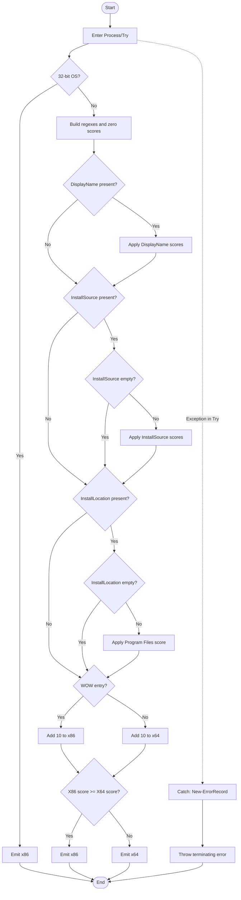

# Resolve-AppArchitecture

## Purpose
`Resolve-AppArchitecture` is a private discovery helper that classifies one
application record as `x86` or `x64` by scoring architecture hints from
`DisplayName`, `InstallSource`, `InstallLocation`, and the registry view that
produced the record. `Get-InstalledApplication` computes whether the source
entry came from the WOW6432 registry view, calls this helper, stores the
returned value in the synthetic `AppArch` field, and then applies any requested
architecture filter. The helper exists because the plan explicitly calls for a
dedicated, unit-testable architecture resolver instead of burying this scoring
logic inside discovery.

## Parameters
| Name | Type | Required | Default | Description |
|------|------|----------|---------|-------------|
| Application | `[System.Management.Automation.PSObject]` | Yes | N/A | Application record to inspect. The function reads the optional `DisplayName`, `InstallSource`, and `InstallLocation` properties from it. |
| IsWow | `[System.Boolean]` | Yes | N/A | `$True` when the record came from the 32-bit registry view on a 64-bit OS; otherwise `$False`. |

## Return Value
Returns `[System.String]`. On a 32-bit operating system it emits `'x86'`
immediately. On a 64-bit operating system it emits either `'x86'` or `'x64'`
from the final score comparison, with ties resolving to `'x86'`. It has no
designed `$Null` or silent no-output path; if any operation inside the `Try`
block fails, the `Catch` block builds an `ErrorRecord` through
`New-ErrorRecord` and raises a terminating error through
`$PSCmdlet.ThrowTerminatingError()`, so the function emits no architecture
string.

## Execution Flow

## Error Handling
- PowerShell parameter binding requires both parameters, and
  `[ValidateNotNull()]` rejects a null `Application` value before the function
  body runs.
- The full `Process` block is wrapped in one `Try/Catch`, so failures from
  `Get-Is64BitOperatingSystem`, regex construction, property access, string
  casts, or `Regex.IsMatch()` calls are all routed to the catch block.
- On a 32-bit OS, the function still enters `Try`, then emits `'x86'` before
  building regexes or scoring any hints.
- Missing `DisplayName`, `InstallSource`, or `InstallLocation` properties, null
  property values, and empty `InstallSource` or `InstallLocation` strings are
  silently ignored and contribute no score.
- If any caught failure occurs, the catch block calls `New-ErrorRecord` with
  exception type `System.InvalidOperationException`, error ID
  `ResolveAppArchitectureFailed`, category `InvalidOperation`, target object
  `$Application`, and a message that starts with
  `Unable to resolve application architecture:`.
- In the current implementation, the original exception message is embedded into
  the new error text, but `Resolve-AppArchitecture` does not preserve the
  original exception as an inner exception.
- After creating the error record, the catch block raises it as a terminating
  error with `$PSCmdlet.ThrowTerminatingError($ErrorRecord)`.
- The function body has no direct `Write-Warning`, `Write-Verbose`, or
  `Write-Debug` calls. The delegated `New-ErrorRecord` helper would only emit a
  warning if it failed to instantiate the requested exception type.

## Side Effects
This function has no side effects.

## Research Log
| Topic | Finding | Source | Date Verified |
|-------|---------|--------|---------------|
| Search: "PowerShell Practice and Style guide GitHub PoshCode" | The community PowerShell Practice and Style guide is still maintained as pragmatic baseline guidance rather than a hard language spec. | https://github.com/PoshCode/PowerShellPracticeAndStyle | 2026-04-01 |
| Search: "PSScriptAnalyzer overview" | Microsoft still positions PSScriptAnalyzer as the current static analyzer for PowerShell modules and scripts, with support for Windows PowerShell 5.1 or greater. | https://learn.microsoft.com/en-us/powershell/utility-modules/psscriptanalyzer/overview?view=ps-modules | 2026-04-01 |
| Search: "What's new in PSScriptAnalyzer" | PSScriptAnalyzer 1.24.0 (2025-03-18) raised its minimum PowerShell version to 5.1 and expanded `UseCorrectCasing` to correct operators, keywords, and commands by default. | https://learn.microsoft.com/en-us/powershell/utility-modules/psscriptanalyzer/whats-new-in-pssa?view=ps-modules | 2026-04-01 |
| Search: "UseCorrectCasing PowerShell" | Current analyzer guidance prefers exact type and cmdlet casing plus lowercase keywords and operators, which differs from this repo's PascalCase-everywhere house style. | https://learn.microsoft.com/en-us/powershell/utility-modules/psscriptanalyzer/rules/usecorrectcasing?view=ps-modules | 2026-04-01 |
| Search: "AvoidUsingPositionalParameters PowerShell" | Current analyzer guidance still discourages positional arguments, but the built-in rule only warns when three or more positional arguments are supplied, which is looser than this repo's standard. | https://learn.microsoft.com/en-us/powershell/utility-modules/psscriptanalyzer/rules/avoidusingpositionalparameters?view=ps-modules | 2026-04-01 |
| Search: "about Functions CmdletBindingAttribute PositionalBinding" | `PositionalBinding` still defaults to `$true`, so codebases that forbid positional binding must disable it explicitly. | https://learn.microsoft.com/en-us/powershell/module/microsoft.powershell.core/about/about_functions_cmdletbindingattribute?view=powershell-7.5 | 2026-04-01 |
| Search: "about Functions Advanced Parameters" | PowerShell still documents parameter validation attributes as the standard boundary-validation mechanism for advanced functions. | https://learn.microsoft.com/en-us/powershell/module/microsoft.powershell.core/about/about_functions_advanced_parameters?view=powershell-5.1 | 2026-04-01 |
| Search: "about Functions OutputTypeAttribute" | `OutputType` remains metadata only; it is not compared against actual runtime output. | https://learn.microsoft.com/en-us/powershell/module/microsoft.powershell.core/about/about_functions_outputtypeattribute?view=powershell-7.5 | 2026-04-01 |
| Search: "Writing Comment-Based Help Topics" | Comment-based help keywords remain current, and `Get-Help` still exposes sections such as `Example`, `Detailed`, `Full`, and `Online`. | https://learn.microsoft.com/en-us/powershell/scripting/developer/help/writing-comment-based-help-topics?view=powershell-7.5 | 2026-04-01 |
| Search: "about Return PowerShell" | PowerShell still returns statement results even without the `return` keyword, so the final bare `'x86'` or `'x64'` expression is a valid output pattern. | https://learn.microsoft.com/en-us/powershell/module/microsoft.powershell.core/about/about_return?view=powershell-7.5 | 2026-04-01 |
| Search: ".NET regex best practices timeout" | Current .NET guidance still recommends timeout-aware regex APIs for untrusted input and recommends interpreted regex for infrequent calls. | https://learn.microsoft.com/en-us/dotnet/standard/base-types/best-practices-regex | 2026-04-01 |
| Search: "compiled regular expressions reuse" | `RegexOptions.Compiled` still trades initialization time for runtime speed and only helps when the same regex object or cached static pattern is reused across multiple calls. | https://learn.microsoft.com/en-us/dotnet/standard/base-types/regular-expression-options | 2026-04-01 |
| Search: "String.IsNullOrEmpty .NET" | `System.String::IsNullOrEmpty()` remains the current supported API for null-or-empty checks; no deprecation surfaced. | https://learn.microsoft.com/en-us/dotnet/api/system.string.isnullorempty?view=net-9.0 | 2026-04-01 |
| Search: "about PSCustomObject case-sensitive" | PowerShell still treats `[pscustomobject]` keys and non-dictionary member access case-insensitively while preserving original casing. | https://learn.microsoft.com/en-us/powershell/module/microsoft.powershell.core/about/about_pscustomobject?view=powershell-7.5 | 2026-04-01 |
| Search: "about Character Encoding PowerShell 5.1 UTF-8 BOM" | SUPERSEDED on 2026-04-01: the prior audit tied the BOM finding to non-ASCII help text in this file. The current file is ASCII-only, so that code-specific rationale no longer applies. | https://learn.microsoft.com/en-us/powershell/module/microsoft.powershell.core/about/about_character_encoding?view=powershell-7.5 | 2026-04-01 |
| Search: "about Character Encoding PowerShell 5.1 UTF-8 BOM (updated application)" | Windows PowerShell 5.1 still distinguishes BOM-backed Unicode encodings from no-BOM text, and this repo's standard still requires UTF-8 with BOM for all `.ps1` and `.psd1` files even when a specific file is ASCII-only. | https://learn.microsoft.com/en-us/powershell/module/microsoft.powershell.core/about/about_character_encoding?view=powershell-7.5 | 2026-04-01 |
| Search: "about Case-Sensitivity PowerShell" | PowerShell still guarantees case-insensitive non-dictionary member access, which supports the function's use of `$Application.PSObject.Properties[...]` for `DisplayName`, `InstallSource`, and `InstallLocation`. | https://learn.microsoft.com/en-us/powershell/module/microsoft.powershell.core/about/about_case-sensitivity?view=powershell-7.5 | 2026-04-01 |
| Search: "Switch parameters preferred over Boolean parameters PowerShell" | PowerShell still prefers `[switch]` for presence/absence flags, but this helper's `[System.Boolean] $IsWow` remains appropriate because the registry-view state is explicit input data rather than an optional mode toggle. | https://learn.microsoft.com/en-us/powershell/module/microsoft.powershell.core/about/about_functions_advanced_parameters?view=powershell-7.5 | 2026-04-01 |
| Search: "compiled regular expressions reuse (updated .NET guidance)" | Current .NET guidance now documents compilation and reuse separately and adds source-generated regex as newer C# guidance; for this PowerShell helper, the still-relevant point is that `RegexOptions.Compiled` raises startup cost and helps only when the same pattern is reused frequently. | https://learn.microsoft.com/en-us/dotnet/standard/base-types/compilation-and-reuse-in-regular-expressions | 2026-04-01 |
| Search: "PowerShell cmdlet error reporting ThrowTerminatingError ErrorRecord" | SUPERSEDED on 2026-04-02: this row reflected an older catch implementation that bypassed `New-ErrorRecord`; the current source no longer does that. | https://learn.microsoft.com/en-us/powershell/scripting/developer/cmdlet/cmdlet-error-reporting?view=powershell-7.4 | 2026-04-02 |
| Search: "about PSCustomObject PowerShell psobject pscustomobject" | Current docs still distinguish `[psobject]` from `[pscustomobject]`; no deprecation surfaced for `PSObject`, but it remains a broad wrapper type rather than a specific application-record contract. This changes the object-type audit from `REVIEW` to `FAIL` against the house rule that rejects generic object typing. | https://learn.microsoft.com/en-us/powershell/module/microsoft.powershell.core/about/about_pscustomobject?view=powershell-7.5 | 2026-04-02 |
| Search: "PSScriptAnalyzer latest release GitHub" | GitHub still shows PSScriptAnalyzer `1.24.0` as the latest release, so no newer analyzer release changes the prior casing or PowerShell-version-baseline findings. | https://github.com/PowerShell/PSScriptAnalyzer/releases | 2026-04-02 |
| Search: "PowerShell cmdlet error reporting ThrowTerminatingError ErrorRecord (revalidated after source change)" | Microsoft still documents terminating errors as thrown exceptions or `ThrowTerminatingError(ErrorRecord)`. Applied to the current source, that guidance now aligns with the repo rule here because the catch block creates its record through `New-ErrorRecord` and then throws it with `$PSCmdlet.ThrowTerminatingError($ErrorRecord)`. | https://learn.microsoft.com/en-us/powershell/scripting/developer/cmdlet/cmdlet-error-reporting?view=powershell-7.4 | 2026-04-02 |
| Search: "about Functions CmdletBindingAttribute SupportsShouldProcess ConfirmImpact" | Current PowerShell docs still say `SupportsShouldProcess` adds `-Confirm` and `-WhatIf`, and `ConfirmImpact` should be specified only when `SupportsShouldProcess` is present. This does not change the standards audit, but it reinforces the frozen plan's literal prohibition and the standing conflict between the plan and the repo template. | https://learn.microsoft.com/en-us/powershell/module/microsoft.powershell.core/about/about_functions_cmdletbindingattribute?view=powershell-7.5 | 2026-04-02 |

## Standards Audit
| Rule | Status | Line(s) | Evidence |
|------|--------|---------|----------|
| Colon-bound parameters | PASS | 165-173 | The only value-bearing command call is colon-bound: ``$ErrorRecord = New-ErrorRecord``, with arguments such as ``-ExceptionName:'System.InvalidOperationException'``, ``-TargetObject:$Application``, and ``-ErrorCategory:([System.Management.Automation.ErrorCategory]::InvalidOperation)``. |
| PascalCase naming | PASS | 1, 55-85, 87-175 | ``Function Resolve-AppArchitecture {``, ``Process {``, ``$DisplayNameValue``, ``$RegexProgramFilesX64``, and ``$PrefersX86`` follow the repo's PascalCase house style. |
| Full .NET type names (no accelerators) | PASS | 43, 47, 51, 65-82, 84-85, 173 | ``[OutputType([System.String])]``, ``[System.Management.Automation.PSObject]``, ``[System.Boolean]``, ``[System.Text.RegularExpressions.Regex]::new(...)``, ``[System.Int32]$ScoreX86``, and ``[System.Management.Automation.ErrorCategory]::InvalidOperation`` use full .NET type names. |
| Leading commas in attribute blocks | FAIL | 34-45, 50 | ``[CmdletBinding(`` is followed by ``ConfirmImpact = 'None',`` instead of a leading-comma line such as ``, ConfirmImpact = ...``, and the parameter attributes are written as ``[Parameter(Mandatory = $True, ParameterSetName = 'Default')]`` rather than the standard's leading-comma form. |
| `[Parameter()]` properties listed explicitly | FAIL | 45, 50 | Both parameter attributes are abbreviated to ``[Parameter(Mandatory = $True, ParameterSetName = 'Default')]`` and omit explicit properties such as `DontShow`, `HelpMessage`, `Position`, `ValueFromPipeline`, `ValueFromPipelineByPropertyName`, and `ValueFromRemainingArguments` that the house template requires to be listed. |
| Object types are the MOST appropriate and specific choice | FAIL | 45-48 | ``[System.Management.Automation.PSObject] $Application`` is a generic shell wrapper type, and the standard explicitly calls out generic object typing like `PSObject` as too broad when a more specific record contract is intended. |
| Single quotes for non-interpolated strings | PASS | 35-41, 62, 69, 73, 77, 81, 166-172 | ``ConfirmImpact = 'None'``, regex patterns such as ``'Program Files(?! \(x86\))'``, the error message template ``'Unable to resolve application architecture: {0}'``, the error ID ``'ResolveAppArchitectureFailed'``, and the output strings ``'x86'`` / ``'x64'`` are single-quoted. |
| `$PSItem` not `$_` | PASS | 168-169 | The catch block uses ``$PSItem.Exception.Message``, and a local scan returned `NO_UNDERSCORE_AUTOVAR`. |
| Explicit bool comparisons (`$Var -eq $True`) | PASS | 57-60, 89-99, 107-121, 130-148, 154-162 | Representative cases include ``If ($Is32BitOperatingSystem -eq $True) {``, ``$DisplayNameLooksX86 = [System.Boolean]( $RegexX86.IsMatch($DisplayNameValue) -eq $True )``, ``If ($HasInstallSourceText -eq $True) {``, ``If ($IsWowEntry -eq $True) {``, and ``If ($PrefersX86 -eq $True) { 'x86' } Else { 'x64' }``. |
| If conditions are pre-evaluated outside If blocks | PASS | 58-60, 89-99, 107-121, 130-148, 154-161 | The function stores conditions in typed variables before branching, for example ``$Is32BitOperatingSystem = [System.Boolean]( $Is64BitOperatingSystem -eq $False )`` before ``If ($Is32BitOperatingSystem -eq $True) {``, ``$DisplayNameLooksX86 = [System.Boolean](...)`` before ``If ($DisplayNameLooksX86 -eq $True)``, and ``$PrefersX86 = [System.Boolean]($ScoreX86 -ge $ScoreX64)`` before the final `If/Else`. |
| `$Null` on left side of comparisons | PASS | 89-91, 107-109, 130-132 | ``$Null -ne $DisplayNameProperty -and $Null -ne $DisplayNameProperty.Value``, ``$Null -ne $InstallSourceProperty -and $Null -ne $InstallSourceProperty.Value``, and ``$Null -ne $InstallLocationProperty -and $Null -ne $InstallLocationProperty.Value`` keep `$Null` on the left. |
| No positional arguments to cmdlets | PASS | 165-173 | The function's only command call with value arguments is ``New-ErrorRecord``, and every supplied argument is named: ``-ExceptionName:``, ``-ExceptionMessage:``, ``-TargetObject:``, ``-ErrorId:``, and ``-ErrorCategory:``. |
| No cmdlet aliases | PASS | 55-174 | The function body calls ``Get-Is64BitOperatingSystem`` and ``New-ErrorRecord`` by full names, and a local alias-token scan returned `NO_COMMON_ALIAS_TOKEN`. |
| Switch parameters correctly handled | N/A | 44-52, 55-175 | The function defines no `[switch]` parameters and does not call any switch-bearing commands that need audit here. |
| CmdletBinding with all required properties | PASS | 34-42 | ``[CmdletBinding( ConfirmImpact = 'None', DefaultParameterSetName = 'Default', HelpURI = '', PositionalBinding = $False, RemotingCapability = 'None', SupportsPaging = $False, SupportsShouldProcess = $False )]`` lists the repo's required explicit `CmdletBinding()` properties. |
| OutputType declared | PASS | 43 | ``[OutputType([System.String])]`` is declared immediately above `Param`. |
| Comment-based help is complete | PASS | 3-31 | The help block includes ``.SYNOPSIS``, ``.DESCRIPTION``, ``.PARAMETER`` for both parameters, ``.EXAMPLE``, ``.OUTPUTS``, and ``.NOTES``. |
| Soft return instead of `return` | PASS | 61-62, 161-162 | The function emits values with bare expressions: ``'x86'`` on the 32-bit path and ``If ($PrefersX86 -eq $True) { 'x86' } Else { 'x64' }`` on the scored path. |
| Error handling via `New-ErrorRecord` or appropriate pattern | PASS | 164-174 | The catch block assigns ``$ErrorRecord = New-ErrorRecord ...`` and then raises it with ``$PSCmdlet.ThrowTerminatingError($ErrorRecord)``. |
| Try/Catch around operations that can fail | PASS | 55-175 | The full operational body is wrapped by ``Try {`` at line 56 and ``} Catch {`` at line 164, so OS detection, regex construction, property access, casts, and match operations all execute inside the catch scope. |
| Begin / Process / End blocks by default | FAIL | 55-176 | The function defines only ``Process {`` and omits ``Begin {`` / ``End {}``, even though the standards template defaults to all three lifecycle blocks. |
| Write-Debug at Begin/Process/End block entry and exit | FAIL | 55-176 | ``Process {`` is present at line 55, but no ``Write-Debug -Message:'[Resolve-AppArchitecture] Entering/Leaving Block: Process'`` appears anywhere in the block. |
| No variable pollution (`script:`/`global:` leaks) | PASS | 56-174 | Working state is stored in local variables such as ``$ScoreX86``, ``$InstallSourceValue``, ``$InstallLocationProperty``, and ``$ErrorRecord``; a local scan returned `NO_SCOPE_LEAK`. |
| 96-character line limit | PASS | 1-177 | A local scan returned `NO_LONG_LINES`; representative near-maximum wrapped code such as ``    $RegexProgramFilesX64 = [System.Text.RegularExpressions.Regex]::new(`` stays within the limit. |
| 2-space indentation (not tabs, not 4-space) | PASS | 34-175 | Lines such as ``  [CmdletBinding(``, ``    $RegexOptions = (``, and ``      [System.Text.RegularExpressions.RegexOptions]::Compiled`` use 2-space indents, and a local scan returned `NO_TABS`. |
| OTBS brace style | PASS | 1, 55, 61, 93, 111, 134, 146-149, 155-157, 161-164 | ``Function Resolve-AppArchitecture {``, ``Process {``, ``If ($Is32BitOperatingSystem -eq $True) {``, ``} ElseIf ($IsProgramFilesX64 -eq $True) {``, ``} Else {``, and ``} Catch {`` follow OTBS placement. |
| No commented-out code | PASS | 2-32 | The only comments are the comment-based help block delimited by ``<#`` / ``#>``; there are no disabled executable statements in the function body. |
| Registry access is read-only | N/A | 44-174 | The function inspects an input object and the `IsWow` flag only; it does not open or modify registry keys. |
| Parameter validation at the boundary | PASS | 45-52 | ``[Parameter(Mandatory = $True, ParameterSetName = 'Default')]`` plus ``[ValidateNotNull()]`` guard `Application`, and mandatory typed ``[System.Boolean] $IsWow`` enforces Boolean input during parameter binding. |
| UTF-8 with BOM for a PS 5.1 file | PASS | file header | A local byte check returned ``EF BB BF 46``, so the file starts with the required UTF-8 BOM followed by ``F`` from ``Function``. |

Research notes:

1. Current PSScriptAnalyzer `UseCorrectCasing` guidance still prefers lowercase
   keywords and operators plus exact cmdlet/type casing, but this audit follows
   the repository's PascalCase-everywhere house style.
2. Current PowerShell platform guidance still treats
   `ThrowTerminatingError(ErrorRecord)` as a valid terminating-error pattern;
   the current implementation also routes the error record through the repo's
   required `New-ErrorRecord` helper before throwing it.
3. Current .NET regex guidance still distinguishes interpreted, compiled, and
   source-generated regex. Source-generated regex is C#-only and not directly
   usable in this PowerShell 5.1 helper, so the still-relevant concerns here
   remain timeout handling for untrusted input and the startup cost of per-call
   compiled regex construction.
4. PowerShell language docs still allow `return`, but the current
   implementation already follows the repo's preferred soft-return style by
   emitting bare `'x86'` / `'x64'` expressions.
5. Current `CmdletBinding` docs still say `ConfirmImpact` belongs with
   `SupportsShouldProcess`, while the frozen plan literally forbids both. The
   standards table audits against the standards reference; the plan table audits
   against the plan.

## Plan Audit
| Plan Section | Requirement | Status | Line(s) | Details |
|--------------|-------------|--------|---------|---------|
| 12. File Structure | `Resolve-AppArchitecture.ps1` must live under `src/Private/`. | ALIGNED | `src/Private/Resolve-AppArchitecture.ps1:1-177` | The function is implemented in the planned private-helper path. |
| 12. Function Responsibilities | "`Resolve-AppArchitecture.ps1` - computes `AppArch`" | ALIGNED | `src/Private/Resolve-AppArchitecture.ps1:55-175`; `src/Private/Get-InstalledApplication.ps1:287-289` | The helper computes `x86` or `x64`, and discovery writes that result into the synthetic `AppArch` field. |
| 7.6 Architecture Detection | "on 32-bit OS, every discovered application is `x86`" | ALIGNED | `src/Private/Resolve-AppArchitecture.ps1:56-62` | The function emits `'x86'` before any scoring when `Get-Is64BitOperatingSystem` reports a 32-bit OS. |
| 7.6 Architecture Detection | "on 64-bit OS, use weighted evidence from `DisplayName`, `InstallSource`, `InstallLocation`, and registry view" | ALIGNED | `src/Private/Resolve-AppArchitecture.ps1:87-102,105-124,128-149,154-158` | The helper scores `DisplayName` `+100`, `InstallSource` `+25`, `InstallLocation` `+10`, and registry view `+10`. |
| 7.6 Architecture Detection | "check `Program Files (x86)` before generic `Program Files`; use `Program Files(?! \(x86\))`; tie goes to `x86`" | ALIGNED | `src/Private/Resolve-AppArchitecture.ps1:76-82,140-149,161-162` | The x86 and x64 path regexes are separate, `Program Files (x86)` is checked first, the x64 pattern uses the required negative lookahead, and the final `-ge` comparison sends ties to `'x86'`. |
| 8.1 Case Handling | "use `PSCustomObject` property lookups or an equivalent case-insensitive mechanism" | ALIGNED | `src/Private/Resolve-AppArchitecture.ps1:88,106,129` | The function reads properties through `$Application.PSObject.Properties[...]`, and a local verification confirmed that `['DisplayName']`, `['displayname']`, and `['DISPLAYNAME']` all resolve the same property. |
| 12. External Seams | "External dependencies must be wrapped behind private seam functions so tests can mock them reliably." | ALIGNED | `src/Private/Resolve-AppArchitecture.ps1:57`; `src/Private/Get-Is64BitOperatingSystem.ps1:1-35`; `tests/Private/Resolve-AppArchitecture.Tests.ps1:27,53,112,144,168,192,216,258` | OS bitness is read only through `Get-Is64BitOperatingSystem`, and the dedicated test file mocks that seam throughout its scenario groups. |
| 14.2 Critical Unit Tests | "`Resolve-AppArchitecture` covers: 32-bit OS short-circuit, x86 evidence, x64 evidence, `Program Files (x86)` precedence, tie -> `x86`" | ALIGNED | `tests/Private/Resolve-AppArchitecture.Tests.ps1:25-46,56-69,115-128,171-184,195-208` | The test file includes explicit cases for each required branch. I re-ran `Invoke-Pester -Path 'tests\Private\Resolve-AppArchitecture.Tests.ps1'` on 2026-04-02; discovery found 26 tests, but execution still failed in this sandbox because Pester 5.7.1 tried to create `HKCU\Software\Pester` and registry writes are blocked here. |
| 4.4 No Interactivity | "no `SupportsShouldProcess`, no `ConfirmImpact`, no dependency on an interactive session" | DEVIATION | `src/Private/Resolve-AppArchitecture.ps1:34-41` | The helper does not prompt, but it explicitly declares `ConfirmImpact = 'None'` and `SupportsShouldProcess = $False`, which does not satisfy the plan's literal "no `ConfirmImpact` / no `SupportsShouldProcess`" wording. |
| 4.3 Exit Codes | The top-level script wrapper owns PDQ output lines and the final process exit code. | ALIGNED | `src/Private/Resolve-AppArchitecture.ps1:62,162,174` | This helper only emits `'x86'` or `'x64'` or throws a terminating error; it does not write PDQ output or own process exit behavior. |
| 5.1 Application Record | `AppArch` is a synthetic field on each application record. | ALIGNED | `src/Private/Get-InstalledApplication.ps1:234,287-289`; `src/Private/Resolve-AppArchitecture.ps1:55-175` | `Get-InstalledApplication` materializes `AppArch` as a note property and fills it with this helper's output. |
| 12. Function Responsibilities; 14.2 Critical Unit Tests | The helper should exist as a dedicated unit-testable architecture resolver, not be folded into unrelated code. | ALIGNED | `PLAN.md:733-734,820-825`; `src/Private/Resolve-AppArchitecture.ps1:1-177`; `tests/Private/Resolve-AppArchitecture.Tests.ps1:25-278` | The plan explicitly names a dedicated `Resolve-AppArchitecture.ps1` helper and requires direct unit coverage for its key branches, so keeping this logic isolated is planned design rather than overengineering. |

Plan notes:

1. Plan 4.4 and the house standard still pull in opposite directions: the plan
   forbids `ConfirmImpact` and `SupportsShouldProcess`, while the standards
   reference requires an explicit `CmdletBinding()` property list. This helper
   follows the standards pattern but therefore misses the plan's literal
   wording.
2. The current sandbox still cannot execute the dedicated Pester file to
   completion because Pester 5.7.1 attempts to create
   `HKCU\Software\Pester` for its temporary test registry, and registry writes
   are blocked here. That prevents runtime verification in this environment,
   but it does not change the line-level evidence that the required test cases
   exist.

## Changelog

| Date | Changes |
|------|---------|
| 2026-04-02 | Corrected the stale audit to the current helper-based catch implementation: changed the colon-bound, soft-return, and `New-ErrorRecord` verdicts to PASS, fixed the Error Handling section to match the live code, added missed FAILs for missing lifecycle debug tracing and Process-only lifecycle structure, refreshed plan evidence to current `Get-InstalledApplication` line numbers, and re-verified the Pester registry sandbox limitation with a live run. |
| 2026-04-02 | Corrected the stale audit against the live source again: fixed the catch-scope and error-path documentation, corrected the standards verdicts for pre-evaluated `If` conditions, `Try/Catch`, and UTF-8 BOM, promoted the generic `PSObject` parameter from `REVIEW` to `FAIL`, added missed findings for leading-comma attributes, non-explicit `[Parameter()]` property lists, and repo-forbidden `return` usage, refreshed plan line references, and re-verified the Pester sandbox limitation with a live run. |
| 2026-04-01 | Corrected the stale audit against the live source: fixed the parameter types, flowchart, error-handling description, standards verdicts, and plan alignment; added missed findings for pre-evaluated `If` conditions and the literal plan 4.4 `ConfirmImpact` / `SupportsShouldProcess` mismatch; corrected the BOM rationale and expanded the research log with case-sensitivity, Boolean-vs-switch, and updated regex compilation guidance. |
| 2026-04-01 | First audit run. Added the initial README with function documentation, execution flow, current web research log, standards audit, plan audit, and changelog tracking. |
AUDIT_STATUS:UPDATED