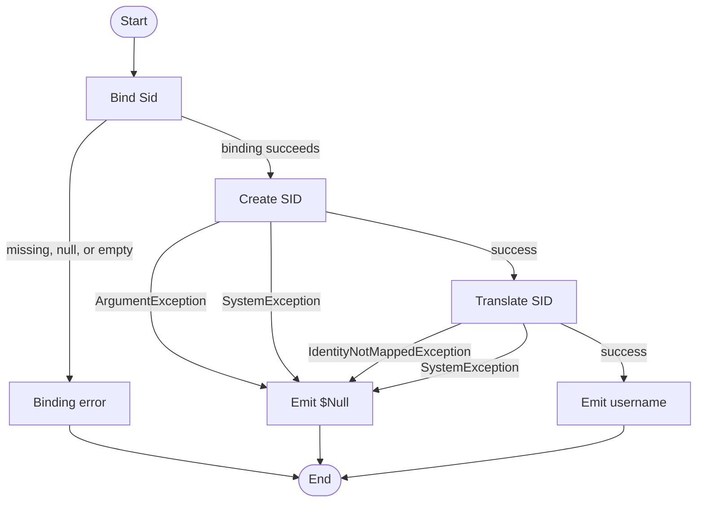

# Resolve-SidIdentity

## Purpose

`Resolve-SidIdentity` is a private seam that accepts one SID string and tries to
translate it to a `DOMAIN\Username` account name by constructing
`[System.Security.Principal.SecurityIdentifier]` and calling
`Translate([System.Security.Principal.NTAccount])`. `Get-UninstallRegistryPath`
calls it while building loaded-`HKU` registry view descriptors so user-scoped
uninstall records can carry best-effort `UserName` metadata without repeating
SID translation per application entry. The helper exists mainly for
testability, because downstream tests can mock account resolution instead of
depending on live Windows identity translation.

## Parameters

| Name | Type | Required | Default | Description |
|------|------|----------|---------|-------------|
| `Sid` | `System.String` | Yes | None | The SID string to translate to an `NTAccount` name. |

## Return Value

On successful translation, the `Process` block emits one `[System.String]`
equal to `$Account.Value`, such as `NT AUTHORITY\SYSTEM`. If SID construction
throws `[System.ArgumentException]`, if translation throws
`[System.Security.Principal.IdentityNotMappedException]`, or if either step
throws `[System.SystemException]`, the catch block path evaluates `$Null`;
callers assigning the result observe `$Null`, while pure pipeline consumers
effectively receive no object. Missing `Sid`, `$Null`, and empty-string input do
not reach the function body because parameter binding fails before `Process`
runs.

## Execution Flow

## Error Handling

- Missing `Sid`, `$Null`, or `''` triggers mandatory or validation binding
  errors before the `Process` block runs.
- Whitespace-only or malformed SID text reaches
  `[System.Security.Principal.SecurityIdentifier]::new($Sid)`. If that raises
  `[System.ArgumentException]` or `[System.SystemException]`, the function
  catches it and evaluates `$Null`.
- Unresolvable SIDs raise
  `[System.Security.Principal.IdentityNotMappedException]` from
  `$SecurityIdentifier.Translate([System.Security.Principal.NTAccount])`; that
  path is caught and also evaluates `$Null`.
- The catch blocks distinguish the expected exception types, but they still do
  not emit `New-ErrorRecord`, `Write-Warning`, or `Write-Error`, so callers
  cannot tell parse failure from lookup failure from other system-level failure
  without re-running the translation themselves.

## Side Effects

This function has no side effects. It performs a best-effort Windows identity
lookup, but it does not modify registry data, files, processes, or variables
outside its own scope.

## Research Log

Previous research rows are preserved below. Rows marked `SUPERSEDED` were
accurate when recorded, but the current function or the current external source
state no longer matches the earlier audit impact.

This helper uses only built-in PowerShell and .NET identity APIs and does not
touch registry values, files, credentials, processes, or network resources, so
the security-operations and third-party-module portions of the checklist were
limited to confirming that the identity APIs remain current.

| Topic | Finding | Source | Date Verified |
|-------|---------|--------|---------------|
| Search: `about_Functions_CmdletBindingAttribute PositionalBinding Position` | Current Microsoft guidance says `Position` on `[Parameter()]` takes precedence over `PositionalBinding = $False`. Change: adds a new standards finding here because `Sid` still declares `Position = 0`, so the function remains callable positionally despite the non-positional cmdlet binding setting. | https://learn.microsoft.com/en-us/powershell/module/microsoft.powershell.core/about/about_functions_cmdletbindingattribute?view=powershell-7.5 | 2026-04-02 |
| Search: `PSScriptAnalyzer releases` | SUPERSEDED on 2026-04-02. Earlier audit text said the public GitHub releases page still listed `1.24.0` as the latest release. Current verification shows that statement is stale. | https://github.com/PowerShell/PSScriptAnalyzer/releases | 2026-04-02 |
| Search: `PSScriptAnalyzer releases latest` | The current public GitHub releases page now lists `1.25.0` as the latest PSScriptAnalyzer release, published on 2026-03-20. The release adds rules such as `UseConsistentParametersKind`, `UseConsistentParameterSetName`, and `UseSingleValueFromPipelineParameter`. Change: corrects the stale `1.24.0` latest-release finding; no direct code impact on this helper surfaced from the new rules. | https://github.com/PowerShell/PSScriptAnalyzer/releases | 2026-04-02 |
| Search: `PSScriptAnalyzer what's new` | Microsoft Learn's `What's new in PSScriptAnalyzer` page still tops out at `1.24.0`, so current analyzer release tracking now requires checking GitHub releases as well. Change: explains why the earlier Learn-based `1.24.0` row remained true while the GitHub latest-release row became stale. | https://learn.microsoft.com/en-us/powershell/utility-modules/psscriptanalyzer/whats-new-in-pssa?view=ps-modules | 2026-04-02 |
| Search: `PowerShell Practice and Style code layout` | The community style guide still frames itself as guidance rather than a mandatory standard, and the current code-layout page still says project-specific rules trump the guide. Change: none, but it reinforces auditing against this repo's house standard where the two differ. | https://poshcode.gitbook.io/powershell-practice-and-style/style-guide/code-layout-and-formatting | 2026-04-02 |
| Search: `about_Character_Encoding UTF-8 with BOM PowerShell 5.1` | Microsoft still documents UTF-8 with BOM as the safe encoding for Windows PowerShell 5.1 when scripts contain non-ASCII content. Change: the external guidance did not change, but the previous code-specific `NO-BOM` finding is now false because the current file starts with `EF BB BF`. | https://learn.microsoft.com/en-us/powershell/module/microsoft.powershell.core/about/about_character_encoding?view=powershell-7.5 | 2026-04-02 |
| Search: `about_Requires` | Current docs say `#Requires` can appear on any line in a script and is always applied globally, even when placed inside a function. Change: removes the earlier placement ambiguity and keeps the direct standards miss here because this standalone `.ps1` file contains no `#Requires -Version 5.1`. | https://learn.microsoft.com/en-us/powershell/module/microsoft.powershell.core/about/about_requires?view=powershell-7.6 | 2026-04-02 |
| Search: `SecurityIdentifier.Translate(Type)` | `SecurityIdentifier.Translate(Type)` remains the current translation API and still documents `IdentityNotMappedException` and `SystemException` as expected failure modes. Change: none. | https://learn.microsoft.com/en-us/dotnet/api/system.security.principal.securityidentifier.translate?view=net-10.0 | 2026-04-02 |
| Search: `PowerShell Practice and Style guide` | The community PowerShell Practice and Style guide is still available, but it still describes itself as guidance rather than a rigid rulebook and says the style guide is in preview. Change: none. | https://poshcode.gitbook.io/powershell-practice-and-style | 2026-04-01 |
| Search: `PowerShell Practice and Style readability` | The GitBook style pages still include long-standing draft language and TODO notes, which reinforces that they are not a current authoritative standard by themselves. Change: none. | https://poshcode.gitbook.io/powershell-practice-and-style/style-guide/readability | 2026-04-01 |
| Search: `PSScriptAnalyzer overview` | PSScriptAnalyzer remains the Microsoft-documented static analyzer for PowerShell code and still supports Windows PowerShell 5.1 or greater. Change: none. | https://learn.microsoft.com/en-us/powershell/utility-modules/psscriptanalyzer/overview?view=ps-modules | 2026-04-01 |
| Search: `PSScriptAnalyzer what's new` | Current release notes still show PSScriptAnalyzer 1.24.0 on 2025-03-18 and note that `UseCorrectCasing` can now correct commands, keywords, and operators by default. Change: keeps the standards-discrepancy note because current analyzer guidance still differs from this repo's PascalCase keyword rule. | https://learn.microsoft.com/en-us/powershell/utility-modules/psscriptanalyzer/whats-new-in-pssa?view=ps-modules | 2026-04-01 |
| Search: `UseCorrectCasing` | Current Microsoft rule guidance still says exact casing should be used for commands and parameters, but language keywords and operators should be lowercase. Change: keeps the standards-discrepancy note, not a code finding against this repo's house style. | https://learn.microsoft.com/en-us/powershell/utility-modules/psscriptanalyzer/rules/usecorrectcasing?view=ps-modules | 2026-04-01 |
| Search: `AvoidUsingPositionalParameters` | The built-in analyzer rule still only warns when a command uses three or more positional parameters, which is looser than this repo's zero-positional-argument rule. Change: none. | https://learn.microsoft.com/en-us/powershell/utility-modules/psscriptanalyzer/rules/avoidusingpositionalparameters?view=ps-modules | 2026-04-01 |
| Search: `about_Functions_CmdletBindingAttribute PositionalBinding` | SUPERSEDED on 2026-04-01. Earlier audit text used this source to support a bare-`[CmdletBinding()]` finding. The source guidance is still current, but that code-specific implication no longer applies because the function now declares the full explicit property inventory. | https://learn.microsoft.com/en-us/powershell/module/microsoft.powershell.core/about/about_functions_cmdletbindingattribute?view=powershell-7.5 | 2026-04-01 |
| Search: `about_Functions_CmdletBindingAttribute PositionalBinding` | `CmdletBinding` still exposes explicit properties such as `SupportsShouldProcess`, `SupportsPaging`, and `PositionalBinding`. Change: no new external concern; the current source already uses an explicit property inventory, so this research no longer changes the standards audit. | https://learn.microsoft.com/en-us/powershell/module/microsoft.powershell.core/about/about_functions_cmdletbindingattribute?view=powershell-7.5 | 2026-04-01 |
| Search: `about_Functions_OutputTypeAttribute` | `OutputType` is still metadata only; PowerShell does not compare the declared type to actual runtime output. Change: confirms that runtime output paths still need manual auditing. | https://learn.microsoft.com/en-us/powershell/module/microsoft.powershell.core/about/about_functions_outputtypeattribute?view=powershell-7.5 | 2026-04-01 |
| Search: `Comment-Based Help Keywords` | SUPERSEDED on 2026-04-01. Earlier audit text used this source to support a missing `.EXAMPLE` finding. The source guidance is still current, but that code-specific implication no longer applies because the function now includes `.EXAMPLE`. | https://learn.microsoft.com/en-us/powershell/scripting/developer/help/comment-based-help-keywords?view=powershell-7.5 | 2026-04-01 |
| Search: `Comment-Based Help Keywords` | `.PARAMETER`, `.EXAMPLE`, `.OUTPUTS`, and `.NOTES` remain current help keywords, and Microsoft still documents `.EXAMPLE` as the place for sample usage. Change: no current documentation gap; the help block now contains the required example section. | https://learn.microsoft.com/en-us/powershell/scripting/developer/help/comment-based-help-keywords?view=powershell-7.5 | 2026-04-01 |
| Search: `ValidateNotNullOrEmpty ValidateNotNullOrWhiteSpace` | Current advanced-parameter docs still say `ValidateNotNullOrEmpty` rejects null and empty values, while `ValidateNotNullOrWhiteSpace` additionally rejects whitespace-only strings. Change: whitespace-only SID text remains an improvement candidate because it still falls through to the catch path and returns `$Null` instead of failing at binding. | https://learn.microsoft.com/en-us/powershell/module/microsoft.powershell.core/about/about_functions_advanced_parameters?view=powershell-7.6 | 2026-04-01 |
| Search: `about_Try_Catch_Finally` | `try/catch/finally` remains the documented PowerShell pattern for handling terminating errors, and typed catches are still the way to distinguish expected failure modes. Change: confirms the current catch structure is intentional PowerShell syntax, even though this helper still silently swallows those failures. | https://learn.microsoft.com/en-us/powershell/module/microsoft.powershell.core/about/about_try_catch_finally?view=powershell-7.5 | 2026-04-01 |
| Search: `SecurityIdentifier class constructor` | `SecurityIdentifier` and its `SecurityIdentifier(String)` constructor remain current APIs in `System.Security.Principal.Windows.dll`; no deprecation or replacement surfaced. Change: none. | https://learn.microsoft.com/en-us/dotnet/api/system.security.principal.securityidentifier?view=net-9.0 https://learn.microsoft.com/en-us/dotnet/api/system.security.principal.securityidentifier.-ctor?view=net-9.0 | 2026-04-01 |
| Search: `SecurityIdentifier.Translate NTAccount` | `SecurityIdentifier.Translate(Type)` is still the current translation API and can throw `IdentityNotMappedException` or `SystemException` when translation fails. Change: confirms that unresolved SIDs and lookup failures are expected catch-path scenarios for this helper. | https://learn.microsoft.com/en-us/dotnet/api/system.security.principal.securityidentifier.translate?view=net-9.0 | 2026-04-01 |
| Search: `SecurityIdentifier.IsValidTargetType NTAccount` | Current .NET docs still list `NTAccount` and `SecurityIdentifier` as the valid translation targets for `SecurityIdentifier`. Change: confirms `[System.Security.Principal.NTAccount]` remains the most specific supported target for this helper's username-resolution output. | https://learn.microsoft.com/en-us/dotnet/api/system.security.principal.securityidentifier.isvalidtargettype?view=net-10.0 | 2026-04-01 |
| Search: `well-known SID S-1-5-18` | Microsoft still documents `S-1-5-18` as the local `System` identity, so the existing unit test's well-known SID remains valid. Change: none. | https://learn.microsoft.com/en-us/windows-server/identity/ad-ds/manage/understand-security-identifiers | 2026-04-01 |

## Standards Audit

Audit target: `src/Private/Resolve-SidIdentity.ps1`

| Rule | Status | Line(s) | Evidence |
|------|--------|---------|----------|
| Colon-bound parameters | N/A | 55-58 | `Resolve-SidIdentity` does not invoke any cmdlet or function with bindable PowerShell parameters; its body only uses `[System.Security.Principal.SecurityIdentifier]::new($Sid)` and `$SecurityIdentifier.Translate([System.Security.Principal.NTAccount])`. |
| PascalCase naming | PASS | 1, 37, 53-67 | `Function Resolve-SidIdentity {`, `Param (`, `Process {`, `Try {`, `} Catch [System.ArgumentException] {`, and variables such as `$SecurityIdentifier` and `$Account` follow the repo's PascalCase convention. |
| Full .NET type names (no accelerators) | PASS | 36, 49, 55-64 | `[OutputType([System.String])]`, `[System.String]`, `[System.Security.Principal.SecurityIdentifier]`, `[System.Security.Principal.NTAccount]`, `[System.ArgumentException]`, `[System.Security.Principal.IdentityNotMappedException]`, and `[System.SystemException]` use full .NET type names. |
| Object types are the most appropriate and specific choice | PASS | 36, 49, 55-58 | The parameter and declared output are `[System.String]`, and the translation uses the specific identity types `[System.Security.Principal.SecurityIdentifier]` and `[System.Security.Principal.NTAccount]` instead of generic `PSObject` or `Object` types. |
| Single quotes for non-interpolated strings | PASS | 17, 28-34, 42 | `Resolve-SidIdentity -Sid:'S-1-5-18'`, `ConfirmImpact = 'None'`, `DefaultParameterSetName = 'Default'`, `HelpURI = ''`, `RemotingCapability = 'None'`, and `HelpMessage = 'See function help.'` use single-quoted literals. |
| `$PSItem` not `$_` | N/A | 1-68 | There is no pipeline script block and neither automatic variable appears in the function body. |
| Explicit bool comparisons (`$Var -eq $True`) | N/A | 53-67 | The function has no conditional expressions. |
| If conditions are pre-evaluated outside `If` blocks | N/A | 53-67 | The function has no `If` blocks. |
| `$Null` on left side of comparisons | N/A | 53-67 | The function has no null comparisons. |
| No positional arguments to cmdlets | N/A | 55-58 | No cmdlets are called; the body uses only a .NET constructor and a .NET instance method. |
| Named parameters only | FAIL | 31, 43 | `PositionalBinding = $False` is declared, but `[Parameter( ... Position = 0, ... )]` re-enables positional invocation for `Sid`, so the function still accepts unnamed argument binding. |
| No cmdlet aliases | N/A | 55-58 | No cmdlets are invoked, so there is no alias usage to audit. |
| Switch parameters correctly handled | N/A | 37-50, 55-58 | The function defines no `[switch]` parameters and does not pass switch parameters to any command. |
| CmdletBinding with all required properties | PASS | 27-35 | `[CmdletBinding( ConfirmImpact = 'None' , DefaultParameterSetName = 'Default' , HelpURI = '' , PositionalBinding = $False , RemotingCapability = 'None' , SupportsPaging = $False , SupportsShouldProcess = $False )]` explicitly declares the repo's required property inventory. |
| Leading commas in attributes | FAIL | 27-46 | `[CmdletBinding(` is followed by `ConfirmImpact = 'None'`, and `[Parameter(` is followed by `Mandatory = $True,` instead of the house-required leading-comma form such as `, ConfirmImpact = 'None'` and `, Mandatory = $True`. |
| OutputType declared | PASS | 36 | `[OutputType([System.String])]` is present immediately above `Param()`. |
| Comment-based help is complete (`Synopsis`, `Description`, `Parameter`, `Example`, `Outputs`, `Notes`) | PASS | 3-24 | The help block contains `.SYNOPSIS`, `.DESCRIPTION`, `.PARAMETER Sid`, `.EXAMPLE`, `.OUTPUTS`, and `.NOTES`. |
| `Parameter()` properties listed explicitly | FAIL | 38-47 | `[Parameter( Mandatory = $True, ParameterSetName = 'Default', DontShow = $False, HelpMessage = 'See function help.', Position = 0, ValueFromPipeline = $False, ValueFromPipelineByPropertyName = $False, ValueFromRemainingArguments = $False )]` omits repo-template properties such as `HelpMessageBaseName` and `HelpMessageResourceId`, so it still does not list the full property inventory explicitly. |
| Error handling via `New-ErrorRecord` or appropriate pattern | FAIL | 54-65 | `Try { ... } Catch [System.ArgumentException] { $Null } Catch [System.Security.Principal.IdentityNotMappedException] { $Null } Catch [System.SystemException] { $Null }` distinguishes expected failures, but it still silently swallows them and emits no `New-ErrorRecord`, `Write-Warning`, or `Write-Error`. |
| Try/Catch around operations that can fail | PASS | 54-65 | `[System.Security.Principal.SecurityIdentifier]::new($Sid)` and `$SecurityIdentifier.Translate([System.Security.Principal.NTAccount])` both execute inside `Try { ... } Catch ...`. |
| Write-Debug at Begin/Process/End block entry and exit (if blocks are used) | FAIL | 53-67 | The function uses `Process { ... }`, but that block contains no `Write-Debug -Message:'[Resolve-SidIdentity] Entering Block: Process'` or matching leaving trace. |
| No variable pollution (no `script:` or `global:` scope leaks) | PASS | 55-59 | `$SecurityIdentifier = ...` and `$Account = ...` are local variables, and no `script:` or `global:` assignments exist. |
| 96-character line limit | PASS | 1-68 | A local scan reported `MAXLEN=85`, with line 55 (`$SecurityIdentifier = [System.Security.Principal.SecurityIdentifier]::new($Sid)`) as the longest line. |
| 2-space indentation (not tabs, not 4-space) | PASS | 27-67 | Lines such as `  [CmdletBinding(` and `    } Catch [System.SystemException] {` use 2-space indentation, and a local scan reported `TAB_LINES=0`. |
| OTBS brace style | PASS | 1, 53-68 | `Function Resolve-SidIdentity {`, `Process {`, `Try {`, and `} Catch [System.ArgumentException] {` follow OTBS placement. |
| No commented-out code | PASS | 2-25, 53-67 | The only comments are the active help block `<# ... #>`; there are no disabled executable statements. |
| Registry access is read-only (if applicable) | N/A | 1-68 | The function does not access the registry. |
| Approved verb naming | PASS | 1 | `Function Resolve-SidIdentity {` uses the approved `Resolve` verb for a transformation helper. |
| `Param()` block present | PASS | 37-50 | `Param (` is present and declares the `Sid` parameter. |
| UTF-8 with BOM encoding | PASS | 1 | A byte-level scan reported `FIRST8=EF BB BF 46 75 6E 63 74`, so the file starts with a UTF-8 BOM before `Function Resolve-SidIdentity {`. |
| `#Requires -Version 5.1` present | FAIL | 25-27 | The help block closes at line 25 and the next construct is `[CmdletBinding(` on line 27; there is no `#Requires -Version 5.1` directive anywhere in the file. |

Standards notes:

1. Current `PSUseCorrectCasing` guidance prefers lowercase keywords and operators,
   while this repo's standard requires PascalCase keywords. This audit follows the
   repo standard as written.
2. Current parameter-validation docs expose `ValidateNotNullOrWhiteSpace`, which
   would reject whitespace-only SID strings earlier than the current
   `ValidateNotNullOrEmpty` setup. The repo standard only mandates
   `ValidateNotNullOrEmpty`, so that gap is logged as research-backed context
   rather than a formal standards failure.
3. Current `about_Requires` guidance says `#Requires` can appear anywhere in a
   script and still applies globally. This audit therefore treats the missing
   directive in this standalone `.ps1` file as a literal standards failure.
4. The project plan and the house standard disagree on `ConfirmImpact`: the
   standard requires it to be declared explicitly, while plan section 4.4 says
   `no ConfirmImpact`.
5. Plan section 7.3 explicitly makes SID translation failure non-fatal. That
   explains why the helper returns `$Null`, but it does not remove the literal
   standards mismatch with section 1.9's `New-ErrorRecord` requirement.
6. Current Microsoft guidance says `Position` on `[Parameter()]` overrides
   `PositionalBinding = $False`, so the `Sid` parameter's `Position = 0` is a
   direct standards failure, not just a style preference.

## Plan Audit

| Plan Section | Requirement | Status | Line(s) | Details |
|--------------|-------------|--------|---------|---------|
| `7.3 User Identity Resolution` | `Resolve the username once per loaded SID during descriptor discovery, not once per application entry.` | ALIGNED | `PLAN.md:330-331` `src/Private/Get-UninstallRegistryPath.ps1:61-72` `src/Private/Get-UninstallRegistryPath.ps1:80-90` `src/Private/Resolve-SidIdentity.ps1:55-59` | `Get-UninstallRegistryPath` materializes `$LoadedSids`, sorts them, and calls `Resolve-SidIdentity -Sid:$UserSid` once per SID before reusing `$ResolvedName` while stamping descriptor parameters. The helper itself performs exactly one SID-to-name translation per invocation. |
| `7.3 User Identity Resolution` | `UserName` is best-effort convenience metadata and `SID translation failure is non-fatal.` | ALIGNED | `PLAN.md:335-339` `src/Private/Get-UninstallRegistryPath.ps1:72-88` `src/Private/Resolve-SidIdentity.ps1:60-65` | `Resolve-SidIdentity` catches expected translation failures and evaluates `$Null`; the caller converts that to `UserIdentityStatus = 'Unresolved'` while continuing descriptor discovery. |
| `12. File Structure`; `12. Function Responsibilities` | `Resolve-SidIdentity.ps1` must live under `src/Private/` and `translate SID to username once per loaded user hive`. | ALIGNED | `PLAN.md:698` `PLAN.md:731-732` `src/Private/Resolve-SidIdentity.ps1:1-68` `src/Private/Get-UninstallRegistryPath.ps1:69-90` | The function is in the planned private file location and does exactly the narrow responsibility the plan assigns to it. |
| `2. Frozen Product Decisions`; `12. External Seams`; `15. Phase 1: External Seams and Shared Helpers` | `External dependencies must be wrapped behind private seam functions so tests can mock them reliably.`, seam functions `exist primarily for testability and must stay thin`, and `wrappers are tiny`. | ALIGNED | `PLAN.md:70-71` `PLAN.md:746-758` `PLAN.md:907-918` `src/Private/Resolve-SidIdentity.ps1:6-11` `src/Private/Resolve-SidIdentity.ps1:53-65` `tests/Private/Get-UninstallRegistryPath.Tests.ps1:17` `tests/Private/Get-UninstallRegistryPath.Tests.ps1:88` `tests/Private/Get-UninstallRegistryPath.Tests.ps1:139-145` `tests/Private/Get-UninstallRegistryPath.Tests.ps1:173-176` `tests/Private/Get-UninstallRegistryPath.Tests.ps1:194` `tests/Private/Get-UninstallRegistryPath.Tests.ps1:222` | This helper is an explicitly planned seam around the Windows SID translation API, stays minimal, and is mocked directly by downstream tests. It is justified by the architecture rather than being unnecessary abstraction. |
| `14.3 Discovery Tests` | `SID resolution success and failure`, `filter by UserIdentityStatus = Unresolved`, and `filter by exact UserName`. | ALIGNED | `PLAN.md:846-848` `tests/Private/Resolve-SidIdentity.Tests.ps1:42-68` `tests/Private/Get-UninstallRegistryPath.Tests.ps1:112-119` `tests/Private/Get-UninstallRegistryPath.Tests.ps1:199-234` | Direct unit tests cover successful and failed SID translation, and descriptor tests cover propagation of resolved names and unresolved state into `UserName` and `UserIdentityStatus`, which is what later filtering depends on. |
| `5.1 Application Record`; `5.2 Registry View Descriptor`; `5.3 Uninstall Result Record` | Internal record shapes must carry `UserName`, `UserSid`, and `UserIdentityStatus` in the documented places. | N/A | `PLAN.md:151-213` `src/Private/Resolve-SidIdentity.ps1:1-68` | This helper outputs only `[System.String]` or `$Null`. Record construction and property stamping are performed by the caller, not by this seam. |
| `4.3 Exit Codes`; `10.4 Per-Entry Outcome Mapping` | Exit codes and uninstall outcomes must match the documented contract. | N/A | `PLAN.md:124-133` `PLAN.md:542-560` `src/Private/Resolve-SidIdentity.ps1:1-68` | `Resolve-SidIdentity` does not emit script exit codes or uninstall outcomes. |
| `4.4 No Interactivity` | `The script must not prompt.` Specifically: `no SupportsShouldProcess` and `no ConfirmImpact`. | DEVIATION | `PLAN.md:137-145` `src/Private/Resolve-SidIdentity.ps1:27-35` | The helper does not prompt and sets `SupportsShouldProcess = $False`, but it still literally declares `ConfirmImpact = 'None'`. That preserves non-interactive runtime behavior, yet it does not satisfy the plan text as written. |

Plan notes:

1. Research did not surface a newer SID-translation API or a plan-breaking
   security change for this helper. `[System.Security.Principal.NTAccount]`
   remains a valid and current translation target.
2. The main improvement candidates that remain plan-neutral are stricter
   whitespace validation at the parameter boundary and removal of `Position = 0`
   so the helper is no longer callable positionally.
3. Plan section 4.4 is scored literally: because it says `no ConfirmImpact`,
   the current attribute list remains a text-level plan deviation even though the
   helper stays non-interactive at runtime.

## Changelog

| Date | Changes |
|------|---------|
| 2026-04-02 | Corrected stale documentation that still described a single untyped catch even though the current source has three typed catches (`ArgumentException`, `IdentityNotMappedException`, `SystemException`). Added a new standards finding for `Position = 0` because current Microsoft guidance says it overrides `PositionalBinding = $False`, corrected the `Write-Debug` row from `N/A` to `FAIL` because the function does use a `Process` block, refreshed line references to the current 68-line source, and tightened the return-value section to distinguish `$Null` assignment behavior from pipeline no-output behavior. Also corrected the research log after re-verifying that GitHub now lists PSScriptAnalyzer `1.25.0` as latest while the Learn `What's new` page still tops out at `1.24.0`. |
| 2026-04-02 | Corrected the stale encoding finding after byte-level verification showed the source now starts with a UTF-8 BOM (`EF BB BF`). Added new research for current PowerShell style-guide precedence, PSScriptAnalyzer release state, `about_Character_Encoding`, and `about_Requires`; added the missing `#Requires -Version 5.1` standards finding; refreshed stale source and caller line references; corrected the plan-audit detail that still described a `foreach` loop; and tightened the plan's non-interactivity row from `REVIEW` to a literal `DEVIATION` because the function still declares `ConfirmImpact`. |
| 2026-04-01 | Corrected stale audit findings after re-verifying the current source. Reclassified explicit `CmdletBinding` and complete comment-based help from `FAIL` to `PASS`, fixed stale evidence that referenced `$SidObj` instead of `$SecurityIdentifier`, replaced the false mojibake claim with the accurate `ASCII_ONLY`/`NO-BOM` finding, added current standards gaps for leading-comma and explicit-`Parameter()`-property rules, updated the research log with superseded code-impact rows, and downgraded the plan's no-`ConfirmImpact` check from `ALIGNED` to `REVIEW`. |
| 2026-04-01 | First audit run. Added the initial README with purpose, parameters, return behavior, flowchart, research log, standards audit, and plan audit. Recorded substantive findings: missing `.EXAMPLE` help, silent catch-based error swallowing, bare `[CmdletBinding()]`, missing UTF-8 BOM with observable mojibake, and the whitespace-only SID validation gap. |
AUDIT_STATUS:UPDATED