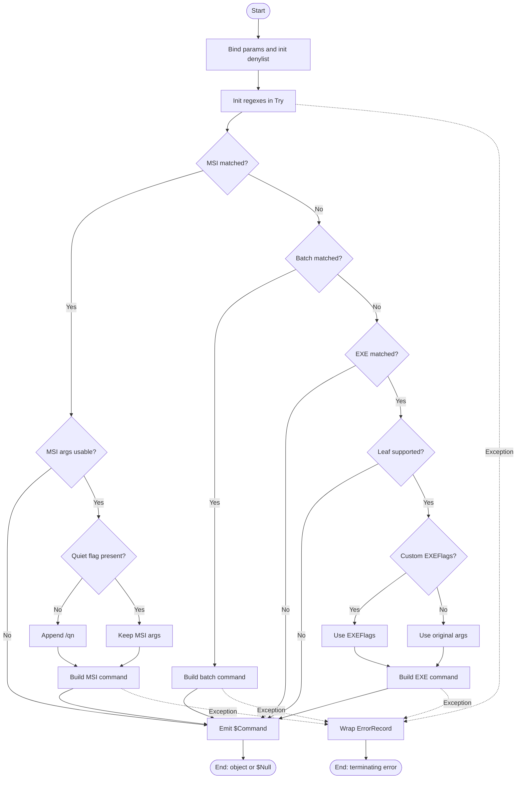

# Resolve-UninstallCommand

## Purpose

`Resolve-UninstallCommand` is the private parser that `Start-Uninstaller` calls after `Resolve-UninstallString` selects a raw uninstall string. It converts supported MSI, EXE, `.cmd`, and `.bat` uninstall strings into a normalized command record that the execution layer can launch, and it returns `$Null` for unsupported or unrecognized formats so the caller can mark the matched application as failed without launching a process. The helper only parses and normalizes command text; it does not read the registry, start processes, or write PDQ output.

## Parameters

| Name | Type | Required | Default | Description |
|------|------|----------|---------|-------------|
| `UninstallString` | `System.String` | Yes | None | Raw uninstall command string from the registry. `[ValidateNotNullOrEmpty()]` and `[ValidatePattern('\S')]` reject `$Null`, `''`, and whitespace-only values during parameter binding before the function body runs. |
| `EXEFlags` | `System.Object` | No | `$Null` | Optional EXE-only argument override. In the EXE branch, an explicitly supplied non-`$Null` value replaces the original EXE arguments after string conversion. An explicitly supplied empty string clears the original EXE arguments. `$Null` means preserve the original EXE arguments. MSI, `.cmd`, and `.bat` branches ignore this parameter. |

## Return Value

The live function declares `[OutputType([StartUninstallerUninstallCommand])]` and, on successful parse, emits one `StartUninstallerUninstallCommand` instance. It also inserts `StartUninstaller.UninstallCommand` at `PSTypeNames[0]`, so callers can treat the result as both a concrete class instance and a custom PowerShell shape. The class exposes these properties:

- `FileName`
- `Arguments`

Branch behavior:

- MSI branch: returns a command whose `FileName` is normalized to `%SystemRoot%\System32\msiexec.exe`; `/I` is rewritten to `/X` only when it matches the MSI action token; `/qn` is appended only when no existing quiet/passive UI flag is detected.
- EXE branch: returns the parsed executable path and either the caller-supplied `EXEFlags` value or the original arguments.
- Batch branch: returns the parsed `.cmd` or `.bat` path and the original arguments.
- Unsupported wrapper branch: returns `$Null` for `cmd.exe`, `powershell.exe`, `pwsh.exe`, and `rundll32.exe`.
- Unmatched input: emits the trailing `$Command`, which remains `$Null`.
- MSI-without-usable-arguments: emits `$Null` because the MSI branch only constructs a command when the captured argument text is not null/whitespace.

There is no dedicated `return` statement; success and no-match cases use pipeline output via the trailing `$Command`. Parameter-binding failures happen before the body runs and therefore emit no parsed object. Runtime failures inside `Try` are caught, wrapped in an `ErrorRecord`, and rethrown as terminating errors via `$PSCmdlet.ThrowTerminatingError()`.

The source help block's `.OUTPUTS` text is stale: it still says `[System.Management.Automation.PSObject] or $Null`, but the live implementation now declares and constructs `StartUninstallerUninstallCommand`.

## Execution Flow

## Error Handling

- `UninstallString = $Null` or `''`: rejected during parameter binding by `[ValidateNotNullOrEmpty()]` before the function body runs.
- `UninstallString = '   '`: rejected during parameter binding by `[ValidatePattern('\S')]` before the function body runs.
- Unsupported wrapper executables: `cmd.exe`, `powershell.exe`, `pwsh.exe`, and `rundll32.exe` are silently rejected by returning `$Null`.
- Other unrecognized families: silently return `$Null`.
- MSI commands with no usable argument text: silently return `$Null`.
- Runtime failures during regex construction, matching, replacement, path-leaf extraction, or command-object creation: caught by the broad `Catch` block, wrapped in a new `System.InvalidOperationException`, then raised as a terminating `System.Management.Automation.ErrorRecord` with:
  - `FullyQualifiedErrorId = 'ResolveUninstallCommandFailed'`
  - `Category = InvalidOperation`
  - `TargetObject = $UninstallString`
- The function does not call `New-ErrorRecord`, `Write-Warning`, or `Write-Error`.

## Side Effects

This function has no side effects.

## Research Log

Rows from the previous audit remain below. Outdated rows are marked `SUPERSEDED`, and new evidence from this pass is appended.

| Topic | Finding | Source | Date Verified |
|-------|---------|--------|---------------|
| Search: `PowerShell Practice and Style guide current` | The community PowerShell Practice and Style guide is still active and explicitly positioned as evolving guidance. The repo's house standard is materially stricter than that public baseline, so the audit should treat the house standard as authoritative. | https://poshcode.gitbook.io/powershell-practice-and-style | 2026-04-01 |
| Search: `PSScriptAnalyzer what's new rule changes` | PSScriptAnalyzer 1.24.0 remains the current documented release and raised the minimum supported PowerShell version to 5.1 while expanding `UseCorrectCasing`. That is newer than older analyzer assumptions and matters for casing-related findings. | https://learn.microsoft.com/en-us/powershell/utility-modules/psscriptanalyzer/whats-new-in-pssa?view=ps-modules | 2026-04-01 |
| Search: `about_Functions_CmdletBindingAttribute PositionalBinding default` | Microsoft still documents `PositionalBinding` as defaulting to `$true`. If a codebase forbids positional binding, `[CmdletBinding()]` alone is still insufficient. | https://learn.microsoft.com/en-us/powershell/module/microsoft.powershell.core/about/about_functions_cmdletbindingattribute?view=powershell-7.6 | 2026-04-01 |
| Search: `about_Functions_Advanced_Parameters AllowNull AllowEmptyString ValidateNotNullOrWhiteSpace` | Current advanced-parameter guidance still documents `AllowNull()`, `AllowEmptyString()`, and `ValidateNotNullOrWhiteSpace()`. It also notes that `AllowNull()` does not help string-typed parameters the way authors often expect, and `ValidateNotNullOrWhiteSpace()` is the current validator when whitespace-only strings must be rejected. | https://learn.microsoft.com/en-us/powershell/module/microsoft.powershell.core/about/about_functions_advanced_parameters?view=powershell-7.6 | 2026-04-01 |
| Search: `comment based help keywords .EXAMPLE .OUTPUTS .NOTES` | `.SYNOPSIS`, `.DESCRIPTION`, `.PARAMETER`, `.EXAMPLE`, `.OUTPUTS`, and `.NOTES` all remain first-class comment-based help keywords. | https://learn.microsoft.com/en-us/powershell/scripting/developer/help/comment-based-help-keywords?view=powershell-7.5 | 2026-04-01 |
| Search: `approved verbs resolve powershell` | `Resolve` remains an approved PowerShell verb and is specifically defined as mapping a shorthand resource representation to a more complete one. The function name is still semantically current. | https://learn.microsoft.com/en-us/powershell/scripting/developer/cmdlet/approved-verbs-for-windows-powershell-commands?view=powershell-7.6 | 2026-04-01 |
| Search: `about_PSCustomObject type accelerator` | `[pscustomobject]` remains a type accelerator, and Microsoft still distinguishes it from a full .NET type literal. That remains relevant when comparing `PSObject` and `PSCustomObject` object-shape choices under the repo's stricter standards. | https://learn.microsoft.com/en-us/powershell/module/microsoft.powershell.core/about/about_pscustomobject?view=powershell-7.5 | 2026-04-01 |
| Search: `regex timeout untrusted input .NET` | SUPERSEDED on 2026-04-02: current .NET guidance still recommends explicit regex timeouts for untrusted input, but this older row's note that the function "also uses `-match`" is no longer current after the parser rewrite. | https://learn.microsoft.com/en-us/dotnet/standard/base-types/best-practices-regex | 2026-04-01 |
| Search: `Regex constructor timeout default` | The timeout-aware `Regex(String, RegexOptions, TimeSpan)` constructor remains the current way to set an instance-level timeout. Without that, matching uses the default infinite timeout unless the app domain overrides it. | https://learn.microsoft.com/en-us/dotnet/api/system.text.regularexpressions.regex.matchtimeout?view=net-9.0 | 2026-04-01 |
| Search: `msiexec /i /x /qn /qb /qr /passive` | Microsoft still documents `/i` as install, `/x` as uninstall, and `/passive`, `/qn`, `/qb`, and `/qr` as valid UI controls for `msiexec.exe`. That still supports the function's intended MSI rewrite and quiet-flag preservation logic. | https://learn.microsoft.com/en-us/windows-server/administration/windows-commands/msiexec | 2026-04-01 |
| Search: `String.IsNullOrEmpty current guidance` | SUPERSEDED on 2026-04-02: the API semantics are still current, but this older row's function-specific note about preserving EXE arguments for `-EXEFlags ''` and accepting whitespace-only `UninstallString` is no longer accurate. | https://learn.microsoft.com/en-us/dotnet/fundamentals/runtime-libraries/system-string-isnullorempty | 2026-04-01 |
| Search: `CA3006 process command injection` | Microsoft still treats process launch as a command-injection surface when untrusted input influences the command line. This function does not launch processes itself, but it decides which uninstall strings may later reach the launcher, so strict family allowlisting remains the relevant control. | https://learn.microsoft.com/en-us/dotnet/fundamentals/code-analysis/quality-rules/ca3006 | 2026-04-01 |
| Search: `about_Functions_OutputTypeAttribute PowerShell` | SUPERSEDED on 2026-04-02: `[OutputType()]` is still metadata only, but this older row's reference to the function's "generic `PSObject` declaration" is no longer current because the function now declares `[StartUninstallerUninstallCommand]`. | https://learn.microsoft.com/de-de/powershell/module/Microsoft.PowerShell.Core/about/about_functions_outputtypeattribute?view=powershell-7.5 | 2026-04-01 |
| Search: `about_Object_Creation New-Object PowerShell 7.6` | SUPERSEDED on 2026-04-02: Microsoft still documents `New-Object` as supported, but this older row's helper-specific note about "current `New-Object` usage" is stale because the live function now uses `[Type]::new()` exclusively. | https://learn.microsoft.com/en-us/powershell/module/microsoft.powershell.core/about/about_object_creation?view=powershell-7.6 | 2026-04-01 |
| Search: `Path.GetFileName System.IO net 10` | `System.IO.Path.GetFileName(String)` remains current with no deprecation or breaking-change notice relevant to this helper's executable-leaf extraction. | https://learn.microsoft.com/en-us/dotnet/api/system.io.path.getfilename?view=net-10.0 | 2026-04-01 |
| Search: `about_Try_Catch_Finally PowerShell 7.6` | Microsoft still positions `try/catch/finally` as the fine-grained pattern for handling terminating errors. This changes the previous audit because the live function now does use `Try/Catch`, even though it still diverges from the repo-specific `New-ErrorRecord` rule. | https://learn.microsoft.com/pt-br/powershell/module/microsoft.powershell.core/about/about_try_catch_finally?view=powershell-7.6 | 2026-04-01 |
| Search: `msiexec /quiet /passive /qn /qb /qr` | SUPERSEDED on 2026-04-02: Microsoft's current `msiexec` documentation still lists `/quiet`, but the older row's statement that the function failed to preserve `/quiet` is no longer accurate. | https://learn.microsoft.com/en-us/windows-server/administration/windows-commands/msiexec | 2026-04-01 |
| Search: `ValidatePattern attribute PowerShell current` | Microsoft still documents `ValidatePattern` as a standard parameter-validation attribute for advanced functions. That supports the current `ValidatePattern('\S')` boundary rejection of whitespace-only `UninstallString` before the function body runs. | https://learn.microsoft.com/en-us/powershell/scripting/developer/cmdlet/validatepattern-attribute-declaration?view=powershell-7.5 | 2026-04-02 |
| Search: `about_Functions_OutputTypeAttribute PowerShell` | Microsoft still documents `[OutputType()]` as descriptive metadata only; PowerShell does not enforce it at runtime. The current function's new `[StartUninstallerUninstallCommand]` declaration is therefore more accurate than the older generic `PSObject` declaration, but it is still metadata, not runtime validation. | https://learn.microsoft.com/en-us/powershell/module/microsoft.powershell.core/about/about_functions_outputtypeattribute?view=powershell-7.5 | 2026-04-02 |
| Search: `regex timeout untrusted input .NET` | Current .NET guidance still recommends explicit regex timeouts for untrusted input. The function no longer uses `-match`, but it still constructs timeout-free `Regex` objects over registry-provided uninstall strings, so the concern remains partially applicable. | https://learn.microsoft.com/en-us/dotnet/standard/base-types/best-practices-regex | 2026-04-02 |
| Search: `String.IsNullOrEmpty current guidance` | `System.String.IsNullOrEmpty()` still checks only `null` and `String.Empty`. That API is no longer the source of a live defect in this function because the EXE override branch now distinguishes `''` from `$Null`, and `UninstallString` whitespace is rejected at binding by `ValidatePattern('\S')`. | https://learn.microsoft.com/en-us/dotnet/fundamentals/runtime-libraries/system-string-isnullorempty | 2026-04-02 |
| Search: `about_Object_Creation New-Object PowerShell 7.6` | Microsoft still documents both `[Type]::new()` and `New-Object` as supported construction patterns. The current helper now uses `[Type]::new()` exclusively, so there is no live `New-Object` usage to audit in this function. | https://learn.microsoft.com/en-us/powershell/module/microsoft.powershell.core/about/about_object_creation?view=powershell-7.6 | 2026-04-02 |
| Search: `msiexec /quiet /passive /qn /qb /qr` | Microsoft's current `msiexec` documentation still lists `/quiet` as a valid UI flag. The live function now preserves `/quiet` without adding `/qn`, so the previous `/quiet` deviation is resolved. | https://learn.microsoft.com/en-us/windows-server/administration/windows-commands/msiexec | 2026-04-02 |

## Standards Audit

| Rule | Status | Line(s) | Evidence |
|------|--------|---------|----------|
| Colon-bound parameters | N/A | N/A | The function body uses constructors and methods such as `[System.Text.RegularExpressions.Regex]::new(` and `$PSCmdlet.ThrowTerminatingError($ErrorRecord)`; there are no cmdlet invocations to audit for colon binding. |
| PascalCase naming | PASS | 1, 61-77, 80-223 | `Function Resolve-UninstallCommand {`, `$UninstallString`, `$EXEFlags`, `$UnsupportedExecutables`, `$RegexOptions`, `$MsiMatch`, and `$HasCustomExeFlags`. |
| Full .NET type names (no accelerators) | REVIEW | 47, 61, 76, 88-115, 182, 211-220 | Most type literals are fully qualified, for example `[System.String]`, `[System.Object]`, `[System.Text.RegularExpressions.Regex]::new(`, and `[System.IO.Path]::GetFileName(`, but `[StartUninstallerUninstallCommand]` is a repo-defined class rather than a fully qualified .NET type name. The standard excerpt does not say how custom PowerShell classes should be scored. |
| Object types are the MOST appropriate and specific choice (not just a functional generic type like PSObject or Array) | PASS | 47, 139-143, 161-165, 199-203 | `[OutputType([StartUninstallerUninstallCommand])]` and `[StartUninstallerUninstallCommand]::new(` use a dedicated uninstall-command record type instead of generic `PSObject`. |
| Single quotes for non-interpolated strings | PASS | 81-84, 90, 98, 136, 143, 219 | `'cmd.exe'`, `'/I(?=\s*[\{"])'`, `'{0} /qn' -f $MsiArgs`, `'StartUninstaller.UninstallCommand'`, and `'ResolveUninstallCommandFailed'`. |
| `$PSItem` not `$_` | PASS | 214-215 | `$PSItem.Exception.Message` and `$PSItem.Exception`. |
| Explicit bool comparisons (`$Var -eq $True`) | PASS | 122, 127, 135, 151-152, 160, 172-173, 181, 188, 193 | `If ($IsMsiCommand -eq $True) {`, `If ($HasQuietFlag -eq $False) {`, and `If ($IsSupportedExecutable -eq $True) {`. |
| If conditions are pre-evaluated outside If blocks | FAIL | 151-152, 172-173 | `If ($HasQuotedBatchMatch -eq $False -and $HasUnquotedBatchMatch -eq $True) {` and `If ($HasQuotedExeMatch -eq $False -and $HasUnquotedExeMatch -eq $True) {` still combine sub-conditions inline instead of pre-evaluating the full boolean. |
| `$Null` on left side of comparisons | PASS | 191 | `$Null -ne $EXEFlags`. |
| No positional arguments to cmdlets | N/A | N/A | The function body contains no cmdlet invocations; it uses constructors and methods only. |
| No cmdlet aliases | N/A | N/A | No cmdlets are invoked in the function body, so alias usage does not apply. |
| Switch parameters correctly handled | N/A | N/A | The function declares no `[Switch]` parameters and passes no switch parameters. |
| CmdletBinding with all required properties | PASS | 38-45 | `[CmdletBinding( ConfirmImpact = 'None' , DefaultParameterSetName = 'Default' , HelpURI = '' , PositionalBinding = $False , RemotingCapability = 'None' , SupportsPaging = $False , SupportsShouldProcess = $False )]`. |
| OutputType declared | PASS | 47 | `[OutputType([StartUninstallerUninstallCommand])]`. |
| Comment-based help is complete (Synopsis, Description, Parameter, Example, Outputs, Notes) | PASS | 3-35 | The help block contains `.SYNOPSIS`, `.DESCRIPTION`, `.PARAMETER UninstallString`, `.PARAMETER EXEFlags`, `.EXAMPLE`, `.OUTPUTS`, and `.NOTES`. |
| Error handling via New-ErrorRecord or appropriate pattern | FAIL | 211-223 | `$Exception = [System.InvalidOperationException]::new(...`, `$ErrorRecord = [System.Management.Automation.ErrorRecord]::new(...`, and `$PSCmdlet.ThrowTerminatingError($ErrorRecord)` manually construct and throw the error without calling `New-ErrorRecord`. |
| Try/Catch around operations that can fail | PASS | 87-223 | `Try { ... } Catch { ... }`. |
| Write-Debug at Begin/Process/End block entry and exit (if blocks are used) | N/A | N/A | The function has no `Begin`, `Process`, or `End` blocks. |
| No variable pollution (no script: or global: scope leaks) | PASS | 80-223 | Variables such as `$UnsupportedExecutables`, `$RegexOptions`, `$Command`, and `$ExeArguments` are local, and no `script:` or `global:` qualifiers appear. |
| 96-character line limit | FAIL | 98 | The MSI command regex literal on line 98 measures 104 characters. |
| 2-space indentation (not tabs, not 4-space) | PASS | 38-77, 87-223 | Representative lines such as `  [CmdletBinding(`, `    [Parameter(`, and `      $RxMsiInstallFlag.Replace($MsiArgsText, '/X')` use 2-space indentation. A 2026-04-02 tab scan found `Tabs=0`. |
| OTBS brace style | PASS | 1, 87, 122, 145, 151, 160, 172, 181, 188, 193, 210 | `Function Resolve-UninstallCommand {`, `Try {`, `If (...) {`, `} Else {`, and `} Catch {`. |
| No commented-out code | PASS | 1-225 | The file contains comment-based help only; there are no disabled executable lines such as `# If (...)` or `# New-Object ...`. |
| Registry access is read-only (if applicable) | N/A | N/A | This function does not access the registry. |
| Leading commas in `[CmdletBinding()]` and `[Parameter()]` attributes | FAIL | 38-57, 64-72 | `[CmdletBinding(` followed by `    ConfirmImpact = 'None'` and `[Parameter(` followed by `      Mandatory = $True,` do not use the leading-comma layout required by the house style. |
| `[Parameter()]` properties listed explicitly | PASS | 49-57, 64-72 | Both parameter attributes explicitly list `Mandatory`, `ParameterSetName`, `DontShow`, `HelpMessage`, `Position`, `ValueFromPipeline`, `ValueFromPipelineByPropertyName`, and `ValueFromRemainingArguments`. |
| Fail-fast boundary validation | PASS | 59-60 | `[ValidateNotNullOrEmpty()]` and `[ValidatePattern('\S')]` reject invalid `UninstallString` values before the body runs. |

Standards notes:

1. Microsoft still documents `[OutputType()]` as descriptive only, not runtime-enforced. This audit therefore scores both the declaration and the actual runtime object choice separately, even though the function now declares a specific custom class.
2. Current PSScriptAnalyzer `UseCorrectCasing` guidance still prefers lowercase keywords and operators. This audit still follows the repository's explicit PascalCase house rule.
3. Current .NET regex guidance still recommends explicit match timeouts for untrusted input. Because the house standard excerpt does not define a timeout rule, that concern remains in the research log and verification notes rather than as a separate house-rule row.

## Plan Audit

| Plan Section | Requirement | Status | Line(s) | Details |
|--------------|-------------|--------|---------|---------|
| `12. File Structure`; `12. Function Responsibilities` | `src/Private/Resolve-UninstallCommand.ps1` must exist as a private helper that "parses supported uninstall command families". | ALIGNED | `Resolve-UninstallCommand` 1, 122-209; `Start-Uninstaller` 396-398 | `Function Resolve-UninstallCommand {` lives under the planned private path, and the public orchestrator calls it with `Resolve-UninstallCommand -UninstallString:$UninstallString -EXEFlags:$EXEFlagsToPass`. The helper is therefore plan-mandated, not overengineering. |
| `2. Frozen Product Decisions`; `3. Non-Goals`; `9.2 Supported Command Families` | Unsupported examples include `rundll32`, `powershell.exe ...`, and `cmd.exe /c ...`; unsupported families are failures, not supported EXEs. | ALIGNED | `Resolve-UninstallCommand` 80-84, 181-188; `Start-Uninstaller` 403-410, 450-452; tests 279-297, 233-243 | The helper denylist is `$UnsupportedExecutables = @('cmd.exe', 'powershell.exe', 'pwsh.exe', 'rundll32.exe')`, and the EXE branch only emits a command when `$UnsupportedExecutables -inotcontains $ExecutableLeaf`. The caller maps `$Null` from this helper to `Outcome='Failed'`, `ExitCode=$Null`, and aggregate exit code `3`. |
| `9.3 MSI Parsing Rules` | Detect MSI uninstallers via `msiexec`. | ALIGNED | `Resolve-UninstallCommand` 97-100, 119-123; tests 121-133, 300-305, 352-356 | The MSI regex anchors to an actual `msiexec` executable token: `^(?:"(?<exe>[^"]*\\)?msiexec(?:\.exe)?"|(?<exe>(?:[^"\s]+\\)?msiexec(?:\.exe)?))...`. Direct smoke execution on 2026-04-02 confirmed `C:\Tools\mymsiexec-wrapper.exe /remove` is now parsed as a normal EXE, not misclassified as MSI. |
| `9.3 MSI Parsing Rules` | Preserve existing quiet/passive UI flags and append `/qn` only when no existing quiet/passive flag is present. | ALIGNED | `Resolve-UninstallCommand` 93-95, 132-137; tests 56-116 | Quiet detection now uses `'( ?i)(/quiet\b|/q[nbr]?\b|/passive\b)'`, and the MSI branch appends `/qn` only when `$HasQuietFlag -eq $False`. Direct smoke execution on 2026-04-02 confirmed `msiexec.exe /X{GUID-0001} /quiet` remains `/quiet` without a second `/qn`. |
| `9.3 MSI Parsing Rules` | Convert `/I` to `/X` only when it is the actual MSI action token and do not corrupt property values that happen to contain `/I`. | ALIGNED | `Resolve-UninstallCommand` 89-92, 128-130; tests 13-50, 344-349 | The replacement regex `'/I(?=\s*[\{"])'` rewrites only an action token before a GUID or quoted product code, and the private tests cover `IGNOREFAILURES`, `REBOOTPROMPT`, and `MSIFASTINSTALL` without corruption. |
| `4.2 Parameters`; `9.1 Uninstall String Selection`; `9.4 EXE Parsing Rules` | `EXEFlags` defaults to empty at the script contract, and if `-EXEFlags` is supplied it replaces original EXE arguments. | ALIGNED | `Resolve-UninstallCommand` 189-197; `Resolve-UninstallString` 70-98; `Start-Uninstaller` 365-398; tests 177-218, 331-359 | `Start-Uninstaller` preserves "parameter supplied" state with `$PSBoundParameters.ContainsKey('EXEFlags')`, `Resolve-UninstallString` bypasses `QuietUninstallString` when custom flags were supplied, and this helper now treats an explicitly supplied empty string as a real override because it checks `$PSBoundParameters.ContainsKey('EXEFlags') -and $Null -ne $EXEFlags`. Direct smoke execution on 2026-04-02 confirmed `-EXEFlags ''` clears original EXE arguments. |
| `9.4 EXE Parsing Rules` | Prefer quoted path parsing first, fall back to unquoted greedy parsing to the last `.exe`, support spaces, and preserve case. | DEVIATION | `Resolve-UninstallCommand` 109-115, 167-180; tests 156-172, 359-363 | The quoted-path branch and case preservation are correct, but the unquoted fallback regex is lazy: `^(?<exe>.+?\.exe)(?:\s+(?<args>.*))?$`. Direct smoke execution on 2026-04-02 showed `C:\Dir.exe Folder\app.exe /S` parsing as `FileName='C:\Dir.exe'` and `Arguments='Folder\app.exe /S'` instead of selecting the last `.exe`. This appears to be a bug, and the current test named "Greedily matches to the last .exe" does not exercise a string that contains an earlier `.exe` segment. |
| `9.5 CMD/BAT Parsing Rules` | Support quoted and unquoted `.cmd` / `.bat` paths, preserve original arguments, and never apply custom `-EXEFlags`. | DEVIATION | `Resolve-UninstallCommand` 101-106, 146-163; tests 224-272 | Custom `-EXEFlags` are correctly ignored for batch files, and ordinary quoted/unquoted cases work, but the unquoted batch fallback uses the same lazy shape: `^(?<exe>.+?\.(?:cmd|bat))(?:\s+(?<args>.*))?$`. Direct smoke execution on 2026-04-02 showed `C:\Dir.cmd Folder\cleanup.cmd /force` parsing as `FileName='C:\Dir.cmd'` and `Arguments='Folder\cleanup.cmd /force'`, and `C:\Dir.bat Folder\remove.bat /q` parsing as `FileName='C:\Dir.bat'`. That means unquoted batch-path support is incomplete for valid paths that contain an earlier `.cmd` or `.bat` segment. |
| `10.4 Per-Entry Outcome Mapping`; `14.4 Orchestrator and Output Tests` | Unsupported uninstall family should become `Failed`, exit `3`. | ALIGNED | `Start-Uninstaller` 403-410, 450-452; tests 233-243 | When this helper returns `$Null`, the caller stamps `Outcome='Failed'`, `ExitCode=$Null`, and `Message='Unsupported uninstall command format.'`, then sets aggregate exit code `3`. The public tests assert that no process is launched in that case. |
| `14.2 Critical Unit Tests` | `Resolve-UninstallCommand` tests must cover MSI `/I -> /X`, quiet flag preservation, `/passive`, quoted EXE, unquoted EXE, `.cmd`, `.bat`, and unsupported command. | ALIGNED | tests 13-314 | The private test file covers `/I -> /X`, `/passive`, quiet-flag preservation, quoted/unquoted EXE, `.cmd`, `.bat`, unsupported wrappers, plus newer cases for `/quiet`, explicit-empty `-EXEFlags`, and the `msiexec` substring false-positive fix. |
| `3. Goals`; `14.2 Critical Unit Tests` | Every high-risk branch should have direct tests. | DEVIATION | tests 156-172, 224-253 | The parser ambiguity branches for unquoted paths with earlier `.exe`, `.cmd`, or `.bat` segments are not directly tested. The current tests use ordinary paths only, and the smoke-verified EXE/CMD/BAT truncation defects escaped despite a test name that claims "greedy to the last .exe". |
| `5. Internal Data Model` | The plan defines application records, registry-view descriptors, and uninstall result records, but does not define a dedicated uninstall-command object schema for this helper. | N/A | `Resolve-UninstallCommand` 47, 139-143, 161-165, 199-203 | The helper now returns a dedicated `StartUninstallerUninstallCommand` class with `FileName` and `Arguments`, which fits the architecture, but the exact helper-specific schema is not explicitly defined by the plan. |

Plan notes:

1. Current Microsoft `msiexec` documentation still lists `/quiet`, which now strengthens alignment for the MSI quiet-flag logic rather than a deviation.
2. Current .NET regex guidance still recommends explicit timeouts for untrusted input, but the plan excerpt does not define a regex-timeout requirement for this helper.
3. The private test suite now covers `/quiet`, explicit-empty `-EXEFlags`, and the `msiexec` substring fix, but it still misses the newly verified last-extension parsing defects in the unquoted EXE/CMD/BAT fallback regexes.

## Verification Notes

- Direct smoke execution on 2026-04-02 confirmed several previously documented defects are fixed in the live function: `msiexec.exe /I{GUID-0001}` still normalizes to `C:\Windows\System32\msiexec.exe` with `/X{GUID-0001} /qn`; `msiexec.exe /X{GUID-0001} /quiet` now preserves `/quiet` without adding `/qn`; `C:\Tools\mymsiexec-wrapper.exe /remove` is now parsed as a normal EXE path instead of being misclassified as MSI; and `"C:\App\unins000.exe" /S` with `-EXEFlags ''` now returns empty `Arguments` instead of preserving `/S`.
- The same smoke pass confirmed that whitespace-only `UninstallString` input no longer falls through to `$Null`: `Resolve-UninstallCommand -UninstallString '   '` now fails parameter binding with `System.Management.Automation.ParameterBindingValidationException`.
- The same smoke pass revealed two still-undocumented parser defects in the unquoted fallback regexes. `C:\Dir.exe Folder\app.exe /S` parses as `FileName='C:\Dir.exe'` instead of the last `.exe`, and `C:\Dir.cmd Folder\cleanup.cmd /force` plus `C:\Dir.bat Folder\remove.bat /q` truncate to the first matching batch extension segment. Those results contradict the plan's unquoted-path intent.
- `Invoke-Pester -Path 'tests\Private\Resolve-UninstallCommand.Tests.ps1' -PassThru` still cannot run successfully in this sandbox because Pester 5.7.1 attempts to create `HKCU\Software\Pester` and hits `System.Security.SecurityException: Requested registry access is not allowed.` On 2026-04-02, Pester discovered 40 tests, then the container failed and surfaced all 40 as failed because of the framework-level registry restriction. Coverage statements above are therefore based on test-file inspection plus direct smoke execution, not on a green Pester run.
- Byte and formatting inspection on 2026-04-02 found `src/Private/Resolve-UninstallCommand.ps1` saved with a UTF-8 BOM and no tab characters, which corrects the previous encoding note. The same scan found a new style failure: maximum line length is 104 characters on source line 98.

## Changelog

| Date | Changes |
|------|---------|
| 2026-04-02 | Third convergence pass. Corrected the README to the live parser implementation: updated the parameter contract to reflect `System.Object` `EXEFlags`, custom class output, bind-time whitespace rejection, `/quiet` preservation, explicit-empty `-EXEFlags` override behavior, and restored UTF-8 BOM status; removed stale false deviations for `msiexec` substring matching, missed `/quiet`, and empty-string `EXEFlags`; tightened the standards audit to the current source, including the new 96-character line-length failure and restored fail-fast validation pass; and added two newly verified plan deviations for the lazy unquoted EXE/CMD/BAT fallback regexes plus the associated test-gap finding. |
| 2026-04-01 | Second same-day convergence pass. Corrected the README to the current 8.1.0 source: added the live `Try/Catch`, wrapper denylist, current return contract, and current caller/test alignment; removed stale false findings about missing `.EXAMPLE`, bare `CmdletBinding`, missing `Try/Catch`, and the old unsupported-wrapper defect; refreshed the encoding note; and added new verified deviations for false-positive `msiexec` substring matching, missed `/quiet` preservation, and `-EXEFlags ''` not overriding EXE arguments. |
| 2026-04-01 | First audit run. Added the initial README, documented the function contract and control flow, recorded current research with source URLs, identified standards gaps, and confirmed a substantive plan deviation: shell-wrapper uninstall strings such as `rundll32.exe`, `cmd.exe /c ...`, and `powershell.exe ...` are still treated as supported EXEs and the unit tests currently encode that incorrect behavior. |
AUDIT_STATUS:UPDATED