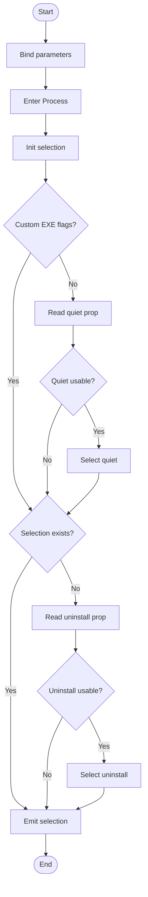

# Resolve-UninstallString

## Purpose

`Resolve-UninstallString` is a private selector helper that chooses the single
uninstall command string to parse for one application record. `Start-Uninstaller`
calls it during uninstall mode after target selection so the pipeline can prefer
`QuietUninstallString` when custom `-EXEFlags` were not supplied, but still fall
back to the raw `UninstallString` when EXE arguments must be rebuilt. Its job is
intentionally narrow: inspect the application record, apply the two-source
priority rules, and emit the chosen string or `$Null`.

## Parameters

| Name | Type | Required | Default | Description |
|------|------|----------|---------|-------------|
| `Application` | `System.Management.Automation.PSObject` | Yes | None | Application record to inspect. The function looks up only `QuietUninstallString` and `UninstallString` in the object's `PSObject.Properties` collection. |
| `HasCustomEXEFlags` | `System.Boolean` | No | `$False` | Signals whether the caller supplied custom `-EXEFlags`. When `$True`, the helper skips `QuietUninstallString` so downstream EXE parsing can preserve only the raw uninstall command path and rebuild arguments. |

## Return Value

The function declares `[System.String]` output and emits one uninstall command
string when a usable candidate exists. It selects `QuietUninstallString` first
when `-HasCustomEXEFlags` is `$False` and the property exists, is not `$Null`,
and is not whitespace-only; otherwise it evaluates `UninstallString` under the
same usability test.

If neither property is usable, the terminal expression is `$Null`. In assignment
or comparison contexts the caller receives `$Null`; if invoked interactively,
that null path produces no visible text even though PowerShell still treats it
as a null output object. Usable strings are returned exactly as stored; the
function does not trim or normalize non-whitespace values.

## Execution Flow

## Error Handling

- Missing `-Application`, or an explicit `-Application:$Null`, is rejected by
  PowerShell parameter binding before the body runs.
- Missing `QuietUninstallString` or `UninstallString` members are not treated as
  errors. The helper reads the property bag, receives `$Null`, and continues to
  the next candidate or final `$Null` path.
- `$Null`, empty, and whitespace-only candidate values are silently treated as
  unavailable.
- The function has no `Try/Catch`, no `Write-Warning`, and no `New-ErrorRecord`
  path. Any unexpected runtime exception inside the `Process` block bubbles to
  the caller unchanged.
- This helper does not validate command-family syntax. Unsupported command
  formats are handled later by `Resolve-UninstallCommand` and `Start-Uninstaller`.

## Side Effects

This function has no side effects.

## Research Log

| Topic | Finding | Source | Date Verified |
|-------|---------|--------|---------------|
| Search: `PowerShell Practice and Style guide current baseline` | The community style guide is still a live baseline and still says project-specific rules should win when they differ. It continues to recommend OTBS, but its default formatting guidance is looser than this repo's 2-space and 96-character house style. Change: first audit entry. | [About this Guide](https://poshcode.gitbook.io/powershell-practice-and-style) | 2026-04-01 |
| Search: `PSScriptAnalyzer overview PowerShell 5.1 or greater` | Microsoft still positions PSScriptAnalyzer as the current static analyzer for PowerShell code, and the current overview still lists Windows PowerShell 5.1 or greater as supported. Change: first audit entry. | [PSScriptAnalyzer module](https://learn.microsoft.com/en-us/powershell/utility-modules/psscriptanalyzer/overview?view=ps-modules) | 2026-04-01 |
| Search: `What's new in PSScriptAnalyzer` | Current release notes show PSScriptAnalyzer 1.24.0 raised the minimum PowerShell version to 5.1 and expanded `UseCorrectCasing` formatting behavior. Change: first audit entry. | [What's new in PSScriptAnalyzer](https://learn.microsoft.com/en-us/powershell/utility-modules/psscriptanalyzer/whats-new-in-pssa?view=ps-modules) | 2026-04-01 |
| Search: `UseCorrectCasing rule` | Current analyzer guidance prefers exact cmdlet and type casing but lowercase keywords and operators. That conflicts with this repo's PascalCase-keyword standard, so the audit still follows the repo standard as written. Change: first audit entry. | [UseCorrectCasing](https://learn.microsoft.com/en-us/powershell/utility-modules/psscriptanalyzer/rules/usecorrectcasing?view=ps-modules) | 2026-04-01 |
| Search: `about_Functions_CmdletBindingAttribute PositionalBinding` | SUPERSEDED on 2026-04-01: the documentation point remains current, but the previous audit's "minimal `[CmdletBinding()]`" failure is obsolete because the current source explicitly sets `PositionalBinding = $False` and the other house metadata fields. | [about_Functions_CmdletBindingAttribute](https://learn.microsoft.com/en-us/powershell/module/microsoft.powershell.core/about/about_functions_cmdletbindingattribute?view=powershell-7.5) | 2026-04-01 |
| Search: `about_Functions_CmdletBindingAttribute PositionalBinding` | Current PowerShell documentation still states that advanced functions default `PositionalBinding` to `$True` unless it is explicitly disabled. This source now explicitly disables positional binding, so the prior minimal-CmdletBinding finding no longer applies. Change: corrected previous false FAIL. | [about_Functions_CmdletBindingAttribute](https://learn.microsoft.com/en-us/powershell/module/microsoft.powershell.core/about/about_functions_cmdletbindingattribute?view=powershell-7.5) | 2026-04-01 |
| Search: `about_Functions_CmdletBindingAttribute ConfirmImpact SupportsShouldProcess` | Current Microsoft documentation says `ConfirmImpact` should be specified only when `SupportsShouldProcess` is also specified. This function still follows the repo's house-style requirement for an explicit `CmdletBinding` property list, so the audit records that standards discrepancy but still grades against the repo reference as written. Change: new best-practice discrepancy note. | [about_Functions_CmdletBindingAttribute](https://learn.microsoft.com/en-us/powershell/module/microsoft.powershell.core/about/about_functions_cmdletbindingattribute?view=powershell-7.5) | 2026-04-01 |
| Search: `comment-based help keywords PowerShell` | SUPERSEDED on 2026-04-01: `.EXAMPLE` remains a standard help keyword, but the previous audit's "missing example section" finding is obsolete because the current source includes `.EXAMPLE`. | [Comment-Based Help Keywords](https://learn.microsoft.com/en-us/powershell/scripting/developer/help/comment-based-help-keywords?view=powershell-7.5) | 2026-04-01 |
| Search: `comment-based help keywords PowerShell` | `.EXAMPLE` remains a standard comment-based help keyword, and the current source includes `.SYNOPSIS`, `.DESCRIPTION`, two `.PARAMETER` entries, `.EXAMPLE`, `.OUTPUTS`, and `.NOTES`. Change: corrected previous false FAIL. | [Comment-Based Help Keywords](https://learn.microsoft.com/en-us/powershell/scripting/developer/help/comment-based-help-keywords?view=powershell-7.5) | 2026-04-01 |
| Search: `about_Functions_OutputTypeAttribute` | `OutputType` is still metadata only; PowerShell does not derive it from function code or validate it against actual runtime output. Change: first audit entry. | [about_Functions_OutputTypeAttribute](https://learn.microsoft.com/en-us/powershell/module/microsoft.powershell.core/about/about_functions_outputtypeattribute?view=powershell-7.5) | 2026-04-01 |
| Search: `about_Functions_Advanced_Parameters switch parameters preferred over Boolean parameters` | Current docs still prefer `[switch]` over Boolean parameters for presence and absence flags. This helper's `[System.Boolean] HasCustomEXEFlags` remains defensible because the caller passes explicit state data, not a user-facing toggle. Change: retained prior design note. | [about_Functions_Advanced_Parameters](https://learn.microsoft.com/en-us/powershell/module/microsoft.powershell.core/about/about_functions_advanced_parameters?view=powershell-7.5) | 2026-04-01 |
| Search: `System.String.IsNullOrWhiteSpace net 9` | `System.String.IsNullOrWhiteSpace()` remains the current supported .NET API for null, empty, and whitespace checks, and no deprecation or replacement surfaced in current documentation. Change: first audit entry. | [String.IsNullOrWhiteSpace(String) Method](https://learn.microsoft.com/en-us/dotnet/api/system.string.isnullorwhitespace?view=net-9.0) | 2026-04-01 |
| Search: `about_PSCustomObject` | SUPERSEDED on 2026-04-01: `[pscustomobject]` remains supported, but the previous accelerator-specific finding is obsolete because the current source no longer uses `[pscustomobject]` for the `Application` parameter. | [about_PSCustomObject](https://learn.microsoft.com/en-us/powershell/module/microsoft.powershell.core/about/about_pscustomobject?view=powershell-7.5) | 2026-04-01 |
| Search: `PSObject Class System.Management.Automation` | `System.Management.Automation.PSObject` remains a current, supported wrapper type. That means the current type discussion is about specificity and data-model precision, not deprecation. Change: refined previous type finding. | [PSObject Class](https://learn.microsoft.com/en-us/dotnet/api/system.management.automation.psobject?view=powershellsdk-7.4.0) | 2026-04-01 |
| Search: `about_Return PowerShell` | PowerShell still returns the result of each statement as output, so a terminal `$Null` expression still reaches callers as a null result even though it renders as no visible output in normal console display. Change: first audit entry. | [about_Return](https://learn.microsoft.com/en-us/powershell/module/microsoft.powershell.core/about/about_return?view=powershell-7.5) | 2026-04-01 |
| Search: `ValidateNotNullOrEmpty PowerShell parameter validation` | Current docs still recommend built-in validation attributes such as `ValidateNotNullOrEmpty` and `ValidateNotNullOrWhiteSpace` for boundary validation. This helper relies on mandatory binding to reject `-Application:$Null`, then performs explicit in-body whitespace checks because the uninstall strings live inside the input object rather than in separate parameters. Change: new validation note. | [about_Functions_Advanced_Parameters](https://learn.microsoft.com/en-us/powershell/module/microsoft.powershell.core/about/about_functions_advanced_parameters?view=powershell-7.5) | 2026-04-01 |
| Search: `Preventing script injection attacks PowerShell` | Microsoft still recommends relying on PowerShell parameter binding instead of `Invoke-Expression` when handling commands. This helper only selects a stored uninstall string and does not execute it, so no new execution-security finding applies here. Change: new security note. | [Preventing script injection attacks](https://learn.microsoft.com/en-us/powershell/scripting/security/preventing-script-injection?view=powershell-7.5) | 2026-04-01 |
| Search: `PSScriptAnalyzer module supported PowerShell versions` | The current overview, updated on 2026-03-20, now explicitly documents Windows PowerShell 5.1+ and PowerShell 7.2.11+ on Windows/Linux/macOS. That narrows the prior compatibility note but does not change the audit outcome for this PS 5.1-baselined repo. Change: refined prior compatibility note. | [PSScriptAnalyzer module](https://learn.microsoft.com/en-us/powershell/utility-modules/psscriptanalyzer/overview?view=ps-modules) | 2026-04-02 |
| Search: `What's new in PSScriptAnalyzer 1.24.0` | The current Learn release notes still identify 1.24.0 as the latest documented release and still record the 5.1 minimum-version change plus expanded `UseCorrectCasing` coverage for commands, keywords, and operators. Change: no audit conclusion change, but reconfirmed the casing/tooling discrepancy. | [What's new in PSScriptAnalyzer](https://learn.microsoft.com/en-us/powershell/utility-modules/psscriptanalyzer/whats-new-in-pssa?view=ps-modules) | 2026-04-02 |
| Search: `Everything about PSCustomObject PSTypeName function parameters` | Microsoft still documents `[PSTypeName('My.Object')]` parameter typing for custom objects and automatic validation on mismatch. That strengthens the existing standards finding that `[System.Management.Automation.PSObject]` is supported but broader than necessary for an internal application-record contract. Change: strengthened prior specificity FAIL. | [Everything you wanted to know about PSCustomObject](https://learn.microsoft.com/en-us/powershell/scripting/learn/deep-dives/everything-about-pscustomobject?view=powershell-7.5) | 2026-04-02 |
| Search: `about_Return PowerShell current output without return` | Current PowerShell documentation still says the results of each statement are returned as output even without the `return` keyword. That confirms the terminal `$SelectedUninstallString` expression is a soft return and that the previous README's `Return`-keyword failure was stale. Change: corrected previous false FAIL. | [about_Return](https://learn.microsoft.com/en-us/powershell/module/microsoft.powershell.core/about/about_return?view=powershell-7.5) | 2026-04-02 |
| Search: `about_Functions_CmdletBindingAttribute ConfirmImpact SupportsShouldProcess current` | Current Microsoft documentation still says `ConfirmImpact` should be specified only when `SupportsShouldProcess` is also specified. That does not change the house-style standards audit, but it does reinforce that the plan's literal `no ConfirmImpact` and `no SupportsShouldProcess` wording conflicts with the current source metadata template. Change: strengthened plan-discrepancy note. | [about_Functions_CmdletBindingAttribute](https://learn.microsoft.com/en-us/powershell/module/microsoft.powershell.core/about/about_functions_cmdletbindingattribute?view=powershell-7.5) | 2026-04-02 |

## Standards Audit

| Rule | Status | Line(s) | Evidence |
|------|--------|---------|----------|
| Colon-bound parameters | N/A | 20, 71-102 | The only parameterized command text is the non-executable help example `Resolve-UninstallString -Application:$Application` on line 20. The executable body uses property access such as `$Application.PSObject.Properties['QuietUninstallString']` and emits `$SelectedUninstallString`, so there are no executable cmdlet/function arguments to audit. |
| PascalCase naming | PASS | 1, 40-65, 68-102 | `Function Resolve-UninstallString {`, `Param (`, `$Application`, `$HasCustomEXEFlags`, `$SelectedUninstallString`, `If`, and `$HasUsableUninstallString` all follow the repo's PascalCase naming convention. |
| Full .NET type names (no accelerators) | PASS | 39, 51, 64, 73-77, 85-94 | The source uses `[OutputType([System.String])]`, `[System.Management.Automation.PSObject]`, `[System.Boolean]`, and `[System.String]::IsNullOrWhiteSpace(...)` rather than type accelerators such as `[string]` or `[bool]`. |
| Object types are the most appropriate and specific choice | FAIL | 51-52 | The parameter is declared as `[System.Management.Automation.PSObject] $Application`, which is a broad wrapper type. For an internal application-record contract with known properties, that remains less specific than a custom typed record or `[PSTypeName()]`-validated object. |
| Single quotes for non-interpolated strings | PASS | 31-37, 45, 58, 72, 89 | The source uses single-quoted literals such as `'None'`, `'Default'`, `''`, `'See function help.'`, `'QuietUninstallString'`, and `'UninstallString'`. |
| `$PSItem` not `$_` | N/A | 1-104 | No `$PSItem` or `$_` appear because the function has no pipeline script block or catch block. |
| Explicit bool comparisons (`$Var -eq $True`) | PASS | 71, 78, 80, 85-88, 95, 97 | Boolean checks are explicit throughout: `If ($HasCustomEXEFlags -eq $False)`, `) -eq $False`, `If ($HasUsableQuietString -eq $True)`, `If ($HasSelection -eq $False)`, and `If ($HasUsableUninstallString -eq $True)`. |
| If conditions are pre-evaluated outside `If` blocks | FAIL | 71 | The opening guard uses `If ($HasCustomEXEFlags -eq $False)` directly instead of first storing that condition in a typed variable. The later `If ($HasUsableQuietString -eq $True)` and `If ($HasSelection -eq $False)` guards do use pre-evaluated booleans, but the first branch still violates the rule. |
| `$Null` on left side of comparisons | PASS | 74-75, 91-92 | Null comparisons are left-sided: `$Null -ne $QuietProperty`, `$Null -ne $QuietProperty.Value`, `$Null -ne $UninstallProperty`, and `$Null -ne $UninstallProperty.Value`. |
| No positional arguments to cmdlets | N/A | 71-102 | The executable body does not call any cmdlets; it uses property access, casts, and `[System.String]::IsNullOrWhiteSpace(...)`. |
| No cmdlet aliases | N/A | 71-102 | No cmdlets or functions are invoked in the executable body, so no alias usage exists to audit. |
| Switch parameters correctly handled | N/A | 40-65 | The function defines `[System.Boolean] $HasCustomEXEFlags = $False` and no `[switch]` parameters. |
| Leading commas in attributes | FAIL | 30-37, 41-49, 54-62 | The attribute blocks begin with `ConfirmImpact = 'None'` and `Mandatory = $True,` instead of the house-required leading-comma form `, ConfirmImpact = ...` and `, Mandatory = ...`. |
| CmdletBinding with all required properties | PASS | 30-37 | `[CmdletBinding(` explicitly lists `ConfirmImpact = 'None'`, `DefaultParameterSetName = 'Default'`, `HelpURI = ''`, `PositionalBinding = $False`, `RemotingCapability = 'None'`, `SupportsPaging = $False`, and `SupportsShouldProcess = $False`. |
| Parameter attributes list all properties explicitly | PASS | 41-49, 54-62 | Both `[Parameter(...)]` blocks explicitly list `Mandatory`, `ParameterSetName`, `DontShow`, `HelpMessage`, `Position`, `ValueFromPipeline`, `ValueFromPipelineByPropertyName`, and `ValueFromRemainingArguments`, matching the house template's explicit parameter-property pattern. |
| OutputType declared | PASS | 39 | `[OutputType([System.String])]` is declared directly above `Param (`. |
| Comment-based help is complete | PASS | 3-27 | The help block includes `.SYNOPSIS`, `.DESCRIPTION`, `.PARAMETER Application`, `.PARAMETER HasCustomEXEFlags`, `.EXAMPLE`, `.OUTPUTS`, and `.NOTES`. |
| Error handling via `New-ErrorRecord` or appropriate pattern | REVIEW | 40-102 | The function has no `Try`, `Catch`, `Write-Warning`, or `New-ErrorRecord` path; it instead relies on parameter binding for `-Application` and uses silent `$Null` selection semantics for missing or whitespace-only members. That is reasonable for a pure selector, but it does not literally implement the repo's standard error-reporting pattern. |
| Try/Catch around operations that can fail | N/A | 71-102 | The body only performs property access such as `$Application.PSObject.Properties['QuietUninstallString']` and string checks via `[System.String]::IsNullOrWhiteSpace(...)`; no external seam, I/O, or failure-prone cmdlet is invoked. |
| Write-Debug at Begin/Process/End block entry and exit (if blocks are used) | FAIL | 68-103 | The function uses a `Process {` block on line 68, but there are no `Write-Debug -Message:'[Resolve-UninstallString] Entering/Leaving Block: Process'` statements anywhere in the block. |
| Soft return / no `Return` keyword in functions | PASS | 102 | The function ends with the pipeline output expression `$SelectedUninstallString`, and no `Return` keyword appears anywhere in the source. |
| No variable pollution (no `script:` or `global:` scope leaks) | PASS | 69, 72, 85, 89 | Working state is assigned only to local variables such as `$SelectedUninstallString = $Null`, `$QuietProperty = ...`, `$HasSelection = ...`, and `$UninstallProperty = ...`; there are no `Script:` or `Global:` writes. |
| 96-character line limit | PASS | 1-104 | The longest line in the current file is line 72 at 79 characters: `$QuietProperty = $Application.PSObject.Properties['QuietUninstallString']`. A local 2026-04-02 scan found `MaxLength = 79`. |
| 2-space indentation (not tabs, not 4-space) | FAIL | 64-65 | The second parameter's type and variable lines are outdented one level inside the `Param (` block: `  [System.Boolean]` and `  $HasCustomEXEFlags = $False` should align with the peer parameter declaration lines that use four leading spaces. |
| OTBS brace style | PASS | 1, 71, 80, 88, 97, 103-104 | `Function Resolve-UninstallString {`, `If ($HasCustomEXEFlags -eq $False) {`, `If ($HasUsableQuietString -eq $True) {`, and the closing `}` placements follow OTBS. |
| No commented-out code | PASS | 2-28, 30-102 | The only comment syntax is the active help block `<# ... #>`; there are no disabled executable statements such as `# Return ...`. |
| Registry access is read-only (if applicable) | N/A | 1-104 | The function never opens or writes registry keys. It only inspects the in-memory `$Application` object. |

Research notes:

1. Current community style guidance still describes itself as evolving guidance,
   not dogma. This audit therefore continues to treat the repo reference as
   authoritative when they differ.
2. Current `PSScriptAnalyzer` `UseCorrectCasing` guidance still prefers
   lowercase keywords and operators. This audit still grades casing against the
   repo's PascalCase requirement.
3. Current PowerShell docs still prefer `[switch]` for presence flags, but this
   helper's Boolean parameter remains defensible because the caller passes
   explicit state data.
4. Current Microsoft docs still say `ConfirmImpact` should be specified only
   when `SupportsShouldProcess` is also specified. The house standard still
   expects an explicit `CmdletBinding` property list, so the standards audit
   follows the repo rule and notes the discrepancy here.
5. Microsoft's current PSCustomObject guidance explicitly documents
   `[PSTypeName()]` parameter typing for custom objects. That strengthens,
   rather than weakens, the existing specificity finding against raw `PSObject`.
6. The project plan's literal `no SupportsShouldProcess` and `no ConfirmImpact`
   requirements conflict with the repo's explicit-`CmdletBinding` house
   template. The standards audit follows the house reference, while the plan
   audit records the literal divergence.

## Plan Audit

| Plan Section | Requirement | Status | Line(s) | Details |
|--------------|-------------|--------|---------|---------|
| 9.1 Uninstall String Selection | `1. QuietUninstallString, when present and -EXEFlags was not supplied` | ALIGNED | 71-82 | `If ($HasCustomEXEFlags -eq $False)` gates the quiet-string lookup, and `If ($HasUsableQuietString -eq $True)` then assigns `$SelectedUninstallString = [System.String]$QuietProperty.Value`. |
| 9.1 Uninstall String Selection | `2. UninstallString` | ALIGNED | 85-98 | After `$HasSelection` is computed, `If ($HasSelection -eq $False)` reads `$Application.PSObject.Properties['UninstallString']` and selects it when `If ($HasUsableUninstallString -eq $True)` passes. |
| 9.1 Rationale | `custom -EXEFlags requires control over the raw EXE uninstall string` | ALIGNED | `src/Public/Start-Uninstaller.ps1:370-384`; `tests/Public/Start-Uninstaller.Tests.ps1:365-373`; `src/Private/Resolve-UninstallString.ps1:71-82` | `Start-Uninstaller` derives `$HasCustomFlags` from `$PSBoundParameters.ContainsKey('EXEFlags')`, passes `-HasCustomEXEFlags:$HasCustomFlags`, and the helper bypasses `QuietUninstallString` whenever that Boolean is `$True`. |
| 10.4 Per-Entry Outcome Mapping | `No uninstall string` -> `Failed` -> `<null>` | ALIGNED | `src/Private/Resolve-UninstallString.ps1:85-102`; `src/Public/Start-Uninstaller.ps1:386-396`; `tests/Public/Start-Uninstaller.Tests.ps1:243-253` | This helper leaves `$SelectedUninstallString` as `$Null` when no usable string exists. The orchestrator then sets `Outcome = 'Failed'`, `ExitCode = $Null`, `Message = 'No uninstall command available.'`, and does not launch a process. |
| 12. File Structure | `Resolve-UninstallString.ps1` appears under `src/Private/` in the planned file tree. | ALIGNED | `src/Private/Resolve-UninstallString.ps1:1-104` | The function lives in the planned private-helper location, not under `src/Public`. |
| 12. Function Responsibilities | `Resolve-UninstallString.ps1` - `chooses QuietUninstallString vs UninstallString` | ALIGNED | 68-102 | The body only initializes `$SelectedUninstallString`, evaluates quiet and uninstall properties, and emits the selected string. It does not parse command families, launch processes, emit PDQ lines, or calculate exit codes. |
| 5.1 Application Record | `raw normalized named registry values as note properties` | REVIEW | 72, 89 | The helper consumes named properties through `$Application.PSObject.Properties['QuietUninstallString']` and `['UninstallString']`, which matches the planned record shape, but it does not itself enforce or construct the application-record contract. |
| 15. Phase 4: Uninstall Resolution and Execution | `implement uninstall string selection` | ALIGNED | `src/Private/Resolve-UninstallString.ps1:1-104`; `tests/Private/Resolve-UninstallString.Tests.ps1:27-172` | The function is a dedicated selector helper and its unit tests cover quiet preference, custom-flag bypass, fallback, whitespace-only values, missing properties, and exact-value preservation. |
| 15. Phase 4 Acceptance | `unsupported/no-command cases fail cleanly` | ALIGNED | `src/Private/Resolve-UninstallString.ps1:85-102`; `src/Public/Start-Uninstaller.ps1:386-415` | This helper covers the no-command half by emitting `$Null`; the orchestrator maps that to `Failed`, while unsupported command families are handled immediately afterward by `Resolve-UninstallCommand`. |
| 4.4 No Interactivity | `no SupportsShouldProcess` | DEVIATION | 37 | The function explicitly declares `SupportsShouldProcess = $False` inside `[CmdletBinding(...)]` instead of omitting the setting entirely. This is behaviorally non-interactive, but it does not satisfy the plan's literal `no SupportsShouldProcess` wording. |
| 4.4 No Interactivity | `no ConfirmImpact` | DEVIATION | 31 | The function explicitly declares `ConfirmImpact = 'None'`, which keeps prompting disabled but still contradicts the plan's literal `no ConfirmImpact` requirement. This looks like a metadata-template divergence rather than a prompt bug. |
| 4.4 No Interactivity | `no Read-Host`, `no GUI`, `no dependency on an interactive session` | ALIGNED | 1-104 | The source contains no `Read-Host`, no GUI calls, and no interactive-session checks; it only reads object properties and emits a string or `$Null`. |
| 4.3 Exit Codes | `0`, `1`, `2`, `3`, and `4` behave exactly as documented. | N/A | 1-104 | This helper never sets exit codes. Script exit code behavior remains the responsibility of `Start-Uninstaller` and the entrypoint wrapper. |
| 12 / 15 Necessity | Dedicated private selector helper vs folding into another function | ALIGNED | `PLAN.md:700`; `PLAN.md:735-736`; `PLAN.md:948`; `src/Private/Resolve-UninstallString.ps1:1-104` | The plan names `Resolve-UninstallString.ps1` in the file tree, assigns it a single selector responsibility, and lists uninstall string selection as a Phase 4 work item. Its existence is therefore architectural rather than gratuitous abstraction. |

## Verification Notes

- Manual runtime checks on 2026-04-02 confirmed that `-Application:$Null` is
  rejected by parameter binding with `ParameterBindingValidationException`.
- Manual runtime checks on 2026-04-02 also confirmed that the terminal
  `$SelectedUninstallString` null path captures as `$Null` and counts as one
  null output object when wrapped in `@(...)`.
- Manual runtime checks on 2026-04-02 confirmed that `PSObject.Properties[...]`
  resolves lowercase `quietuninstallstring` and `uninstallstring`
  case-insensitively in current PowerShell behavior, and that usable strings are
  returned without trimming.
- Manual file checks on 2026-04-02 confirmed that
  `src\Private\Resolve-UninstallString.ps1` is saved as UTF-8 with BOM.
- `Invoke-Pester -Path tests\Private\Resolve-UninstallString.Tests.ps1 -CI` on
  2026-04-02 still could not reach test assertions in this sandbox because
  Pester 5.7.1 attempted to create `HKCU\Software\Pester` and hit a registry
  `SecurityException` during temporary-registry setup.
- `Get-Module -ListAvailable PSScriptAnalyzer` on 2026-04-02 returned
  `PSScriptAnalyzer 1.24.0`, and `Invoke-ScriptAnalyzer -Path
  src\Private\Resolve-UninstallString.ps1` returned zero findings both with
  default rules and with `PSScriptAnalyzerSettings.psd1`. The remaining
  standards failures are therefore house-style source-audit findings rather than
  active analyzer diagnostics in this environment.

## Changelog

| Date | Changes |
|------|---------|
| 2026-04-02 | Corrected the stale standards row that marked block-level `Write-Debug` tracing as `N/A` even though the function uses a `Process` block; corrected the unsupported parameter-attribute completeness `FAIL` to a `PASS` based on the house template's explicit property set; added the previously missed indentation `FAIL` for the outdented second parameter declaration; refreshed the flowchart to show the real `Process` block; updated all line references to the current 104-line source; and replaced the stale `PSScriptAnalyzer not installed` note with live verification showing `PSScriptAnalyzer 1.24.0` installed and zero analyzer findings. |
| 2026-04-02 | Corrected the stale standards finding that still claimed the function used `Return`; updated the execution-flow wording to reflect soft output instead of `return`; refreshed all standards and plan-audit line references to the current 102-line source; added new 2026-04-02 research on PSScriptAnalyzer compatibility, current release notes, PSCustomObject parameter typing, and soft-return behavior; added the previously missed literal plan deviations for explicit `SupportsShouldProcess = $False` and `ConfirmImpact = 'None'`; refreshed verification notes with current runtime, encoding, test, and module-availability checks. |
| 2026-04-01 | Corrected stale findings from the previous audit, including the false `CmdletBinding` and comment-based-help failures; fixed the documented `Application` parameter type; added superseded research rows and replacement findings; added missed standards findings for object specificity, attribute-comma style, parameter-attribute completeness, pre-evaluated conditions, and `Return` usage; refreshed plan-audit line references and verification notes. |
| 2026-04-01 | First audit run. Added the initial README with purpose, parameters, return behavior, flowchart, error and side-effect notes, current research log, standards audit, plan audit, and verification notes. |
AUDIT_STATUS:UPDATED