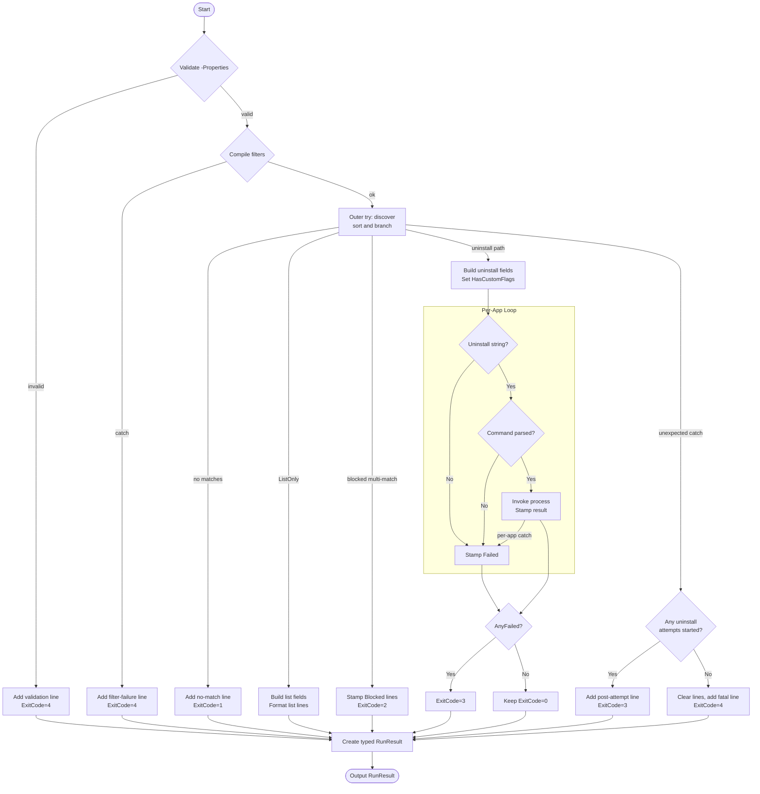

# Start-Uninstaller

## Purpose

`Start-Uninstaller` is the public orchestrator for the PDQ-facing uninstaller workflow. It validates `-Properties`, compiles filters, discovers matching uninstall records, applies the safe single-match default, and then either formats list output or executes uninstall commands before returning a typed run-result object containing the PDQ output lines plus the script exit code. It exists so the top-level entrypoint in `src/EntryPoint.ps1` and the built `build/Start-Uninstaller.ps1` artifact can keep a stable deployment contract: the wrapper writes the returned lines and exits with the returned code, while the function owns the business logic.

## Parameters

| Name | Type | Required | Default | Description |
|------|------|----------|---------|-------------|
| `Filter` | `System.Collections.Hashtable[]` | Yes | None | One or more filter definitions that are validated and compiled before discovery begins. |
| `Architecture` | `System.String` | No | `Both` | Discovery architecture gate. Allowed values are `x86`, `x64`, and `Both`. |
| `Properties` | `System.String[]` | No | Empty array | Additional raw registry value names to emit. Blank names, NUL-containing names, synthetic fields, and internal-only fields are rejected before discovery starts. |
| `EXEFlags` | `System.String` | No | `$Null` | Optional replacement arguments for EXE uninstallers. Presence is tracked separately with `$PSBoundParameters.ContainsKey('EXEFlags')`. |
| `ListOnly` | `System.Management.Automation.SwitchParameter` | No | Off | Discovery-only mode. Matching records are emitted, but no uninstall command is resolved or executed. |
| `IncludeHidden` | `System.Management.Automation.SwitchParameter` | No | Off | Includes entries where `SystemComponent = 1`. |
| `IncludeNameless` | `System.Management.Automation.SwitchParameter` | No | Off | Includes entries whose `DisplayName` is missing, empty, or whitespace-only. |
| `AllowMultipleMatches` | `System.Management.Automation.SwitchParameter` | No | Off | Allows more than one matching record to be processed in uninstall mode. |
| `TimeoutSeconds` | `System.Int32` | No | `600` | Per-entry timeout passed to `Invoke-SilentProcess`. Validation range is `1..3600`. |

## Return Value

The function returns one `[StartUninstallerRunResult]` instance and then inserts the leading `PSTypeName` `StartUninstaller.RunResult` onto that object. The instance contains `ExitCode` (`System.Int32`) and `Lines` (`System.String[]`), where `Lines` already holds the formatted PDQ output records and `ExitCode` is the code the wrapper should use for process exit.

It does not intentionally return `$Null`, and it does not write PDQ lines to the host itself. Under normal execution it always emits one run-result object, including validation failures, no-match results, blocked multi-match results, aggregate uninstall failures, and post-attempt formatting failures. The source help block's `.OUTPUTS` text still says `[System.Management.Automation.PSObject]`, but the actual runtime output and `[OutputType()]` attribute are the typed class above. Only an unexpected terminating failure outside the covered catch blocks, such as a failure during final `StartUninstallerRunResult` construction or `PSTypeName` insertion, would prevent any object from being returned.

## Execution Flow

## Error Handling

- Each invalid `-Properties` element is handled inline. Blank names, names containing NUL, synthetic field names, and internal field names append one `Message=...` line, set `ExitCode = 4`, and stop further property validation.
- Filter compilation is wrapped in `Try/Catch` around `New-CompiledFilter -Filter:$Filter`. On failure, the function appends `Message=Filter validation failed: ...` and sets `ExitCode = 4`.
- The outer orchestration block is wrapped in `Try/Catch` starting before registry-path discovery and ending after per-record line formatting. If a terminating exception escapes that region before any uninstall attempt starts, the catch clears any previously accumulated lines, appends `Message=Fatal pre-processing error: ...`, and sets `ExitCode = 4`.
- That same outer catch now distinguishes post-attempt failures correctly. If one or more uninstall attempts already started, it appends `Message=Uninstall processing failed after one or more attempts: ...`, marks `$AnyFailed = $True`, and sets `ExitCode = 3` instead of collapsing the run into the fatal pre-processing path.
- A successful discovery pass with zero matches appends `Message=No applications matched the supplied filters. | MatchCount=0` and sets `ExitCode = 1`.
- A multi-match uninstall request without `-AllowMultipleMatches` does not throw. Each matched record is annotated with `Outcome = 'Blocked'`, `ExitCode = $Null`, and a message, then the function sets `ExitCode = 2`.
- Missing uninstall strings and unsupported uninstall command formats are handled per record. The function stamps `Outcome = 'Failed'`, `ExitCode = $Null`, and a message on the record, marks `$AnyFailed = $True`, and continues.
- Exceptions raised during per-record uninstall processing are caught inside the uninstall loop. The function stamps `Outcome = 'Failed'`, `ExitCode = $Null`, and `Message = 'Uninstall processing failed: ...'`, marks `$AnyFailed = $True`, and still emits the record.
- `Invoke-SilentProcess` owns process-launch, timeout, and exit-code interpretation. `Start-Uninstaller` copies the returned `Outcome`, `ExitCode`, and `Message` onto the record, and any non-`Succeeded` outcome sets the aggregate failure flag.
- The final `StartUninstallerRunResult` construction and `PSTypeName` insertion happen after the outer catch. If either of those operations throws, the function would bypass its line-oriented public error contract and emit no run-result object.
- The function does not call `New-ErrorRecord`, `Write-Warning`, or `Write-Error`, and it does not intentionally throw on normal control paths. Its public error contract is line-oriented PDQ output plus `ExitCode`.

## Side Effects

- Reads uninstall-registry inventory indirectly through `Get-UninstallRegistryPath` and `Get-InstalledApplication`.
- Launches external uninstall processes in uninstall mode through `Resolve-UninstallString`, `Resolve-UninstallCommand`, and `Invoke-SilentProcess`.
- Mutates matched application objects in place with `Add-Member` to stamp `Outcome`, `ExitCode`, and `Message`.
- Buffers PDQ-visible lines in a local `System.Collections.Generic.List[System.String]` and returns them in `Lines`; it does not write host output directly.
- Does not modify the registry, files, or variables outside its own scope.

## Research Log

| Topic | Finding | Source | Date Verified |
|-------|---------|--------|---------------|
| Search: `"PowerShell Practice and Style introduction"` | The community `PowerShell Practice and Style` guide is still positioned as guidance rather than a mandatory ruleset. This repo's house standard is materially stricter than that baseline. | [PowerShell Practice and Style](https://poshcode.gitbook.io/powershell-practice-and-style/best-practices/introduction) | 2026-04-01 |
| Search: `"what's new in PSScriptAnalyzer"` | Current official release notes show `PSScriptAnalyzer 1.24.0` on 2025-03-18, raising the minimum supported PowerShell version to 5.1 and extending `UseCorrectCasing` to commands, keywords, and operators. | [What's new in PSScriptAnalyzer](https://learn.microsoft.com/en-us/powershell/utility-modules/psscriptanalyzer/whats-new-in-pssa?view=ps-modules) | 2026-04-01 |
| Search: `"UseCorrectCasing PSScriptAnalyzer"` | The current analyzer rule now prefers exact cmdlet, parameter, and type casing plus lowercase keywords and operators. That differs from this repo's PascalCase-keyword house rule, so the audit scores against the repo standard and notes the discrepancy. | [UseCorrectCasing](https://learn.microsoft.com/en-us/powershell/utility-modules/psscriptanalyzer/rules/usecorrectcasing?view=ps-modules) | 2026-04-01 |
| Search: `"about_Functions_CmdletBindingAttribute PositionalBinding"` | Official docs still state that `PositionalBinding` defaults to `$true` when omitted. Explicitly setting `PositionalBinding = $False` remains necessary when the house rule requires named-only binding. | [about_Functions_CmdletBindingAttribute](https://learn.microsoft.com/en-us/powershell/module/microsoft.powershell.core/about/about_functions_cmdletbindingattribute?view=powershell-7.5) | 2026-04-01 |
| Search: `"about_Functions_OutputTypeAttribute"` | `OutputType` remains metadata only. It documents intended output, but PowerShell does not enforce it at runtime. | [about_Functions_OutputTypeAttribute](https://learn.microsoft.com/en-us/powershell/module/microsoft.powershell.core/about/about_functions_outputtypeattribute?view=powershell-7.5) | 2026-04-01 |
| Search: `"comment-based help keywords"` | SUPERSEDED on 2026-04-01. The documentation is still current, but the prior impact note is outdated because `Start-Uninstaller` now includes `.EXAMPLE`. See the newer comment-help row below. | [Writing Comment-Based Help Topics](https://learn.microsoft.com/en-us/powershell/scripting/developer/help/writing-comment-based-help-topics?view=powershell-7.6) | 2026-04-01 |
| Search: `"validating parameter input PowerShell"` | Validation attributes are still enforced before the cmdlet or function body runs. That confirms the function is correctly using built-in validators for `Filter`, `Architecture`, and `TimeoutSeconds`, even though downstream business-rule validation is still needed. | [Validating Parameter Input](https://learn.microsoft.com/en-us/powershell/scripting/developer/cmdlet/validating-parameter-input?view=powershell-7.5) | 2026-04-01 |
| Search: `"Write-Host official docs"` | SUPERSEDED on 2026-04-01. The docs are still current, but the prior impact note is outdated because `Start-Uninstaller` no longer writes PDQ lines with `Write-Host`. See the newer output-pattern row below. | [Write-Host](https://learn.microsoft.com/en-us/powershell/module/microsoft.powershell.utility/write-host?view=powershell-7.5) | 2026-04-01 |
| Search: `"about_Return scriptblock scope"` | SUPERSEDED on 2026-04-01. The docs are still current, but `Start-Uninstaller` no longer uses routine `Return` flow, so this no longer explains the function's control path. See the newer return-behavior row below. | [about_Return](https://learn.microsoft.com/en-us/powershell/module/microsoft.powershell.core/about/about_return?view=powershell-7.5) | 2026-04-01 |
| Search: `"RegistryKey OpenSubKey read-only"` | `RegistryKey.OpenSubKey()` still opens keys read-only when `writable` is `false`, and missing keys still return `null` rather than throwing. That supports the plan's read-only registry design in the discovery helpers used by this function. | [RegistryKey.OpenSubKey](https://learn.microsoft.com/en-us/dotnet/api/microsoft.win32.registrykey.opensubkey?view=net-10.0) | 2026-04-01 |
| Search: `"ProcessStartInfo UseShellExecute false redirect streams"` | Official .NET guidance still requires `UseShellExecute = false` when redirecting child-process output. That validates the unattended launch pattern used by `Invoke-SilentProcess`, which `Start-Uninstaller` depends on for uninstall execution. | [ProcessStartInfo.UseShellExecute](https://learn.microsoft.com/en-us/dotnet/api/system.diagnostics.processstartinfo.useshellexecute?view=net-9.0) | 2026-04-01 |
| Search: `"Process StandardOutput deadlock redirected stream"` | Official docs still warn that redirected process I/O can deadlock unless the parent drains output correctly. That supports the current `Invoke-SilentProcess` design, which asynchronously drains stdout/stderr before interpreting results. | [Process.StandardOutput](https://learn.microsoft.com/en-us/dotnet/api/system.diagnostics.process.standardoutput?view=net-10.0) | 2026-04-01 |
| Search: `"comment-based help keywords"` | Comment-based help remains the supported function-help mechanism, and the current `Start-Uninstaller` help block now includes `.SYNOPSIS`, `.DESCRIPTION`, `.PARAMETER`, `.EXAMPLE`, `.OUTPUTS`, and `.NOTES`. This corrects the prior help-completeness finding. | [Writing Comment-Based Help Topics](https://learn.microsoft.com/en-us/powershell/scripting/developer/help/writing-comment-based-help-topics?view=powershell-7.6) | 2026-04-01 |
| Search: `"Write-Host official docs"` | `Write-Host` guidance is unchanged, but the public function no longer calls `Write-Host`; it buffers PDQ output in `Lines`, and the entrypoint writes those lines. This corrects the prior `Write-Host` finding for this function. | [Write-Host](https://learn.microsoft.com/en-us/powershell/module/microsoft.powershell.utility/write-host?view=powershell-7.5) | 2026-04-01 |
| Search: `"about_Return scriptblock scope"` | `return` still exits the current scope, including a script block, but `Start-Uninstaller` no longer uses `Return`. This removes the prior routine-return standards failure for the current source. | [about_Return](https://learn.microsoft.com/en-us/powershell/module/microsoft.powershell.core/about/about_return?view=powershell-7.5) | 2026-04-01 |
| Search: `"about_PSCustomObject"` / `"New-Object PowerShell 7.5"` | SUPERSEDED on 2026-04-02. The docs are still current, but the prior impact note is outdated because `Start-Uninstaller` no longer declares or constructs a generic run-result `PSObject`. See the newer class/output-type row below. | [about_PSCustomObject](https://learn.microsoft.com/en-us/powershell/module/microsoft.powershell.core/about/about_pscustomobject?view=powershell-7.5), [New-Object](https://learn.microsoft.com/en-us/powershell/module/microsoft.powershell.utility/new-object?view=powershell-7.5) | 2026-04-01 |
| Search: `"What is Windows PowerShell?"` | Microsoft still states that Windows PowerShell 5.1 is the latest Windows PowerShell release and no longer receives new features. That does not change the repo's 5.1 baseline, but it explains why newer PowerShell 7.x guidance can diverge from this frozen target. | [What is Windows PowerShell?](https://learn.microsoft.com/en-us/powershell/scripting/what-is-windows-powershell?view=powershell-7.5) | 2026-04-01 |
| Search: `"about_Functions_CmdletBindingAttribute SupportsShouldProcess ConfirmImpact"` | Official docs still say `ConfirmImpact` should only be specified when `SupportsShouldProcess` is also specified. That means omitting both is consistent with current PowerShell guidance and with the plan's no-interactivity rule, even though it still fails the repo's stricter "list every CmdletBinding property explicitly" standard. | [about_Functions_CmdletBindingAttribute](https://learn.microsoft.com/en-us/powershell/module/microsoft.powershell.core/about/about_functions_cmdletbindingattribute?view=powershell-7.5) | 2026-04-02 |
| Search: `"about_Classes"` / `"UseOutputTypeCorrectly"` | PowerShell classes remain supported in Windows PowerShell 5.1, and current analyzer guidance still expects the declared `OutputType` to match the actual output type. That removes the prior generic-run-result concern now that `Start-Uninstaller` declares `[OutputType([StartUninstallerRunResult])]` and constructs that class directly. | [about_Classes](https://learn.microsoft.com/en-us/powershell/module/microsoft.powershell.core/about/about_classes?view=powershell-5.1), [UseOutputTypeCorrectly](https://learn.microsoft.com/en-us/powershell/utility-modules/psscriptanalyzer/rules/useoutputtypecorrectly?view=ps-modules) | 2026-04-02 |
| Search: `"Add-Member Microsoft Learn"` | `Add-Member` remains the supported cmdlet for adding per-instance note properties and does not change the underlying object type. That validates the current `Outcome`/`ExitCode`/`Message` stamping pattern while keeping it clearly documented as an in-place side effect. | [Add-Member](https://learn.microsoft.com/en-us/powershell/module/microsoft.powershell.utility/add-member?view=powershell-7.5) | 2026-04-02 |
| Search: `"Sort-Object PowerShell 7.5"` | `Sort-Object` remains the supported sorting cmdlet, and objects missing one of the requested sort properties are treated as having `$null` for that property and are placed at the end of the sort order. That does not change the current `Start-Uninstaller` findings, but it reinforces the need for deterministic stamped sort fields before ordering records. | [Sort-Object](https://learn.microsoft.com/en-us/powershell/module/microsoft.powershell.utility/sort-object?view=powershell-7.5) | 2026-04-02 |
| Search: `"PowerShell Gallery Pester 5.7.1"` | PowerShell Gallery still lists `Pester 5.7.1` as the current stable release, while `6.0.0` remains alpha-only. That does not change the runtime audit findings, but it supports continuing to judge this repo's tests against current Pester 5 behavior. | [Pester 5.7.1](https://www.powershellgallery.com/packages/pester) | 2026-04-02 |

## Standards Audit

| Rule | Status | Line(s) | Evidence |
|------|--------|---------|----------|
| Colon-bound parameters | PASS | 272, 318, 336-339, 347-350, 373-376, 382-384, 402-404, 418-421 | Calls and parameter values are consistently named and colon-bound, for example `New-CompiledFilter -Filter:$Filter`, `Sort-Object -Property:@(...)`, `ConvertTo-OutputFieldList -MandatoryFields:$ListFields -Properties:$Properties -FilterPropertyNames:$FilterPropNames`, and `Invoke-SilentProcess -FileName:$ParsedCommand.FileName -Arguments:$ParsedCommand.Arguments -TimeoutSeconds:$TimeoutSeconds`. |
| PascalCase naming | PASS | 1, 220-265, 270-489 | Keywords and identifiers follow the repo's casing style, for example `Function Start-Uninstaller {`, `Foreach ($PropertyName in $Properties) {`, `If ($HasMatches -eq $False) {`, `Try {`, and `} ElseIf (...) {`. |
| Full .NET type names (no accelerators) | PASS | 66, 79, 93, 106, 119, 132, 145, 158, 171, 185, 190, 268, 485-486 | The function uses full names such as `[StartUninstallerRunResult]`, `[System.Collections.Hashtable[]]`, `[System.Management.Automation.SwitchParameter]`, `[System.Collections.Generic.List[System.String]]`, and `[System.Int32]`; a type scan found no `[string]`, `[int]`, `[bool]`, or `[switch]`. |
| Object types are the most appropriate and specific choice | FAIL | 268; `src/Private/A.Types.ps1` 1-23 | The function still seeds compiled filters as `$CompiledFilters = [System.Management.Automation.PSObject[]]@()`, even though a dedicated `StartUninstallerCompiledFilter` class already exists: `class StartUninstallerCompiledFilter { ... }`. |
| Single quotes for non-interpolated strings | FAIL | 232 | The function still uses a non-interpolated double-quoted string literal in the NUL check: ``$ContainsNulCharacter = [System.Boolean]($PropertyName.Contains("`0"))``. |
| `$PSItem` not `$_` | PASS | 285, 341-345, 352-367, 439-446 | Pipeline/scriptblock code uses `$PSItem`, for example `$CompiledFilters | & { Process { [System.String]$PSItem.Property } }`; a token scan found no `$_`. |
| Explicit bool comparisons (`$Var -eq $True`) | PASS | 224, 233, 244, 258, 270, 283, 300, 303, 310, 326-334, 389, 399, 409, 433, 457, 466 | Conditions compare booleans explicitly, for example `If ($HasMatches -eq $False)` and `If ($ExecutionSucceeded -eq $False)`. |
| If conditions are pre-evaluated outside `If` blocks | PASS | 326-346, 386-389, 406-409, 456-457, 463-466 | The current source now precomputes branch booleans before use, for example `$BlocksMultipleMatches = [System.Boolean](...)` followed by `} ElseIf ($BlocksMultipleMatches -eq $True) {`. |
| `$Null` on left side of comparisons | PASS | 387, 407 | Null comparisons keep `$Null` on the left: `$Null -ne $UninstallString` and `$Null -ne $ParsedCommand`. |
| No positional arguments to cmdlets | PASS | 272, 307, 318-323, 336-339, 347-350, 373-376, 382-384, 402-404, 418-421 | Cmdlets are called with named parameters or splatting, for example `Get-InstalledApplication @DiscoverParams`, `Sort-Object -Property:@(...)`, and `Resolve-UninstallString -Application:$App -HasCustomEXEFlags:$HasCustomFlags`. |
| No cmdlet aliases | PASS | 1-491 | The function uses full command names such as `Sort-Object`, `Add-Member`, and `Invoke-SilentProcess`; a token scan found no cmdlet aliases. |
| Switch parameters correctly handled | PASS | 354-362, 390-395, 410-415, 423-428 | Switches are used in bare form when enabled, for example `-Force` on `Add-Member`, rather than redundant `-Force:$True`. |
| CmdletBinding with all required properties | FAIL | 59-65 | `[CmdletBinding(DefaultParameterSetName = 'Default', HelpURI = '', PositionalBinding = $False, RemotingCapability = 'None', SupportsPaging = $False)]` omits the house-required `ConfirmImpact` and `SupportsShouldProcess` properties. |
| OutputType declared | PASS | 66 | `[OutputType([StartUninstallerRunResult])]` is present directly above `Param (`. |
| Comment-based help is complete | PASS | 2-56 | The help block includes `.SYNOPSIS`, `.DESCRIPTION`, `.PARAMETER` entries for every parameter, `.EXAMPLE`, `.OUTPUTS`, and `.NOTES`. |
| Comment-based help `.OUTPUTS` matches runtime output | FAIL | 51-52, 66, 484-489 | The help block still says `.OUTPUTS [System.Management.Automation.PSObject]`, but the function declares `[OutputType([StartUninstallerRunResult])]` and constructs `$RunResult = [StartUninstallerRunResult]::new(...)`. |
| Error handling via `New-ErrorRecord` or appropriate pattern | FAIL | 225-227, 274-277, 311-312, 467-478 | Public error paths are converted into PDQ message lines such as `'Message=Filter validation failed: {0}' -f ...`, `'Message=No applications matched the supplied filters. | MatchCount=0'`, and `'Message=Fatal pre-processing error: {0}' -f ...`; the function never calls `New-ErrorRecord`. |
| Try/Catch around operations that can fail | FAIL | 271-279, 288-480, 484-489 | Filter compilation, outer orchestration, and per-app uninstall processing are wrapped in `Try/Catch`, but final run-result construction is still unguarded: `$RunResult = [StartUninstallerRunResult]::new(...)` then `$RunResult.PSObject.TypeNames.Insert(...)`. |
| Write-Debug at Begin/Process/End block entry and exit (if blocks are used) | FAIL | 189-490 | The function does use a lifecycle block, `Process {`, but a token scan of the block found no `Write-Debug` entry or exit tracing. |
| No variable pollution (no `script:` or `global:` scope leaks) | PASS | 190-193, 295-305, 398-404, 463-479 | Working state is local (`$OutputLines`, `$ExitCode`, `$AnyFailed`, `$DiscoverParams`, `$EXEFlagsToPass`), and a token scan found no `script:` or `global:` assignments. |
| 96-character line limit | PASS | 247-249, 311-312, 444-446, 468-476 | Long templates are wrapped across lines, and a length scan found no line over 96 characters. |
| 2-space indentation (not tabs, not 4-space) | PASS | 59-66, 68-187, 220-279, 288-480 | The function uses consistent 2-space indentation throughout the body, and a tab scan found no tab characters. |
| OTBS brace style | FAIL | 345, 367 | Nested scriptblocks still close with combined braces, for example `            }}` rather than placing each closing brace on its own line. |
| No commented-out code | PASS | 2-57, 59-491 | The only comments are the structured help block; there are no disabled command lines or commented-out code fragments. |
| Registry access is read-only (if applicable) | N/A | 289, 307; `Get-UninstallRegistryPath` 43-91; `Get-InstalledApplication` 146-179 | `Start-Uninstaller` itself does not open registry keys. It delegates registry access to helpers, and those helpers implement the read-only registry behavior. |
| State-changing functions implement `SupportsShouldProcess` | FAIL | 59-65, 378-421 | The function performs uninstall work, but its `[CmdletBinding(...)]` omits `SupportsShouldProcess` while the body still executes `Invoke-SilentProcess`. |
| No `Write-Host` in functions | PASS | 225-227, 311-312, 451-489 | Output is buffered via `$OutputLines.Add(...)` and returned through `$RunResult`; a token scan found no `Write-Host`. |
| No routine `return` flow in functions | PASS | 488-489 | The function ends with implicit pipeline output: `$RunResult.PSObject.TypeNames.Insert(0, 'StartUninstaller.RunResult')` and `$RunResult`; a token scan found no `Return`. |
| UTF-8 with BOM for PS 5.1-targeted files | PASS | file bytes | A local byte scan of `src/Public/Start-Uninstaller.ps1` reported `UTF8_BOM`. |

### Footnotes

1. Current official `PSScriptAnalyzer` guidance differs from the repo standard in at least one notable place: `UseCorrectCasing` now prefers lowercase keywords and operators, while the house standard requires PascalCase keywords. The audit scores against the repo standard as instructed.
2. `OutputType` still documents intent rather than enforcing runtime output. A PASS here means only that the attribute exists.
3. Current official PowerShell guidance says `ConfirmImpact` should only be specified when `SupportsShouldProcess` is also specified. The house standard requiring every `CmdletBinding` property to be listed explicitly is stricter than that guidance.
4. The standards reference requires `SupportsShouldProcess` for state-changing functions, while the project plan explicitly forbids `SupportsShouldProcess` and `ConfirmImpact` for this noninteractive PDQ workflow. The function can align with the plan and official docs while still failing the house standard on those rows.
5. PowerShell escape sequences such as ``"`0"`` require double-quoted strings unless the code is rewritten to a non-string form such as `[System.Char]0`. The audit still scores line 232 against the house rule as written.

## Plan Audit

| Plan Section | Requirement | Status | Line(s) | Details |
|--------------|-------------|--------|---------|---------|
| `1. Purpose` | "`Start-Uninstaller` is a PDQ Deploy-oriented universal uninstaller script" that discovers entries, narrows them through filters, and "`execute[s] a single safe uninstall by default`." | ALIGNED | 13-16, 288-489 | The current function validates inputs, discovers matches, enforces the single-match default, and either lists or executes uninstall actions while producing PDQ-ready line output plus an exit code. |
| `2. Frozen Product Decisions` | "`Default uninstall behavior requires exactly one match.`" "`-AllowMultipleMatches` opts into multi-uninstall behavior." "`-ListOnly` always returns all matches.`" | ALIGNED | 307-368, 378-459 | Zero matches produce exit `1`, list mode emits all sorted matches, multi-match uninstall is blocked unless `-AllowMultipleMatches` is present, and allowed multi-match uninstall processes every sorted record. |
| `2. Frozen Product Decisions` | Discovery scope is "`HKLM` native uninstall view", "`HKLM` WOW6432Node view on 64-bit OS", and "`loaded HKU\<SID>` user hives only". | ALIGNED | 289, 307; `Get-UninstallRegistryPath` 43-91; `Get-LoadedUserRegistrySid` 53-89 | The public function delegates discovery to `Get-UninstallRegistryPath` and `Get-InstalledApplication`, and the discovery helpers build system descriptors plus loaded-user descriptors while excluding `.DEFAULT`, `*_Classes`, and the built-in service SIDs. |
| `2. Frozen Product Decisions` | "`Hidden entries are excluded by default.`" "`-IncludeHidden` includes entries where `SystemComponent = 1`." "`-IncludeNameless` includes entries whose `DisplayName` is missing or empty.`" | ALIGNED | 290-305; `Get-InstalledApplication` 188-229 | `Start-Uninstaller` passes `IncludeHidden` and `IncludeNameless` only when explicitly present, and the discovery helper applies the hidden and nameless gates independently. |
| `4.1 Built Artifact` | The built artifact must call `Start-Uninstaller` once, write the returned PDQ lines, and `exit` with the returned code. | ALIGNED | `src/EntryPoint.ps1` 45-49; `build/Start-Uninstaller.ps1` 4243-4247; `src/Private/A.Types.ps1` 76-86 | The wrapper calls `Start-Uninstaller @PSBoundParameters` once, writes `$RunResult.Lines`, and exits with `$RunResult.ExitCode`. The `StartUninstallerRunResult` class exposes exactly the `Lines` and `ExitCode` members that contract requires. |
| `4.2 Parameters` | The public parameter contract is `Filter`, `Architecture`, `Properties`, `EXEFlags`, `ListOnly`, `IncludeHidden`, `IncludeNameless`, `AllowMultipleMatches`, and `TimeoutSeconds` with the documented defaults and validation. | ALIGNED | 68-186 | The signature matches the plan table, including `ValidateSet('x86', 'x64', 'Both')`, `ValidateRange(1, 3600)`, and `Filter` as mandatory. |
| `4.3 Exit Codes` | `0 = success`, `1 = no matches`, `2 = blocked multi-match uninstall`, `3 = one or more uninstall failures/timeouts`, `4 = fatal pre-processing or setup error before uninstall attempts began`. | ALIGNED | 309-314, 346-368, 378-479; `Start-Uninstaller.Tests.ps1` 204-224 | The current source now distinguishes post-attempt failures from pre-attempt failures correctly: if `$HasStartedUninstallAttempts` is `$True`, the outer catch appends `Message=Uninstall processing failed after one or more attempts: ...` and sets exit `3`; otherwise it clears prior lines and sets exit `4` for fatal pre-processing errors. The public tests include a direct regression case for the post-attempt formatting path. |
| `4.4 No Interactivity` | "`The script must not prompt.` Specifically: `no SupportsShouldProcess`, `no ConfirmImpact`, `no Read-Host`, `no GUI`." | ALIGNED | 59-65, 378-421 | The function omits both `SupportsShouldProcess` and `ConfirmImpact`, performs uninstall work without any prompt path, and a token scan of `src/Public/Start-Uninstaller.ps1` found no `Read-Host` or GUI calls. |
| `5.3 Uninstall Result Record` | Each attempted or blocked uninstall must carry identity/context fields plus `Outcome`, `ExitCode`, and `Message`, with valid outcomes `Blocked`, `Failed`, `Succeeded`, and `TimedOut`. | ALIGNED | 353-365, 390-395, 410-415, 423-428, 439-447 | Blocked and processed records are annotated with `Outcome`, `ExitCode`, and `Message`, and successful or timed-out executions inherit those values from `Invoke-SilentProcess`. |
| `8.2 Deterministic Ordering` | Matching records must be sorted by `InstallScope`, `UserSid`, `DisplayName`, and `RegistryPath`. | ALIGNED | 316-323 | The function sorts matches using the exact property order required by the plan before list output, blocked output, or uninstall execution. |
| `9.1 Uninstall String Selection` | Prefer `QuietUninstallString` when present and `-EXEFlags` was not supplied; otherwise use `UninstallString`. | ALIGNED | 370-384; `Resolve-UninstallString` 71-99 | `Start-Uninstaller` derives `$HasCustomFlags` from `PSBoundParameters.ContainsKey('EXEFlags')` and passes that state into `Resolve-UninstallString`, whose helper logic matches the required precedence. |
| `9.2`, `9.4`, and `9.5` Uninstall Command Rules | Supported uninstall command families are MSI, EXE, `.cmd`, and `.bat`; unsupported families fail the matched record; custom `-EXEFlags` replace only EXE arguments. | ALIGNED | 402-415; `Resolve-UninstallCommand` 123-205 | A `$Null` parse result becomes a per-record `Failed` outcome, and the parser helper implements the allowed MSI, EXE, and batch families with EXE-only flag replacement. |
| `10.2` and `10.4` Process Execution Model | Timeout is per entry, must kill the process tree, and timeouts or failed launches count as per-entry failures that aggregate to exit `3`. | ALIGNED | 418-458; `Invoke-SilentProcess` 157-244, 281-321 | `Invoke-SilentProcess` enforces per-entry timeout and returns `TimedOut` or `Failed` outcomes; `Start-Uninstaller` copies those results onto the record and promotes any non-`Succeeded` result to aggregate exit `3`. |
| `11.1`, `11.2`, `11.3`, and `11.5` PDQ Output Contract | Public output must be line-oriented `Key=Value \| Key=Value`, with mandatory fields first, additional fields after that, and sanitized values. | ALIGNED | 195-206, 284-285, 336-376, 451-452; `ConvertTo-OutputFieldList` 114-268; `Format-OutputLine` 86-124 | Mandatory list and uninstall fields are defined explicitly, filter property names are collected and passed through to output-field construction, and final rendering is delegated to helpers that enforce deterministic ordering and single-line sanitization. |
| `11.4 -Properties` | "`-Properties` accepts only named raw registry value names.` Synthetic metadata is invalid, internal-only fields are invalid, and invalid input is a fatal validation error." | ALIGNED | 220-265 | The function rejects blank names, NUL-containing names, synthetic fields, and internal fields before discovery starts and returns exit `4` with one validation line. |
| `11.6 No-Match and Fatal Lines` | No-match and fatal pre-processing/setup runs must emit one single-line PDQ message record. | ALIGNED | 311-312, 467-478 | No-match runs emit `Message=No applications matched the supplied filters. \| MatchCount=0`, and fatal pre-processing runs emit one single-line `Message=...` record. Post-attempt outer-catch failures now correctly use exit `3` instead of the fatal path. |
| `12. File Structure` and `12. Function Responsibilities` | `Start-Uninstaller.ps1` belongs under `src/Public/` and should "`orchestrate validation, discovery, matching, output, execution, and exit code`." | ALIGNED | `src/Public/Start-Uninstaller.ps1` 1-491 | The function is in the planned public location and is necessary, not overengineered: the plan explicitly assigns orchestration to `Start-Uninstaller` while keeping the wrapper responsible only for parameter binding, writing lines, and exiting. |
| `12. External Seams` | External dependencies must be wrapped behind private seam functions so tests can mock them reliably. | ALIGNED | 272, 289, 307, 336-339, 347-350, 382-384, 402-404, 418-421; `Start-Uninstaller.Tests.ps1` 52-91 | The public function calls helpers rather than raw registry or process APIs, and the public orchestrator tests mock `New-CompiledFilter`, `Get-UninstallRegistryPath`, `Get-InstalledApplication`, `Resolve-UninstallString`, `Resolve-UninstallCommand`, and `Invoke-SilentProcess` directly. |
| `14.4 Orchestrator and Output Tests` | The plan requires direct tests for list-only, no-match, blocked multi-match, multi-uninstall, unsupported command, no uninstall string, timeout, `-Properties`, filter auto-append, and timeout passthrough behavior. | DEVIATION | `Start-Uninstaller.Tests.ps1` 94-435, especially 331-350 | The public tests now cover list-only, no-match, blocked multi-match, multi-uninstall, unsupported command, no uninstall string, timeout, invalid synthetic `-Properties`, EXE-flag passthrough, and timeout passthrough. They still do not directly assert emitted raw `-Properties`, missing-property `<null>`, filter-property auto-append, synthetic filter-property auto-append, or final PDQ line sanitization and ordering. |
| `14.5 Built Script Integration Tests` | "`The built artifact must be invoked as a script`" and integration tests should validate stdout lines plus exit codes. | REVIEW | `tests/Smoke/AuditRegression.ps1` 69-155; `build/Start-Uninstaller.ps1` 4243-4247 | The smoke script does invoke the built artifact as a child PowerShell process and validates stdout, stderr, and exit-code behavior for synthetic-`-Properties` and no-match cases. That is meaningful integration coverage, but it is still narrow, `tests/Integration` remains empty, and the build-script verification is better treated as partial than fully aligned. |

## Changelog

| Date | Changes |
|------|---------|
| 2026-04-02 | Corrected stale audit conclusions after the latest convergence pass: updated the execution-flow and error-handling sections to reflect the fixed outer-catch behavior that now returns exit `3` after uninstall attempts begin, changed the plan audit `4.3 Exit Codes` row from `DEVIATION` to `ALIGNED`, refreshed the standards audit to mark pre-evaluated `If` conditions as `PASS`, `Write-Debug` lifecycle tracing as `FAIL`, single-quote compliance as `FAIL` because of the NUL literal, and object-type specificity as a stronger `FAIL` because `StartUninstallerCompiledFilter` now exists, added the missed finding that the help block's `.OUTPUTS` text still says `PSObject`, and appended new research on `Sort-Object` and the current stable Pester line. |
| 2026-04-02 | Corrected the README for the current typed-run-result implementation: updated the return-value model from generic `PSObject` to `StartUninstallerRunResult`, refreshed standards findings for `CmdletBinding`, string quoting, line length, BOM, and generic compiled-filter typing, corrected the plan audit to mark no-interactivity as aligned while flagging the remaining exit-`4` scope bug and missing direct orchestrator output tests, fixed the built-script test reference from the stale `tests/Integration/AuditRegression.ps1` path to the current `tests/Smoke/AuditRegression.ps1` smoke script, and added new research on official `CmdletBinding` guidance, PowerShell classes/output-type matching, and `Add-Member` instance behavior. |
| 2026-04-01 | Corrected the README to match the current `8.1.0` source: fixed the return-value model from integer/`Write-Host` to `StartUninstaller.RunResult`, updated the error-handling and side-effect descriptions, replaced stale standards findings for `Write-Host`, `return`, comment-based help, variable pollution, and top-level fatal handling, added the missing standards checks for object-type specificity and pre-evaluated `If` conditions, corrected the plan audit to mark fatal pre-processing handling as aligned and the literal `ConfirmImpact`/`SupportsShouldProcess` wording as a plan deviation, and superseded outdated research notes whose prior audit impact no longer applies. |
| 2026-04-01 | First audit run. Created the initial README for `Start-Uninstaller`, added current-source research with URLs, documented the actual orchestrator control flow and side effects, recorded strict house-style failures such as `Write-Host`, routine `Return`, bare `[CmdletBinding()]`, and missing `.EXAMPLE`, and flagged the discovery-phase exception path that can bypass the plan's required exit code `4`. |
AUDIT_STATUS:UPDATED