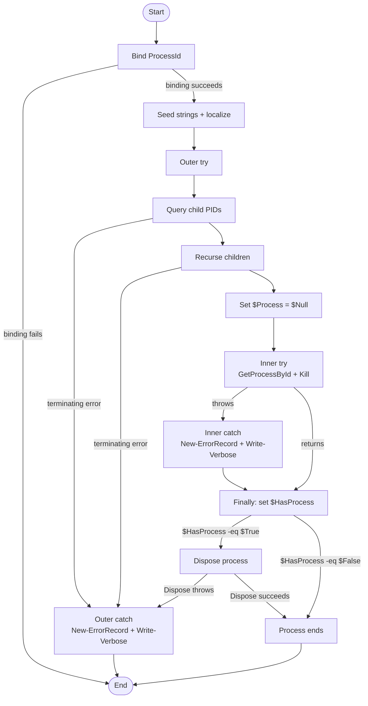

# Stop-ProcessTree

## Purpose

`Stop-ProcessTree` is a private timeout-cleanup helper that `Invoke-SilentProcess` calls after a launched uninstaller exceeds its wait limit. It performs a best-effort recursive child lookup through the local `Win32_Process` CIM class, attempts to stop discovered descendants first, and then calls `[System.Diagnostics.Process]::GetProcessById(...).Kill()` for the requested root PID. The helper exists so timeout-driven process-tree cleanup stays isolated behind one private seam that higher-level logic can call and tests can mock independently.

## Parameters

| Name | Type | Required | Default | Description |
|------|------|----------|---------|-------------|
| `ProcessId` | `System.Int32` | Yes | None | PID of the root process that the helper will attempt to stop after recursively processing any currently discovered children. Validation restricts accepted values to `1..[System.Int32]::MaxValue`. |

## Return Value

Returns no success-stream output. `[OutputType([System.Void])]` is metadata only; after parameter binding succeeds, the function completes silently on the success stream even on failure paths because both `New-ErrorRecord` results are assigned to `$ErrorRecord` rather than emitted. Operational detail is reduced to verbose output, including the helper's own `Write-Verbose` messages and any downstream verbose records that `Get-CimInstance` emits when `-Verbose` is enabled. If parameter binding fails, PowerShell raises the binding error before the function body runs.

## Execution Flow

## Error Handling

- Missing `ProcessId` or an out-of-range PID fails during parameter binding before the function body runs.
- `Begin` seeds an inline fallback `$Strings` table, then calls `Import-LocalizedData -ErrorAction:'SilentlyContinue'` for a best-effort localized-data lookup. If that lookup fails non-terminatingly, the fallback strings remain in use.
- `Get-CimInstance` is supplied `ErrorAction = 'SilentlyContinue'` through `$CimArguments`, so non-terminating child-query errors can be suppressed with no message at all.
- Terminating failures from child discovery, recursive descent, or any exception that escapes `Finally` are caught by the outer `Catch`, translated through `New-ErrorRecord`, and then reduced to `Write-Verbose 'Process tree cleanup failed for PID ...'`.
- Failures from `[System.Diagnostics.Process]::GetProcessById()` or `$Process.Kill()` are caught by the inner `Catch`, translated through `New-ErrorRecord`, and then reduced to `Write-Verbose 'Process ... could not be stopped cleanly ...'`.
- `Finally` precomputes `$HasProcess`; if it is `$True`, the function attempts `$Process.Dispose()`. A dispose failure bypasses the inner `Catch` and is then handled by the outer `Catch`.
- The function intentionally does not rethrow cleanup failures and does not intentionally emit a success-stream object.

## Side Effects

- Performs a best-effort localized-data lookup rooted at `$PSScriptRoot` for `Stop-ProcessTree` string data.
- Queries the local `Win32_Process` CIM class to discover child processes.
- May terminate the requested root PID and any descendants it discovers during the recursive walk.
- Opens and disposes a transient `System.Diagnostics.Process` handle for the root PID.
- May emit verbose diagnostics, including downstream verbose records from `Get-CimInstance` when `-Verbose` is enabled.
- Does not touch the registry, network resources, or variables outside its local scope.

## Research Log

This log carries forward prior verified research and marks rows as `SUPERSEDED` where a newer verification or the current source revision changed the function-specific conclusion.

| Topic | Finding | Source | Date Verified |
|-------|---------|--------|---------------|
| Search: `PowerShell Practice and Style naming conventions` | The community style guide still recommends full command names and full parameter names instead of aliases or short forms, so the repo's explicit-command standard remains directionally aligned with current public guidance. | https://poshcode.gitbook.io/powershell-practice-and-style/style-guide/naming-conventions | 2026-04-01 |
| Search: `PowerShell Practice and Style readability` | The public style guide still describes many formatting rules as consensus guidance rather than hard rules, and it still recommends avoiding backticks when practical. That is looser than this repo's house standard. | https://poshcode.gitbook.io/powershell-practice-and-style/style-guide/readability | 2026-04-01 |
| Search: `PSScriptAnalyzer latest release 1.24.0` | Current PSScriptAnalyzer release notes still show 1.24.0 raised the minimum supported PowerShell version to 5.1 and expanded `UseCorrectCasing`, so current analyzer expectations remain 5.1+-based. | https://github.com/PowerShell/PSScriptAnalyzer/releases | 2026-04-01 |
| Search: `PSScriptAnalyzer rules readme` | Current Microsoft docs still list `ProvideCommentHelp`, `AvoidUsingPositionalParameters`, `UseBOMForUnicodeEncodedFile`, `UseCorrectCasing`, and `UseShouldProcessForStateChangingFunctions` as active built-in rules. This sharpens the basis for several standards findings even where the repo suppresses selected analyzer rules. | https://learn.microsoft.com/en-us/powershell/utility-modules/psscriptanalyzer/rules/readme?view=ps-modules | 2026-04-01 |
| Search: `UseCorrectCasing` | Current analyzer guidance now prefers exact casing for types, cmdlets, and parameters, but lowercase language keywords and operators. That conflicts directly with this repo's PascalCase-keyword house style, so this audit still scores keyword casing against repo policy rather than the live analyzer preference. | https://learn.microsoft.com/en-us/powershell/utility-modules/psscriptanalyzer/rules/usecorrectcasing?view=ps-modules | 2026-04-02 |
| Search: `UseShouldProcessForStateChangingFunctions` | Microsoft still documents that state-changing verbs including `Stop` should support `ShouldProcess`. That conflicts with this repo's frozen non-interactive plan and disabled analyzer rule, so it keeps the standards-versus-plan conflict explicit. | https://learn.microsoft.com/en-us/powershell/utility-modules/psscriptanalyzer/rules/useshouldprocessforstatechangingfunctions?view=ps-modules | 2026-04-01 |
| Search: `UseShouldProcessForStateChangingFunctions` | Guidance is unchanged, but its impact on this audit changed with the current source revision: `Stop-ProcessTree` now omits `SupportsShouldProcess`, so the divergence is between public analyzer guidance and repo policy rather than between the live implementation and the plan. | https://learn.microsoft.com/en-us/powershell/utility-modules/psscriptanalyzer/rules/useshouldprocessforstatechangingfunctions?view=ps-modules | 2026-04-02 |
| Search: `AvoidUsingPositionalParameters` | The built-in analyzer rule still warns only when three or more positional arguments are supplied, which is looser than this repo's no-positional-arguments rule. | https://learn.microsoft.com/en-us/powershell/utility-modules/psscriptanalyzer/rules/avoidusingpositionalparameters?view=ps-modules | 2026-04-01 |
| Search: `AvoidUsingEmptyCatchBlock` | SUPERSEDED on 2026-04-01. Microsoft still treats empty catch blocks as poor design and recommends executable handling inside `catch`, but the prior conclusion that this function had empty catches no longer applies to the current source revision. | https://learn.microsoft.com/en-us/powershell/utility-modules/psscriptanalyzer/rules/avoidusingemptycatchblock?view=ps-modules | 2026-04-01 |
| Search: `AvoidUsingEmptyCatchBlock` | SUPERSEDED on 2026-04-02. Current guidance still disfavors empty catches and recommends `Write-Error` or `throw`, but the prior conclusion that this function still diverged from the repo's stronger `New-ErrorRecord` requirement no longer matches the current source revision because both catches now call `New-ErrorRecord`. | https://learn.microsoft.com/en-us/powershell/utility-modules/psscriptanalyzer/rules/avoidusingemptycatchblock?view=ps-modules | 2026-04-01 |
| Search: `AvoidUsingEmptyCatchBlock` | Current guidance still disfavors empty catches and recommends `Write-Error` or `throw`; `Stop-ProcessTree` still avoids that specific analyzer rule because both catches now call `New-ErrorRecord` and then `Write-Verbose`. The remaining gap is verbose-only or suppressed reporting, not empty catches or missing `New-ErrorRecord`. | https://learn.microsoft.com/en-us/powershell/utility-modules/psscriptanalyzer/rules/avoidusingemptycatchblock?view=ps-modules | 2026-04-02 |
| Search: `AvoidUsingWMICmdlet` | Current analyzer guidance still prefers CIM cmdlets over WMI cmdlets, so `Get-CimInstance` remains the correct family and no deprecation surfaced for that choice. | https://learn.microsoft.com/en-us/powershell/utility-modules/psscriptanalyzer/rules/avoidusingwmicmdlet?view=ps-modules | 2026-04-01 |
| Search: `CimCmdlets module` | `CimCmdlets` remains a current Windows-only module family and still includes `Get-CimInstance`; no replacement or deprecation surfaced in current docs. | https://learn.microsoft.com/en-us/powershell/module/cimcmdlets/?view=powershell-7.5 | 2026-04-01 |
| Search: `Get-CimInstance` | Current docs still say `Get-CimInstance` returns a snapshot of the CIM instances present on the server. That changes this audit by reinforcing that descendant discovery is opportunistic at query time rather than proof of a continuously complete process tree. | https://learn.microsoft.com/en-us/powershell/module/cimcmdlets/get-ciminstance?view=powershell-7.5 | 2026-04-01 |
| Search: `Get-CimInstance platform behavior` | Current docs also say `Get-CimInstance` is Windows-only and, when no `ComputerName` or `CimSession` is supplied, it works against local WMI using a COM session. That matches this helper's local-only `Win32_Process` query and reinforces that the seam is intentionally Windows-specific. | https://learn.microsoft.com/en-us/powershell/module/cimcmdlets/get-ciminstance?view=powershell-7.6 | 2026-04-02 |
| Search: `Process.Kill Method` | Current .NET docs still distinguish `Kill()` from `Kill(Boolean)`, where the Boolean overload can include descendants. This means the helper's explicit child recursion is still the mechanism that actually implements tree-kill behavior in this code. | https://learn.microsoft.com/en-us/dotnet/api/system.diagnostics.process.kill?view=net-10.0 | 2026-04-01 |
| Search: `Process.Kill Method on PowerShell 5.1 baseline` | Current .NET docs still distinguish `Kill()` from `Kill(Boolean)`. Combined with a local PowerShell 5.1 runtime inspection on 2026-04-02 that exposed only `Void Kill()`, this implies the helper's manual recursion is also baseline-compatible rather than merely stylistic. | https://learn.microsoft.com/en-us/dotnet/api/system.diagnostics.process.kill?view=net-10.0 | 2026-04-02 |
| Search: `Process.Kill Method descendants` | Current .NET docs also say descendant termination can be incomplete when permissions prevent viewing process details, and the current implementation uses plain `Kill()` plus manual recursion and root-only waiting. That changes the audit by supporting only an `attempt` claim, not a verified full-tree-termination guarantee. | https://learn.microsoft.com/en-us/dotnet/api/system.diagnostics.process.kill?view=net-10.0 | 2026-04-01 |
| Search: `Stop-Process documentation` | Current process-management guidance still notes that stopping processes is local-only, may require elevation for processes not owned by the current user, and can affect dependent services or even Windows itself. That remains relevant operational and security context for a helper that force-kills processes. | https://learn.microsoft.com/en-us/powershell/module/microsoft.powershell.management/stop-process?view=powershell-7.5 | 2026-04-01 |
| Search: `about_Functions_Advanced_Parameters` | Mandatory parameters and validation attributes remain the current advanced-function model, and `ValidateRange` still performs boundary validation before the body runs. The current `ProcessId` contract is consistent with that model. | https://learn.microsoft.com/en-us/powershell/module/microsoft.powershell.core/about/about_functions_advanced_parameters?view=powershell-7.5 | 2026-04-01 |
| Search: `Import-LocalizedData` | Current docs still say `Import-LocalizedData` loads `.psd1` data from language-specific subdirectories under the script base directory into a local variable, and `-ErrorAction:'SilentlyContinue'` suppresses the missing-file error path. That changes this audit by making the Begin-block localized-data lookup an explicit external dependency/side effect even though the function seeds inline fallback strings first. | https://learn.microsoft.com/en-us/powershell/module/microsoft.powershell.utility/import-localizeddata?view=powershell-7.5 | 2026-04-02 |
| Search: `about_PSItem` | Current Microsoft documentation still says `$_` is the preferred spelling even though `$PSItem` works everywhere. That differs from this repo's house standard, so the audit still scores `$PSItem` as required even though public guidance is different. | https://learn.microsoft.com/en-us/powershell/module/microsoft.powershell.core/about/about_psitem?view=powershell-7.5 | 2026-04-01 |
| Search: `Comment-Based Help Keywords` | SUPERSEDED on 2026-04-01. `.EXAMPLE` remains a current first-class help keyword, but the prior conclusion that this function was missing an example no longer applies because the current source now contains one. | https://learn.microsoft.com/en-us/powershell/scripting/developer/help/comment-based-help-keywords?view=powershell-7.6 | 2026-04-01 |
| Search: `Comment-Based Help Keywords` | `.EXAMPLE` remains a current first-class help keyword, and the current `Stop-ProcessTree` source now satisfies that requirement. | https://learn.microsoft.com/en-us/powershell/scripting/developer/help/comment-based-help-keywords?view=powershell-7.6 | 2026-04-01 |
| Search: `about_Functions_OutputTypeAttribute` | `OutputType` still reports intended metadata only and is not compared to actual runtime output, so the no-output behavior still needs manual audit even though `[OutputType([System.Void])]` is present. | https://learn.microsoft.com/en-us/powershell/module/microsoft.powershell.core/about/about_functions_outputtypeattribute?view=powershell-7.5 | 2026-04-01 |
| Search: `about_Return` | PowerShell still returns the result of each statement as output even without `return`, so a helper that should stay silent remains correct by simply emitting nothing to the success stream. | https://learn.microsoft.com/en-us/powershell/module/microsoft.powershell.core/about/about_return?view=powershell-7.5 | 2026-04-01 |
| Search: `about_Character_Encoding` | SUPERSEDED on 2026-04-01. Current Windows PowerShell encoding guidance is still valid, but the prior finding that this specific file already contained non-ASCII mojibake no longer matches the current source revision. | https://learn.microsoft.com/en-us/powershell/module/microsoft.powershell.core/about/about_character_encoding?view=powershell-5.1 | 2026-04-01 |
| Search: `about_Character_Encoding` | SUPERSEDED on 2026-04-02. Current Windows PowerShell docs still distinguish UTF-8 with BOM from BOM-less UTF-8. For this file, the local byte scan on 2026-04-01 returned `NO_UTF8_BOM`, but that file-state conclusion no longer matches the current source revision. | https://learn.microsoft.com/en-us/powershell/module/microsoft.powershell.core/about/about_character_encoding?view=powershell-5.1 | 2026-04-01 |
| Search: `about_Character_Encoding` | Current Windows PowerShell docs still distinguish UTF-8 with BOM from BOM-less UTF-8. For this file, the local byte scan on 2026-04-02 returned `UTF8_BOM_PRESENT` and the content scan returned `ASCII_ONLY`, so the prior repo-standard BOM failure no longer applies. | https://learn.microsoft.com/en-us/powershell/module/microsoft.powershell.core/about/about_character_encoding?view=powershell-5.1 | 2026-04-02 |

## Standards Audit

| Rule | Status | Line(s) | Evidence |
|------|--------|---------|----------|
| Colon-bound parameters | PASS | 57-61, 74, 82-92, 98-108 | `Import-LocalizedData -BindingVariable:'Strings' -FileName:'Stop-ProcessTree.strings' -BaseDirectory:$PSScriptRoot -ErrorAction:'SilentlyContinue'`, `Stop-ProcessTree -ProcessId:([System.Int32]$PSItem.ProcessId)`, `New-ErrorRecord -ExceptionName:'System.InvalidOperationException' ... -TargetObject:$ProcessId`, and `Write-Verbose -Message:$ErrorRecord.Exception.Message` use named colon-bound syntax. |
| PascalCase naming | PASS | 1, 26-47, 50-109 | `Function Stop-ProcessTree {`, `Begin {`, `Process {`, `Try {`, `} Catch {`, `} Finally {`, and variables such as `$CimArguments`, `$Children`, `$ErrorRecord`, and `$HasProcess` follow the repo's PascalCase convention. |
| Full .NET type names (no accelerators) | PASS | 33, 45-46, 74, 79, 91, 94, 107 | `[OutputType([System.Void])]`, `[ValidateRange(1, [System.Int32]::MaxValue)]`, `[System.Int32]$PSItem.ProcessId`, `[System.Diagnostics.Process]::GetProcessById($ProcessId)`, `[System.Management.Automation.ErrorCategory]::OperationStopped`, and `[System.Boolean]($Null -ne $Process)` use full .NET names. |
| Object types are the MOST appropriate and specific choice | PASS | 45-47, 74, 94 | `[System.Int32] $ProcessId` matches the PID contract enforced by `ValidateRange`, the recursive cast `[System.Int32]$PSItem.ProcessId`, and the boolean temporary `$HasProcess = [System.Boolean]($Null -ne $Process)` is specific to the dispose gate. |
| Single quotes for non-interpolated strings | PASS | 27-31, 39, 52-55, 67-69, 83, 90, 99, 106 | String literals such as `'Default'`, `'Stop-ProcessTree.strings'`, `'Win32_Process'`, `'SilentlyContinue'`, `'System.InvalidOperationException'`, `'StopProcessTreeKillFailed'`, and `'StopProcessTreeFailed'` are single-quoted. |
| `$PSItem` not `$_` | PASS | 74, 87, 103 | The function uses `$PSItem.ProcessId` in recursion and `$PSItem.Exception.Message` in both catches. |
| Explicit bool comparisons (`$Var -eq $True`, not just `$Var`) | PASS | 94-95 | `$HasProcess = [System.Boolean]($Null -ne $Process)` is tested explicitly with `If ($HasProcess -eq $True) { $Process.Dispose() }`. |
| If conditions are pre-evaluated outside If blocks | PASS | 94-95 | The dispose gate is pre-evaluated into `$HasProcess = [System.Boolean]($Null -ne $Process)` before `If ($HasProcess -eq $True)`. |
| `$Null` on left side of comparisons | PASS | 94 | `$HasProcess = [System.Boolean]($Null -ne $Process)` keeps `$Null` on the left. |
| No positional arguments to cmdlets | PASS | 57-61, 71, 74, 82-92, 98-108 | `Import-LocalizedData`, `Get-CimInstance @CimArguments`, `Stop-ProcessTree -ProcessId:...`, `New-ErrorRecord ...`, and `Write-Verbose -Message:...` are invoked with named parameters or hashtable splatting by name. |
| No cmdlet aliases | PASS | 57-61, 71, 74, 82-92, 98-108 | The function uses full command names such as `Import-LocalizedData`, `Get-CimInstance`, `Stop-ProcessTree`, `New-ErrorRecord`, and `Write-Verbose`; no aliases appear. |
| Switch parameters correctly handled | N/A | 57-108 | The function body does not pass any switch parameters; its calls use value parameters such as `-BindingVariable`, `-FileName`, `-BaseDirectory`, `-ErrorAction`, `-ProcessId`, `-ExceptionName`, and `-Message`. |
| CmdletBinding with all required properties | FAIL | 26-32 | `[CmdletBinding( DefaultParameterSetName = 'Default' , HelpURI = '' , PositionalBinding = $False , RemotingCapability = 'None' , SupportsPaging = $False )]` omits the house-template `ConfirmImpact` and `SupportsShouldProcess` properties. |
| Leading commas in attributes | FAIL | 27, 36 | The first property lines in both attributes omit the required leading-comma style: `DefaultParameterSetName = 'Default'` and `Mandatory = $True,`. |
| Parameter attributes list all properties explicitly | FAIL | 35-44 | `[Parameter( Mandatory = $True, ParameterSetName = 'Default', DontShow = $False, HelpMessage = 'See function help.', Position = 0, ValueFromPipeline = $False, ValueFromPipelineByPropertyName = $False, ValueFromRemainingArguments = $False )]` omits house-template properties such as `HelpMessageBaseName` and `HelpMessageResourceId`. |
| OutputType declared | PASS | 33 | `[OutputType([System.Void])]` is present immediately above `Param (`. |
| Comment-based help is complete | PASS | 2-24 | The help block includes `.SYNOPSIS`, `.DESCRIPTION`, `.PARAMETER`, `.EXAMPLE`, `.OUTPUTS`, and `.NOTES`. |
| Error handling via `New-ErrorRecord` or appropriate pattern | FAIL | 57-61, 69, 82-92, 98-108 | `Import-LocalizedData ... -ErrorAction:'SilentlyContinue'` and `$CimArguments = @{ ... ErrorAction = 'SilentlyContinue' }` suppress failures, and although both catches call `New-ErrorRecord`, they only reduce the result to `Write-Verbose -Message:$ErrorRecord.Exception.Message`. |
| Try/Catch around operations that can fail | FAIL | 57-61, 65-109 | `Import-LocalizedData -BindingVariable:'Strings' -FileName:'Stop-ProcessTree.strings' -BaseDirectory:$PSScriptRoot -ErrorAction:'SilentlyContinue'` in `Begin` is outside any `Try/Catch`; only the query/recursion and kill paths are wrapped. |
| Empty catch blocks avoided | PASS | 81-108 | Both catches execute `New-ErrorRecord` and `Write-Verbose -Message:$ErrorRecord.Exception.Message`; neither catch block is empty. |
| Write-Debug at Begin/Process/End block entry and exit (if blocks are used) | FAIL | 50-62, 64-110 | The function defines `Begin {` and `Process {` blocks but contains no `Write-Debug -Message:'[Stop-ProcessTree] ...'` entry or exit tracing. |
| No variable pollution (no `script:` or `global:` scope leaks) | PASS | 50-109 | Working state is limited to local variables such as `$Strings`, `$CimArguments`, `$Children`, `$Process`, `$ErrorRecord`, and `$HasProcess`; there are no `script:` or `global:` assignments. |
| 96-character line limit | PASS | 1-111 | A local scan on 2026-04-02 found `LongLines = 0`; representative wrapped lines include `Import-LocalizedData \`` and the multiline `New-ErrorRecord` calls. |
| 2-space indentation (not tabs, not 4-space) | PASS | 26-109 | Representative lines such as `  [CmdletBinding(`, `    Import-LocalizedData \``, and `      Write-Verbose -Message:$ErrorRecord.Exception.Message` use 2-space increments, and a local scan on 2026-04-02 found `HasTabs = False`. |
| OTBS brace style | PASS | 1, 50, 64-65, 73, 78, 81, 93, 95, 97 | The function uses `Function Stop-ProcessTree {`, `Begin {`, `Process {`, `Try {`, `} Catch {`, `} Finally {`, and `If (...) { ... }` with opening braces on the same line. |
| No commented-out code | PASS | 2-24 | The only comments are active help text; there are no disabled executable lines. |
| Registry access is read-only (if applicable) | N/A | 1-111 | The function does not access the registry. |
| Backtick line continuation requires visual indicator comment | FAIL | 57-60, 82-91, 98-107 | `Import-LocalizedData \``, the inner `New-ErrorRecord \``, and the outer `New-ErrorRecord \`` all use backtick continuations without the required preceding `# --- [ Line Continuation ]` comment. |
| Iteration pattern avoids `foreach` keyword | PASS | 73-75 | The function uses the house-preferred pipeline form: `$Children | & { Process { Stop-ProcessTree -ProcessId:([System.Int32]$PSItem.ProcessId) }}`. |
| State-changing function declares `SupportsShouldProcess` | FAIL | 26-32, 80 | The `CmdletBinding` block omits `SupportsShouldProcess = $True`, and the state-changing call `$Process.Kill()` runs unguarded. |
| UTF-8 with BOM for a PS 5.1-targeted `.ps1` file | PASS | 1 | The file begins `Function Stop-ProcessTree {`; a local byte scan on 2026-04-02 returned `Utf8Bom = True`, `HasTabs = False`, and `LongLines = 0`. |
| `#Requires -Version 5.1` | REVIEW | 1-111 | The file begins with `Function Stop-ProcessTree {` and contains no `#Requires`; the standard is written at script scope, while this repo stores dot-sourced single-function `.ps1` source files. |

Standards notes:

1. Current public guidance differs from the repo standard on several points. Microsoft documentation still prefers `$_`, the current `UseCorrectCasing` rule prefers lowercase keywords and operators, and the community readability guide still presents many formatting rules as consensus guidance rather than hard requirements. This audit still scores against the repo standard exactly as written.
2. There is still a standards-versus-plan conflict at the policy level. Current analyzer guidance favors `SupportsShouldProcess` on `Stop-*` functions, but the project plan explicitly forbids `SupportsShouldProcess` and `ConfirmImpact`, and the repo's analyzer settings also exclude `PSUseShouldProcessForStateChangingFunctions`.
3. Current analyzer guidance around BOMs is narrower than the repo's always-BOM rule, but that distinction does not change this file's verdict. The live `Stop-ProcessTree.ps1` still contains a UTF-8 BOM and therefore satisfies both the repo's stricter requirement and the practical Windows PowerShell encoding guidance.

## Plan Audit

| Plan Section | Requirement | Status | Line(s) | Details |
|--------------|-------------|--------|---------|---------|
| `12. File Structure` | ``src/Private/`` must contain `Stop-ProcessTree.ps1`. | ALIGNED | `Stop-ProcessTree.ps1` 1-111 | The helper is implemented in `src/Private/Stop-ProcessTree.ps1`, exactly where the plan places the private seam. |
| `2. Frozen Product Decisions`; `12. External Seams` | `External dependencies must be wrapped behind private seam functions so tests can mock them reliably.` and `Stop-ProcessTree` is one of the listed seams. | ALIGNED | `Stop-ProcessTree.ps1` 1-111; `Invoke-SilentProcess.ps1` 157-163; `Stop-ProcessTree.Tests.ps1` 7-110 | Timeout cleanup is centralized in this private helper, and the only live `src` caller found by repo search is `Invoke-SilentProcess`, which calls it via `Stop-ProcessTree -ProcessId:$Process.Id`. That keeps timeout cleanup behind the explicit seam the plan names. |
| `15. Phase 1` | `create process-tree stop helper` | ALIGNED | `Stop-ProcessTree.ps1` 1-111 | This file is the process-tree stop helper described by Phase 1. |
| `15. Phase 1 Acceptance`; `12. External Seams` | `wrappers are tiny` and external seams `must stay thin`. | REVIEW | `Stop-ProcessTree.ps1` 50-109 | The function is compact, but it performs recursive traversal, process termination, localized-message setup, and verbose error translation itself. That is still focused, but it is more than a trivial passthrough wrapper. |
| `15. Phase 1 Acceptance` | `wrappers have focused tests` | ALIGNED | `Stop-ProcessTree.Tests.ps1` 7-110 | Dedicated tests cover command existence, parameter metadata, child-query shape, recursive traversal, sibling handling, and swallowed-failure behavior, although kill-side assertions remain indirect because the static `System.Diagnostics.Process` API is not mocked here. A local `Invoke-Pester -Path tests\Private\Stop-ProcessTree.Tests.ps1` run on 2026-04-02 was still blocked before assertions by Pester 5.7.1 failing to create `HKCU\Software\Pester` in this sandbox. |
| `15. Phase 1 Acceptance` | `no business logic is buried in a seam function` | REVIEW | `Stop-ProcessTree.ps1` 64-109 | The helper contains real recursion and kill ordering, but that logic is the seam's stated responsibility rather than uninstall selection, output formatting, or outcome mapping business logic. |
| `10.2 Timeout and Process Tree Kill` | If a process exceeds `-TimeoutSeconds`, the script must `attempt to kill the full process tree`. | ALIGNED | `Invoke-SilentProcess.ps1` 157-163; `Stop-ProcessTree.ps1` 65-80 | On timeout, `Invoke-SilentProcess` calls `Stop-ProcessTree -ProcessId:$Process.Id`, and this helper recursively enumerates discovered descendants before attempting to kill the root. |
| `16. Acceptance Checklist` | `Timeout kills the full process tree.` | REVIEW | `Invoke-SilentProcess.ps1` 160-244; `Stop-ProcessTree.ps1` 65-108 | The implementation clearly attempts root-and-descendant termination, but it suppresses or downgrades failures, `Get-CimInstance` returns only a snapshot, and current .NET guidance does not support proving that every descendant is gone afterward. The stronger checklist wording is still not demonstrable from this implementation alone. |
| `2. Frozen Product Decisions`; `4.4 No Interactivity` | `Execution is non-interactive by default. No confirmation prompts.` and specifically `no SupportsShouldProcess`, `no ConfirmImpact`. | ALIGNED | `Stop-ProcessTree.ps1` 26-32, 80; `Invoke-SilentProcess.ps1` 163 | The helper's `CmdletBinding` omits both `ConfirmImpact` and `SupportsShouldProcess`, so `$Process.Kill()` is not wrapped in confirmation infrastructure. `Invoke-SilentProcess` calls it directly without needing `-Confirm:$False`. |
| `4.3 Exit Codes`; `10.4 Per-Entry Outcome Mapping` | Exit codes and uninstall outcomes are owned by the orchestrator/result layer. | N/A | `Stop-ProcessTree.ps1` 1-111 | This helper returns no result object and does not map script exit codes or per-entry outcomes. |
| `5. Internal Data Model` | Application records, descriptor records, and uninstall result records are defined elsewhere. | N/A | `Stop-ProcessTree.ps1` 1-111 | `Stop-ProcessTree` constructs no application record, registry descriptor, or uninstall result object. |
| `16. Acceptance Checklist`; `12. External Seams` | `External dependency seams exist and are unit-testable.` | ALIGNED | `Stop-ProcessTree.ps1` 1-111; `Stop-ProcessTree.Tests.ps1` 7-110 | The seam exists, isolates timeout cleanup behavior, and has dedicated unit tests even though the current sandbox blocks the targeted Pester run before assertions. |

Plan notes:

1. The plan's timeout requirement is split between an `attempt to kill the full process tree` statement in section 10.2 and a stronger `Timeout kills the full process tree` checklist item. Current Microsoft docs on `Get-CimInstance` snapshot behavior and `Process.Kill()` limitations still support only the weaker attempt claim.
2. The non-interactivity alignment remains real even though public analyzer guidance still differs. `Stop-ProcessTree` omits `SupportsShouldProcess` and `ConfirmImpact`, which matches the plan's frozen contract and the repo's analyzer-settings suppression of the `ShouldProcess` rule.
3. Focused seam tests exist, but a local `Invoke-Pester -Path tests\Private\Stop-ProcessTree.Tests.ps1` run on 2026-04-02 still failed before assertions because Pester 5.7.1 could not create its `HKCU\Software\Pester` temporary test registry key in this sandbox.

## Changelog

| Date | Changes |
|------|---------|
| 2026-04-02 | Corrected another round of source drift in the README: the live function now uses `New-ErrorRecord`, pre-evaluates its only `If` condition, defines `Begin`/`Process` blocks, and performs a best-effort localized-data lookup, so the purpose, return-value, flowchart, error-handling, and side-effects sections were updated accordingly. Re-scored standards findings for explicit-bool comparisons, pre-evaluated `If`, `Write-Debug` block tracing, and try/catch coverage; refreshed all evidence and line references against the current 111-line source; added new research on `UseCorrectCasing` and `Import-LocalizedData`; superseded the stale `AvoidUsingEmptyCatchBlock` interpretation; and reran the targeted Pester file, which is still blocked by Pester 5.7.1 registry setup in this sandbox. |
| 2026-04-02 | Corrected major source drift in the README: removed stale `ShouldProcess` and confirmation claims from the purpose, return-value, flowchart, error-handling, standards, and plan sections; flipped the non-interactivity plan audit from `DEVIATION` to `ALIGNED`; and updated standards verdicts for PascalCase naming, iteration pattern, switch-parameter applicability, `CmdletBinding` completeness, explicit-bool applicability, `SupportsShouldProcess`, and UTF-8 BOM status to match the live function. Added new research tying current `Process.Kill` guidance to the PowerShell 5.1 runtime, refreshed the encoding finding after a fresh byte scan showed the file now has a UTF-8 BOM, and updated the testing note with a 2026-04-02 Pester run that is still blocked by Pester's registry sandbox setup. |
| 2026-04-01 | Corrected stale findings after source drift: `CmdletBinding` completeness, comment-based help completeness, `SupportsShouldProcess`, `ValidateRange`, verbose catch behavior, and empty-catch status now reflect the live function. Added new research on `Get-CimInstance` snapshot semantics and `Process.Kill()` descendant limitations, added new standards failures for inline `If` conditions, lowercase `foreach`, forbidden iteration style, missing attribute leading commas, incomplete `[Parameter()]` property lists, and missing line-continuation markers, and updated the plan audit to record the current non-interactivity deviation. Also narrowed the encoding finding from a previous mojibake/non-ASCII claim to the current, narrower `NO_UTF8_BOM` failure on an ASCII-only file. |
| 2026-04-01 | First audit run. Added the initial README with function documentation, current web research, a standards audit, a plan audit, and two additional high-signal findings that were not documented before: the standards-versus-plan conflict around `ShouldProcess`, and the current UTF-8-without-BOM source encoding problem visible under Windows PowerShell. |
AUDIT_STATUS:UPDATED