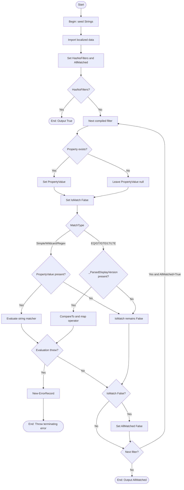

# Test-ApplicationMatch

## Purpose

`Test-ApplicationMatch` is the private filter-engine matcher that evaluates one
normalized application record against one or more compiled filter objects and
emits one boolean result. `Get-InstalledApplication` calls it after discovery
has built a candidate application record and `New-CompiledFilter` has already
validated and compiled the user-supplied filters. The function exists to keep
matching centralized, stop further evaluation after the first non-match by
flipping `$AllMatched` to `$False`, and reuse compiled wildcard, regex, and
version artifacts instead of rebuilding them per application.

## Parameters

| Name | Type | Required | Default | Description |
|------|------|----------|---------|-------------|
| `Application` | `System.Management.Automation.PSObject` | Yes | None | The normalized application record to test. The matcher reads ordinary record properties for string matching and `_ParsedDisplayVersion` for version operators. |
| `CompiledFilters` | `StartUninstallerCompiledFilter[]` | Yes | None | The compiled filters to evaluate. The function expects the typed objects produced by `New-CompiledFilter`; an empty collection is explicitly allowed and means "match everything". |

## Return Value

The function returns `[System.Boolean]` only. It initializes `$AllMatched` to
`$True`, skips the filter loop when `CompiledFilters.Count -eq 0`, evaluates
filters while `$AllMatched -eq $True`, and emits `[System.Boolean]$AllMatched`
from the `Process` block.

The function does not intentionally return `$Null`, use the `return` keyword,
or emit any non-boolean pipeline output. If parameter binding fails, or if the
evaluation block catches an unexpected runtime failure, the function terminates
with an exception and no boolean result is produced for that invocation.

## Execution Flow

## Error Handling

- Omitting either mandatory parameter stops execution during parameter binding
  before the function body runs.
- Passing `-Application:$Null` throws
  `System.Management.Automation.ParameterBindingValidationException` because the
  parameter has `[ValidateNotNull()]`.
- Passing `-CompiledFilters:$Null` throws
  `System.Management.Automation.ParameterBindingValidationException` because the
  binder does not accept a null value for the mandatory collection parameter.
- An empty `CompiledFilters` array is a normal success path, not an error, and
  leaves `$AllMatched` at `$True`.
- If `Import-LocalizedData` cannot load `Test-ApplicationMatch.strings.psd1`,
  the inline `$Strings` hashtable remains in place because the import uses
  `-ErrorAction:'SilentlyContinue'`.
- Missing target properties and missing `_ParsedDisplayVersion` are treated as
  non-matches, not errors, by leaving `$PropertyValue` or
  `$ApplicationVersion` as `$Null` and keeping `$IsMatch` at `$False`.
- The match-evaluation block is wrapped in `Try/Catch`. If
  `.CompiledWildcard.IsMatch()`, `.CompiledRegex.IsMatch()`, `CompareTo()`, or
  similar evaluation logic fails, the function calls `New-ErrorRecord` to build
  an `InvalidOperationException`-backed
  `System.Management.Automation.ErrorRecord` with error ID
  `TestApplicationMatchFailed`, then throws it through
  `$PSCmdlet.ThrowTerminatingError()`.
- The terminating wrapper message includes the original runtime failure text,
  but the current `New-ErrorRecord` path does not preserve the original
  exception as `InnerException`.
- The function still trusts the upstream compiled-filter contract for semantic
  correctness. A handcrafted malformed version filter with
  `MatchType = 'GT'` and `CompiledVersion = $Null` does not throw;
  `[System.Version].CompareTo($Null)` returns `1`, so that malformed filter can
  still mis-evaluate as a match.

## Side Effects

This function has no side effects.

## Research Log

| Topic | Finding | Source | Date Verified |
|-------|---------|--------|---------------|
| Search: `PowerShell Practice and Style guide latest` | The community PowerShell Practice and Style guide is still published and remains a reasonable baseline. Change: unchanged from the prior audit; this repo still intentionally applies stricter house rules for casing, indentation, and parameter syntax. | https://poshcode.gitbook.io/powershell-practice-and-style | 2026-04-01 |
| Search: `PSScriptAnalyzer rules latest official` | Current rule documentation still lists the core rules relevant here, including `ProvideCommentHelp`, `UseApprovedVerbs`, `UseBOMForUnicodeEncodedFile`, `UseOutputTypeCorrectly`, and `UseShouldProcessForStateChangingFunctions`. Change: unchanged from the prior audit. | https://learn.microsoft.com/en-us/powershell/utility-modules/psscriptanalyzer/rules/readme?view=ps-modules | 2026-04-01 |
| Search: `PSScriptAnalyzer latest release PowerShell Gallery` | PowerShell Gallery still shows `PSScriptAnalyzer` `1.25.0`, published on 2026-03-20, with minimum PowerShell version `5.1`. Change: unchanged from the prior audit. | https://www.powershellgallery.com/packages/PSScriptAnalyzer/1.25.0 | 2026-04-01 |
| Search: `PSScriptAnalyzer what's new official` | Microsoft's official "What's new in PSScriptAnalyzer" page still tops out at `1.24.0` even though PowerShell Gallery lists `1.25.0`. Change: unchanged from the prior audit. | https://learn.microsoft.com/en-us/powershell/utility-modules/psscriptanalyzer/whats-new-in-pssa?view=ps-modules | 2026-04-02 |
| Search: `UseCorrectCasing PSScriptAnalyzer official` | Current analyzer guidance still prefers exact cmdlet and type casing plus lowercase keywords and operators. Change: unchanged from the prior audit; this conflicts with the repo's PascalCase-keyword house rule, so the standards audit below still follows the repo standard as written. | https://learn.microsoft.com/en-us/powershell/utility-modules/psscriptanalyzer/rules/usecorrectcasing?view=ps-modules | 2026-04-02 |
| Search: `PSScriptAnalyzer UseBOMForUnicodeEncodedFile rule` | SUPERSEDED on 2026-04-01: the rule still targets Unicode text files without a BOM, but the previous README's claim that `Test-ApplicationMatch.ps1` currently contains non-ASCII text is no longer accurate. | https://learn.microsoft.com/en-us/powershell/utility-modules/psscriptanalyzer/rules/usebomforunicodeencodedfile?view=ps-modules | 2026-04-01 |
| Search: `PSScriptAnalyzer UseBOMForUnicodeEncodedFile rule` | SUPERSEDED on 2026-04-02: the prior function-specific note that `Test-ApplicationMatch.ps1` is ASCII-only is no longer accurate. The file is now UTF-8 with BOM, so the rule is satisfied for a different reason. | https://learn.microsoft.com/en-us/powershell/utility-modules/psscriptanalyzer/rules/usebomforunicodeencodedfile?view=ps-modules | 2026-04-02 |
| Search: `PSScriptAnalyzer UseBOMForUnicodeEncodedFile rule` | SUPERSEDED on 2026-04-02: the prior current-state finding that `Test-ApplicationMatch.ps1` has a UTF-8 BOM is no longer accurate. | https://learn.microsoft.com/en-us/powershell/utility-modules/psscriptanalyzer/rules/usebomforunicodeencodedfile?view=ps-modules | 2026-04-02 |
| Search: `PSScriptAnalyzer UseBOMForUnicodeEncodedFile rule` | The analyzer still warns only for non-ASCII or other Unicode text without a BOM. Change: the current `Test-ApplicationMatch.ps1` is ASCII-only without BOM, so this rule would not warn, but the repo's broader UTF-8-with-BOM policy is currently unmet. | https://learn.microsoft.com/en-us/powershell/utility-modules/psscriptanalyzer/rules/usebomforunicodeencodedfile?view=ps-modules | 2026-04-02 |
| Search: `about_Functions_CmdletBindingAttribute PositionalBinding official` | `PositionalBinding` still defaults to `$true` unless explicitly disabled. Change: unchanged from the prior audit; the current function is correct to set `PositionalBinding = $False`. | https://learn.microsoft.com/en-us/powershell/module/microsoft.powershell.core/about/about_functions_cmdletbindingattribute?view=powershell-7.6 | 2026-04-02 |
| Search: `comment-based help keywords PowerShell official` | Comment-based help remains the supported function-help model. Change: unchanged from the prior audit; the current function includes `.EXAMPLE`, so the earlier missing-example finding remains obsolete. | https://learn.microsoft.com/en-us/powershell/scripting/developer/help/writing-comment-based-help-topics?view=powershell-7.5 | 2026-04-02 |
| Search: `about functions advanced parameters AllowEmptyCollection` | `AllowEmptyCollection` remains the correct way to allow a mandatory collection parameter to accept `@()`. Change: unchanged from the prior audit; this still fits `CompiledFilters`. | https://learn.microsoft.com/en-us/powershell/module/microsoft.powershell.core/about/about_functions_advanced_parameters?view=powershell-7.5 | 2026-04-02 |
| Search: `about_Requires` | Current docs say `#Requires` can appear on any line in a script and still applies globally; placing one inside a function does not limit its scope. Change: unchanged from the prior audit; this still supports scoring this standalone `.ps1` function file as missing the repo-required `#Requires -Version 5.1` directive. | https://learn.microsoft.com/en-us/powershell/module/microsoft.powershell.core/about/about_requires?view=powershell-7.6 | 2026-04-02 |
| Search: `best practices strings OrdinalIgnoreCase .NET official` | .NET still recommends explicit `StringComparison.Ordinal` or `OrdinalIgnoreCase` as the safe default for culture-agnostic string matching. Change: the docs have moved, but the guidance is unchanged and still supports the `Simple` branch. | https://learn.microsoft.com/en-us/dotnet/standard/base-types/string-comparison-net-5-plus | 2026-04-02 |
| Search: `WildcardPattern class PowerShell SDK` | `System.Management.Automation.WildcardPattern` remains current and no deprecation surfaced. Change: unchanged from the prior audit; precompiled wildcard objects are still a valid implementation choice. | https://learn.microsoft.com/en-us/dotnet/api/system.management.automation.wildcardpattern?view=powershellsdk-7.4.0 | 2026-04-02 |
| Search: `WildcardOptions CultureInvariant official` | SUPERSEDED on 2026-04-02: the prior finding that `New-CompiledFilter` set only `IgnoreCase` is no longer accurate. | https://learn.microsoft.com/en-us/dotnet/api/system.management.automation.wildcardoptions?view=powershellsdk-7.4.0 | 2026-04-02 |
| Search: `WildcardOptions CultureInvariant official` | `WildcardOptions` still exposes `IgnoreCase` and `CultureInvariant` as separate flags. Change: unchanged from the prior audit; `New-CompiledFilter` still sets both flags, and the Turkish-culture unit test still closes the earlier culture-sensitivity gap. | https://learn.microsoft.com/en-us/dotnet/api/system.management.automation.wildcardoptions?view=powershellsdk-7.4.0 | 2026-04-02 |
| Search: `regular expression options compiled ignorecase cultureinvariant official` | `RegexOptions.IgnoreCase`, `CultureInvariant`, and `Compiled` remain current. Newer .NET guidance still prefers source-generated regex only when patterns are known at compile time, which does not fit runtime filter input. Change: unchanged from the prior audit. | https://learn.microsoft.com/en-us/dotnet/standard/base-types/compilation-and-reuse-in-regular-expressions | 2026-04-02 |
| Search: `regex best practices untrusted input timeout` | Current .NET guidance still recommends explicit regex timeouts for untrusted patterns. Change: unchanged from the prior audit; the risk belongs to `New-CompiledFilter`, which constructs the regexes, not to this matcher. | https://learn.microsoft.com/en-us/dotnet/standard/base-types/best-practices-regex | 2026-04-02 |
| Search: `Version.CompareTo official` | `Version.CompareTo` still returns a positive value when the other version is `null`. Change: unchanged from the prior audit; this remains the key reason a malformed version filter with `CompiledVersion = $Null` can mis-evaluate as a match. | https://learn.microsoft.com/en-us/dotnet/api/system.version.compareto?view=net-9.0 | 2026-04-02 |
| Search: `about_Case-Sensitivity PowerShell official` | PowerShell still guarantees case-insensitive non-dictionary member access. Change: unchanged from the prior audit; this still supports using `$Application.PSObject.Properties[...]` as the plan's required case-insensitive property lookup mechanism. | https://learn.microsoft.com/en-sg/powershell/module/microsoft.powershell.core/about/about_case-sensitivity?view=powershell-7.4 | 2026-04-02 |
| Search: `about_Return official` | `return` still exits the current scope. Change: unchanged from the prior audit; this confirms the current function still satisfies the repo's soft-return house rule by not using `return` at all. | https://learn.microsoft.com/en-us/powershell/module/microsoft.powershell.core/about/about_return?view=powershell-7.5 | 2026-04-02 |
| Search: `Import-LocalizedData constrained language mode official` | Localized data imported by `Import-LocalizedData` is processed in Constrained language mode. Change: new row; this supports the companion `Test-ApplicationMatch.strings.psd1` pattern and slightly reduces the risk of executable logic in localized data files. | https://learn.microsoft.com/en-us/powershell/module/microsoft.powershell.core/about/about_data_files?view=powershell-7.6 | 2026-04-02 |
| Search: `ThrowTerminatingError ErrorRecord official` | `Cmdlet.ThrowTerminatingError(ErrorRecord)` still terminates the command and remains the preferred path when cmdlet-style code needs terminating errors with structured `ErrorRecord` metadata. Change: new row; this supports the current catch path that builds an `ErrorRecord` via `New-ErrorRecord` and terminates through `$PSCmdlet.ThrowTerminatingError()`. | https://learn.microsoft.com/en-us/dotnet/api/system.management.automation.cmdlet.throwterminatingerror?view=powershellsdk-7.4.0 | 2026-04-02 |

## Standards Audit

| Rule | Status | Line(s) | Evidence |
|------|--------|---------|----------|
| Colon-bound parameters | PASS | 74-78, 158-168 | `Import-LocalizedData -BindingVariable:'Strings' -FileName:'Test-ApplicationMatch.strings' -BaseDirectory:$PSScriptRoot -ErrorAction:'SilentlyContinue'`; `New-ErrorRecord -ExceptionName:'System.InvalidOperationException' ... -TargetObject:$CompiledFilter -ErrorId:'TestApplicationMatchFailed' -ErrorCategory:([System.Management.Automation.ErrorCategory]::InvalidOperation)` both use named, colon-bound value parameters. |
| PascalCase naming | PASS | 1, 31-39, 69-179 | `Function Test-ApplicationMatch {`; `Begin {`; `Process {`; `If`, `For`, `Try`, `Switch`, and `Catch` are consistently PascalCase. |
| Full .NET type names (no accelerators) | PASS | 40, 52, 65, 82, 94, 105-108, 133-145, 158-168, 178 | `[OutputType([System.Boolean])]`; `[System.Management.Automation.PSObject]`; `[StartUninstallerCompiledFilter[]]`; `[System.String]::Equals(..., [System.StringComparison]::OrdinalIgnoreCase)`; `[System.Management.Automation.ErrorCategory]::InvalidOperation`; `[System.Boolean]$AllMatched` all use full .NET type names. |
| Object types are the MOST appropriate and specific choice | REVIEW | 52, 65; `Get-InstalledApplication` 231; `A.Types` 1-24 | `CompiledFilters` is now strongly typed as `[StartUninstallerCompiledFilter[]]`, but `Application` remains `[System.Management.Automation.PSObject]`. The repo defines `StartUninstallerCompiledFilter` as a class, but it does not define a typed application-record class, and `Get-InstalledApplication` still creates the application record with `New-Object -TypeName:'System.Management.Automation.PSObject' -Property:$Props`, so the remaining generic parameter may be intentional rather than a missed stronger contract. |
| Single quotes for non-interpolated strings | PASS | 32-38, 72, 76, 102, 112, 120, 131, 159, 167 | Examples: `ConfirmImpact = 'None'`; `'Unable to evaluate filter ''{0}'' on property ''{1}'': {2}'`; `'Simple'`; `'Wildcard'`; `'Regex'`; `'_ParsedDisplayVersion'`; `'TestApplicationMatchFailed'`. |
| `$PSItem` not `$_` | PASS | 164 | The catch block uses `$PSItem.Exception.Message`, and a local scan on 2026-04-02 found no `$_` tokens in the file. |
| Explicit bool comparisons ($Var -eq $True, not just $Var) | PASS | 85, 95, 104, 114, 122, 136, 143, 172 | `If ($HasNoFilters -eq $False) {`; `If ($HasPropertyInfo -eq $True) {`; `If ($HasPropertyValue -eq $True) {`; `If ($HasVersionProperty -eq $True) {`; `If ($HasApplicationVersion -eq $True) {`; `If ($IsMatch -eq $False) {`. |
| If conditions are pre-evaluated outside If blocks | PASS | 82-85, 94-95, 103-104, 121-143, 172-173 | `$HasNoFilters = [System.Boolean](...)` precedes `If ($HasNoFilters -eq $False) {`; `$HasPropertyInfo = [System.Boolean](...)` precedes `If ($HasPropertyInfo -eq $True) {`; `$HasApplicationVersion = [System.Boolean](...)` precedes `If ($HasApplicationVersion -eq $True) {`. |
| `$Null` on left side of comparisons | PASS | 94, 103, 113, 121, 134, 141 | `[System.Boolean]($Null -ne $PropertyInfo)`; `[System.Boolean]($Null -ne $PropertyValue)`; `[System.Boolean]($Null -ne $VersionProperty)`; `[System.Boolean]($Null -ne $ApplicationVersion)`. |
| No positional arguments to cmdlets | PASS | 74-78, 158-168 | `Import-LocalizedData -BindingVariable:'Strings' -FileName:'Test-ApplicationMatch.strings' -BaseDirectory:$PSScriptRoot -ErrorAction:'SilentlyContinue'` and `New-ErrorRecord -ExceptionName:'System.InvalidOperationException' ...` use named arguments only. |
| No cmdlet aliases | PASS | 74-78, 158-168 | The function calls `Import-LocalizedData` and `New-ErrorRecord` by full name; no aliases such as `ipmo`, `?`, or `%` appear. |
| Switch parameters correctly handled | N/A | 41-67, 74-78, 158-168 | The function declares no `[System.Management.Automation.SwitchParameter]` parameters and does not call any switch parameters. |
| CmdletBinding with all required properties | PASS | 31-39 | `[CmdletBinding( ConfirmImpact = 'None' , DefaultParameterSetName = 'Default' , HelpURI = '' , PositionalBinding = $False , RemotingCapability = 'None' , SupportsPaging = $False , SupportsShouldProcess = $False )]` explicitly sets the repo's expected property set. |
| Leading commas in attributes | FAIL | 32, 43, 56 | The first property line in each attribute block lacks the required leading comma: `ConfirmImpact = 'None'`; `Mandatory = $True`; `Mandatory = $True`. |
| Parameter attributes list all properties explicitly | FAIL | 42-49, 55-62 | Both `[Parameter(...)]` blocks omit `Position = ...`. The current first block is `[Parameter( Mandatory = $True , ParameterSetName = 'Default' , DontShow = $False , HelpMessage = 'See function help.' , ValueFromPipeline = $False , ValueFromPipelineByPropertyName = $False , ValueFromRemainingArguments = $False )]`, and the second block omits `Position` the same way. |
| OutputType declared | PASS | 40 | `[OutputType([System.Boolean])]` is present. |
| Comment-based help is complete (Synopsis, Description, Parameter, Example, Outputs, Notes) | PASS | 2-29 | The help block includes `.SYNOPSIS`, `.DESCRIPTION`, `.PARAMETER Application`, `.PARAMETER CompiledFilters`, `.EXAMPLE`, `.OUTPUTS`, and `.NOTES`. |
| Error handling via New-ErrorRecord or appropriate pattern | PASS | 157-169 | `Catch { $ErrorRecord = New-ErrorRecord -ExceptionName:'System.InvalidOperationException' -ExceptionMessage:(...) -TargetObject:$CompiledFilter -ErrorId:'TestApplicationMatchFailed' -ErrorCategory:([System.Management.Automation.ErrorCategory]::InvalidOperation); $PSCmdlet.ThrowTerminatingError($ErrorRecord) }` follows the repo's structured error-record pattern. |
| Localized string data for user-facing messages | REVIEW | 70-78; `Test-ApplicationMatch.strings.psd1` 1-4 | The function imports `Test-ApplicationMatch.strings` and the companion file contains `FilterEvaluationFailed = 'Unable to evaluate filter ''{0}'' on property ''{1}'': {2}'`, but the same user-facing message is also duplicated inline in the fallback `$Strings` hashtable at lines 70-73. |
| Try/Catch around operations that can fail | PASS | 100-170 | The whole evaluation block is wrapped in `Try { Switch ($CompiledFilter.MatchType) { ... } } Catch { ... }`, covering wildcard, regex, and version comparison failures. |
| Write-Debug at Begin/Process/End block entry and exit (if blocks are used) | FAIL | 69, 81-179 | The function uses `Begin {` and `Process {`, but a token scan on 2026-04-02 found no `Write-Debug` calls anywhere in the file, and there is no `End {}` block. |
| Begin / Process / End blocks present where required | FAIL | 69, 81, 180 | The function uses localized setup in `Begin {` and per-invocation logic in `Process {`, but it closes at line 180 without an `End {}` block even though the repo reference defaults advanced functions to `Begin / Process / End`. |
| No variable pollution (no script: or global: scope leaks) | PASS | 69-178 | Working state is local, for example `$CompiledFilter = $CompiledFilters[$Index]` and `$ApplicationVersion = $Null`; no `script:` or `global:` scope qualifiers appear in the file. |
| 96-character line limit | PASS | 168 | A local scan on 2026-04-02 found no line over 96 characters. The current maximum is 91 characters at line 168. |
| 2-space indentation (not tabs, not 4-space) | PASS | 69, 85-89 | A leading-whitespace scan on 2026-04-02 found no tabs. Structural lines advance by 2 spaces per block level, for example `Begin {`, `If ($HasNoFilters -eq $False) {`, `For ($Index = 0;`, and `$CompiledFilter = $CompiledFilters[$Index]`; the wrapped `For` header at lines 87-88 is continuation alignment. |
| OTBS brace style | PASS | 1, 85, 100, 157 | `Function Test-ApplicationMatch {`; `If (...) {`; `Try {`; `} Catch {` all follow OTBS placement. |
| No commented-out code | PASS | 2-29 | The only comments are documentation inside the help block. There are no disabled executable statements prefixed with `#`. |
| Registry access is read-only (if applicable) | N/A | 1-180 | This helper does not access the registry. |
| `#Requires -Version 5.1` present | FAIL | 29-31 | The file goes directly from `#>` to `[CmdletBinding(`; there is no `#Requires -Version 5.1` directive anywhere in the script file. |
| UTF-8 with BOM | FAIL | file bytes | A byte-level scan on 2026-04-02 reported `HasUtf8Bom : False` and `NonAsciiByteCount : 0` for `src/Private/Test-ApplicationMatch.ps1`. The file is ASCII-only without BOM, so the repo's broader UTF-8-with-BOM policy is currently unmet even though `UseBOMForUnicodeEncodedFile` would not warn. |
| Soft return only (no `return` keyword in functions) | PASS | 178 | The function emits `[System.Boolean]$AllMatched` on its own line, and a local scan on 2026-04-02 found no `Return` tokens in the file. |

*Note 1: current `PSScriptAnalyzer` `UseCorrectCasing` guidance prefers
lowercase keywords and operators. This audit still grades casing against the
repo's authoritative standard, which explicitly requires PascalCase keywords.*

*Note 2: current `UseBOMForUnicodeEncodedFile` guidance is narrower than the
repo's broader BOM policy. The current `Test-ApplicationMatch.ps1` is
ASCII-only without BOM, so this analyzer rule would not warn, but the repo's
broader UTF-8-with-BOM policy is still not satisfied.*

*Note 3: current .NET guidance recommends explicit regex timeouts for untrusted
patterns. This function does not construct regexes itself, so that risk remains
upstream in `New-CompiledFilter`.*

*Note 4: current `about_Requires` guidance removes the old scope ambiguity:
placing `#Requires` inside a function would still apply globally, so this
standalone `.ps1` file simply lacks the repo-required directive.*

## Plan Audit

| Plan Section | Requirement | Status | Line(s) | Details |
|--------------|-------------|--------|---------|---------|
| 12 | "`Test-ApplicationMatch.ps1` evaluates one application record against compiled filters." | ALIGNED | `Test-ApplicationMatch 41-66, 81-178` | The function takes one `Application` and one `CompiledFilters` array, evaluates the filters, and emits one boolean match result. |
| 12 | "`Test-ApplicationMatch.ps1` belongs under `src/Private`." | ALIGNED | `Test-ApplicationMatch 1` | The implementation exists at `src/Private/Test-ApplicationMatch.ps1`, matching the plan's private-helper layout. |
| 2, 8.1 | "Filter property names are case-insensitive." | ALIGNED | `Test-ApplicationMatch 91-96`; `tests/Private/Test-ApplicationMatch.Tests.ps1 467-474` | The matcher uses `$Application.PSObject.Properties[$CompiledFilter.Property]`, and the direct test for `Property = 'displayname'` succeeds against `DisplayName`. |
| 2, 6.3, 16 | "`Simple` means case-insensitive exact string match." | ALIGNED | `Test-ApplicationMatch 102-109` | The `Simple` branch uses `[System.String]::Equals(..., [System.StringComparison]::OrdinalIgnoreCase)`, which is a case-insensitive exact comparison. |
| 2, 6.3 | "String matching is case-insensitive and culture-invariant." | ALIGNED | `Test-ApplicationMatch 112-125`; `New-CompiledFilter 123-126, 269-276, 293-296`; `tests/Private/Test-ApplicationMatch.Tests.ps1 118-138` | The `Simple` branch is ordinal and culture-insensitive, while the wildcard and regex branches consume artifacts that `New-CompiledFilter` builds with `IgnoreCase` plus `CultureInvariant`. The direct Turkish-culture wildcard test still verifies the intended behavior. |
| 6.2, 16 | "Synthetic metadata fields are also allowed for filtering." | ALIGNED | `Test-ApplicationMatch 91-96`; `tests/Private/Test-ApplicationMatch.Tests.ps1 445-461` | Property lookup is generic, so synthetic fields such as `AppArch` and `InstallScope` match the same way as raw fields. Direct tests cover both examples. |
| 6.3, 16 | "`Wildcard` is case-insensitive wildcard." | ALIGNED | `Test-ApplicationMatch 112-117`; `New-CompiledFilter 269-276` | The matcher calls the precompiled wildcard object's `IsMatch()`, and the compiler builds that wildcard with case-insensitive, culture-invariant options. |
| 6.3, 16 | "`Regex` is case-insensitive culture-invariant regex." | ALIGNED | `Test-ApplicationMatch 120-125`; `New-CompiledFilter 123-126, 293-296` | The matcher consumes a precompiled `Regex`, and the compiler constructs it with `IgnoreCase`, `CultureInvariant`, and `Compiled`. |
| 6.3, 16 | "`DisplayVersion` supports `EQ`, `GT`, `GTE`, `LT`, and `LTE`." | ALIGNED | `Test-ApplicationMatch 128-153`; `Get-InstalledApplication 256-272` | Version operators route through the default branch, read `_ParsedDisplayVersion`, compare it to the compiled version, and map `CompareTo()` results through the operator switch. `Get-InstalledApplication` stamps `_ParsedDisplayVersion` onto each application record. |
| 6.3 | "`EQ`, `GT`, `GTE`, `LT`, and `LTE` are invalid on any property other than `DisplayVersion`." | N/A | `New-CompiledFilter 230-256`; `Test-ApplicationMatch 128-153` | Rejection is enforced by `New-CompiledFilter` before this helper is called. `Test-ApplicationMatch` trusts already-compiled filters and only evaluates them. |
| 5.1, 7.4 | "`_ParsedDisplayVersion` stores best-effort parsed version or `$null` and is internal-only on the application record." | ALIGNED | `Get-InstalledApplication 256-272`; `Test-ApplicationMatch 129-145` | The application-record builder stamps `_ParsedDisplayVersion`, and this helper reads that internal field only for version operators while still returning only a boolean result. |
| 6.3 | "If an application's `DisplayVersion` cannot be parsed as `[version]`, version operators return non-match for that entry." | ALIGNED | `Test-ApplicationMatch 140-143`; `tests/Private/Test-ApplicationMatch.Tests.ps1 340-352` | If `_ParsedDisplayVersion` is missing or `$Null`, the function skips comparison, leaves `$IsMatch` at `$False`, and emits `$False` for that filter. The direct test covers an unparseable `DisplayVersion`. |
| 6.3 | "`DisplayVersion` still supports `Simple`, `Wildcard`, and `Regex` against the raw normalized string value." | ALIGNED | `Test-ApplicationMatch 91-125` | The string-match branches always read `$Application.PSObject.Properties[$CompiledFilter.Property]`; if `Property` is `DisplayVersion`, the raw string value is matched and `_ParsedDisplayVersion` is ignored. |
| 6.4 | "Missing properties become non-match without throwing." | ALIGNED | `Test-ApplicationMatch 90-96, 103-125, 129-143, 172-173`; `tests/Private/Test-ApplicationMatch.Tests.ps1 297-335` | Missing properties leave `$PropertyValue` or `$ApplicationVersion` as `$Null`, which keeps `$IsMatch` false. The helper throws only when evaluation itself fails, not when a property is absent. |
| 6.5 | "All filters use `AND` logic. An entry matches only when every filter succeeds." | ALIGNED | `Test-ApplicationMatch 83-88, 172-178` | The `For` loop continues only while `$AllMatched -eq $True`. A failed filter flips `$AllMatched` to `$False`, which short-circuits further evaluation and leads to a final `$False` result. |
| 12, 15 | "`Test-ApplicationMatch` exists as a dedicated Phase 2 filter-engine helper." | ALIGNED | `Get-InstalledApplication 302-307`; `Test-ApplicationMatch 81-178` | `Get-InstalledApplication` delegates match evaluation to this helper. That keeps string, wildcard, regex, and version-operator logic centralized instead of duplicating it inside discovery. |
| 13.2 | "Use `.strings.psd1` only where a function has reusable user-facing messages." | ALIGNED | `Test-ApplicationMatch 70-78`; `Test-ApplicationMatch.strings.psd1 1-4` | The helper has a reusable terminating-error message, ships a companion `src/Private/Test-ApplicationMatch.strings.psd1`, and imports it in `Begin`. The inline fallback is extra, but the plan requirement itself is now satisfied. |
| 14.2, 15, 16 | "Critical unit tests cover string/regex/version behavior and missing-property non-match," and "all filter types pass direct tests." | REVIEW | `tests/Private/Test-ApplicationMatch.Tests.ps1 36-475` | The test file now covers the planned happy-path, missing-property, version, synthetic-property, case-insensitive-property, and wildcard culture-invariance scenarios. However, a live `Invoke-Pester` run on 2026-04-02 still failed at the Pester framework layer because Pester 5.7.1 could not create `HKCU\Software\Pester` in this restricted environment, so direct pass/fail cannot be verified here. |
| 2, 4.4 | "Execution is non-interactive by default. No confirmation prompts." | ALIGNED | `Test-ApplicationMatch 31-39, 81-178` | The helper declares `SupportsShouldProcess = $False`, has no prompt path, and performs pure in-memory evaluation only. |
| 4.3, 10.4 | "Are correct exit codes and outcomes used?" | N/A | `Test-ApplicationMatch 1-180` | This helper returns only `[System.Boolean]` and has no responsibility for script exit codes or uninstall outcome mapping. |

## Verification Notes

- A byte-level scan on 2026-04-02 confirmed
  `src/Private/Test-ApplicationMatch.ps1` is ASCII-only and does not have a
  UTF-8 BOM.
- Manual smoke execution on 2026-04-02 confirmed `Simple = True`,
  `VersionLT = True`, and `WildcardTurkish = True` when dot-sourcing
  `build/Start-Uninstaller.Functions.ps1`.
- Parameter-binding probes on 2026-04-02 confirmed
  `-Application:$Null` throws
  `System.Management.Automation.ParameterBindingValidationException`,
  `-CompiledFilters:$Null` throws
  `System.Management.Automation.ParameterBindingValidationException`, and
  omitting `CompiledFilters` throws
  `System.Management.Automation.ParameterBindingException`.
- A handcrafted malformed wildcard filter with `CompiledWildcard = $Null`
  throws `System.InvalidOperationException` with the underlying message text
  included, but `InnerException` is currently `<null>` because the
  `New-ErrorRecord` path recreates the exception rather than wrapping the
  original one.
- A handcrafted malformed version filter with `MatchType = 'GT'` and
  `CompiledVersion = $Null` still returned `$True`, confirming that this helper
  continues to trust `New-CompiledFilter` output and does not revalidate
  compiled version semantics.
- `Invoke-Pester` discovered 43 tests in
  `tests/Private/Test-ApplicationMatch.Tests.ps1`, but the run failed at the
  Pester framework layer because Pester 5.7.1 could not create
  `HKCU\Software\Pester` in this restricted environment. The run reported 43
  failed tests as a container-level consequence of that registry denial.
- `Invoke-ScriptAnalyzer` is now installed locally as version `1.24.0` and
  produced no findings for `src/Private/Test-ApplicationMatch.ps1` under
  `PSScriptAnalyzerSettings.psd1`. The house-style deviations recorded above
  are therefore stricter than the current analyzer configuration.

## Changelog

| Date | Changes |
|------|---------|
| 2026-04-02 | Corrected materially stale findings again after the function and environment moved since the prior same-day audit. Updated the parameter contract to the current typed `StartUninstallerCompiledFilter[]`, fixed the standards table for colon-bound arguments, alias/positional-argument compliance, `New-ErrorRecord` usage, real `Begin`/`Process` blocks, missing `Write-Debug` traces, missing `End`, and current attribute-property omissions, and replaced the false "missing strings file" and false "PSScriptAnalyzer not installed" claims. Refreshed the BOM research and verification to match the current ASCII-without-BOM file state, corrected the malformed-wildcard verification note to reflect that `InnerException` is no longer preserved, added new research for `Import-LocalizedData` constrained-language handling and `ThrowTerminatingError(ErrorRecord)`, and changed the plan's `.strings.psd1` verdict from `DEVIATION` to `ALIGNED`. |
| 2026-04-02 | Corrected materially stale documentation against the current source. Replaced the obsolete wildcard-culture plan deviation with the now-aligned implementation, updated the return-value and flow sections to match the current no-`return` `$AllMatched` implementation, fixed stale standards verdicts for pre-evaluated `If` conditions and soft-return compliance, corrected the indentation finding after a direct leading-space scan, and added missing standards and plan findings for attribute formatting, inline user-facing strings with no companion `.strings.psd1`, and the missing `#Requires -Version 5.1` directive. Refreshed the research log for `WildcardOptions`, BOM state, `about_Requires`, and `PSScriptAnalyzer` release-note lag, and updated verification notes for the current 43-test Pester discovery plus current smoke and binding-probe results. |
| 2026-04-01 | Corrected the stale audit to match the current source: fixed the help, type, `Try/Catch`, and error-handling findings; added the wildcard culture-invariance plan deviation and supporting verification; updated the research log; and removed the obsolete non-ASCII BOM applicability claim. |
| 2026-04-01 | Initial README audit for `Test-ApplicationMatch`. Added purpose, parameter, return, flow, error, and side-effect documentation; recorded current research; added standards and plan audits; documented the Unicode-without-BOM finding; and captured the malformed-compiled-filter precondition risk. |
AUDIT_STATUS:UPDATED